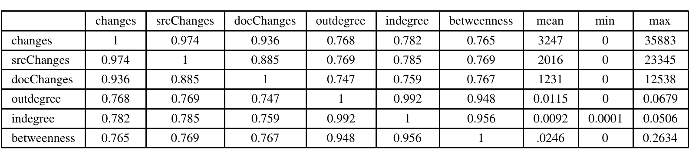
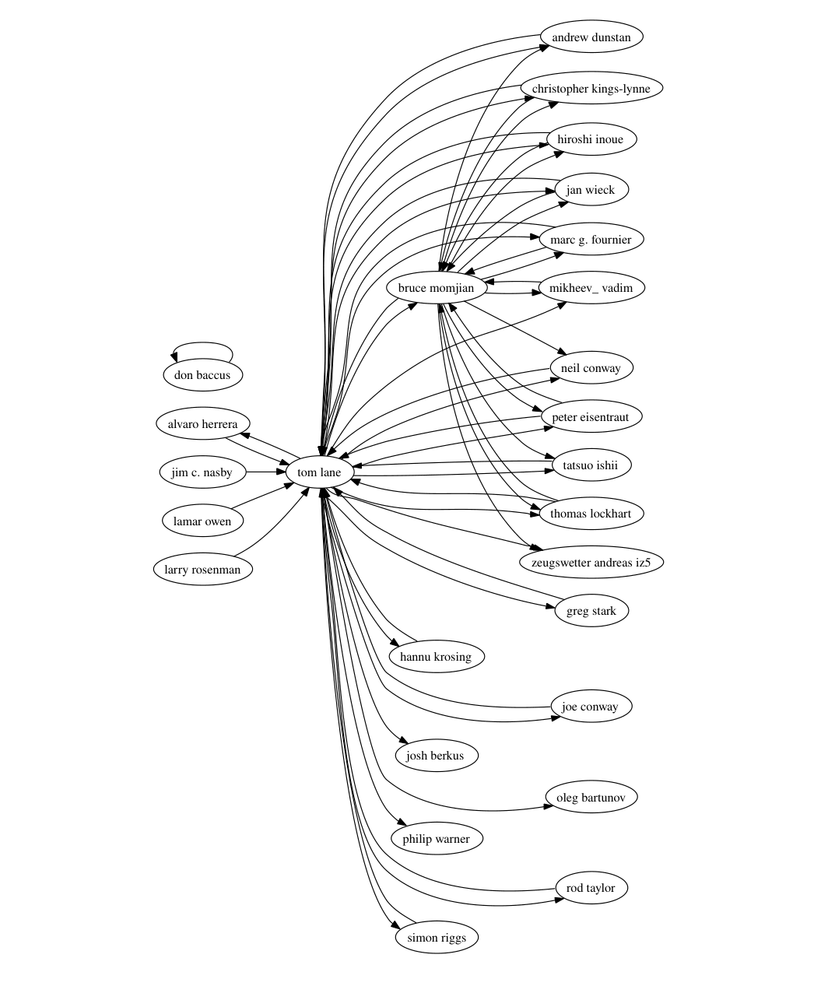

Figure 1: Cross-correlation table (using Spearman’s rank correlation) showing the relationship between the total number of changes, the changes to source, changes to documents, relative in-degree, relative out-degree, and betweenness. Average, min, and max are also shown. n = 25

In addition to mining mailing list data, we also gathered data from the source code repository of Postgres (which uses CVS as its version control mechanism). During the period of interest, 26 CVS accounts were used. We were able to match email addresses to all but one of these. According to the developers4, the pgsql account is used only to tag and package releases, and is not represented on the mailing list so we do not include it in our analysis. We tracked development by counting the number of changes to files over time and found 83,359 changes made to 4,108 files over the course of the time studied.

### 3. RESULTS

We constructed a social network based on the messages that were sent and replied to on the mailing lists. Three commonly accepted social network metrics were run on the resulting network on a per-node basis: in-degree, out-degree, and betweenness. In general, developers had higher levels of all three metrics by at least an order of magnitude over non-developers. This indicates that developers hold positions of high status in the social network of contributors by multiple measures. A Student’s t-test shows a significant statistical difference in the in-degree, out-degree and betweenness values for the population of developers and the population of non-developers.

Figure 2 shows the social network of highly active Postgres mailing list participants (ties represent at least 150 messages between participants). The two most central participants, Bruce Momjian and Tom Lane, are also the most active CVS committers. The majority of the other participants in this network are also CVS committers. There are, however, nodes in this network that are not CVS committers and not all committers are in the network.

In addition, Figure 1 shows high levels of correlation between the social network measures and CVS activity. Similar to the results of our study of the Apache HTTP Server project, the social network metrics are highly correlated with source file changes. Unlike Apache, however, document file changes correlate to an equal degree. This may be due to the lower number of CVS developers (25 versus 78) and the fact that in this project, many developers work on both source code and documentation. Another possibility may be the number of document translations and how they are dealt with. We plan to mine other OSS projects to investigate this phenomenon further.

We also examined the distribution of people with in-degree, out-degree, number of sent messages and number of replies. Consistent with data from the Apache project, each distribution exhibits a power-law character. This gives us confidence in our mining methodology and analysis as social processes tend to be characterized by power-laws.

4 Marc Fournier and Tom Lane both explained this in responses to our inquiries regarding this account

Figure 2: Social network of highly active Postgres mailing list participants

### 4. CONCLUSION

After mining and analyzing mailing list and source code repository data for the Postgres project we found that the distributions of email activity and social network measures were similar to those found in the Apache project. Our results indicate that developers hold higher levels of status in the social network than non-developers. We also found high correlations between various social network status metrics and source code development. This is consistent with our findings from the Apache project and gives us confidence in our hypotheses and methods. The discrepancy in correlation of document changes with social network status between projects indicates an area that requires further investigation.

There is a significant body of related work, which is omitted from this summary for brevity. We refer the reader to our companion paper, “Mining Email Social Networks” accepted to MSR 2006 (located at http://www.cs.ucdavis.edu/~bird/papers/msr06.pdf) for details.