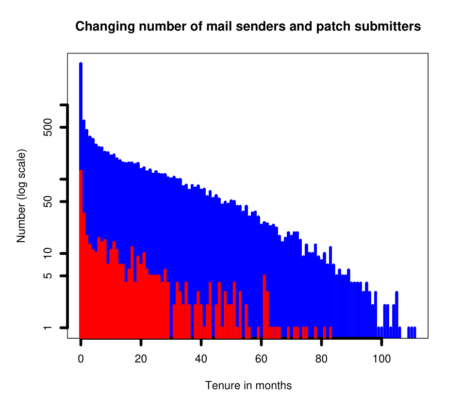

projects; specifically, we study the duration from the first appearance on the mailing list of an individual, to the time the first commit, if any, is made by that individual. Details of this technique are presented later; first, we develop the conceptual framework and the hypotheses of interest.

## 2.2 Conceptual Framework

In a departure from previous research, this paper considers how the likelihood of becoming a developer varies with tenure in a community, and also quantitatively evaluate the importance of factors such as social status and demonstrated technical skill. We begin with a conceptual framework for the mechanisms that influence the attainment of developer status. This conceptual framework directly leads us to the phenomena we model as predictor variables in the statistical hazard rate model. It also helps us theoretically explain the observed non-monotonicity in the hazard rate (as will be seen later).

We consider four different factors that influence acceptance into developer-hood.

- Technical commitment to project: how committed is the developer to the success of this project? How long does s/he sustain that technical commitment?
- Skill Level: How knowledgeable/skillful is this developer relative to this specific project?
- Individual Reputation: What is the status of the individual in this community?
- Project Specificity: Are there significant differences in different projects, relating to immigration?

To become a developer, an individual must both acquire project-specific technical skills; and then s/he must win the community’s trust by demonstrating these skills, via email participation and by contribution of work products. This takes commitment. Therefore, the developer needs to make a long-term commitment to first acquire those skills, show them to the community, and earn their trust. Experienced software engineers are well aware of the effort required to sustain specialized technical skills relevant to an evolving system for long periods of time.

### 2.2.1 Commitment

A developer’s commitment to a project will arguably decay with time, increasing the likelihood that a given person will quit. Sustaining working skills and knowledge in a large, complex project is a formidable undertaking, and unpaid volunteers who have not yet reaped the professional reward of being admitted into the inner circle cannot be expected to keep up their effort for too long.

This effect can be expected to be somewhat attenuated for people who become developers, since we can expect that these people have made an invested effort to earn that privilege, and have developed valuable relationships within the community.

To the variation of commitment with time, we examine how many different non-developers are active during each month since their first appearance on the mailing list. While all of these are potentially candidates to become developers, prior research shows that patch submitters are the most technically engaged in the community, and most likely to become developers (See von Krogh [26]).

Figure 2 shows the number of non-developers who remain active on the mailing list in Postgres (and similarly in all the projects we studied) decays steadily as tenure increases to the maximum (note that the y-axis (counts) is log scale) around roughly the 100th month (i.e., lifetime of the email archive). In contrast, after a much shorter tenure interval of 40 months, there are very few active patch submitters remaining. All three projects we considered show the same pattern (though with different time periods). In Apache, this period is a little longer, about 50 months, and in Python, it’s much shorter: very few email participants submit any patches after their 10th month.

Figure 2. Variation in number of non-developers (log scale) who actively submit emails (top curve) and patches (bottom curve) in Postgres with tenure in months

### 2.2.2 Knowledge and Skill Level

As a developer spends more and more time on a project, she can be expected to gradually become more knowledgeable and skillful. This difficult, time-consuming process of learning the details of a specific system and development environment (sometimes known as discovery, or ramp-up) is documented by prior research [8, 24]. In many cases, even the initial email is sent by an individual on the developer mailing list only after some initial study; quite often people submit patches during their first month of activity on the mailing list. In the Postgres project, we find that the median time for first patch submission is during the second month of mailing list participation. For Apache, the median time is the second month, and for Python, the median time is the sixth month. These numbers indicate the time commitment required for skill acquisition.

### 2.2.3 Individual Reputation