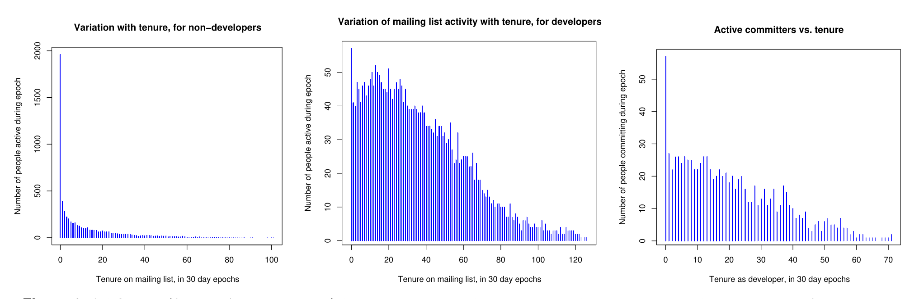
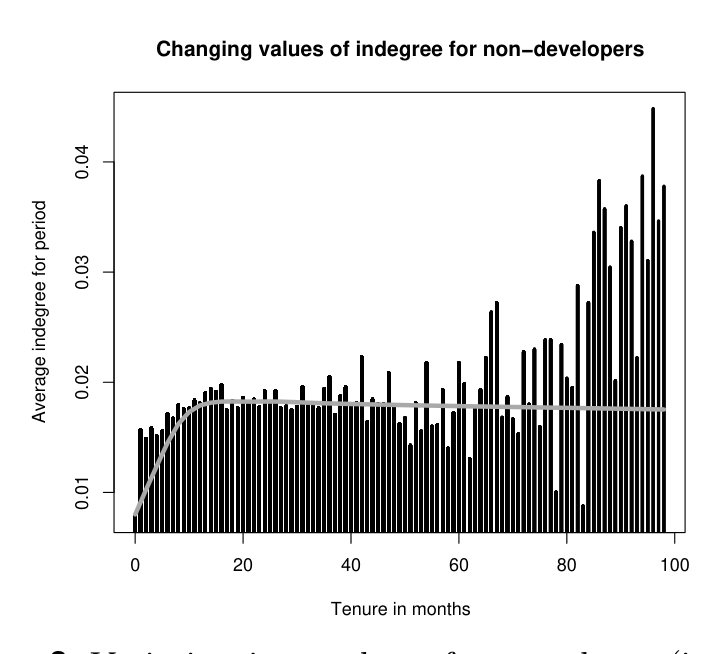

Tenure on mailing list, in 30 day epochs  Tenure on mailing list, in 30 day epochs  Tenure as developer, in 30 day epochs

Figure 1. All figures (for the Apache project) have tenure in 30 day epochs on the x-axis, and indicate number of active people during that epoch of their tenure on the y-axis. Leftmost figure shows email activity for non-developers, middle email activity for developers, and rightmost shows file commit activity. Python and Postgres show similar patterns. Number of active people declines in every case, indicating gradual waning of engagement.

Tenure in months

Figure 3. Variation in number of respondents (in-degree on the social network) with tenure on the mailing list. Note that the data beyond 60 months is based on fewer than 10 or so participants, and is thus unstable. Grey line shows smoothed trend. Notice initial rise, followed by flat/declining slope over time.

An individual's reputation can be expected to increase with tenure and activity on the mailing list. Prior research has documented the need to build community reputation before being admitted as a developer [11, 26].

Social network theorists have developed validated network measures of community importance, based on the network of interactions [27]. In the networks for our analysis, each node or actor represents a mailing list participant. If actor A posts a message and actor B responds, then there is indication that B had some interest in A’s message. Therefore, we create a directed tie from B to A.

Social network metrics include in-degree, out-degree and other measures. In-degree and out-degree are defined as the number of ties directed towards and away from an actor respectively. If A has high in-degree, that indicates that many people found A’s messages of interest, and thus that information contributed by A is relevant and interesting. High out-degree indicates that A finds many people’s messages of interest.

In figure 3, we show the variation of median in-degree for non-developers (who form the candidate pool for new developers) with tenure in the Postgres project. It can be seen that in-degree, as a function of tenure, first increases, then flattens until about 40 months, and then decreases until some point when there are so few mailing list participants remaining (with such long tenures) that the data becomes unstable.

The decrease in in-degree can be related to the patch submission data; after around 3–4 years in Postgres, non-developers tend to stop submitting patches and are presumably less technically engaged. A similar phenomenon is observed in Apache and Python: median in-degree for non-developers peaks during the second or third years of tenure, and then declines.

### 2.2.4 Project-Specific Considerations

FLOSS projects have to a greater or lesser degree developed specific cultural norms on how immigration is handled. These norms are enforced to varying degrees of formality. Much work remains to be done on identifying the precise nature of these cultures, constructing theories concerning the influence of these factors, and validating these theories. We analyze only three different projects. However, these projects have been described by Berkus [2] to be examples of three very different types of projects. Apache is a foundation with a well-organized, hierarchical governance structure and formalized policies. Postgres is a community, more informal, with consensual group decision making. Python is monarchist2 with an authority figure, Guido Van Rossum. With just 3 projects, quantifying the precise influence of these factors is not possible. We have, however, fortuitously chosen projects with very different cultures, and characteristics. We consider here 3 factors: structure of governance, formalization of immigration and technical complexity.

Foundation: The Apache project3 arose out of a loose

2 For a description of these project types, see http://www.powerpostgresql.com/5_types

3 Please see http://httpd.apache.org/ABOUT_APACHE.html for details