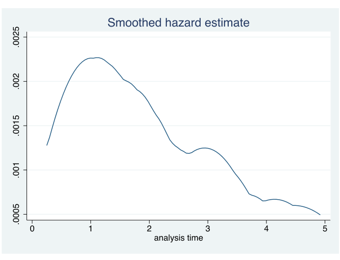
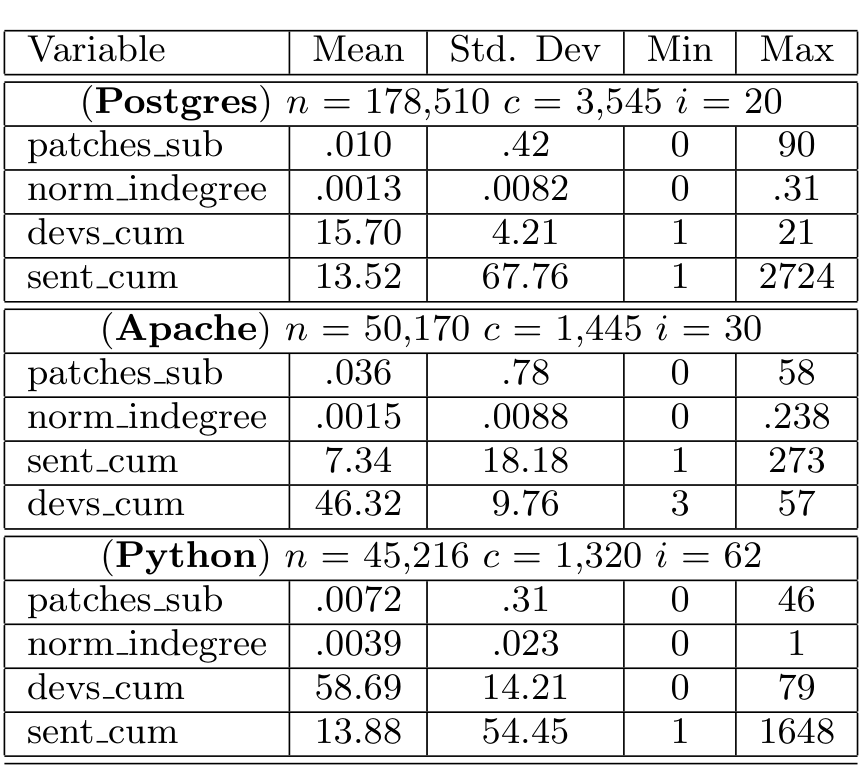

tained data for 5 years. As a result, we only consider those who joined the mailing list (mailed for the first time) after the source code repository became available, on January 5, 1999. There are 1,445 such individuals.

Figure 4. Fitted hazard rate estimate for immigration events in Postgres with time scale in years.

After gathering the variables, we accounted for multi-collinearity between variables by checking correlations. We omit these details here for brevity [10].

Table 1. Univariate Statistics of the predictors

Figure 4 is a plot of the raw data that indicates how people immigrate in the Postgres project. This shows the rate of participants becoming developers on the y-axis versus tenure time in years on the x-axis. Notice the non-monotonicity of the curve as it increases in the rate until a peak around one year followed by a gradual decrease until five years. This curve is generated by smoothing the raw data. We present the actual statistical model later. More figures, for our 3 subject projects are available at http://macbeth.cs.ucdavis.edu/hazard

### 3.3 Hazard Rate Analysis: background

Hazard rate analysis, or survival analysis [4, 9], can model stochastic time-dependent phenomena such as systems failure, cancer survival, employment duration, business failure, etc. We use survival analysis not to predict who will become a developer or when, but rather to understand which factors influence, to what degree, the duration and occurrence of such events (e.g., gender, age of onset, smoking history for a cancer survival analysis). If a model has a statistically significant fit, then the details (based on the estimated coefficients of the predictors) shed light on hypotheses concerning the effects of the predictors on the survival. It is thus a natural method for a quantitative study of the process by which a mailing list participant immigrated to become a developer in a FLOSS project.

We now informally present some background for the hazard rate model (see [4] for details). The hazard rate function captures the rate at which events of interest occur, and models their dependence on time and the other predictor variables. First, we present a definition of the hazard rate, and its dependence on the time variable t. Suppose the event does not occur until exactly time T. The hazard rate of the event of interest is the probability of the event occurring in an infinitesimal time interval δt starting at time t (given that it hasn't occurred until then) divided by δt. It is modeled as a hazard rate function λ(t):

λ(t) = lim_{δt→0} P(t ≤ T < t + δt | T > t) / δt

Consider the probability of "survival", that is, the probability that the event has not occurred yet. Assuming that the event actually occurs at time X, the probability that X is later than t is given by:

P(X > t) = exp(−∫_0^t λ(s) ds)

The simplest possible model is that the rate is a constant, λ_c, which gives rise to the common exponential model for survival, with survival becoming always less probable as time increases:

P(X > t) = exp(−λ_c t)

The problem with this simple model is that it doesn't allow for modeling multiple predictors (e.g., age, gender, ethnicity, profession) or non-monotonic rates of failure. A general class of models, called the proportional hazards model, allows the introduction of other predictors (besides time). Such models in general are written as:

λ(t) = f(t) * g(x)

where f is purely a function of time, x is a vector of predictors, and g is an appropriate function. In our setting, we seek to investigate a) if there is a non-monotonic dependence on tenure, and b) if social factors and prior evidence of knowledge and skill have an effect. For our purposes, the easiest model to use is the piecewise constant exponential hazard rate model. We assume that the purely time dependent part f(t) is fixed over each interval. Thus,

f(t) = exp(α_tpk) for t ∈ (c_{k−1}, c_k], where tpk = (c_{k−1}, c_k]

and the intervals (c_{k−1}, c_k] are chosen to cover the duration of the available data, and α_tpk, one for each interval, are constants. This gives us the flexibility of seeing if the data supports the hypothesis that these rates change non-monotonically; in fact any pattern of increasing/decreasing