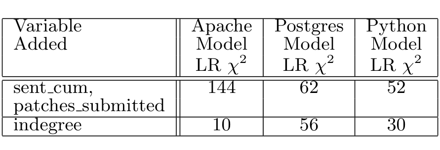

rates is possible. For the parametric part g(x), we use an exponential model, thus:
g(x) = exp(b · x)

where b is a vector of parameters derived by statistical fitting. This allows us to examine the influence of predictors such as prior patch submission history, social network status, etc. on the time to immigration.

### 3.4 Results

As explained above in section 3.3, the hazard rate function is modeled in this form:
λ(t) = exp(α_tpk) * exp(b · x)

The first part (previously denoted f(t)) is a constant for each time interval t_pk, and the second part depends on the vector of variables x. We fit this model for each of the mined projects. During the analysis, we first started with a baseline model, consisting of the piecewise time periods, and the control variables (devs_cum and time_trend). We then added the variables patches_sub and sent_cum, which have to do with an individual behavior and skill level. Finally, we added the norm_indegree variable, which represents the community response. For each of these 3 steps, we built the piecewise-constant proportional hazard rate model and calculated the likelihood ratio χ² to judge the improvement in fit. The results are shown in table 2. It can be seen that the improvement in fit is highly significant in the first step (two degrees of freedom) as well as the second (one degree).

Table 2. Improvement in fit (likelihood ratio χ²) provided by variables in the model. The base model included the time periods, and control variables devs_cum and time_trend. All χ² values are highly significant. All variables were checked for statistical independence.

The results from the final model in each case are shown in table 3. The table shows one variable in each row, with coefficients and their significance in each column, separated out for each project. We show the estimated values of all α_tpk and the components of the vector b; the size of these coefficients represents the size of the effect of the variable, and Z score represents the statistical significance of the estimated value. The Z score is calculated by dividing the estimated value by the standard deviation (not shown). The probability (next column) is the likelihood that the coefficient is actually zero in the proportional hazards model (i.e. the variable has no effect on the rate, since e^0 is 1). The lower the probability, the more statistically significant the result. Generally, values less than 0.05 are considered statistically significant. The absolute values of the coefficients are quite different because the range of values of the relevant variables is different. The actual effects can be judged by considering both the value range and the coefficient, as we illustrate below.

We first discuss the effect of variables that are dependent on the individual. These variables (indicated with *) are located at the lower part of the table. Their coefficients are to be interpreted as log(proportional effect) on the hazard rate for unit change in the value. For example, patches_sub is a variable that indicates the number of patches submitted by a particular mailing list participant. This effect is largest in Python, where each submitted patch increases the hazard rate by a factor e^{0.093}, or about 9.7%. In Postgres, this effect is about e^{0.054} or an increase of 5.5%. The effect is positive, but only significant at about the 0.1 level in the Apache project. Sent_cum is the total number of messages sent by an individual. Its effect is significant in Apache resulting in a e^{0.021*18.18} (1.5 fold) increase in the hazard rate for one standard deviation increase in value. The rates of increase are statistically significant, but more moderate for the other projects; e^{0.003*54.44} (18%) for Python and e^{0.002*67.76} (15%) for Postgres for their respective standard deviations. The social network measure norm_indegree is statistically very significant in all 3 models; however, the effect varies per project, increasing the rate by about 62% in Apache, 77% in Postgres and 22% in Python for one standard deviation increase in normalized indegree.

Turning to the time dependent variables in the hazard rate model we show two classes of variables: the first class, tp1 etc., constitute the pure time dependence of the hazard rate model. The proportional effect of the rate function can be interpreted as:
e^{α_tp1 * tp1} * e^{α_tp2 * tp2} * e^{α_tp3 * tp3} * ...

Each variable tp1 ... tp6 should be interpreted as binary, taking on a value of 1 while t is in that period, and 0 otherwise. Thus during time period tp1, the proportional effect on the rate function is simply e^{α_tp1 * tp1}. The absolute value of the rate resulting from this is quite low, in both Apache and Postgres reflecting the low base rate at which people join the project. In both cases where the fit is significant, we see an increase and then a decrease in the hazard rate. The piecewise-constant time-dependent part of the hazard rate model does not show a statistically significant affect on the hazard rate in Python. We believe that due to the centralized nature of the governance structure and more informal immigration process in Python, visibility (in terms of patches submitted and mails sent) plays a much larger role than tenure within the community.

Finally, we control for two potentially confounding variables: in order to control for effects arising from project age, time_trend measures the age of the email archives in years. This is different from tp1 ..., which are tenure periods per person. The model shows a negative effect in Postgres and Python. The total number of developers, devs_cum, is used to control for the size of the population who play a central role in deciding if someone becomes an immigrant. This has a positive effect in Python and Postgres. The reasons for the effects of these variables is not clear to us presently, but are not concerns since they are used for control and not prediction, though they do present avenues for future study. Neither of these control variables had a statistically significant affect in the Apache project; we believe this may have roots in the more formal norms associated with foundation style projects, but we cannot conclusively affirm this.