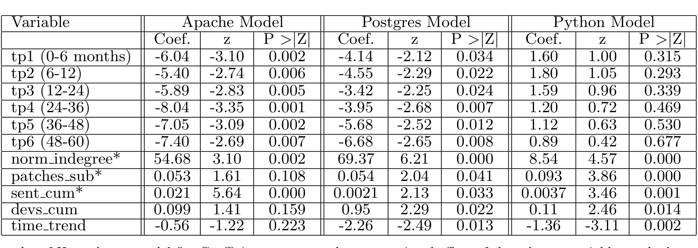

time trend -0.56 -1.22 0.223 -2.26 -2.49 0.013 -1.36 -3.11 0.002

Table 3. Results of Hazard rate model fit. Coefficients represent log-proportional effect of the relevant variable on the hazard rate. For example, in the case of Python, submission of one additional patch (patches_sub) increases the rate by e^0.093, or nearly 10%. tp1, tp2, etc. are time periods with ranges marked in months. Note that in Postgres and Apache the rate increases and then decreases as we move through from tp1 to tp4. Since there are very few non-developers that stay past 4 years, the interpretation beyond this point is unclear. 11

## Summary:

The model results for the three projects share a fair amount of similarity in terms of the direction and degree of effects that the predictors have on the immigration rate. We draw some conclusions from the fit of these models with regard to our hypotheses below.

### Non-monotonic tenure dependence

In both Apache and Postgres, the models support the hypothesis that the hazard rate increases, and then decreases. In all three cases, the data, when plotted, shows this trend; however, in Python the results are not statistically significant. The difference may be due to the centralized community structure and more ad hoc immigration policies in this monarchist project or could be attributable to the calendar duration of the projects: Python is 4 years younger than both Apache and Postgres; perhaps the community’s reaction to newcomers is still evolving. Thus, we conclude that Hypothesis 1 is supported in Apache and Postgres, but is indeterminate in Python.

### Patch submission effect

In Python and Postgres, prior history of patch submission has a significant effect, with each patch submitted increasing the hazard rate by 10% and 5% respectively. The effect is positive and within the same order of magnitude, but not statistically significant in Apache. We thus conclude that demonstrated skill level via patch submission plays an important role in Python and Postgres, but results are inconclusive in Apache. The effect in Python is especially strong (0.093 for Python, vs 0.053 and 0.054 for Apache and Postgres). This is consistent with stated institutional norms of the Python project, which emphasize display of skills through patch submissions and other technical contributions as a way of gaining status. Hypothesis 2 is supported in Python and Postgres, but not in Apache.

### Social Status/Activity

In all three models, the social network measure, indegree, which is a measure of the breadth of response to an individual within the community has a significant effect, although the effect is moderate. This indicates that community response to participants does play a role in developer immigration on each of the projects studied. This is especially interesting given the varied governance structures and levels of formality with regard to the immigration process in the projects. The effect of social status (norm_indegree) is specially strong in Postgres, reflecting Josh Berkus’s description11 of Postgres as a community project, where decisions are made communally. Still, the significance in all projects indicates a phenomenon that may generalize well to a significant portion of other OSS projects. So we conclude that Hypothesis 3 is supported in all three projects.

## 4. Threats to Validity

We now discuss possible threats to validity and explain how we address them (when possible).

### 4.1 Internal Threats

Our patch and social network data are extracted from the project development mailing lists. We may be missing some data if participants interact on IRC channels, via direct email or in other ways (even face to face in some instances). This method is justified for a few reasons. Current research literature [3, 11, 16, 22] suggests that patch submissions and community discussions occur on developer mailing lists. Second, accepted open source tradition (and policies within many FLOSS communities) indicate that the developer mailing list is the standard place to submit patches, discuss the software, and for newcomers wanting to contribute, to interact with the community12. One reason for this is that the mailing lists have the highest visibility of the community communication media. As the mailing lists are the main form of communication in FLOSS communities, we believe that interactions via other mechanisms will be manifest as similar interaction on the mailing lists.

### 4.2 Threats to Construct Validity

One of our hypotheses is that community perception of a participant’s technical skills and knowledge has an effect on becoming a developer. Our method of measuring perceived technical skill is by examining the number of patches submitted and accepted into the source code repository. While there is accepted literature [23] that supports the notion that contributing patch “work-gifts” is one the best ways

11 See http://www.powerpostgresql.com/5 types  
12 please see http://httpd.apache.org/ABOUT_APACHE.html#Development