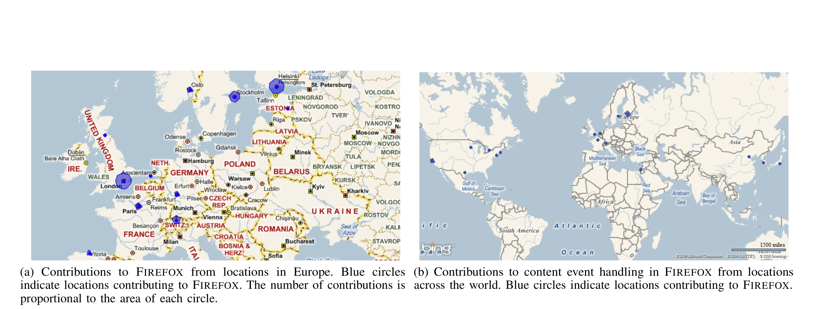
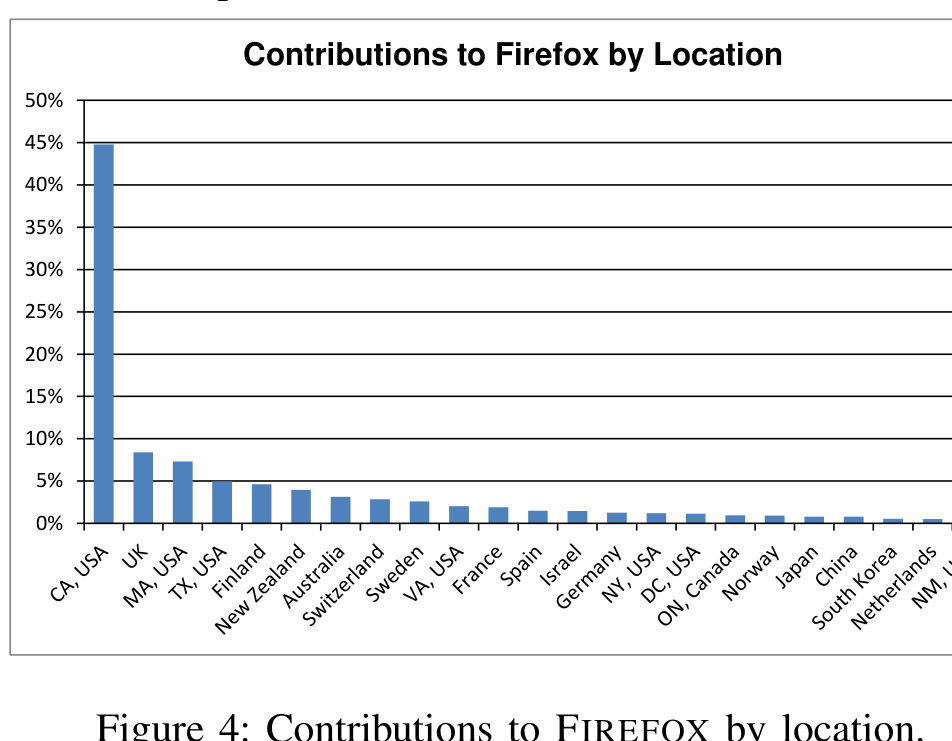

(a) Contributions to FIREFOX from locations in Europe. Blue circles indicate locations contributing to FIREFOX. The number of contributions is proportional to the area of each circle.

(b) Contributions to content event handling in FIREFOX from locations across the world. Blue circles indicate locations contributing to FIREFOX.

Figure 1: Maps of FIREFOX development

## FIREFOX 2.0 Contributions

| Organization | Commits | Percentage |
|---|---:|---:|
| Mozilla Corporation | 9551 | 47.6% |
| Google | 2102 | 10.4% |
| MIT | 1716 | 8.5% |
| Nokia | 758 | 3.8% |
| Intel | 705 | 3.5% |
| Netscape | 631 | 3.1% |
| IBM | 334 | 1.7% |
| XForms | 277 | 1.4% |
| Sun | 209 | 1.0% |
| Korean Adv. Inst. of Tech. | 148 | 0.8% |
| Macalester Univ. | 104 | 0.5% |
| Univ. of Queensland | 94 | 0.5% |
| 8×8 | 79 | 0.4% |
| Thales | 72 | 0.4% |
| University of Tartu | 54 | 0.3% |
| Red Hat | 8 | 0.0% |
| Self | 710 | 3.5% |
| Unknown | 1525 | 7.6% |

Figure 2: Contributions to FIREFOX 2.0 by organization. “Self” and “Unknown” are listed at the bottom because each individual in these categories comprise his or her own organization. Total sums to 95% because we did not determine information for the 100+ developers contributing the remaining 5%.

As Figure 4 shows, FIREFOX is quite geographically distributed. Unsurprisingly, California is the geographic region that makes the largest number of contributions. This is due to the fact that Mozilla Corp, Google, Sun, Netscape/AOL and Red Hat all have offices and, in some cases, headquarters, in the California Bay Area, near San Francisco. Despite this, we see that contributions are made from a number of countries throughout the globe, with a focus in North America and Europe. Note that each location depicted may include multiple sites. For instance, there are two unique sites in Ontario, Canada, and three in Israel.

Figure 4: Contributions to FIREFOX by location.

While almost half of the contributions for FIREFOX come from the California Bay Area, the other half is distributed worldwide, with a focus on Europe and North America.

We also visualized contributions geographically. For example, Figure 1a shows a map of Europe with FIREFOX development sites indicated as blue circles. The area of each circle is proportional to the number of commits to FIREFOX from that location.

When broken down by component, the level of geographic distribution is varied. For instance, the map in Figure 1b shows development for the code that handles events within displayed internet content. The development of this module was split across three continents and 16 different countries/states. At the other extreme is the inter-process communication code, which was developed almost exclusively within Mozilla Corp in the Bay Area of California.

Figure 5 shows the breakdown across both major releases in FIREFOX. FIREFOX appears to be very distributed even at the component level. Almost half of the components were categorized as spanning at least two sites and one third span multiple continents (i.e., at the world level).

Interestingly, there appears to be a dichotomy in geographic distribution. Modules are mostly either categorized as same site or worldwide.