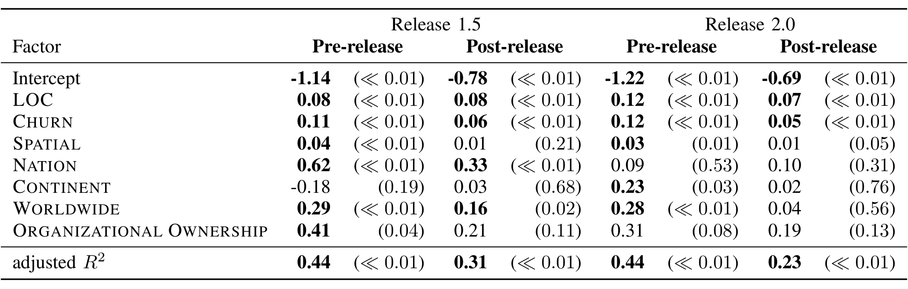
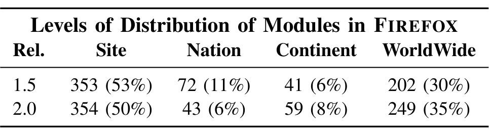

Figure 3: The linear regression model results for effects of distributed development on quality in FIREFOX. Bold values are statistically significant and p-values are shown in parentheses

Figure 5: The number of modules at each level of distribution for FIREFOX.

We also investigated the differences between the modules categorized as same site and different continents. On average, modules categorized at the “Worldwide” level are larger, have more commits, and more distinct contributing developers. For instance both the average and median number of commits for modules developed on multiple continents were over three times higher than that of modules developed primarily in one site. A Mann-Whitney test showed that the difference between the two sets is statistically significant (p < 0.01). This is in stark contrast to our previous study on Windows Vista development. Although geographically distributed binaries in Vista had, on average, more contributing developers, these binaries did not differ from their collocated counterparts in terms of size, complexity, or churn.

We therefore conclude that in answer to RQ2, large proportions of FIREFOX modules are developed at the same site and on different continents. However, same-site modules are smaller, have less commits, and less contributors.

### C. Effects of Distribution on Quality

Finally, we evaluate the effect that distribution has on software quality in FIREFOX. We used linear regression to measure the relationship of pre and post-release bugs in FIREFOX with the previously defined measures of distribution.

We used the same methodology when examining FIREFOX. The distribution of bugs in modules within FIREFOX is heavily right skewed; most plugins have between 5 and 20 postrelease bugs, but there is a long tail. We therefore applied a log transformation to the number of bugs prior to regression. In addition, LOC, CHURN, SPATIAL, TEMPORAL, ORGANIZATIONS were also transformed due to skew.

We also found that LOC and COMPLEXITY were highly correlated leading to VIF values above 10. We also removed ORGANIZATIONS (correlated with TEMPORAL, SPATIAL, and CHURN) and TEMPORAL (correlated with ORGANIZATIONS and SPATIAL) due to high VIF. After applying these changes, the residuals on the resulting models followed a normal distribution, indicating that the results are valid.

We built models for pre and post-release defects for releases 1.5 and 2.0. The summary results of our regression models for FIREFOX are shown in ??. Each column represents the coefficients and p-values (in parentheses) for statistical significance for one regression model. We use a standard cutoff of 0.05 for significance. Coefficients in bold indicate that the independent variable had a statistically significant relationship with defects. The sign of the coefficient indicates if defects went up (positive) or down (negative) as the value for the measure increased. Due to log transformations of dependent and independent variables, comparisons between coefficients are not straightforward. We therefore examine the direction and statistical significance of the geographic and organizational factors to determine if they are related to quality. In all cases where statistically significant, the measure of distribution had a positive relationship with defects.

The one measure that is surprising is ORGANIZATIONAL OWNERSHIP, as we had expected that higher values would lead to fewer defects. Interestingly, bivariate spearman rank correlations of ORGANIZATIONAL OWNERSHIP varied from −0.32 to −0.54, indicating an inverse relationship. Once controlling for all other factors, however, this relationship reverses.

The results are somewhat mixed. In general, distribution measures are more significant during prior to release than after. Higher values of SPATIAL and worldwide distribution were associated with more defects in both prior to both releases. In contrast, the post-release defects in version 2.0 showed no significant relationship with any distribution measures after controlling for LOC and CHURN.

We therefore conclude for RQ3 that modules in FIREFOX that are geographically distributed show only a slight