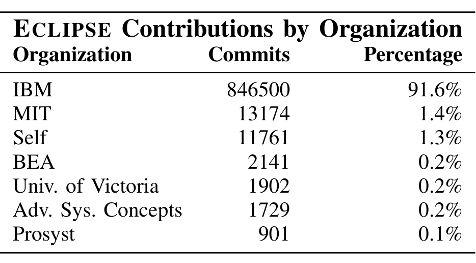
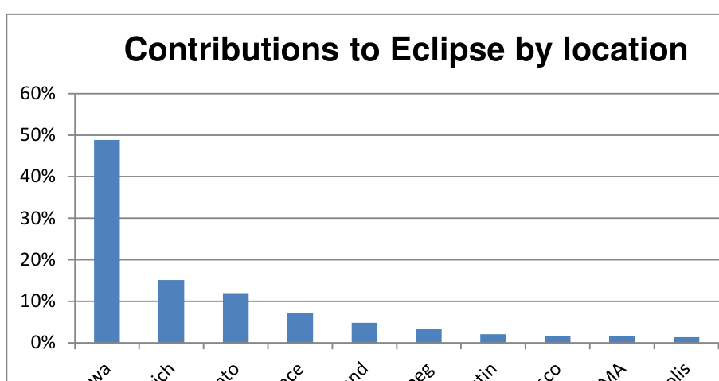

Figure 6: Contributions to ECLIPSE from release 1.0 through release 3.3 by organization.

increase in failures and organizational distribution has no statistically significant effect in most cases.

## VI. ECLIPSE RESULTS

We now present our results after performing a similar analysis on the ECLIPSE project.

### A. Organizational Distribution

Our data shows that IBM is the overwhelming contributor to ECLIPSE. Figure 6 shows the contributions to ECLIPSE across all releases. When broken down by release (not shown), IBM contributed 89% to 93% of the commits to each release, and, in total, IBM contributed 91% of the commits to ECLIPSE. While it is generally recognized that IBM is the major backer of the ECLIPSE project, the level of development support (and clearly control) has not been quantified. The data is so extreme that no further quantitative analysis is needed to conclude that IBM contributes to ECLIPSE more than all other entities combined.

We therefore conclude for RQ1 that ECLIPSE is not organizationally distributed. IBM accounts for over 91% of the development that occurs in ECLIPSE.

### B. Development Sites

A disproportionate number of contributions to ECLIPSE come from a small number of geographical locations. Nearly half of the source code changes originate from one IBM site in Ottawa, Canada and 75% can be traced back to just three sites. The graph in Figure 7 illustrates the percentage of contributions that were made from various sites. San Francisco and Cambridge are the only locations of those shown in the pie chart that are not completely represented by an IBM facility (there are a number of non-IBM sites aggregated into "Other"). Ottawa, Toronto, Portland, and Winnipeg all represent IBM facilities.

A small number of development sites account for the majority of source code contributions in ECLIPSE. 49% of contributions come from just one site and 76% of the contributions can be traced back to just three.

When we look at the granularity of components (in ECLIPSE, plugins), the development is even less distributed. For instance, when we examine development for the JUnit code (a Java testing framework) in the JDT component (Java Development Tools) of ECLIPSE.

Figure 7: Contributions to ECLIPSE by location.

The IBM site in Switzerland accounts for 96% of the commits in JUnit (3,094 total commits), and the other 4% of the commits come from Ottawa, Cambridge, Winnipeg, and Portland (all IBM sites).

We found that as a whole system ECLIPSE is distributed worldwide, but is dominated by just three sites on two continents. However, when examined at the level of individual components, they are not very geographically distributed at all. The numbers of plugins that were not categorized as same site were quite small. Figure 9 shows the breakdown across six major releases in ECLIPSE. There were few cases where a component is distributed across multiple continents; only 1% of the plugins in release 3.3 had non-trivial contributions coming from both Europe and North America.

Similar to our organizational results for ECLIPSE, we conclude for RQ2 that the vast majority of plugins in ECLIPSE are not geographically distributed.

### C. Effects of Distribution on Quality

As with FIREFOX, we used linear regression to measure the relationship of pre and post-release bugs in ECLIPSE with levels of distribution. Given the low number of distributed plugins (some releases had only 4), some of the regression models lacked enough samples for statistical power.

The distribution of defects in plugins in ECLIPSE is heavily right skewed, meaning that while most plugins have between 10 and 50 defects, there is again a long tail and a few plugins have hundreds of defects. When testing for multicollinearity, we had to remove ORGANIZATIONAL OWNERSHIP and TEMPORAL. In order to fit residual normality assumptions, we performed a log transformation on LOC, CHURN, and ORGANIZATIONS. We summarize the results of our regression analysis in Figure 8. Statistically significant values at 0.05 are in bold and at 0.10 are in italics. We also include adjusted R2 values for the models.

Again, the results are somewhat mixed. Each measure shows a statistically significant effect in some releases and not in others. Some releases don't show a significant effect of geographic distribution on software quality at certain levels. However, often this is due to small sample sizes. For instance, the 3.3 release shows no effect of worldwide distribution on