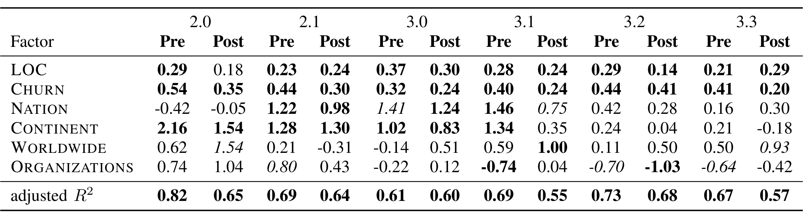
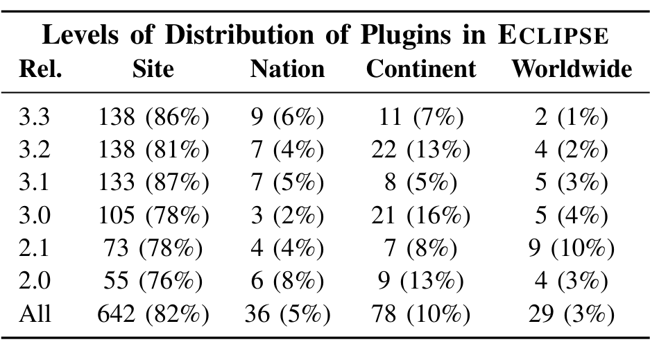

Figure 8: The linear regression model results for effects of distributed development on quality in ECLIPSE.

Figure 9: The number of modules at each level of distribution for ECLIPSE.

quality, but that is likely because although the distributed components did have more pre- and post-release bugs, only 2 plugins were distributed worldwide. This represents only 1% of the plugins in 3.3.

Although not shown in the figure, the magnitude of the increase in bugs was also significant. In all cases where distribution was significant, the average number of bugs for the distributed plugins was at least 50% more than the collocated plugins; in many cases they had twice as many bugs or more. Given the small number of plugins that were distributed worldwide, this does not always represent a statistically significant result.

Thus our findings for RQ3 are that all measures of geographic and organizational distribution increase failures, but the effects are not consistent across releases.

## VII. THREATS TO VALIDITY

One threat to construct validity is that we may not capture all defects for these projects. We only include bugs that have been closed because the location of the source of an unclosed bug is impossible to determine without manual inspection. We argue that fixed bugs are the most important to the project (being important enough to warrant being fixed), and are a reasonable proxy for software quality. A prior study [29] found that there is some bias in ECLIPSE bug data relative to bug severity and experience of the bug closer. We have not examined potential bias in organizational or geographic dispersion.

A potential threat to external validity is that we do not capture the ecosystems surrounding both Firefox and ECLIPSE. There are a number of external plugins that exist for ECLIPSE and Firefox that were developed by separate open source and commercial organizations. For ECLIPSE we only study the core platform and plugins. This represents the functionality that a developer gets when downloading one of the standard versions (we include all plugins that occur in all standard versions, as each release of ECLIPSE has multiple downloadable sets of plugins) from the project web site. Similarly, we do not include any Firefox addons in our analysis. While this means that we do not capture all development relative to these projects, this decision was based on the fact that we are interested in the core product. Developers of third-party plugins and addons may have little or no similarity at all.

The impact of organizational and geographic factors on improvement of the baseline failure models is related to the features used in the original models. We had to make decisions regarding what metrics to include in our baseline models and included size and churn because these have been shown to consistently have a strong relationship to failures [25], [30]. Other factors were either difficult to compute (Firefox is written in many languages so any source analysis would be difficult) or have shown inconsistent results in different domains (e.g., number of contributors to a software entity [31], [32]).

## VIII. CONCLUSION

We have presented the first study that characterizes both organizational and geographically distributed development and examined the effects of these factors on software quality in two large scale, successful open source projects.

Firefox development is quite distributed both geographically and organizationally, although approximately half of all commits come from Mozilla Corp. organizationally and half come from California geographically. Only half of all modules have 75% of their changes originating from one city. Modules that are geographically distributed tend to be larger, more complex, and have more contributors. They also exhibit more defects even when controlling for size and churn.

ECLIPSE differs in that it has very low organizational distribution. At the system level, ECLIPSE is also geographically distributed, but this is due to a small number of IBM sites scattered around the world. At the component level, there