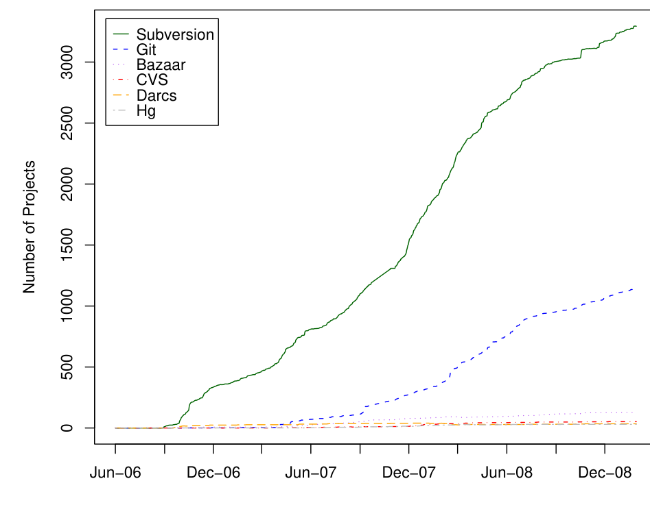
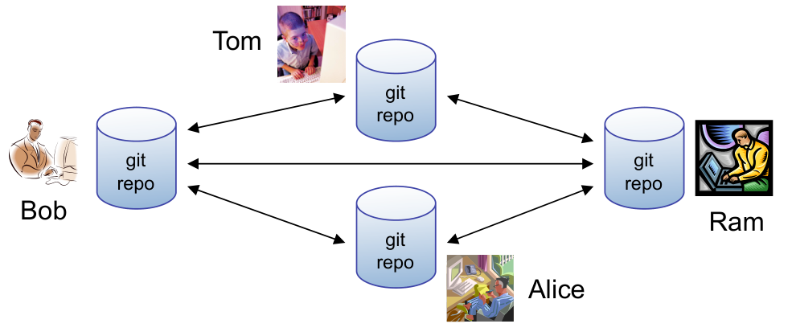
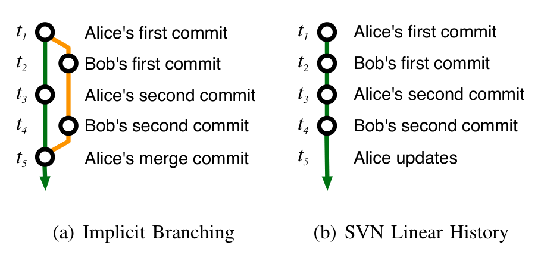
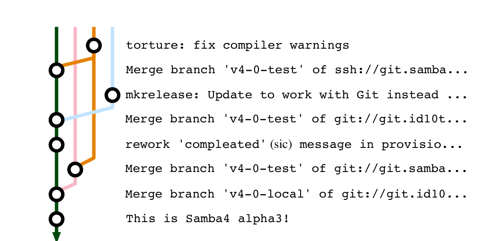
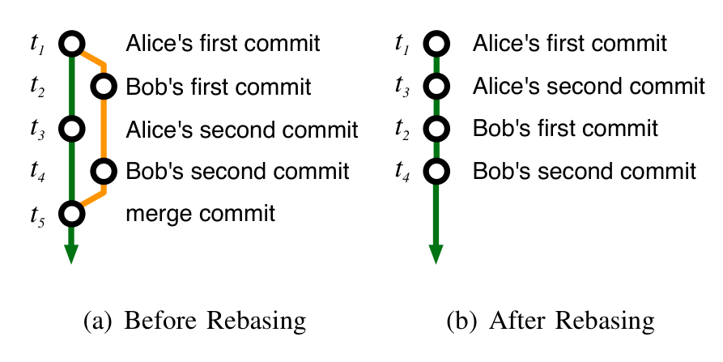
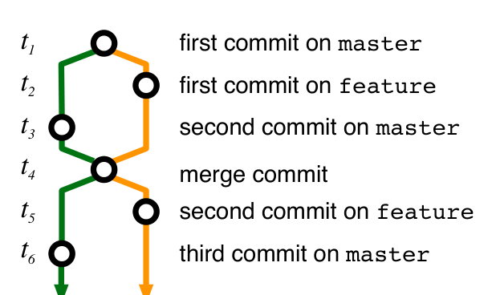
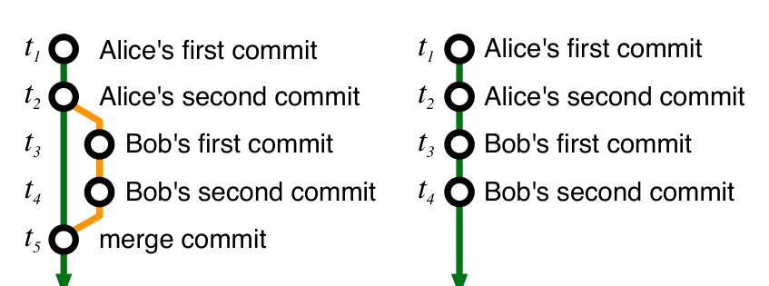
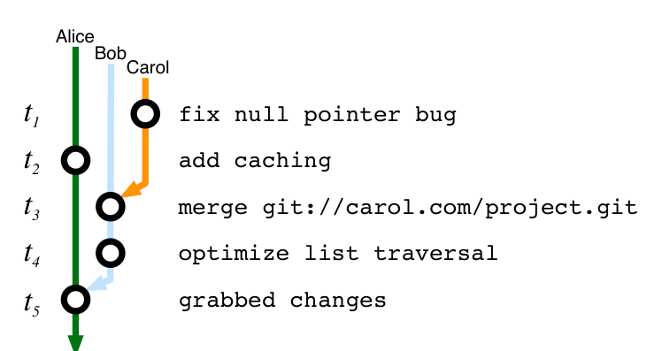
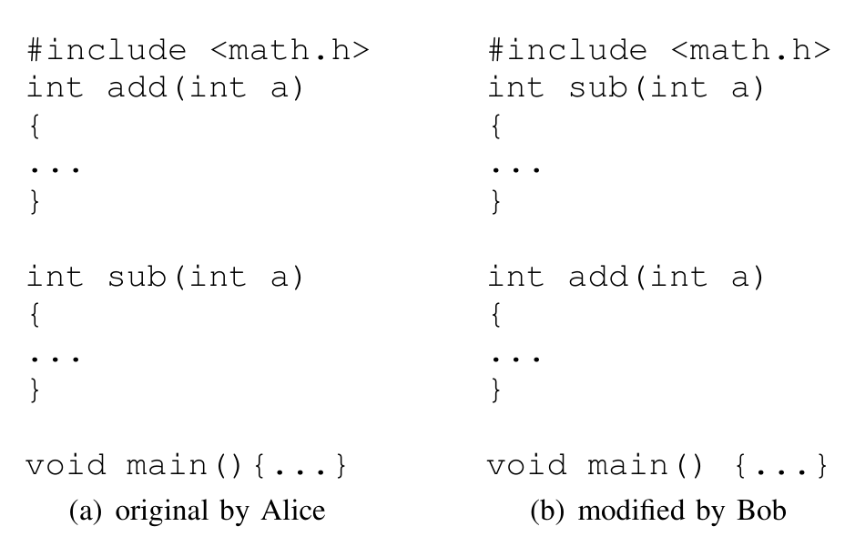
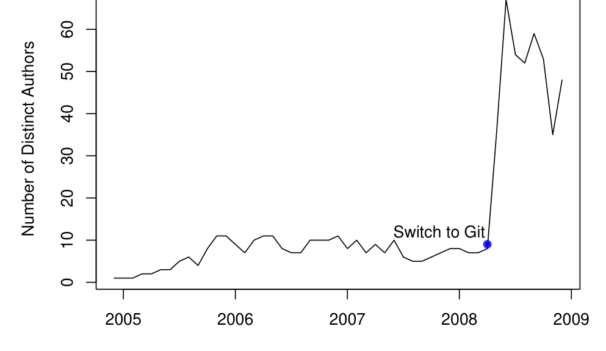

## The Promises and Perils of Mining Git

Christian Bird*, Peter C. Rigby†, Earl T. Barr*, David J. Hamilton*, Daniel M. German†, Prem Devanbu*  
*University of California, Davis, USA  
†University of Victoria, Canada  
{bird,barr,hamiltond,devanbu}@cs.ucdavis.edu {pcr,dmg}@cs.uvic.ca

### Abstract

We are now witnessing the rapid growth of decentralized source code management (DSCM) systems, in which every developer has her own repository. DSCMs facilitate a style of collaboration in which work output can flow sideways (and privately) between collaborators, rather than always up and down (and publicly) via a central repository. Decentralization comes with both the promise of new data and the peril of its misinterpretation. We focus on git, a very popular DSCM used in high-profile projects. Decentralization, and other features of git, such as automatically recorded contributor attribution, lead to richer content histories, giving rise to new questions such as “How do contributions flow between developers to the official project repository?” However, there are pitfalls. Commits may be reordered, deleted, or edited as they move between repositories. The semantics of terms common to SCMs and DSCMs sometimes differ markedly, potentially creating confusion. For example, a commit is immediately visible to all developers in centralized SCMs, but not in DSCMs. Our goal is to help researchers interested in DSCMs avoid these and other perils when mining and analyzing git data.

Figure 1. The Debian Project’s Use of SCMs.

the number of projects with Debian packages that report using a given SCM over time1. As of February, 2009, 36% of the packages include SCM information. Although incomplete, this data gives a strong indication that git is second only to SVN in use and that its use is growing. Indeed, git has also been adopted by a number of high-profile OSS projects such as X.org, Ruby on Rails, Wine, Samba, Perl, and the Glasgow Haskell Compiler.

The repositories of these and other projects are of interest to researchers, but their data differs in important ways from that which is found in their centralized counterparts. Massey and Packard [15] have presented a method of converting CSCMs to git for mining data. However, to our knowledge, only one paper [16] has examined data mined from a git-based project. This paper presented results of analysis of data drawn from the Linux git repository. We have also found one article in the Linux Weekly News that uses data mined from git to track how patches find their way into the stable main line linux tree from subsystem git repositories [17]. Neither the paper nor the article addresses the core differences between git and centralized SCMs,

> Out of a stem that scored the hand  
> I wrung it in a weary land.
> 
> A. E. Housman, A Shropshire Lad

## 1. Introduction

Since the turn of the century, researchers have taken advantage of the data found in SCM repositories that has been made freely available for Open Source Software (OSS) projects. This data has been used to reconstruct the process by which the software was created [1], [2]. Researchers have also used this data to create recommender systems [3], [4], [5], study evolution patterns [6], [7], [8], predict bugs [9], [10], [11], and examine collaboration [12], [13], [14].

The number of software projects using DSCMs has increased, and looks set to continue to do so. Figure 1 shows

1. According to data provided by projects using the vcs- (SCM-) headers introduced to Debian package descriptions in 2006.

---

differences that lead to very different practices in SCMs and DSCMs. Entirely new phenomena are observable in DSCM data, that lead to many new questions. The data offers researchers many new opportunities, but it also is rife with both conceptual and pragmatic risks. In the course of mining and analysis, we suffered many setbacks and came to false initial conclusions due to incomplete understandings about the data and what processes led to the data we observed.

We compare SVN and git, popular and representative SCMs of the centralized and decentralized flavors. The most fundamental difference between the two is that, under git, developers can share code in a managed way without making use of a master repository, commits to which affect all other developers. This is because developers have their own repositories, each of which can tell a different part of a software project's story.

> Promise 1: Since any developer on a git project can make their own repository publicly accessible, it is possible to recover more history, including work in progress and work that never makes it into the stable codebase.

Any person may make their own git repository publicly accessible and there already exists free git hosting services, such as GitHub, Gitorious, and repo.or.cz. For example, at the time of this writing there are 481 publicly accessible developer git repositories cloned from Ruby on Rails2.

Different developers can have different content in their repositories. For instance, Ubuntu maintains its own repositories of the Linux kernel which contains changes of their own, some of which never make it into the official kernel tree. David Miller, a Linux developer, maintains a repository named net-next-2.6 which contains new or experimental code and is the staging area for network code in the kernel.

Despite the decentralized model, many OSS projects have an "official" repository from which releases are made and which developers use as the source. These repositories, and those of the more active developers, are likely to be the most interesting to researchers.

In projects using SVN, commits often only make it into the repository after being vetted; the rest of the activity (false starts, experiments) are largely invisible. With git, by mining from developers' repositories, it is possible to recover a more complete picture of the development process, including unpolished, experimental work that does not make it into the stable code base.

We begin our discussion of the promises and perils of mining git, with a clarification of the conceptual differences between the centralized and decentralized SCM worlds.

2. As reported by Github.com in February, 2009.

Figure 2. Sample decentralized usage of git

## 2. Conceptual Differences

> Peril 1: Git nomenclature differs from that of centralized SCMs (CSCMs): a) similar actions have different commands; and b) shared terms can have different meanings.

Figure 2 illustrates the DSCM world for a 4-person team consisting of Tom, Bob, Alice and Ram, who collaborate on a large project. There is no centralized repository: each developer has their own, which they use to make commits, check out different versions, compare version differences, and so on.

This looks very different from a centralized SCM world and engenders nomenclature differences that can perplex even those who have some familiarity with git; especially those terms whose semantics differ subtly. To bootstrap our analysis, we broadly delineate these differences here, diving into more subtle differences as needed in the context of specific promises and perils.

In both SVN and git, the working copy is the current checked-out state of the repository. The developer Alice executes svn checkout or git clone to create a working copy. Alice can now work and, when she is ready, commit her contributions, using the commit command in both SVN and git. The fundamental difference is that in SVN commits are sent to the central repository, but in git they remain local. Hence, SVN commits are visible to all developers; git commits may not be. In SVN, Ram would have to issue a svn update to see the changes just committed by Alice. Under git, Alice’s commits move to another repository only when a) another developer, e.g. Ram, pulls changes into current branch of his repository via git pull or b) Alice pushes her changes to a remote repository using git push.

Pulling in git differs from an SVN update in that a developer may pull from any number of remote repositories into his own. It is much more common for a git developer to pull than push because a push requires write access and because each developer "owns" his repository and decides what goes into it. However, git does support a centralized workflow via a bare repository. A bare repository is not

---

exclusively owned by a single individual and does not have a working copy that a push can disrupt.

In SVN, commits are identified by a sequential number, and it is trivial to determine their order. In git, each commit is identified by the SHA-1 hash of its contents, and it is impossible, given only two git commit identifiers, to determine which one was performed earlier.

Branches in CSCMs are usually used for releases and for major, experimental efforts. We have observed that it is uncommon practice for developers using CSCMs to create branches just for their own individual work that is regularly merged into the mainline. By contrast, branches are lightweight in git. Developers using git freely create branches for new features or bug fixes, test them, and then merge them into the release/stable branch once they are reasonably confident. One important feature of git is its ability to track merges of branches, something that SVN lacks. Git also creates many branches as an unintended side-effect of decentralization (see Peril 2 in which implicit branches are discussed). Such branching differs fundamentally from the common use of branching in CSCMs. The head of any branch, in both SVN and git, is the last commit made to that branch. For mining purposes, SVN and git tags are identical. All git repositories start with a single, explicit branch whose name is master by convention. Git’s master is similar, but not equivalent, to trunk in svn, cf. Peril 3.

Since git records information about both branches and merges, the history of a repository is represented by a graph of commits, compared to the tree-like structure of commits in SVN. In git a commit may have more than one parent (due to merging) and may be the parent of more than one commit (due to branching). Since no commit may be its own ancestor, the graph represented by commits and their directed parent-child relationships is a directed acyclic graph (DAG). The term DAG is used throughout the paper and is common in git vernacular. Two git commits in different repositories have the same SHA-1 iff they have the same ancestors in the DAG and the same contents, which means that their working copies were identical when they were created. SHA-1 is a highly reliable indicator of content equivalence, and allows tracking of content pulled from common origins, which allows two repositories that have separately pulled identical content from a third repository to merge from one another without the use of that third repository.

A merge in git creates a new commit (a marker for the merge in the DAG) that has at least two parents. There are two key differences between merging in git and SVN: 1) n-way merging occurs in git and creates a merge commit with n parents; and 2) SVN does not explicitly track merge information, such as conflicts and their resolution. When a merge conflict arises, git writes the resolution to its commit. In addition, the merge that occurs whenever a SVN developer updates his working copy is never recorded, whereas analogous operations in git are.

Figure 3. The result of identical commit sequences.

We note that tools such as Perforce, ClearCase, Accurev, and SVN version 1.5 include merge tracking. However, the DAG created by these tools are semantically different, and the popularity and history of use of these tools in OSS projects is small (SVN 1.5 only tracks merges that occur after the code base switched to version 1.5 and cannot recover historical merges).

> Peril 2: Here Be “Implicit Branches!”
> (With apologies to Dragons)

Developers can explicitly create explicit branches in both git and SVN. In SVN, all branches are explicitly created, but this is not the case with git. As two collaborating developers commit to their local git repositories, their repositories diverge—i.e., each repository contains new commits not present in the other. When one of the developers pulls from the other, git merges the remote sequence of commits into the pulling developer’s repository. These changes are recorded as two branches that start at the commit where the repositories started to diverge (the last commit in common) and end at a merge commit created by git. One branch contains the local developer’s commits; the other contains the commits from the remote developer. Neither developer has explicitly created a branch. Thus, we call a branch that pulling can create an implicit branch. These branches can be confusing to those familiar only with centralized SCMs like SVN where a branch is always explicit and refers to an alternate line of development.

Figure 3(a) illustrates implicit branching. Before time t1, Alice and Bob’s repositories are identical. After t3, their repositories have diverged: each contains commits unknown to the other. Alice and Bob continue working independently, on separate codelines, as shown. At t5, Alice pulls the changes from Bob’s repository and resolves any conflicts, merging both repositories, and automatically creating a commit for the merge. Before t5, Bob’s changes are not visible to Alice; after t5, Bob’s codeline is an implicit branch in Alice’s history. Bob’s repository, however, does not contain Alice’s commits. In contrast, Figure 3(b) displays the history formed if Alice and Bob made the same changes using a CSCM. Because Bob’s commit changed the shared, central repository, Alice must update her working copy at t3 and resolve any conflicts that arise before she can make her

---

Figure 4. A subgraph of the git DAG of commits leading up to release of 4.0 alpha 3 of Samba.

commit; in Figure 3(a), Alice freely committed to her local repository. Similarly, Bob must update, and resolve potential conflicts, before his second commit. In SVN, the fact that Alice and Bob worked separately on different lines of development is lost.

## 3. Git Data Ore

> Promise 2: Git facilitates recovery of richer project history through commit, branch and merge information in the DAGs of multiple repositories.

Since git tracks both implicit and explicit branches and merges within and between repositories, it holds the promise of data not tracked by SVN (which tracks branches within the central repository, but not merges). This includes:
1) Implicit branches, showing how often developers pull and push changes from other repositories;
2) Feature (explicit) branches, showing collaboration activity: changes pulled directly between developers, vs. via an intermediary “official” repository.
3) Merge points, including the set of conflicted files, and who/when performed the merge and resolution.
4) Pulls from remote repositories, and the overall topology of the “pull network”.
5) The DAG, and set of commits in different repositories for the same project can determine the differences and “distance” from each other.

There are a number of possible uses for this data. For instance, is the spontaneously emerging “pull-network” of repositories hierarchical, centralized, or decentralized? Are there discernible patterns of collaboration between developers working on features in their own branches? Is there a relationship between status within a project and how often or how quickly a developer’s changes are integrated into the official repository?

Figure 5. Example of Rebasing

> Peril 3: Git has no mainline, so analysis methods must be suitably modified to take the DAG into account.

In SVN, the ancestry of a commit can be captured as linear series of commits and the trunk or “mainline” is often modeled in this fashion. Rather than following a single “mainline”, git project development flows through a set of paths in a DAG from the initial commit to the head. Analysis methods and storage techniques must therefore handle non-linear commit ancestry, including remote ancestry. Figure 4, which depicts the branching that occurred in the Samba repository prior to a release shows this phenomenon.

In both git and SVN, developers work in parallel. Two features that were made in a series of commits can be made at the same time. However, because SVN requires developers to update before making commits, the development history of these two features will have become interleaved. In effect, parallel development on a “mainline” results in the complete effort being projected into a single date-ordered line. Although miners can view this projection if they wish, it is not imposed and the projection must be created before using existing analysis methods, or alternate methods must be used.

> Peril 4: Git history is revisionist: a repository owner can rewrite it.

While other SCMs, such as SVN, also allow history to be rewritten, it is difficult and rarely done. Git allows a user to rewrite history through a process called rebasing. A user selects a sequence of commits to rebase; he may then alter the order of commits, remove commits, squash the edits in multiple commits into one commit, or flatten a sequence of commits on multiple branches onto a single branch. When commits are reordered or flattened, all information about the commit contents (date, author, changes to files) are retained, but the DAG and the commit hash are modified. The most commonly observed rebasing use case is to flatten a series of implicit branches. Many projects have policies restricting the use of rebasing [18]. These policies should be understood when analyzing data mined from git. Figure 5(b) shows what

---

Figure 6. The git DAG after branches master and feature are each merged with each other.

Alice’s git repository would look like if the commits in 5(a) were flattened (removing the branch and the merge commit) and reordered.

Rebasing is often used to “clean” a branch prior to having it pulled into another repository. Thus, the history in a git repository (especially a stable official project repository) may not reflect what actually happened to arrive at that particular state. Use of rebasing is one reason to mine satellite repositories, those developers use to write new features, as these repositories may contain the complete, unmodified development history.

> Peril 5: You cannot always determine what branch a commit was made on.

Although a commit is explicitly created on a specific branch of a specific git repository, the commit does not record the branch on which it was created. It can be difficult or impossible to recover this information. Figure 6 shows what the git DAG looks like after a crisscross merge. Alice merges a branch named feature to master, then master into feature. These merges share a single merge commit, as shown.

The commits prior to the crisscross merge at t4 are all ancestors of the heads of both subsequent branches. Commits are rarely annotated with the name of the branch to which they were written and the default commit message of the merge commit is merge branch 'master' into feature, which does not helpfully distinguish its parents. Thus, if the repository were mined at time t6, it usually is not possible to tell which commits prior to the merge were made on master (green-line before t4) and which were made on feature (orange-line before t4).

> Peril 6: It is not always possible to track the source of a merge or even determine if a merge occurred.

Typically, when a developer pulls commits from some branch in a remote git repository to his local repository, the branch must be merged into the current local working branch. We’d like to know the source of that merge, both in

(a) Avoid (b) Perform

Figure 7. Alice’s repository if git was told explicitly to avoid a fast forward merge (a) and normally, when performing a fast forward merge (b) after pulling Bob’s changes.

terms of the git repository and branch within that repository.

This is possible under most, but not all, conditions. By default, git creates a log message for the merge commit with one of the following forms. Text in brackets may not always appear.

Merge branch 'branchname' [into branch_name]  
Merge [branch 'branchname' of] remote_repo_url

Using this information and the relationships between commits on the DAG, it is possible to see which branches were merged together and where.

One situation in which detecting a merge is not possible is when a fast forward merge, depicted in Figure 7, occurs. Alice makes two commits to her master, which Bob pulls into his repository and then makes two commits. After t4, if Alice were to pull Bob’s changes, one would expect her history to look like figure 7(a). However, nothing changed in her repository since Bob pulled from it, so no merging actually needs to take place. Unless git is explicitly told not to, it adds Bob’s commits in sequence and “fast forwards” Alice’s HEAD to the last commit pulled from Bob. In this scenario no merge commit is created.

The situations where the merge source is not available in the commit messages follow:

1) If a merge of two branches results in a fast forward merge, no merge commit is created and thus no log message that contains the string will exist in the log.  
2) If there are conflicts during a merge, the developer will resolve the conflicts and commit their resolution with a log message that may not include the default text.  
3) If a developer rebases a series of commits which contain branches and merges, the result may be “flattened” and not include the merge commit.  
4) If a developer amends the commit message of a merge commit to something other than the default merge message (this is unlikely, but possible).

Figure 8 illustrates this peril. At t3, Bob creates a merge commit when he pulls from Carol; its commit message specifies the url of Carol’s repository. Assume that Alice overwrites the default merge text at t5 when she pulls from Bob. In Alice’s DAG, it is not trivial to know which branch is Bob’s and which one is Carol’s. Mining Alice’s repository, one would miss the fact that Alice pulled from Bob and also

---

Figure 8. Alice’s repository after pulling from Bob’s repository. There is no explicit information in the logs that records that Alice pulled from Bob, and one can incorrectly infer that Alice pulled directly from Carol.

One might falsely conclude that Alice pulled from Carol. Any analysis that is based on information about pulls between repositories should be sensitive to these issues.

In the first two cases above, there is no evidence that a merge occurred. Since it is not possible to determine how many merges are being missed due to these constraints, miners must be careful when performing any analysis that depends on branching and merging. In the last two, there is still evidence because there is a commit with two parents; however, source information may be lost. Since the merge is known in these cases, it is possible to measure the information loss. We found that use of the heuristics works in 98% of the cases for a sample of 30 git projects. Details of the analysis and results are presented in section 5.

> Promise 3: Git records the information needed to correct Perils 3–6 in private logs.

When Bob clones Alice and Ram’s repositories, his view into the history of those repositories is obscured. He cannot be sure when and from whom Alice and Ram pulled, when and how they rebased, and so forth. However, this information is not necessarily lost, even if it is not trivially accessible. Git stores information about fast-forward merges, rebases, and pulls in a logs directory. In fact, even more information about a developer’s workflow can be found there — each checkout is recorded, so a researcher could observe when a developer switched between branches.

This promises the possibility of mining data that includes extensive information about developer workflows and project history, but only under certain conditions. The miner must have access to the private repository of each developer whose logs she wishes to mine. Thus, it may well be possible to write tools that take advantage of this information, for use by organizations for their internal projects.

In some cases, researchers may be fortunate enough to have access to, or copies of, some private developer repositories for projects they wish to mine. When this opportunity arises, it is important for researchers to realize that a great deal more information has been made available than from regular repository cloning.

A caveat exists. Git has a cleanup command, gc. Normal execution of gc will not disturb the log files; however, it has an aggressive mode which will. If developers have been running gc --aggressive, some of the log entries may have been deleted.

> Peril 7: The accessible data may only contain commits that are success-selected.

History may be lost or modified due to other reasons. In one workflow, a developer creates a branch that contains changes to be pulled and reviewed by other developers. Once the review has occurred, the branch may be destroyed if the changes are not accepted. Alternately, the developer may modify the branch through rebasing or adding commits prior to inclusion. This process is similar to submitting a patch for review in an SVN project: that patch may be rejected or eventually committed (after possible modifications). Just as recovering the patch and review process is difficult in SVN-based projects [19], [20], a commit’s review history is not directly reflected in git. Initially, we naively thought that we would see more of the review process in the git history. We have found some success in using mailing lists along with signed-off-by, reviewed-by, and tested-by fields when they exist.

> Promise 4: The signed-off-by and other attributes create a “paper trail.”

In response to IP infringement allegations made by SCO, Linus Torvalds added a facility for people to “sign off” on a commit by adding a line such as signed-off-by: John Doe <jdoe@foobar.com> to the end of a commit message. There are also other attributes: acked-by, Cc, reported-by, reviewed-by, and tested-by. These attributes are explicitly added to commits using the -s flag and append a line to the commit log message using a standard format that is easy to parse. A commit may have multiple fields appended as it moves from repository to repository and is reviewed and tested.

This information can be used to (for example) determine certain roles within a community such as reviewer or tester. It can also be used to assess expertise within a project or recreate the organization of the community. We show one use of this data in determining expertise and visualizing the Linux social organization hierarchy in section 5.

To date, we have observed that few projects outside of the Linux kernel use these facilities, but we expect that, as projects with more rigorously enforced policies adopt git, they will take advantage of this added ability to record information about the history of a commit.

---

> Promise 5: Git explicitly records authorship information for contributors who are not part of the core set of developers.

In traditional OSS projects that use a centralized SCM, there is an explicit group of developers that have write access to the source code repository. The repository logs indicate which of these developers made each change. However, OSS projects are heavily dependent on volunteerism [12] and many community members outside the explicit group of developers make contributions in the form of patches, often submitted to the development mailing lists.

If a patch is accepted, it is committed to the repository by a core developer and the logs indicate that the change is attributed to that developer. Ideally, we would like to be able to attribute the source code changes to the person that contributed the change. Unfortunately, detecting the application of submitted patches is difficult [19]. In some projects such as Apache, it is commonplace for the developer applying a submitted patch to include attribution information in the commit message. However, accuracy of gathered attribution data is dependent on the project, the developers following the convention, and standardization of the log message format. Git repositories have more accurate author information due to its facilities for explicitly and automatically including information about the author of a change.

Contributors to git-based projects are able to submit changes in two ways. Anyone with read access may clone a public git repository and commit to their own copy. Any contributor may ask a project developer to pull changes from his own repository into the main project repository. In addition, git provides a facility to turn a commit or sequence of commits into a specially formatted patch that may be emailed to a project developer and applied to the main project repository. Even in the case of a patch, the author information is automatically extracted and preserved when committed to an “official” repository. This record keeping is one of the reasons that a git commit has a committer field that identifies who committed a change to a repository and an author field, identifying the person who made the changes. The author information is tied to the commit as it is transferred from repository to repository. We empirically examine issues of attribution in section 5.

Figure 9. Two versions of a file

In our analysis of OSS projects where we have needed to analyze every version of each file in the repository, we have relied on third party tools such as CVSsuck [21] or svn::mirror [22] to create local mirrors so that we can checkout files quickly and without burdening the official public repository. Unfortunately, we have found these tools to be error prone and sometimes lossy. In some cases, we have needed to contact project maintainers to request a copy of their source code repository. Since all of the information about a git repository is stored locally, there is no need to make requests or use third party tools. This benefit is true of all distributed SCMs, and not unique to git. Of course, the metadata will differ as repositories in the same project diverge.

> Promise 7: Git tracks content, so it can track the history of lines as they are moved or copied.

Git tracks the history of the content of files. This means that it is able to tell automatically if a file is renamed because the content remains the same and the history follows the content. In SVN, a developer must explicitly rename a file in order to maintain the file’s history. In addition, git is able to track hunks of text within and between files. Consider the two versions of a file in figure 9. Alice writes the first version. Bob creates the second version when he moves the function sub above add without changing its contents.

If svn blame is run to show who introduced each line, Bob would be indicated as the author of each line in the function sub. However, git blame -C -M, where -C finds code copies and -M finds code movement, would indicate that Alice had written each line of the file. Git also tracks text that moves between files and text that is copied multiple times as long as the number of lines moved is above a certain threshold (we observe the threshold to be around 4 or 5). Of course, if Bob were to modify a line in the implementation, even slightly, git would assign authorship of that line to Bob. Git’s origin analysis is not as accurate as recently introduced research techniques [23], but it is a dramatic improvement over SVN.

## 4. Mining the Git Gold Vein

> Promise 6: In git all metadata, notably history, is local.

When a developer creates a local repository based on a pre-existing repository all information from the remote repository is transferred to the local repository. In past

---

> Promise 8: Git is faster and often uses less space than centralized repositories.

Git is designed to handle a code base the size of Linux and manage a high volume of contributions. Since the metadata is on the local machine, accessing a log or a diff executes locally, with no network latency. Also, git stores full (compressed) versions of files, rather than a sequence of diffs. This means that checking out a file is a constant-time operation, regardless of history.

We converted the entire Eclipse CVS repository to git format and noticed that log access and checkouts were much faster. Checking out commits in an arbitrary (non-consecutive) order with git took 1–2 minutes per commit compared to 7–25 minutes with CVS. Checking out consecutive commits took 0.5–0.8 seconds per commit with git, compared to 1–3 minutes with CVS with the repository and working copy on our server. This makes some forms of analysis that were painful before, feasible.

Despite the design choice to store revisions in their entirety, git’s wholistic compression strategy uses much less space than CVS or SVN. The entire Mozilla repository weighs in at 12 GB when stored in SVN. However, when the repository was imported into git, that shrunk to 420 MB [24]. We found that the Eclipse CVS repository uses 8.6 GB, compared to 3.3 GB for git. The python community found that converting from SVN to git reduced disk usage from 1.3 GB to 150 MB [25].

> Promise 9: Most SCMs such as CVS, SVN, Perforce, and Mercurial (Hg), can be converted to git with the history of branches, merges and tags intact.

Due to git’s popularity over the past few years, the development community surrounding it has developed a number of tools for migration to git from most popular SCMs. Many of these tools are still actively being developed and are part of the official git distribution. For instance, there are a number of git svn commands that act as a bidirectional gateway between an SVN repository and local git repository. We have successfully converted the entire Eclipse CVS repository to git complete with tags and branches. We have also imported the NetBeans and Mozilla-Central’s Mercurial (Hg) repositories to git as well as numerous other SVN repositories. By being able to convert nearly all repositories to git format, we have been able to reap some of the benefits of git, such as better origin detection, performance, and local copies of all information. In addition, we only need to write mining and analysis tools for one format rather than many.

3. See http://git.or.cz/gitwiki/InterfacesFrontendsAndTools for complete list.

### Distinct Authors by Month in Ruby on Rails

Figure 10. Authors per month for Ruby on Rails as reported by the repository logs. The blue dot indicates the date at which Rails migrated to git.

## 5. Analysis

Promise 5 claims that the information recorded and the workflow enabled by git allows more accurate author analysis. To examine this claim, we extracted data from a project that had used both SVN and git for measurable periods of time and compared author information. Figure 10 shows the number of distinct authors by month who contributed changes to the repository of the Ruby on Rails project. The dot on the graph indicates when the project migrated to git. While it is possible that the move to git caused a dramatic jump in the number of contributors, it seems more likely that the jump is due to git’s superior facilities for tracking authorship.

As per Peril 6, log messages in git record sources of merges. While one can heuristically recover merge information from logs, it may be incomplete. We empirically examined the recall of these heuristics by mining data from 30 OSS projects that use git listed at http://git.or.cz/gitwiki/GitProjects ranging in size from 9 authors (disco) to over one thousand (wine) and containing up to 139,187 commits (samba). In cases where projects migrated from another SCM, and git imported the history, we examined just the merges created after the transition to git. In all, there were 2,971 merges (i.e. commits with more than one parent). We ignored undetectable fast forward merges, or merges flattened due to rebasing. Our heuristics were able to detect the source of the merge in 2,909 of the cases, yielding a recall of 97.9%. This seems well within an acceptable range for most uses. However, researchers should perform similar analyses when interpreting and reporting results based on sources of merges.

We hypothesized that the use of git may affect workflow patterns and that developers make smaller and more frequent commits after a project switches to git from a centralized

---

Figure 11. signed-off-by network in the Linux kernel. An edge from a to b indicates that a signed-off on a commit immediately after b.

SCM. We therefore performed an analysis on the size of commits, measured in LOC added and removed, prior to and after migration to git for a number of projects. Although statistically significant, the magnitude of the difference was uninteresting (only 2 lines less per commit).

To evaluate Promise 4, we studied the attribution data such as signed-off-by contained in log messages. As part of a larger study of the development process and workflow within the Linux kernel, we found that (as an example) the majority of commits related to non-driver related networking and the SPARC architecture were signed off by David Miller (69% and 72% respectively; these two areas accounted for 92% of his total sign-offs). Of all the files Miller modified, 87% were related to networking, and 10% to SPARC. This result from git data analysis confirms the folklore that he is both a gate-keeper and expert in those areas.

The signed-off-by network also allows us to investigate the relationship between signing-off and authoring contributions. Torvalds has stated that his current role with Linux is as integrator not developer. Quantitatively we find that this statement is true: he has authored 632 commits, performed 4,317 merges, and signed off on 25,456 commits. The non-parametric correlation between the number of sign-offs to the number of authored contributions in the entire community was moderate (r = .65, p << .001). This suggests that developers who are strongly involved in signing-off (i.e., higher-up in the hierarchy) often do less development themselves and differentiated roles exist within the community.

> A comprehensive study of position in the “pull network” and location of files that a developer signs off on helps identify the load that a community member carries, their area of expertise, level of status or trust, and role (reviewer versus committer). We have recreated the signed-off-by network based on the order that developers have signed off on commits. A portion of this network including the key members of the hierarchy and the highest weighted edges between them is depicted in figure 11.
>
> The data used to perform these analyses was extracted solely from public git repositories and stored in a PostgreSQL database using tools that we have written. These tools are freely available to other researchers at git://github.com/cabird/git_mining_tools.

## 6. Conclusion

DSCMs promise new and useful data to help us better understand software processes. These include accurate authorship information; the ability to identify roles such as reviewers, committers, and author; differences in repository content between developers in the same project; and merge tracking. Like all data, this data must be handled with care. We have outlined some of the key pitfalls that one can encounter when mining DSCM data. Notably, the semantics of a commit and a branch differ between SVN and DSCMs; some meta-data, such as the DAG, can be modified by developers, and it is often not possible to tell what branch a commit occurred on (this peril cost us several days of work).

We plan to use this data to address such questions as:
1) Does the development process or communication network in a project change when switching from a centralized SCM to a DSCM?
2) Does the use of a DSCM lead to more focused development but less project awareness?
3) Do groups of developers work in concert, separate from the “official” repository for periods of time?

Our hope is that this paper enhances the ability of other researchers to gather, analyze, and interpret this data to answer research questions.

## References

[1] T. Zimmermann and P. Weiβgerber, “Preprocessing CVS data for fine-grained analysis,” in Proceedings of the International Workshop on Mining Software Repositories, 2004.

[2] M. Fischer, M. Pinzger, and H. Gall, “Populating a release history database from version control and bug tracking systems,” in ICSM ’03: Proceedings of the International Conference on Software Maintenance. Washington, DC, USA: IEEE Computer Society, 2003, p. 23.

[3] D. Cubranic, G. Murphy, J. Singer, and K. Booth, “Hipikat: a project memory for software development,” Software Engineering, IEEE Transactions on, vol. 31, no. 6, pp. 446–465, 2005.

---

[4] T. Zimmerman, A. Zeller, P. Weissgerber, and S. Diehl, “Mining version histories to guide software changes,” Software Engineering, IEEE Transactions on, vol. 31, no. 6, pp. 429–445, 2005.

[5] B. Dagenais and M. P. Robillard, “Recommending adaptive changes for framework evolution,” in ICSE, 2008, pp. 481–490.

[6] B. Fluri, H. Gall, and M. Pinzger, “Fine-Grained Analysis of Change Couplings,” Source Code Analysis and Manipulation, 2005. Fifth IEEE International Workshop on, pp. 66–74, 2005.

[7] H. Gall and M. Lanza, “Software Evolution: Analysis and Visualization,” Proceedings of the 2006 International Conference on Software Engineering, pp. 1055–1056, 2006.

[8] M. Pinzger, H. Gall, M. Fischer, and M. Lanza, “Visualizing multiple evolution metrics,” Proceedings of the 2005 ACM symposium on Software visualization, pp. 67–75, 2005.

[9] S. Kim, T. Zimmermann, and K. Pan, “Automatic Identification of Bug-Introducing Changes,” Proceedings of the 21st IEEE International Conference on Automated Software Engineering (ASE’06) - Volume 00, pp. 81–90, 2006.

[10] S. Kim, T. Zimmermann, E. Whitehead Jr., and A. Zeller, “Predicting Faults from Cached History,” Proceedings of the 29th International Conference on Software Engineering, pp. 489–498, 2007.

[11] S. Kim and M. D. Ernst, “Prioritizing warnings by analyzing software history,” in MSR 2007: International Workshop on Mining Software Repositories, Minneapolis, MN, USA, May 19–20, 2007.

[12] C. Bird, A. Gourley, P. Devanbu, A. Swaminathan, and G. Hsu, “Open borders? Immigration in open source projects,” in MSR ’07: Proceedings of the Fourth International Workshop on Mining Software Repositories. Washington, DC, USA: IEEE Computer Society, 2007, p. 6.

[13] C. Bird, D. Pattison, R. D’Souza, V. Filkov, and P. Devanbu, “Latent social structure in open source projects,” in SIGSOFT ’08/FSE-16: Proceedings of the 16th ACM SIGSOFT International Symposium on Foundations of Software Engineering. New York, NY, USA: ACM, 2008, pp. 24–35.

[14] A. Mockus, J. D. Herbsleb, and R. T. Fielding, “Two case studies of open source software development: Apache and mozilla,” ACM Transactions on Software Engineering and Methodology, vol. 11, no. 3, pp. 309–346, July 2002.

[15] B. Massey and K. Packard, “Regurgitate: Using GIT for F/LOSS Data Collection,” in 1st International Workshop on Public Data about Software Development, 2006.

[16] G. Kroah-Hartman, “Linux Kernel Development,” in Linux Symposium, 2007, pp. 239–244.

[17] J. Corbet, “How patches get into the mainline,” Linux Weekly News, February 10, 2009. [Online]. Available: http://lwn.net/Articles/318699/

[18] “Git management.” [Online]. Available: http://kerneltrap.org/Linux/Git_Management

[19] C. Bird, A. Gourley, and P. Devanbu, “Detecting Patch Submission and Acceptance in OSS Projects,” in Proc. of the 4th International Workshop on Mining Software Repositories, 2007.

[20] P. Rigby, D. German, and M.-A. Storey, “Open source software peer review practices: A case study of the apache server,” in Proc. of the International Conference on Software Engineering, 2008.

[21] “CVSsuck.” [Online]. Available: http://cvs.m17n.org/~akr/cvssuck/

[22] “SVN-Mirror.” [Online]. Available: http://search.cpan.org/dist/SVN-Mirror/

[23] G. Canfora, L. Cerulo, and M. D. Penta, “Identifying changed source code lines from version repositories,” in Proceedings of the 4th International Workshop in Mining Software Repositories, 2007.

[24] “Git SVN Comparison.” [Online]. Available: http://git.or.cz/gitwiki/GitSvnComparison

[25] “DVCS Follow-Up: Managing the Python Repository.” [Online]. Available: http://ldn.linuxfoundation.org/blog-entry/dvcs-follow-what-about-managing-python-repository