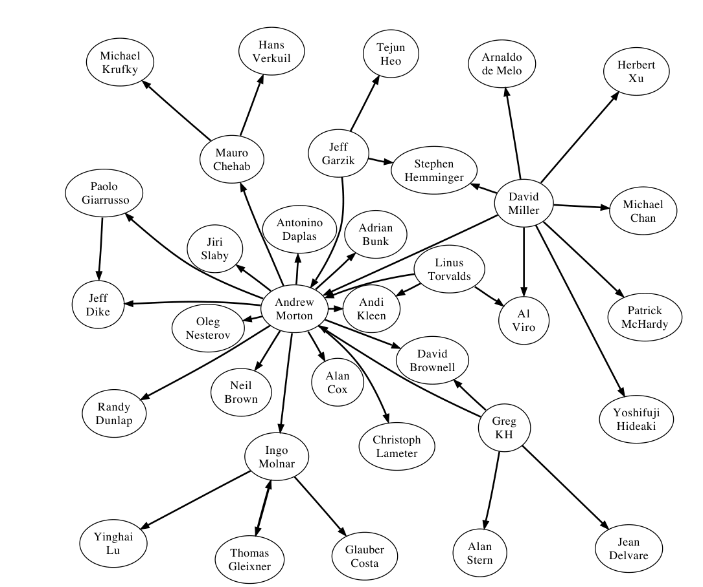

Figure 11. signed-off-by network in the Linux kernel. An edge from a to b indicates that a signed-off on a commit immediately after b.

SCM. We therefore performed an analysis on the size of commits, measured in LOC added and removed, prior to and after migration to git for a number of projects. Although statistically significant, the magnitude of the difference was uninteresting (only 2 lines less per commit).

To evaluate Promise 4, we studied the attribution data such as signed-off-by contained in log messages. As part of a larger study of the development process and workflow within the Linux kernel, we found that (as an example) the majority of commits related to non-driver related networking and the SPARC architecture were signed off by David Miller (69% and 72% respectively; these two areas accounted for 92% of his total sign-offs). Of all the files Miller modified, 87% were related to networking, and 10% to SPARC. This result from git data analysis confirms the folklore that he is both a gate-keeper and expert in those areas.

The signed-off-by network also allows us to investigate the relationship between signing-off and authoring contributions. Torvalds has stated that his current role with Linux is as integrator not developer. Quantitatively we find that this statement is true: he has authored 632 commits, performed 4,317 merges, and signed off on 25,456 commits. The non-parametric correlation between the number of sign-offs to the number of authored contributions in the entire community was moderate (r = .65, p << .001). This suggests that developers who are strongly involved in signing-off (i.e., higher-up in the hierarchy) often do less development themselves and differentiated roles exist within the community.

> A comprehensive study of position in the “pull network” and location of files that a developer signs off on helps identify the load that a community member carries, their area of expertise, level of status or trust, and role (reviewer versus committer). We have recreated the signed-off-by network based on the order that developers have signed off on commits. A portion of this network including the key members of the hierarchy and the highest weighted edges between them is depicted in figure 11.
>
> The data used to perform these analyses was extracted solely from public git repositories and stored in a PostgreSQL database using tools that we have written. These tools are freely available to other researchers at git://github.com/cabird/git_mining_tools.

## 6. Conclusion

DSCMs promise new and useful data to help us better understand software processes. These include accurate authorship information; the ability to identify roles such as reviewers, committers, and author; differences in repository content between developers in the same project; and merge tracking. Like all data, this data must be handled with care. We have outlined some of the key pitfalls that one can encounter when mining DSCM data. Notably, the semantics of a commit and a branch differ between SVN and DSCMs; some meta-data, such as the DAG, can be modified by developers, and it is often not possible to tell what branch a commit occurred on (this peril cost us several days of work).

We plan to use this data to address such questions as:
1) Does the development process or communication network in a project change when switching from a centralized SCM to a DSCM?
2) Does the use of a DSCM lead to more focused development but less project awareness?
3) Do groups of developers work in concert, separate from the “official” repository for periods of time?

Our hope is that this paper enhances the ability of other researchers to gather, analyze, and interpret this data to answer research questions.

## References

[1] T. Zimmermann and P. Weiβgerber, “Preprocessing CVS data for fine-grained analysis,” in Proceedings of the International Workshop on Mining Software Repositories, 2004.

[2] M. Fischer, M. Pinzger, and H. Gall, “Populating a release history database from version control and bug tracking systems,” in ICSM ’03: Proceedings of the International Conference on Software Maintenance. Washington, DC, USA: IEEE Computer Society, 2003, p. 23.

[3] D. Cubranic, G. Murphy, J. Singer, and K. Booth, “Hipikat: a project memory for software development,” Software Engineering, IEEE Transactions on, vol. 31, no. 6, pp. 446–465, 2005.