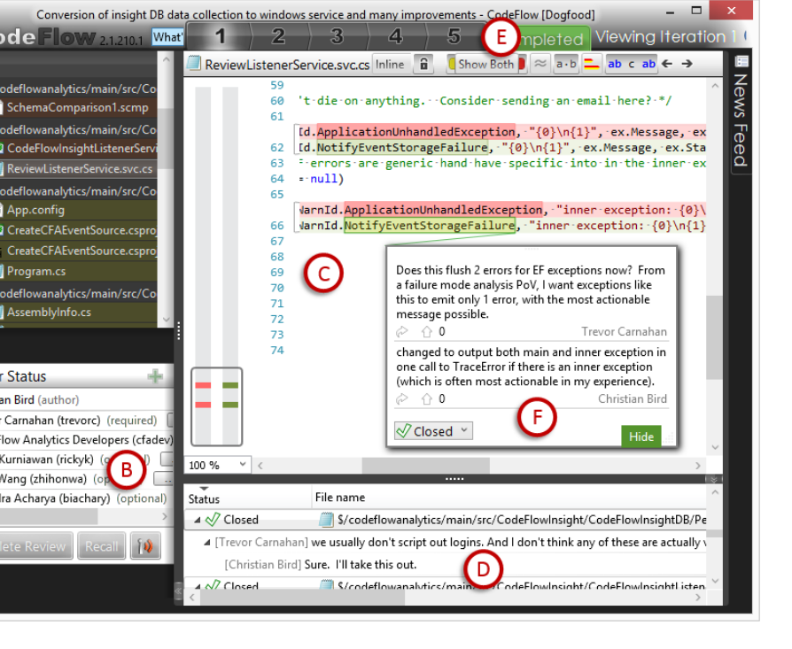

- An empirically validated automatic model for classifying the usefulness of review comments.
- An empirical study of factors influencing review comment usefulness.
- A set of implications and recommendations for teams using code review to achieve a high rate of useful comments during review.

In this paper we start (Section II) by providing a brief overview of the code review process at Microsoft. We then (Section III) introduce the research questions that drive the three stages of our study. Section IV, V, and VI describe the methodology and results for the three stages. We then address the threats to the validity of our findings (Section VII), discuss the implications of the results (Section VIII), and position our work relative to prior studies on code review (Section IX).

## II. Code Review at Microsoft

Most Microsoft developers practice code review using CodeFlow, an internal tool for reviewing code, which is under active development and regularly used by more than 50,000 developers. CodeFlow is a collaborative code review tool similar to other popular review tools such as Gerrit [11], Phabricator [12], and ReviewBoard [13].

The single desktop view of CodeFlow (shown in Figure 1) features several panes to display important information about the code review. Such information includes the list of the files involved in the change (A), the reviewers and their status (B), diff-highlighted content of the file currently selected by the user (C), a summary of all the comments made during the review (D), and tabs for the individual iterations (explained below) of the review (E). Bacchelli and Bird provide a more detailed description of CodeFlow [6].

The workflow in CodeFlow is relatively straightforward. An author submits a change for review and reviewers are notified via email and can examine the change in the tool. If they would like to provide feedback, they highlight a portion of the code and type a comment which is then overlayed in the user interface with a line to the highlighted code as shown in Figure 1-F and seen by all involved in the review. For example, the comment shown is for the highlighted portions of line 66. These comments can start threads of discussion and are the interaction points for the people involved in the review. Each such thread has a status that participants can modify over the course of the review. The status is initially ‘Active’, but can be changed to ‘Pending’, ‘Resolved’, ‘Won’t Fix’, and ‘Closed’ by anyone. There is no proscribed universal definition for each status label and no enforced policies to enforce resolving or closing threads of discussion. Many teams find these useful for tracking work status and decide which labels to use and how to use them independently. The author may take feedback in comments, update the change, and submit the updated change for additional feedback. In CodeFlow parlance, each updated change submitted for review is termed an iteration and constitutes another review cycle. It is not unusual to see two, three, or four iterations before a change is ready to check into the source code repository. In the review shown, there are five iterations (indicated by the tabs labeled “1”, “2”, etc.), with the original change in iteration 1, an updated change in

Fig. 1: Example of Code Review using CodeFlow

iteration 2, and the final change in iteration five. Reviewers can continue to provide feedback in the form of comments on each iteration and this process repeats until the reviewers are happy with the change. Once a reviewer is comfortable that a change is of sufficient quality, he or she indicates this by setting their status to “signed off”. After enough people sign off (sign off policies differ by team), the author checks the changes into the source code repository.

## III. Research Questions

The goal of our study is to derive insight regarding what leads to high quality reviews in an effort to help teams understand the impact of and change (if needed) their code reviewing practices and behaviors so that their reviews are most effective.

We accomplish this by identifying how characteristics of reviewers performing the review, of changes under review, and of temporal aspects of the review, influence usefulness of review comments.

We decompose this high level objective into three concrete research questions.

RQ1. What are the characteristics of code review comments that are perceived as useful by change authors?

RQ2. What methods and features are needed to automatically classify review comments into useful and not useful?

RQ3. What factors have a relationship with the density of useful code review comments?

Each of the following three sections focuses on one research question. We describe the study methods and findings separately for each. These three questions represent high level steps in our study. We first aimed to understand what constitutes usefulness from the developer perspective (RQ1), then we used these insights as we set out to build an automatic classifier to distinguish between useful and not useful code review comments (RQ2). Finally we used this classifier to classify over one million comments that we then investigated quantitatively to help uncover the characteristics of reviewers and their team and the code under review that influence the usefulness of code review comments (RQ3). Figure 2 shows an overview of our three-stage research methodology.