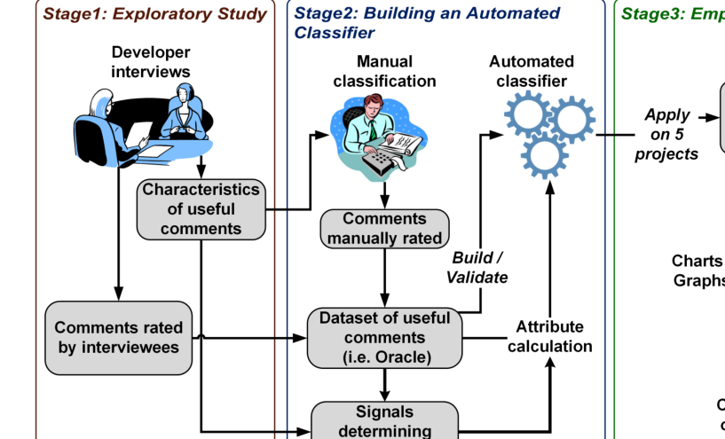
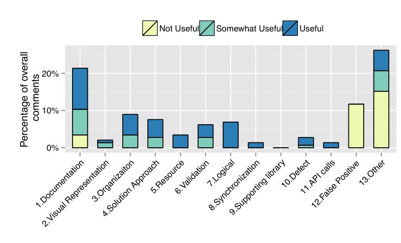

Fig. 2: Three-stage Research Method

Fig. 3: Distribution of comment categories

## IV. Qualitative Exploratory Study on Comment Usefulness

In the first phase, we conducted an exploratory qualitative study to understand what code review comment usefulness means to developers. Further, with the help of the interviewees we identified signals suited to distinguish between useful and not useful code review comments. In the following subsections, we describe the study method and our findings. We deliberately focused on understanding comment usefulness from the perspective of the authors of source code changes because they are the people that actually make changes to the code based on feedback and they are the primary target for code review comments.

### A. Developer Interviews

We chose interview research because interviewing is a frequently used exploratory technique used to gain insight into the opinions and thoughts of the participants – which cannot be obtained by quantitative measures, such as data mining [14]. We conducted semi-structured individual interviews with seven developers, selected from four different Microsoft projects based on their varying level of development / code-review experiences. Semi-structured interviews allowed us to combine open-ended questions to elicit information on their perception on code reviews and comments with specific questions revealing the perceived usefulness of individual code review comments. Each interview lasted 30 minutes and was structured into three phases. First (≈5 minutes), we asked the interviewee about their job role, their experience, and what role comments play during code reviewing. In the second phase (≈20 minutes), we showed the interviewee 20–25 randomly selected review comments from recently submitted code reviews for which the interviewee was the author. We asked the interviewee to rate the usefulness of each comment and categorize it based on a classification scheme adopted from a prior study to identify the types of issues detected during code reviews [15] (see 3 for the list of categories). We used the ratings from the author because they are the only ones with the “ground truth” of the usefulness of the comment (i.e. the author is the best judge of whether the comment was helpful to him or her and/or the change). For each of these comments, we asked the interviewees to

1) rate the comment on a 3-point scale (1- Not useful, 2- Somewhat useful, and 3- Useful),
2) briefly explain why they selected that particular rating for the comment, and
3) assign the comment to a comment category (e.g., comment about documentation, functional, and structure).

To assist with the classification, we supplied the interviewee with a printed copy of the comment classification scheme including a brief description for each category. In the last phase (≈5 minutes), we asked the interviewee if they could indicate other types of useful comments that were not covered in the interview. Prior to our interviews we performed pilot interviews with a separate set of developers to assess whether the question were clear and timing was appropriate. During the interviews, we wrote down all answers, categories and ratings of the review comments on a printed interview form and immediately after the interview completed the notes with further details and observations. We used purposeful sampling until we reached saturation (new interviews were not providing any new information). During the interviews, the seven participants rated and categorized 145 review comments.

### B. Insights from the Interviews

Prior literature has found that the primary goal of code reviews is most often to improve the quality of software by identifying defects, identify better approaches for a source code change or help to improve the maintainability of code [16]. There are, however, other secondary benefits of code reviews such as knowledge dissemination, and team awareness [6]. We found similar sentiments at Microsoft, as developers at Microsoft consider a code review effective if the review comments help to improve the quality of code. On the other hand, comments whose sole purpose can be attributed to knowledge dissemination and team awareness are perceived as less useful by developers.

Figure 3 shows the distribution of comments categorized by the interviewees and their ratings. The interviewees rated almost 69% comments as either useful or somewhat useful. Most of the comments identifying functional defects (categories from 5 to 11 in Figure 3) were rated as ‘Useful’. More than 60% of the “Somewhat Useful” comments belong to the first four categories: documentation in the code, visual representation of the code (e.g. blank lines, indentation), organization of the code (e.g. how functionality is divided into methods), and solution approach. These four all belong to the class termed “evolvability defects” as classified by Mantyla et al. [15] and