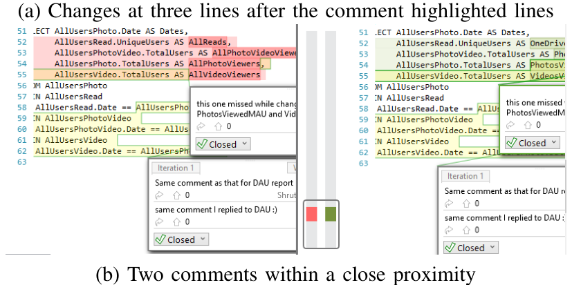

subsequent iterations, even if the location of the line is affected by other additions or deletions. If there was a change in any later iteration that is in close proximity to the line of code associated with the comment then the comment is considered a change trigger.

Sometimes review comments trigger changes before or after the code highlighted by the comment, as illustrated by Figure 4(a). We investigated this by varying the level of proximity in our analysis (i.e., the number of lines a change is away from the code associated with a comment). At the lowest level, we only associated changes on the same line as the highlighted code, while at the highest level, we considered changes within ten lines of the comment. Based on analysis of the false positives (sometimes changes close to a comment are not related to the comment) and false negatives (if a change is more than a few lines away from the comment, we might not categorize it as a change trigger) at each level of proximity, we found that the best results occurred when we associated code changes to comments that were at most one line away from the change.

Keyword-based Classifier. As Naive Bayes classifiers have been used to successfully classify natural language in different domains (e.g., filtering spam emails [19]), we implemented such a classifier based on the multi-variate Bernoulli document model [20] to classify comments. As the training corpus, we used comments from our previously established oracle. We performed standard pre-processing of the corpus [21] by removing white-space, punctuation, and numbers, converting all words to lower case, applying a Porter-stemmer [22] to generate stems of the words and removing common English stop-words. We also limited keywords to those appearing in at least ten comments. After these steps, there were 349 unique keywords. After the Naive Bayes model is trained using our oracle, the frequencies of each keyword in a new comment are fed into the model to generate a classification of useful or not useful. This classification is then used as a feature in our main classifier.

Comment sentiment. Sentiment analysis has been widely used to classify natural language text [23]. To use the sentiment of a comment as a probable predictor of usefulness, we used the Microsoft Research Statistical Parsing and Linguistic Analysis Toolkit (MSR-Splat) [24] service to calculate the sentiment of the comments. MSR-Splat calculates the probability of a comment having a positive sentiment as a floating point number between 0.0 and 1.0. Similar to prior literature [23], we categorized the comments based on sentiment probability into five categories, each category spanning a 0.2 probability range from the previous category: extremely negative, somewhat negative, neutral, somewhat positive, and strongly positive. The sentiment category for the text of the comment was used as an input feature for our main classifier.

### D. Classification process and validation

After calculating the attributes (Section V-B) of the comments in our oracle, we used a classification tree algorithm [25] to build a decision tree model based on the discussed features.

1 A machine learning technique in which the goal is to predict the value of a target variable based on several input variables

(a) Changes at three lines after the comment-highlighted lines

(b) Two comments within a close proximity

Fig. 4: Identifying changes triggered by review comments

To validate our tree-based model, we employed 10-fold cross-validation [26] and repeated the process 100 times.

Finally, to validate our model via review participants, we sent five developers (three of them were not part of the interviews) a list of review comments they received for their recent code reviews and asked them to classify each comment as ‘Useful’ or ‘Not Useful’. We then compared these classifications with the classifications produced by the decision tree. The results of this validation are discussed below (Section V-F).

### E. Effects of individual attributes

We examined each of the features individually to understand the decision characteristics of attributes and the strength of relationship with usefulness. Due to space restriction we report some interesting observation, but omit detail correlation outcomes.

If a comment triggered changes within one line distance to comment-highlighted lines, it was highly likely to be useful (precision: 88% and recall: 78%). If the author did not participate in a comment-thread, it was more likely to be useful (88%) than those threads where the author did (49%). A manual investigation of comments showed that absence of the author in a comment-thread very often indicated an implicit acknowledgment by the author and a useful comment. On the other hand, author participation indicated either a useful comment with explicit acknowledgment (e.g., ‘done’, ‘fixed’, and ‘nice catch’) from the author or a not useful question / false positive, which the author responded to.

Comment-threads with only one comment or participant were more likely to be useful (88%), than those with more than one comment or participant (51%). The explanation is similar as the explanation for author participation, as participation of several engineers indicated a discussion which might or might not be useful. No discussion often indicated implicit agreement. Our keyword based classification also showed promising results. Table I shows keywords, which belonged to at least 15 comments in our oracle and are at least twice more likely to be in a particular class of comments (i.e. either useful or not useful) than the other. We found that comments