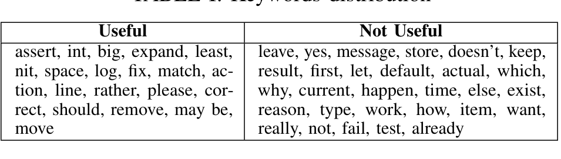
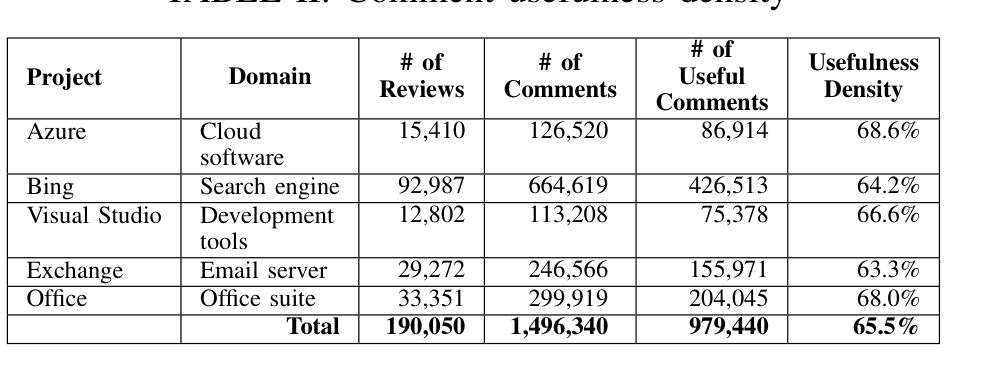

TABLE I: Keywords distribution — Useful / Not Useful

TABLE II: Comment usefulness density

with command verbs (assert, expand, fix, remove, and move) or request (e.g., please, should, may be) are more likely to be useful. On the other hand, questions (e.g., why, which, and how), acknowledgment (e.g., yes, already) or denial (doesn’t, and not) are more likely to be in not useful comments.

Most of the comments (83%) are made during the first two iterations. Comments made after the first two iterations are less likely to be useful. Also, comments where a change within one line of the comment-highlighted text could be detected were much more likely to be useful. Most of the comments (92%) with Won’t fix status are Not Useful, while most of the comments with Resolved/Closed status are ≈ 80% Useful.

Finally, although a majority (51%) of the comments had ‘Extremely Negative’ tones, only 57% of those comments were useful. On the other hand, comments with ‘Neutral’ or ‘Somewhat Negative’ tones were more likely to be ‘Useful’ (≈ 79% were considered useful).

### F. Model performance

Figure 5 shows the decision tree model built from our oracle. The root node of the tree is ChangeTrigger_1 (i.e., changes within one line distance to a comment-highlighted line). Comment status is the second most important attribute for the classification. These two most important signals were evident to us during the first stage of this study (Section IV-B), and our model provides confirmation. The other useful attributes for the model are number of comments, iteration number, and sentiment group.

Based on one hundred 10-fold cross-validations of the decision tree model, our model had a mean precision of 89.1%, mean recall of 85.1%, and mean classification error of 16.6%. Finally, the review participants that we contacted rated 97 out of the 125 comments as Useful. Our model classified 105 of those review comments as ‘Useful’, of which 91 were correct. In this step, our model had 86.7% precision, and 93.8% recall.

## VI. Empirical Study of Factors Influencing Review Usefulness

The ultimate goal of our study is to understand the influences of different factors on the usefulness of code review feedback. Specifically, we investigate two types of factors: 1) characteristics of the reviewers and their team and 2) characteristics of the changeset under review. The selection of those factors was guided by prior studies on software inspection [27], [28], and suggestions for code review practices [29], [16]. To identify the influence of each factor on the usefulness of code review comments we used our trained decision tree to classify review comments in useful and not useful comments (as described in Section V-C) and then examined the relationship of various factors with usefulness. In total, we analyzed ≈ 1.5 million comments from 190,050 review requests from five major Microsoft projects, i.e., Azure, Bing, Visual Studio, Exchange and Office, the same projects that the comments used to train the decision tree were drawn from. We selected those projects as they represent a wide range of domains, development practices, and include both services and traditional desktop applications. Each project has a substantial code base, comprising millions of lines of code. Based on these data sets, we examine the relationship of comment usefulness density (i.e., the proportion of comments in a review that are considered useful) with a number of factors related to the reviewers and what is being reviewed. Table II provides summary information for each of the five projects, including the overall comment usefulness density. Interestingly, all projects have a similar comment usefulness density between 64% and 68%. In this section, we explore the influence of the two aforementioned factors on comment usefulness.

### A. Reviewer characteristics

Prior studies on software inspection found wide variation in the effectiveness of different inspectors (i.e., the person examining the code), even when they are using the same technique on the same artifact [27]. Similarly Rigby et al. suggested using experienced members or co-developers as reviewers [29]. Since those studies suggest that reviewer characteristics can have an influence on review usefulness, we studied the following three aspects of reviewer characteristics: 1) experience with the artifacts in the review, 2) experience in the organization, and 3) being in the same team as the change author. We also examined one aspect of the project the reviews belong to: how the effectiveness of comments in an entire project changes over time.

#### 1) Do reviewers that have prior experience with a software artifact give more useful comments?

We investigated two aspects of experience: first, experience in changing, and second, experience in reviewing an artifact. We used a source code file as the level of granularity for experience. We compared the density of useful comments for developers who had previously made changes to the files in a review to the density of useful comments made by developers who had not made changes. The developers who had made prior changes to files in a change under review had a higher proportion of useful comments in four out of the five projects (all but Exchange which shows marginal increases), but we did not see a difference in effectiveness based on the number of times that a developer had worked on a file. That is, comments from developers who had changed a file ten times had the same usefulness density as from developers who had only changed a file once. In detail, experience in changing a file at least once increases the density of useful comments from 66% to 74% for Azure, from 60%