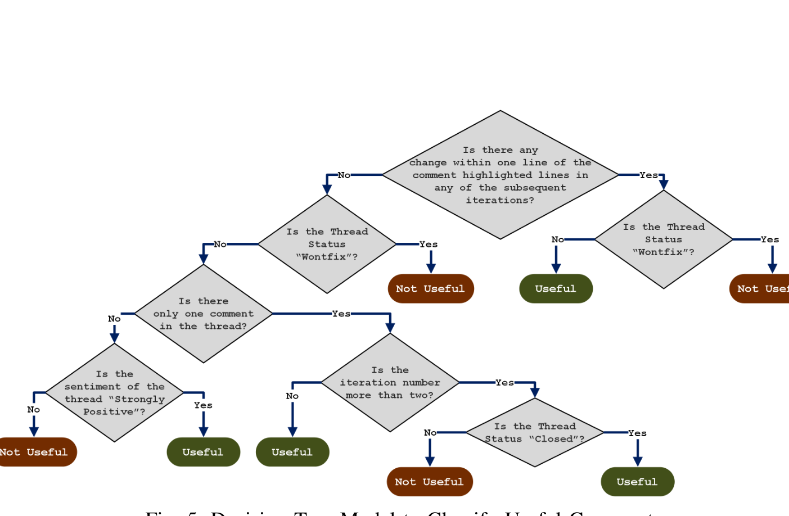
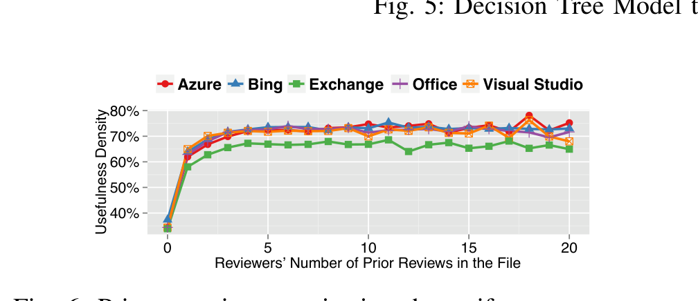

Fig. 5: Decision Tree Model to Classify Useful Comments

Reviewers’ Number of Prior Reviews in the File  
Fig. 6: Prior experience reviewing the artifact vs. comment usefulness density

to Classify Useful Comments

to 71% for Bing, from 66% to 70% for Visual Studio, from 67% to 72% for Office and from 62% to 63% for Exchange.

Our analysis of the effect of experience in reviewing a file showed strong effects on the density of useful comments (Figure 6). For all the five projects, reviewers who had reviewed a file before were almost twice more useful (65%–71%) than the first-time reviewers (32%–37%). Comment usefulness densities also show an increasing trend with the number of prior reviews up to around five reviews, after which the usefulness density plateaued between 70% and 80%.

Based on these results, we conclude that developers who have either changed or reviewed an artifact before give more useful comments. One possible explanation for these results is that reviewers who have changed or reviewed a file before have more knowledge about the design constraints and the implementation. Therefore, they are able to provide more relevant comments. Also, a first-time reviewer may not know the design and context; they may ask questions to understand the implementation, or identify false issues based on their incorrect assumptions. Unsurprisingly, first-time reviewers of an artifact are providing less valuable feedback.

We assume that review experience shows more drastic effects on comment usefulness than change experience because many teams have a practice of letting new developers first review the code before they are allowed to change the code. Therefore, a developer who makes the first change to a file has most likely already reviewed it before.

We calculated a reviewer’s experience based on his or her tenure at Microsoft. In four out of the five projects (all but Exchange), reviewers that spend more time in the organization have a higher density of useful comments. The effect is especially visible for new hires, who in the first three months had the lowest density of useful comments. During the first three quarters, the usefulness density increases the most, and stays relatively stable after the first year. The first year at Microsoft is often considered “ramp up” time for the new hires. During that time employees become more familiar with the code review process, project design, and coding practices at Microsoft. After the ramp up period, they can be as useful reviewers as their senior Microsoft peers. In detail, we saw for Azure an increased density of useful comments from 60% to 66%, for Bing from 62% to 67%, for Visual Studio from 60% to 70% and for Office from 60% to 68% after the first year. For Exchange, we could not see a steady trendline, and usefulness ratios vary between 60% to 65%.

### 2) Do reviewers from the same team give more useful comments?:

We hypothesize that a reviewer may give more useful comments to members of his or her own team because they are familiar with that person, their abilities, and are more invested in the quality of the code that the team ships. A team in this sense is a group of usually four to ten developers all working under the same manager or developer lead (i.e., each project in our analysis comprises many teams). We found that roughly three quarters (76%) of review comments come from reviewers on the same team as the author. Although cross-team reviewers were less frequent, we found that reviewers from different teams gave slightly more useful comments than reviewers from the same team in all the five projects. As Table III shows however, the magnitude of the difference is quite small (under 1.5% for all but one project) and is statistically significant only because of the large sample used (over one million comments in total). Based on this, we conclude that there is no noticeable difference in comment usefulness density between reviewers who are on the same team or on different teams than the author.

### 3) How do comment usefulness densities vary over time?:

Porter et al. found in their study on software inspection that effectiveness and defect discovery rates vary over different time periods [28]. We investigated whether reviewers are becoming