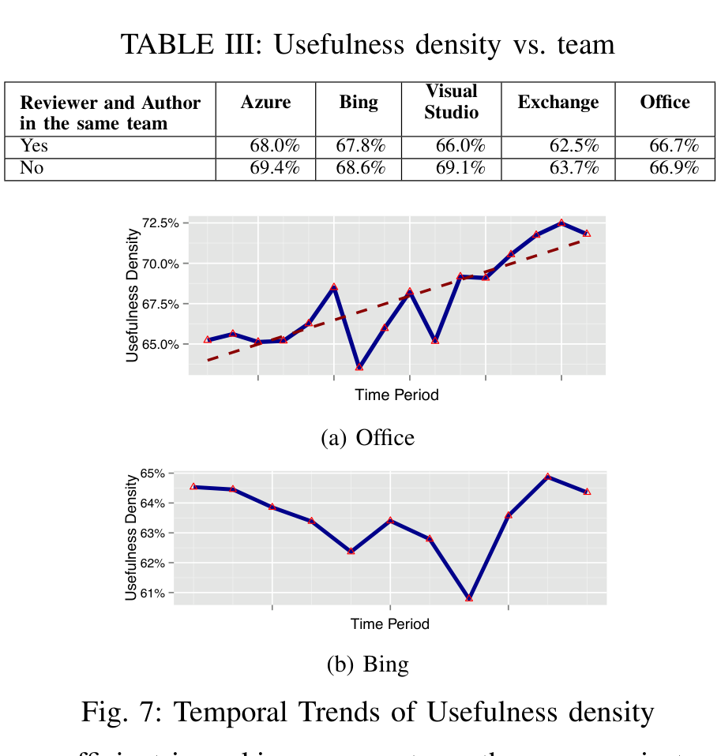
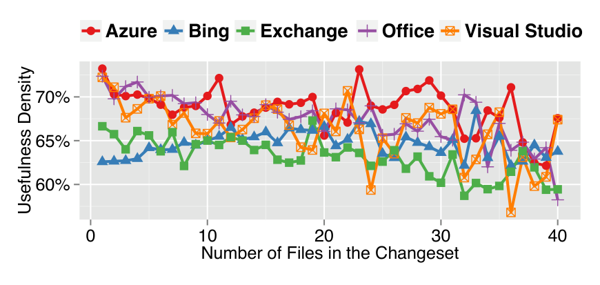

## TABLE III: Usefulness density vs. team

(b) Bing

Fig. 7: Temporal Trends of Usefulness density

more efficient in making comments on the same project over time by looking at the comment usefulness density of the entire project for different periods of time. We found that for four out of the five projects the density of useful comments increases over time and we suspect this can be attributed to both increased experience with the project, similar to our findings in Section VI-A1 and also refinement of the code reviewing process (more training of developers, better tracking of code review data, etc.). Figure 7(a) shows the temporal trend for a snapshot of time for the Office project. Even though the long term trend shows an increase density of useful comments, for three out of the five projects we noticed peaks and valleys in the density of useful comments for limited periods. For example, Figure 7(b) shows a temporary drop for the Bing project. Examining trends of usefulness density can help managers determine whether or not code review practices are improving. For example, during times where the usefulness density drops, managers can be alerted and can easily “drill-down” to the specific reviews, reviewers, changes, or components, that are contributing to the drop and can take corrective action.

### B. Changeset characteristics

Porter et al. found that software inspection effectiveness depends on code unit factors such as code size, or functionality [28] and Rigby et al. suggested that reviews should contain small, incremental and complete changesets [29]. Therefore, we investigated whether size of the changeset or type of file under review has any effect of review usefulness.

#### 1) Do larger code reviews (i.e., with higher number of files) get less useful comments?:

Figure 8 illustrates how comment usefulness density change with the number of files in a change under review. The trendline shows that as number of files in the change increases, the proportion of comments that are useful drops. This result supports Rigby’s recommendation for smaller changesets. Developers have indicated that if there are more files to review, then a thorough review takes more time and effort. As a result, reviewers may opt for cursory review of large changesets and may miss some changes. This may lead

Number of Files in the Changeset

Fig. 8: Usefulness density vs. Number of files

to false positives or more questions to the author in an effort to understand the change, causing lower usefulness densities.

#### 2) Do the types of files under review have any effect on comment usefulness?:

We grouped the files into four groups based on the purpose of the file: 1) Source code (e.g., C#, C++, Visual Basic or C-header files), 2) Scripts (e.g., SQL or command line scripts), 3) Configuration (e.g., .Config or .INI files), and 4) Build (e.g., Project or make files). We observed that source code files had the highest density of useful comments (70%). On the other hand, build files had the lowest comment usefulness densities (65%). As notable outliers, Visual Studio solution files (a type of configuration file) (57%) and make files (53%) had a low proportion of useful comments. We expect that this may be due to the complexity of these files (e.g., McIntosh et al. have demonstrated the complexity of build files [30]) where the impact of changes on the overall system are sometimes harder to assess than for source code. Code reviewing tools and practices also often emphasize the review of code, whereas review of configuration files and build files are given less attention.

## VII. THREATS TO VALIDITY

All projects selected for this study belong to the same organization practicing code reviews using the same tool. While the tool itself may be specific, prior work has shown that most reviewing performed today follows a similar workflow. Code reviews via CodeFlow are similar to the processes based on other popular tools such as Gerrit, ReviewBoard, GitHub pull requests, and Phabricator. Many companies and open source projects that practice review are using tools such as these rather than email. Like CodeFlow, these tools facilitate feedback from reviewers about the change, often allowing reviewers to indicate specific parts of the change [7], [31].

Most of the attributes calculated for this study can be also calculated for code reviews conducted with these other tools. Also, prior study results suggest that there are large similarities between the code review practices of different OSS and commercial projects [7]. We have attempted to mitigate threats to external validity by including projects in this study that represent diverse product domains and platforms. Nonetheless, some biases remain; all projects are large-scale, relatively mature, and come from the same company.

We attempted to validate the model training data and the results of the model’s classification in multiple ways, checking consistency with inter-rater reliability, using k-fold cross validation, and comparing classification results with