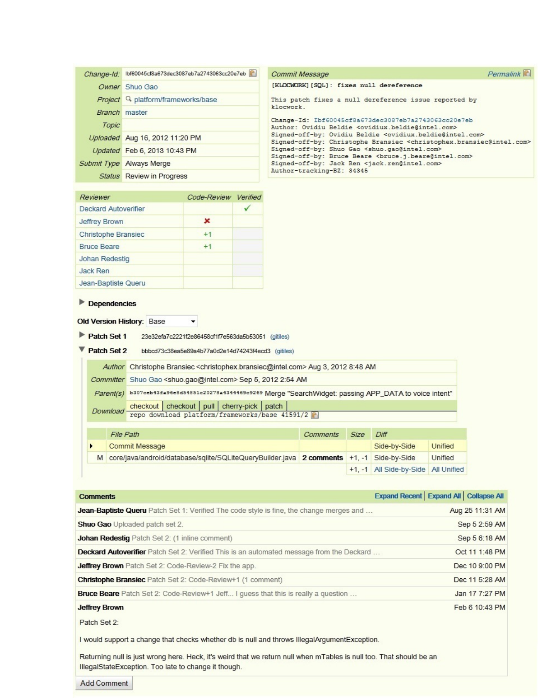
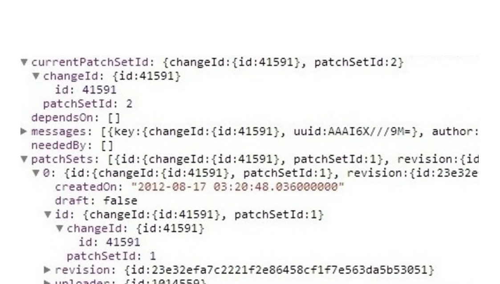

Fig. 1. Gerrit Android Review Number 41591

### III. Extraction Method

Android review data is stored in Gerrit.2 We were able to avoid screen-scraping by observing how Gerrit web pages are constructed. Gerrit works by initially sending a web page skeleton and some Javascript to the browser. The Javascript then makes a number of web requests back to the Gerrit server and requests information about code reviews, which is returned in JSON format. The page DOM is then modified by the Javascript to display the code review information. When we developed our script, the Gerrit REST API provided limited information. However, the current Gerrit API provides an interface to JSON formatted review data.3 This JSON data must still be parsed.

We used the developer tools within the Chrome web browser to inspect these web requests (inspecting header fields and POST data) to the Gerrit server along with the responses in an effort to reverse engineer the types of web methods available and the structure of the JSON data returned by the requests. We also determined which fields in the displayed web pages corresponded to what fields within the JSON. The JSON returned was fairly complex, deep, and redundant (it was not uncommon for a single JSON response for a code review to exceed 50 kilobytes). In addition, many web requests were needed to obtain all information about an individual review.

2 https://android-review.googlesource.com  
3 https://gerrit-review.googlesource.com/Documentation/rest-api.html

Fig. 2. JSON Response from the server

One review might contain many rounds of patch sets (an author may submit one set of changes, get feedback, submit a set of revised changes, etc.). Obtaining the information for each patch set requires an additional web request, and gathering the reviewer comments for each file within each patch set requires yet another. Thus, a review might require over twenty to thirty individual web requests. In an effort to avoid overloading the Gerrit server (and also avoid our IP being blacklisted from the site), we throttled our mining by delaying one second between requests.

We developed a Python script that made use of the various web methods and extracted the relevant data from the JSON responses. We also created a database schema based on the information returned from the server and the data was stored in a Microsoft SQL Server database for later analysis. To enable broad use of the data, we provide an SQL Server database backup file as well as a simple XML dump of the data.4

### Data Extraction Details and Example

We reverse engineered the JSON requests to get the “ChangeDetailService” and “PatchDetailService”. In Figure 2, we show a snippet of the JSON returned when we sent a request for the ChangeDetailService for the review in Figure 1. We store the raw data from each JSON request, so that we can re-process the data without sending requests to the server.5 Our Python script then extracts data from the JSON into a database. For example, the patch id (['result']['patchSet']['id']['patchSetId']=2), change type (['result']['patches']='A'), lines added (['result']['patches']=19), and lines removed (['result']['patches']=0).

### A. Challenges and Limitations

We describe some of the data limitations and some challenges we overcame while cleaning anomalies from the data. We hope that as this dataset becomes more widely used for answering empirical software engineering research questions, other challenges and limitations will be identified and removed from the data.

#### Challenge: Gerrit JSON API

The Gerrit JSON API is the only way to get all information from Gerrit. While the API is intended for public use, it is

4 Script and data is available at https://github.com/mmukadam/gerrit-miner.git  
5 Please contact us for a dump of the raw data