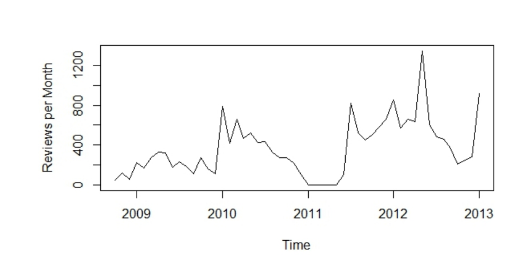

Fig. 3. Number of Reviews started per Month

not formally defined and there is no documentation for it. As we discussed above we reverse engineered the JSON requests and responses. However, the API can change between versions of Gerrit and the location and names of services can also change. For example, while mining Android, the location of the “ChangeDetailService” was moved from
/gerrit/rpc/ChangeDetailService to
/gerrit_ui/rpc/ChangeDetailService

### Challenge: A Bot and other Anomalies

Looking for anomalies in the data, we noticed that a bot called “Deckard Autoverifier” was involved in 1.8k reviews. Qualitative analysis revealed that the bot was responsible for ensuring that the change merged with the master branch without conflict and that it did not break the build – it was “Verified”. Since the bot is responsible for automatically verifying new changes, we expected there to be one verification for each patch set. However, there are 19k reviews and the bot is involved in only 1.8k. A mailing list discussion6 revealed that the ”Deckard Autoverifier” cannot verify inter-project dependencies, so many verifications must be done manually. For example, on AOSP ”Jean-Baptiste Queru” manually verifies all new changes. Since Queru does many manual verifications, he will have commented on an artificially large number of reviews. Depending on the goal of future analysis, verifications with no other comments may be tagged or removed.

### Challenge: Collecting all Reviews

Reviews are identified by an id number; however, not every review number contains a valid id. We download all reviews between review number 1 to 51750, which resulted in 19k reviews. Figure 3 plots the number of reviews per month. While the number of reviews can fluctuate drastically in a given month [7], there is evidence on the Android mailing lists that the Gerrit database has been cleaned at various points in time, removing stalled reviews, but leading to missing data. For example, many reviews are missing from August 2011 until the start of January 2012. A solution would be to regularly mine the Android Gerrit data.

6 https://groups.google.com/forum/#!msg/android-contrib/cEFSGewsqUQ/umd5FKrv4_QJ

## IV. Data Storage and Schema

The database schema is depicted in Figure 4. In general, each table has an Id column that is unique for each entry in the table (e.g., the Review table has ReviewId, the Person table has PersonId). Foreign key relations are indicated by the presence of a column in one table that has the same name as the primary key of another table.

### Reviews

The Review table contains information about the review itself. This includes the review identification number used by Gerrit (the primary key), the person that created the review and typically made the change (OwnerId), the creation time (CreatedOn), the last time that any activity occurred on the review (LastUpdatedOn), a one line description of the change (Subject) along with a description (message), the project that the review is for, and the branch within git that the change was made on. The Status can be “open”, meaning that the review is active and the change has not yet been accepted, “merged”, meaning that the review has passed and the change has been merged into the codebase, and “abandoned”, indicating that the review has not passed and is no longer active.

### People

Many tables include references to people (reviewers, authors, etc.) through the use of a PersonId. The Person table maps this id to the person’s Name and Email address. We have observed that some automated system accounts also add information to reviews. For example, one “bot” adds comments to a review that describe changes to the review. These accounts can be identified due to the IsBotAccount being set to 1.

### Patch Sets

A change for review is made up of a set of files that correspond to a commit. In Gerrit parlance, this is called a patch set. As an author responds to feedback, he may submit multiple patch sets until the final patch set is accepted. The PatchSet table includes information including whether this is the first, second, third, etc. patch set for a review (PatchSetNumber), the number of files in the patch set (NumberOfFiles), when it was created (CreatedOn), and the revision within the git repository that contains the versions of the files in the patch set (GitRevision).

### Patch Set Files

Each file within a patch set has an entry in the PatchSetFile table. This includes the path of the file (Path), how many lines were added and deleted, and the ChangeType, which indicates if the file was added, removed, or modified. We do not store this in the database. It is easy to obtain this with the GitRevision from the corresponding PatchSet entry.

### Comments

The information about each comment is in the Comment table. This includes the text of the comment (Message), when the comment was made (WrittenOn), who wrote the comment (AuthorId), and which patch set the comment is relevant to