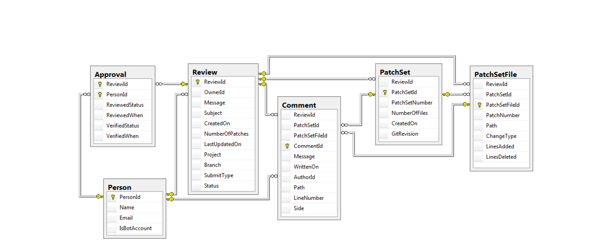
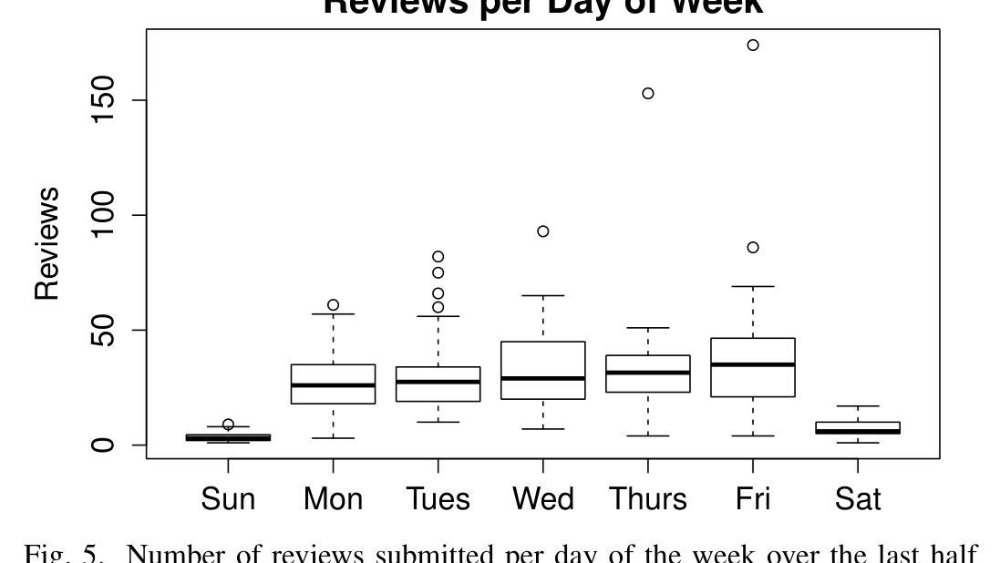

Fig.4. Database Schema

Sun Mon Tues Wed Thurs Fri Sat  
0 50 100 150  
Reviews per Day of Week

Fig.5. Number of reviews submitted per day of the week over the last half of 2012 in Android.

(PatchSetId). Comments can refer to a particular location within a file in the patch set, in which case the file path (Path), line within the file (LineNumber), and whether the comment refers to the version of the file prior to or after the change (Side) are indicated. Otherwise, these fields will be NULL.

### Approvals

Each review is given certain points (-2, -1, 0, 1, +2) based on whether reviewers judge that it should be accepted or rejected. This information is stored in the Approval table, with an entry for each person involved in a review. This is the only table that doesn’t have a single field primary key, as the ReviewId and the PersonId uniquely identify the entry and act as a composite primary key. The information in this table indicates whether the reviewer has signed off on the review (ReviewedStatus) and/or verified that the change does not cause problems (VerifiedStatus) and stores when these occurred (ReviewedWhen and VerifiedWhen).

## V. FUTURE WORK

In a forthcoming paper in preparation for submission, we have used this data to quantitatively characterize code review in Android and compare Android code review to review in other contexts. However, here we present a simple illustration of the types of questions that can be answered using this data. We want to know how developers apportion their work over the course of their work week.

Figure 5 shows boxplots that describe the distribution of the number of code reviews submitted per weekday over the past six months in the Android project. Using t-tests (since the submission numbers per day follow normal distributions) we determined that there is no statistical difference between Monday, Tuesday, Wednesday, Thursday, and Friday. However, they all show a statistically significant increase over both Saturday and Sunday and Saturday has more than Sunday to a statistically significant degree. Thus, one can reasonably conclude that the contributors to Android work during the week and take weekends off.

We are currently using this data set, other OSS datasets, and datasets from software firms to understand how different software development environments affect peer review practices. Other research avenues include using this new dataset to improve models of defect prediction, identifying attributes of changes that lead to many comments from reviewers or many iterations of change submission, and characterizing review patterns of developers who join software projects.

## REFERENCES

[1] Android. Android Open Source Project. http://source.android.com/index.html.  
[2] Android. Submitting patches. http://source.android.com/source/submit-patches.html.  
[3] M. Fagan. Design and Code Inspections to Reduce Errors in Program Development. IBM Systems Journal, 15(3):182–211, 1976.  
[4] Gerrit. Web based code review and project management for git based projects. http://code.google.com/p/gerrit/.  
[5] A. Hindle, D. M. German, and R. Holt. What do large commits tell us?: a taxonomical study of large commits. In MSR, 2008.  
[6] R. Holmes and A. Begel. Deep intellisense: a tool for rehydrating evaporated information. In MSR, 2008.  
[7] P. C. Rigby, D. M. German, and M.-A. Storey. Open Source Software Peer Review Practices: A Case Study of the Apache Server. In 30th ICSE, pages 541–550, 2008.