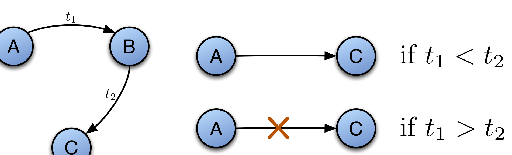

Fig. 1: The same topology, left, may apply to two different cases based on the order in which the messages were posted. If t1 < t2, then information can flow from A to C. But if t1 > t2 no information can flow from A to C

Consider the situation in which B posts on some topic and C replies to B. Later A posts on an unrelated topic, and B replies to A. Unfortunately, many current network mining techniques consider all messages transmitted during an epoch, and construct a network of links observed during this epoch. After the network is constructed, the specific timing of each message is typically not recorded, and just the edges are retained. But, if one ignores the temporal ordering of these emails and focuses purely on the topology of the network, one might infer a transitive information flow relationship between A and C. In this scenario the order of events is the problem, i.e. it matters which of these events took place first. If we were limited to topological information with no time stamps on the edges, we might infer information flow through paths in the graph that in reality did not exist. We call such an erroneously inferred flow a transitive fault. Figure 1 illustrates this problem.

Many metrics used in SNA such as degree centrality, betweenness centrality, assortativity, etc. [6], disregard all but the topological information in the networks. If used without careful consideration, these metrics could yield misleading results. At the core, this is a temporal aggregation issue, i.e. transitive faults would not occur if the time interval under consideration is small enough. The effects of temporal aggregation on SNA results and the perils of ignoring them have been adequately addressed elsewhere [7]. However, a certain amount of aggregation can never be eliminated, both because of the discreteness of the data but also because aggregated analysis is often the very intent of the studies. So then, we ask:

RQ1: How much temporal data aggregation can be tolerated before SNA results become unreliable?

## B. Information Flow in the presence of Inadequate or Missing Data

Typically, social networks are derived from mailing list archives, using the "reply-to" field in messages. This practice is based on the observation that the "reply-to" field in a message is an indication of information flow. Thus, we say that there is information flowing from A to B if B replies to a message that A has posted on a thread: presumably B replies after s/he has digested the information content of A’s message. One problem that arises from this formulation is that we can only observe information flow if a participant actually posts a message. If B reads a message posted by A, but does not reply, then there is information flowing from A to B, but there is no way for us to know that. Put simply, the existence of a reply from A to B indicates information flow from B to A, but the lack of a reply does not imply that no information flow occurred. This situation is due to the inadequacy or missing data in the email "reply-to" network. Depending on the topology of the observable network, the value of computed SNA metrics could potentially be affected seriously by the unobserved edges. When one uses SNA metrics (node centrality) to determine important people, or the clustering coefficient to determine local community structure on such networks, the results may not reflect reality. We therefore ask:

RQ2: To what extent does missing data influence SNA metrics?

There are surely other critiques of the extraction of social networks, and the use of SNA metrics; for now, we focus on the above two issues.

## C. Our Contribution

In this work we seek to quantitatively ascertain the effect of the above two presented concerns on typical SNA analyses on email networks of three OSS projects: Apache [8], Perl [9], and MySQL [10]. We begin with RQ1, viz., the frequency with which we might not have information flow between developers due to transitive fault in the email network topology. Specifically, we address two questions. First, we ask: How frequent are transitive faults? If transitive faults are relatively rare (say a fraction of a percent of the time) then we could probably just ignore them. The second question arises if these