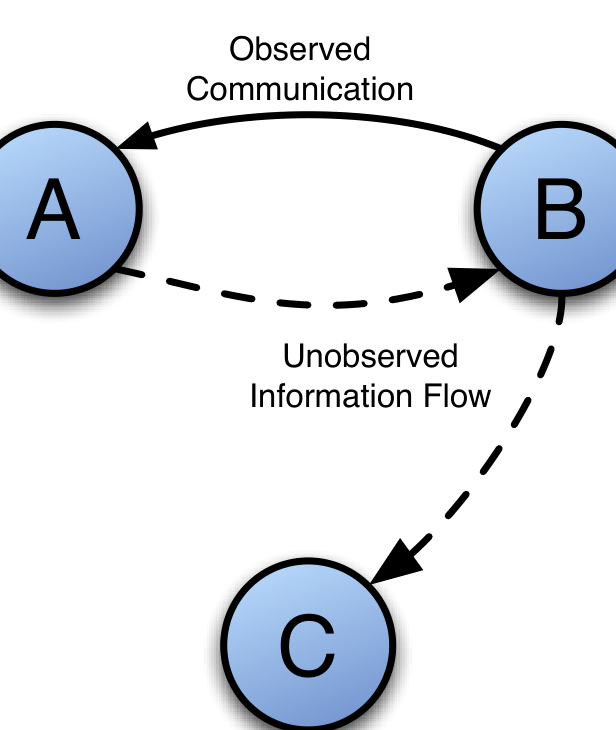

Fig. 2: Observed communication (solid edges) is evidence of information flow from B to A. However, C may read B’s message and B may have read A’s response, which indicates unobserved information flow (dashed edges).

faults are not rare: to what extent do transitive faults affect SNA analysis? We find that while transitive faults can be as frequent as 50%, their frequency is highly dependent on the time interval of aggregation, and that even when very frequent, they do not change results from SNA analysis critically.

We approach RQ2 by specifically focusing on the question: How much do missing links affect downstream SNA analysis, when missing links are modeled under three different attachment scenarios? We find that the calculated betweenness centrality and clustering coefficient are stable in the presence of a large number of missing links.

Our contributions are thus:
1. We find that all social metrics that we have examined are robust to the transitive faults that occur when social network data is aggregated at intervals of one hour to one year.
2. We observe that all social metrics studied are robust to missing links as modeled by standard social network growth models.
3. We present a set of techniques which can be used by other researchers that utilize social network analysis metrics so that they can either show that their own metrics are robust or select different metrics which are.

## II. RELATED WORK

The empirical software engineering community in recent years has been deeply concerned with human aspects of software engineering. Many papers in main-line software engineering conferences and venues, such as ICSE ([11], [12], [13]), FSE ([14], [5], [15]), ASE ([16], [17]), and MSR ([18], [19], [20]) have addressed this issue. In fact, a number of workshops such as Cooperative and Human Aspects of Software Engineering (CHASE) and Socio-Technical Congruence (STC) have arisen that focus specifically on this issue and have had numerous papers discussing the implications of human communication and co-ordination activities on software quality and developer productivity. In this line of work, mining of social networks from email archives has attracted quite a bit of interest. Social network metrics have long been used in sociology to analyze on-line communities [21] and are still [22]. A recent special issue of Information Systems Research [23] was devoted to analysis of on-line communities using such methods. In our own earlier work, we have shown that centrality of an individual as measured by social network metrics [4] in the email network is a powerful indicator of the technical activity and importance of an individual. Pohl and Diehl [24] more recently showed how networks could be used to determine roles of developers. We also found that (rather than being disorganized “bazaars”) the email social networks of OSS projects show a very strong social structure [5] and are organized in ways that reflect the underlying collaborations between individuals [25]. Measures of importance such as betweenness [6] are used in many of these studies.

However, there are quite a few important assumptions, many previously unstated in published work, that are made in the construction of social networks from on-line email archives. Recently, Howison, Wiggins & Crowston [1] have presented a careful, thoughtful analysis of these assumptions, and argued that they should be considered as threats to validity of the results that use social network analysis over email archives. In addition to the temporal aggregation and information problems discussed earlier, they discuss other difficulties, such as the possibility of unrecorded back-channels of communication and modeling the intensity of communications. Temporal issues have also been addressed by Habiba [26], wherein the authors propose a new notion of betweenness that takes times of interactions into account. Braha and Bar-Yam [25] find that in dynamically changing networks, the “hub” roles of individuals actually change quite a bit from day to day, suggesting that efforts to disrupt social networks (e.g., of criminals) by targeting key individuals, would require constantly shifting their sights.

## III. THE EMAIL ARCHIVES DATA AND NETWORKS

A mailing list in an OSS project is a public forum. Anyone can post messages to the list. Posted messages are visible to all the mailing list subscribers. Posters to developer mailing lists include developers, bug-reporters, contributors (who submit patches, but don't have commit privileges) and ordinary users. Mailing lists can be quite active; for example, on the Apache developer mailing list, there were about 4996 messages in the year 2004 and 2340 in 2005. For Perl, these numbers were 10019 and 9606. For the time period studied, 2549 distinct individuals participated on the Apache developer list.

We have mined archival records of developer mailing lists to generate reply-to social networks for the three OSS projects: Apache, MySQL, and Perl. Because we are only interested in