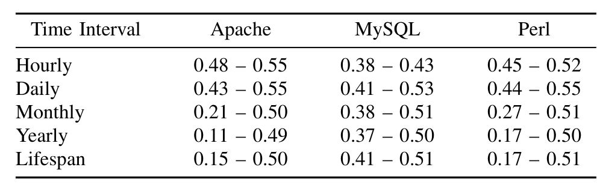

is a vertex, divided by the number of all possible pairs made from that vertex’s neighbors).

The total number of 2-paths has been used to characterize networks in SNA, particularly when modeling node importance, or centrality, in random graph models [27], [30]. Indeed, the ranking of nodes based on the number of 2-paths going through a node correlates very strongly (using the non-parametric Spearman rank correlation [31] due to the power-law distribution of such metrics []) with the node ranking based on node degree (unpublished), and also with betweenness centrality [32]. In our studies, this is a natural measure of centrality since it has a direct connection to the number of transitive faults associated with a node.

### C. Studies

We quantitatively evaluate RQ1 with two studies. First, we gradually increase the aggregation epochs, stepping from hours through days, months, years through to project lifetimes. We measure if, and by how much, transitive faults in the networks change as the epoch size increases. We also take a look more precisely at how the faults change at finer temporal resolutions for each of the three projects. Then, we assess what effect varying amounts of transitive faults have on the ranking of nodes according to the number of 2-paths, for each project. Because there could be multiple edges between the same people in the network, the same topology could be annotated with multiple time stamps on the edges, as the epoch size changes. Thus, some two-paths could be transitive faults for some epochs and not in others.

Because we often observe multiple messages being sent in both directions between the same two people, it is difficult to tell if a particular pair of edges that form a 2-path represent a transitive fault. For instance, if we see an edge, B → C, prior to an edge A → B, we may decide that the 2-path A → B → C is a transitive fault because the order of edges is incorrect temporally. However, if within the same time interval we observe a later occurrence of B → C, then there are two possibilities. If the second B → C corresponds to a message which contains information that was originally sent in the message that created the edge A → B, then the 2-path does represent a valid flow of information temporally.

Since we don’t know if actual information is being exchanged in each pair of edges that represents a 2-path, we model an optimistic and pessimistic model. Our optimistic model represents a lower bound on the transitive fault rate. In this case, whenever we see B → C following A → B, we indicate no transitive faults for the 2-path A → B → C, regardless of if there is an edge B → C prior to the edge A → B (which in isolation would represent a transitive fault). Our pessimistic model represents an upper bound on the fault rate. Here, whenever we see an edge A → B after an edge B → C, we label the 2-path A → B → C as a transitive fault regardless of what other edges between A, B, and C exist in the same time interval. The true transitive fault rate lies somewhere in the

TABLE II: Upper and lower bounds on network transitive fault rates for varying time intervals

middle of these two values. We calculate the upper and lower bounds for all three projects using intervals ranging from 1 hour to 10,000 hours (just over one year).

Turning to RQ2, we note that the concern here is the potential impact of the missing edges on the stability of the network measures. In other words, are the measures affected by missing edges? We evaluate this by adding edges to the measures, and gauging the effect on the measures. We use three different models for adding edges to the observed graph. These models are based on prior, validated theories of real-world social network dynamics, and represent how dynamic social networks grow over time. When we artificially insert additional edges into the networks, as predicted by these models, we hope to realistically simulate the “missing links” of information flow that occur in developer networks; the links are “missing” in the sense that they are not observable in message traffic. In the first model of “missing links”, which we call the Time Window (TW) model, we assume that people read all postings within a time interval (e.g. the last 30 days) before posting a reply. This model assumes that all message posters are reading all the messages in the given interval before their post, and thus information in these messages has flowed into them. In the second and third models, we assume that links are missing randomly based on two different well-known random graph models, the Erdős–Rényi (ER) [33] and Preferential Attachment (PA) [34] models, respectively. The results from the 3 models are simulated using a Monte-Carlo approach, and compared. We used a biased coin approach so that total number of edges added in the latter 2 models were close to the number of links added in the TW model. Once we augment the networks with these links, we calculate the betweenness centrality and clustering coefficient for each node and correlate the metrics for the nodes in the new graph with the corresponding metrics in the original graph.

If the measures in the simulated graphs produce substantially different centrality results, there is a strong indication the measures are not stable in the presence of missing links, and therefore should be viewed with some suspicion.

## V. RESULTS AND DISCUSSION

### A. Fault Rates

The range of fault rates for different aggregation time intervals (epochs) are given in Table II, in terms of a lower-bound—upper-bound range. While the worst case scenario is