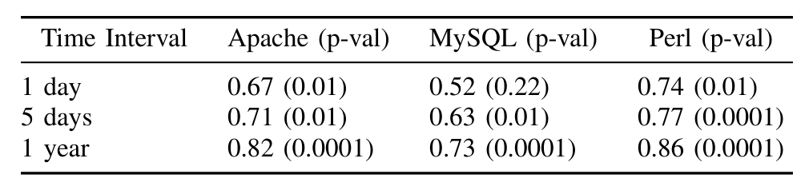
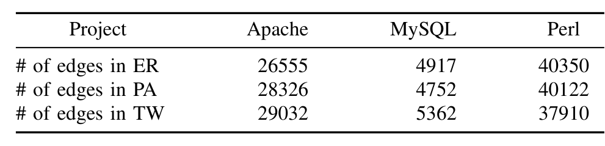

always around 50%, it is apparent that as the aggregation intervals get longer the best case scenario shows fewer faults. In Fig. 3 we show the more precise relationship between the fault rate change (both upper- and lower-bounds) and the aggregation time, for Apache, MySQL, and Perl (respectively). The difference between the lower bound curves for Apache and Perl on one hand and MySQL on the other probably tell us that the “back-and-forth” debates on issues are significantly shorter on the MySQL discussion boards vs the other two projects. It is also notable that the reply-to MySQL email networks, at the same temporal granularity, were much sparser than those of Apache and Perl, Cf. I.

Finally, and most tellingly, Table III shows the rank correlations (using Spearman rank correlation) between ordering of nodes that includes the transitive faults vs ordering of nodes excluding the transitive faults going through the respective nodes. The ordering of nodes is based on the centrality measure of number of 2-paths through the node. The higher the value the better the relative ordering of nodes is preserved. The overall high values for the correlation indicate that the orderings are largely preserved, and except for the very lowest values (for MySQL, where the sparseness of the communication networks are the likely cause, e.g. there were very few 2-paths in any 1 hour interval) the probabilities of observing them by chance (i.e. the p-values) are very small. Still, we note that the time interval is a factor here, especially for smaller projects with low communication activity levels. We conclude that if the time interval is chosen to be not too small, the results will be largely unaffected by even large rates of transitive faults.

### B. Missing Links

Table IV show the number of missing links added to the graphs using each of the three models. In most cases a very significant number of edges (several times more than the number of original edges) get added to the original data, so one might expect that the measures would yield substantially different results. For each of the projects we chose for comparison the top 10% of people who have the highest value for the betweenness or clustering coefficient in the original network, and the networks that we generated by simulations, and compare their rank correlations (again, using Spearman rank correlation). The highly-skewed Pareto nature of the distribution of activity in open-source projects [35],

TABLE III: Stability of rankings based on number of 2-paths. The values are rank correlations (Spearman) of 2-path rankings with vs without transitive faults. In parenthesis are the p-values (1-significance) of the tests.

[4] is well known. This essentially means that most of the activity in these social networks arise from a few participants. Thus it’s sufficient to look at the 10% people. More than half of the people have betweenness centrality or clustering coefficient of 0. Tables V and VI show that the ranking of the betweenness and clustering coefficient of the original data set compared with the three new data sets that we created are highly correlated. The significance of these correlations is greater than or equal to 99% for all of the comparison. For each of the randomly generated graphs based on the original graph (i.e. ER and PA), we generated 100 different random graphs, and averaged the rank correlation over these 100 runs. Although we add a significant number of edges (several times more than the number of edges in the original graph) we see that the people who had the highest betweenness and clustering coefficient in the original data are still amongst the top people in the newly generated data. Moreover the overall ranking stays stable. Thus, missing links behaving according to our three models do not have a considerable effect on the structure of our social networks in OSS projects. This shows that the methodology is reliable and robust.

## VI. THREATS TO VALIDITY

While not a real threat to the validity of this work, we feel obliged to accent strongly the following. What we show in this work is that one can expect the behavior of some important SNA measures to not be affected significantly in the presence of 1) missing data, due to inherent limitations of the data sources, and 2) incorrect information flow inferences, due to temporal network aggregation. What we do not demonstrate in this work is the utility of any such measures for any particular goal; that has been the topic of many prior works. In other words, these techniques may be inadequate for some particular task so the results will not mean anything, but they will still be stable in the presence of the above data challenges. The stability is not to be confused with utility.

SNA analysis comprises many techniques and measures. Here, we recognize that showing a few measures (i.e. centrality and clusteredness) are stable in the presence of missing and inadequate data does not give a clean bill of health nor a license for future practice to the whole approach of SNA analysis. However, we point out that the information flow issues as well as the measures we used are fairly general, important enough, and widely assumed to be pretty safe. Thus, had they not passed the test that we subjected them to, many

TABLE IV: Number of missing links added back to the graphs for all three models; TW=Time Window, ER=Erdős-Rényi, PA=Preferential Attachment