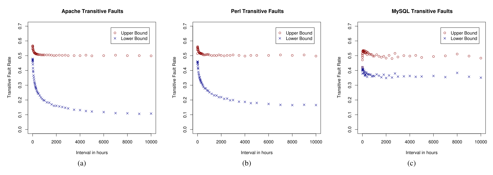

Fig. 3: The upper and lower bounds on transitive fault rates for Apache (a), Perl (b), and MySQL (c) as the time interval increases from 1 hour to 10,000 hours (just over one year).

| Project | Apache | MySQL | Perl |
|---------|--------|-------|------|
| ER      | 0.78   | 0.98  | 0.65 |
| PA      | 0.80   | 0.63  | 0.76 |
| TW      | 0.62   | 0.67  | 0.62 |

TABLE V: Rank correlation (Spearman) of the top 10% of nodes, with vs. without transitive faults. The nodes were ranked based on their Clustering Coefficient. TW=Time Window, ER=Erdős-Rényi, PA=Preferential Attachment.

| Project | Apache | MySQL | Perl |
|---------|--------|-------|------|
| ER      | 0.88   | 0.90  | 0.72 |
| PA      | 0.72   | 0.77  | 0.80 |
| TW      | 0.89   | 0.77  | 0.86 |

TABLE VI: Rank correlation (Spearman) of the top 10% of nodes, with vs. without transitive faults. The nodes were ranked based on their Betweenness Centrality. TW=Time Window, ER=Erdős-Rényi, PA=Preferential Attachment.

Previous studies would have been challenged. Surely, studying the stability of many other local and global network measures is necessary before SNA analysis methods and techniques deserve the confidence people often place in them. Further, there are other properties of SNA metrics that are important to investigate. For example, performance analysis is also critical.

On a technical note, while we found that some measures are fairly stable in the presence of challenging data, we did so by using measures that matched well and were easy to test in our specific application (e.g., using the number of 2-paths as a centrality measure). Ideally, one would need algorithms and evaluation techniques that can calculate existing measures with and without network paths that cannot carry information. Instead, most of the existing algorithmic work in this area aim to either develop new measures or faster ways to calculate old ones. Also, typically, existing algorithms assume a static graph and suffer from the effects of transitive faults. This work and the work of Howison et al. [1] illustrate the problem, which clearly presents an avenue for future research.

## VII. CONCLUSION

We have shown that a set of measures of social network analysis are robust to noise in network data. Specifically, we have shown that:

1) The clustering coefficient and the 2-path counts are both robust to data aggregation across large intervals (over one year), even though such aggregation may lead to transitive faults.

2) The clustering coefficient and betweenness social network analysis metrics on a network with missing links are highly correlated with networks that contain augmented networks with links added, indicating that they are also robust to some information loss.

These findings are good news in that they lend support to prior research in light of the concerns raised by Howison et al. [1]. In addition, further research that rely on social networks that suffer from transitive faults or missing links may continue to use these measures with confidence.

Our study has examined a limited set of SNA metrics. However, software engineering research from noted researchers such as Pinzger, Zimmermann, and Nagappan [15], [36], Williams and Meneeley [37], [38], Wolf et al. [39], [40] and others have used these and other measures. In our study we have presented techniques that other researchers can use to test for robustness of additional metrics to missing links and transitive faults. When the metrics used are found to be robust, this increases confidence in the findings of a study. When metrics are found to be susceptible to transitive faults or missing links, other metrics may be chosen which are more