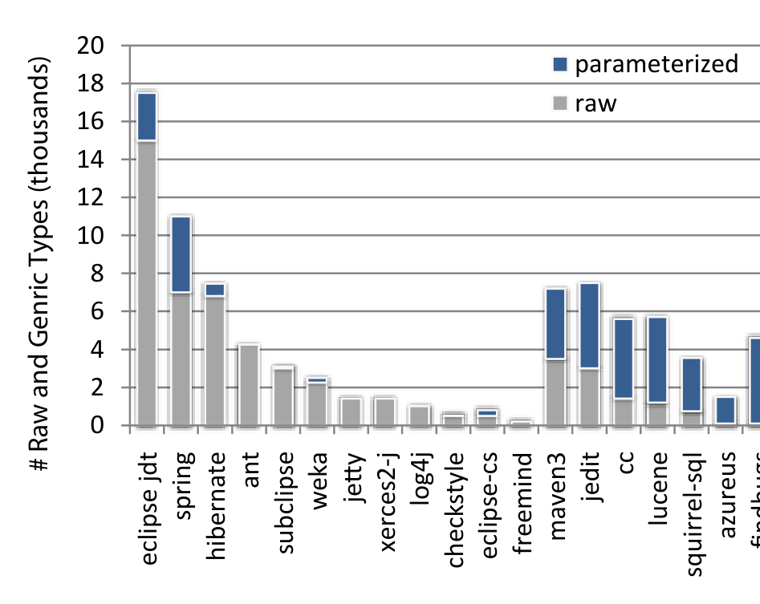
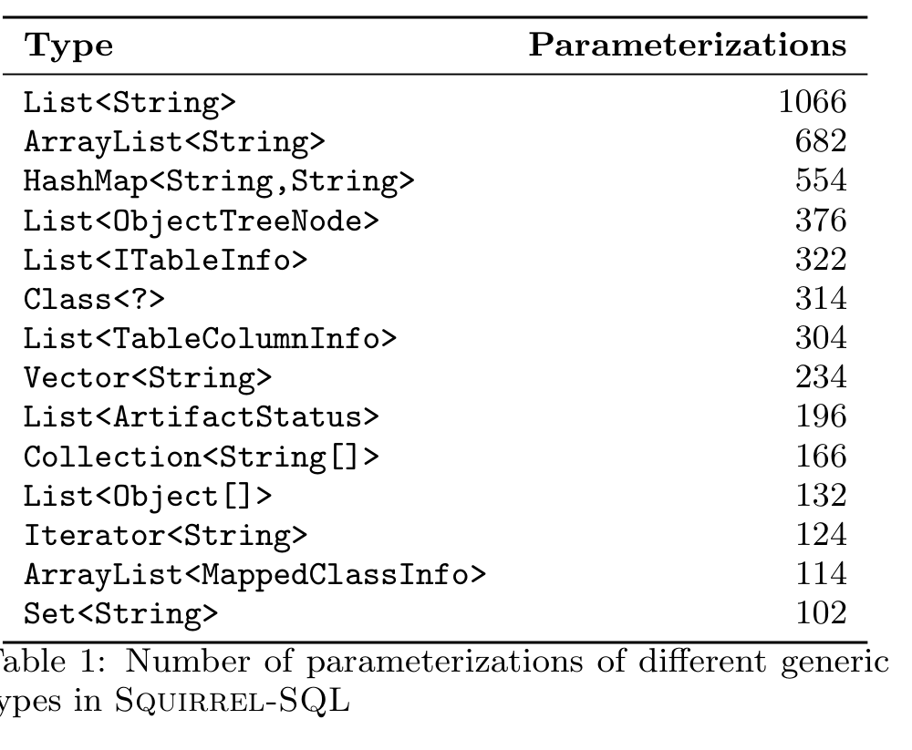

## 5. Data Characterization

### 5.1 Projects

r ∈ R of file f ∈ F iff
∃ i > 0: Types_r(m, f, r−1, t_r) = Types_r(m, f, r, t_r) + i
∧ Types_g(m, f, r−1, t_g) = Types_g(m, f, r, t_g) − i
∧ Elide(t_g) = t_r

We note that this approach is a heuristic and does not provide conclusive proof that a generification occurred. To assess this threat, we manually examined over 100 generifications identified by our algorithm and in all cases, the change represented a generification of a raw type.

One limitation of this approach is that we will miss “implicit” parameterized types. Consider the following two method signatures:

```
void printList(List<String> l)
List<String> getList()
```

Our analysis will identify both methods as using generics. However, if these two method calls are nested in a separate method:

```
a.printList(b.getList())
```

then no parameterized type appears in the AST and we do not count it as a use of generics. Tackling this problem would require a static analysis beyond the bounds of an individual source file, heavily decreasing performance at the scale of our analysis (hundreds of millions LOC). We do not believe this impacts our results, as in our experience, few methods contain implicit parameterized types without type declarations.



Figure 1: Parameterized and raw type counts in 20 projects.

### 5.2 Developers

Five projects ignored generics. Without interviewing the developers, we can only speculate on why. In section 6, we examine if the claims researchers made failed to hold in practice, and could contribute to lower adoption.

Did developers widely embrace generics? We examined commits with creation or modification of parameterized types, generic type declarations, or generic method declarations. In total, 532 developers made 598,855 commits to the projects. Of those developers, 75 developers created or modified generic declarations (14%) and 150 developers used parameterized types (28%). For these developers, the average number of commits involving generic declarations was 27 commits and 554 commits associated with parameterized types. Naturally, some developers commit more than others, which may give them more opportunity to use generics. Only 263 developers had more than 100 commits, averaging 2247 commits. Within this group of more frequent committers, 72 created or modified generic declarations (27%) and 112 used parameterized types (42%).

The data suggests only a select few of developers (perhaps with more authority or involvement) would create generic declarations followed by a modest embrace of generics by the most frequently committing developers. In later sections, we examine in more detail whether certain developers are choosing to ignore generics in favor of raw types (Section 7.1) and whether there is a concerted effort to migrate those raw types to use generic types instead (Section 7.2).

### 5.3 Features Breakdown

#### 5.3.1 Common Parameterized Types

We classified parameterized types as either user-defined or from the standard Java Collections (java.util) based on name signatures. We found that on the whole, use of Collections types accounts for over 90% of parameterized types across all of the codebases that we examined. In every project, List objects were the most common, followed by Map objects. Table 1 illustrates this finding by showing use of parameterized types in the Squirrel-SQL project.



#### 5.3.2 Common Arguments