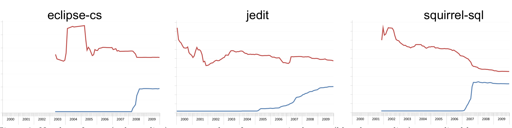

Figure 2: Number of casts (red, top line) versus number of parameterized types (blue, bottom line), normalized by program length.

## 6.2 Generics prevent code duplication

Another claim regarding generics is that a generic type Pair<S,T> would prevent the need for countless clones of classes such as StringIntPair and StringDoublePair if a developer wanted to create a type-safe container. But in practice, how many clones would actually be needed? How many duplicated lines of code and bugs would be introduced from having to maintain these clones?

To test Hypothesis 2, we measure the number of unique parameterizations for all parameterized types to determine the number of clones. Further, we take our previous measures of unique parameterizations of just user-defined generics (shown in subsection 5.3.4), and use the lines of code and number of revisions in the source repository to estimate the impact of code duplication. Total lines of duplicated code are calculated by taking the number of unique parameters (P), lines of code (LOC) and applying this formula: D = LOC * (P − 1). This estimates the amount of additional code needed to provide implementations of non-generic code for each type parameter, P. Next, we take the total duplicated lines (D), the number of revisions (R), and an error constant (K) to estimate the potential faults in the code in this manner: E = D * R * K. This is a rough estimate that assumes a relatively uniform bug rate across lines of code.

From our data, we found a large number of clones would need to be created for a small number of types. We observed usage of 610 generic classes, but actually found about 50% of these types (306) only had exactly one type argument ever used throughout the project's history, suggesting that needless or premature generification of objects occurs fairly frequently. From the top ten generic classes having the most variation (all were Java collection classes), we found a total of 4087 variations. To accommodate all the variations of these ten classes, 4077 clones would need to be created, or about 407 clones per class. But the number of variations dropped drastically for the remaining 294 classes; 1707 clones would need to be created, or about 5.8 clones per class. Interestingly, we only found 6 variations for Pair across all projects.

Next, we analyzed the top 27 parameterized user-defined types to estimate the impact of code duplication. The generic classes had a total of 365 parameter variations. The mean code size of the types was 378 LOC and the types were changed a total of 775 times (mean 28). We estimate, as a result from these 27 generic types alone, an estimated 107,985 lines of duplicated code were prevented. With our error estimation, 400 errors would have been prevented based

on our metric and an error constant of 7.4/10000 (1/100 errors per commit, and 7.4/1000 errors per LOC [11]). On average, 28 bugs were prevented by a generic type.

Overall, this supports Hypothesis 2; however, the impact may not have been as extensive as expected. The benefit of preventing code duplication is largely confined to a few highly used types.

There are limitations to our results. We may over-estimate the code duplication if inheritance could have shared non-generic methods. We may under-estimate the number of unique parameterizations, as some generic types are intended for client use and were not used in the code we analyzed, for example the library Commons Collections; there were 674 generic classes that were never parameterized. Further, we excluded 119 generic types from analysis that had only one unique parameter which themselves were other generic parameters. This might be common, for example, with a GenericHashKey that might be used by other generic types.

## 7. JAVA GENERIC ADOPTION

### 7.1 What happens to old code?

Since generics supposedly offer an elegant solution to a common problem, we investigated how pre-existing code is affected by projects' adoption of generics in an effort to answer Research Question 2. Is old code modified to use generics when a project decides to begin using generics?

There are competing forces at play when considering whether to modify existing code to use generics. Assuming that new code uses generics extensively, modifying existing code to use generics can make such code stylistically consistent with new code. In addition, this avoids a mismatch in type signatures that define the interfaces between new and old code. In contrast, the argument against modifying old code to use generics is that it requires additional effort on code that already "works" and it is unlikely that such changes will be completely bug-free.

To address this question as presented in Research Question 2, we examined if and how old code is modified after generics adoption. Figure 3 depicts a gross comparison by showing the growth in raw types (solid red) and generic types (dashed blue) over time for the three projects of interest. Note that raw types are types used in the system for which a corresponding generic type exists, such as List. A drop in raw types that is coincident with an increase in parameterized types (e.g., in mid 2007 in Squirrel-SQL, which we manually verified by inspection as a large generification effort) indicate evidence of possible generification. Changes in types may not themselves be evidence of actual