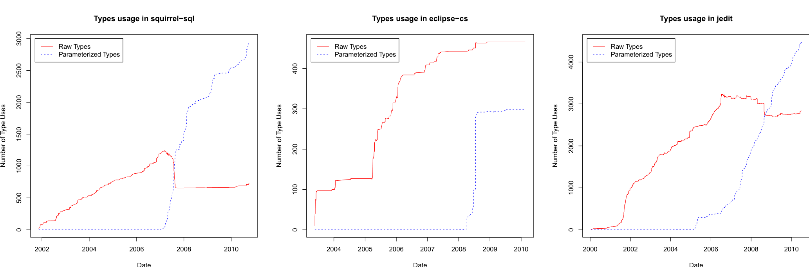

Date Date Date  
(a) Squirrel-SQL (b) Eclipse-cs (c) JEdit  
Figure 3: Migration efforts in switching old style collections was mostly limited in projects: old code remains. Solid lines indicate use of raw types (types such as List that provide an opportunity for generification) and dashed lines, generic types.

generification, however. We therefore determined generifications in a more principled way. Specifically, we identified raw types in the code as candidates for parameterization. We then examined what proportion of these candidates actually were removed and replaced by their generic counterparts by using the approach described in subsection 4.4.1.

In Squirrel-SQL, a total of 1411 raw types were introduced into the codebase over the life of the project (note that some were removed before others were added, so the maximum shown in Figure 3 is 1240). Of these, 574 (40.7%) were converted to use generics over a five month period starting when they were adopted in early 2007 (we identified these using the approach described in section 4.4.1). In contrast, JEdit had 517 of a total 4360 introduced raw types converted to use generics (11.9%) and Eclipse-cs had only 30 of 497 converted (6%). Of the other projects studied, only Commons Collections (28%) and Lucene (33.4%) had more than 10% of their existing raw types generified. In aggregate, only 3 of the 15 projects that use generics converted more than 12% of their raw types and none of them converted more than half of their raw types. We therefore conclude that although we do see a few large-scale migration efforts, most projects do not show a large scale conversion of raw to parameterized types.

### 7.2 Who buys-in?

Research Question 1 relates to who uses generics in the projects that adopt them. We expect that since most large projects depend on the principle of community consensus, the decision to use generics would be made as a group and would not be dominated by one developer.

To answer Research Question 1, we examined the introduction and removal of parameterized types by developers over time. Figure 4 shows the introduction (and removal) of parameterized types by contributor for the five most active contributors to each project. A solid line represents the number of raw types, which are candidates for generification, and a dashed line, parameterized types. Pairs of lines that are the same color denote the same contributor. A downward sloping solid line indicates that a contributor removed raw types. For instance, 4-a shows that in Squirrel-SQL, one contributor began introducing parameterized types in early 2007 while concurrently removing raw types.

The most common pattern that we observed across projects was one contributor introducing the majority of generics. This pattern is illustrated in Squirrel-SQL and Eclipse-cs (4-a and 4-b), and similar phenomena were observed in JDT, Hibernate, Azureus, Lucene, Weka, and Commons Collections. We performed a Fisher’s exact test [7] of introduction of raw and parameterized types comparing the top contributor with each of the other contributors in turn (using Benjamini-Hochberg p-value correction to mitigate false discovery [2]) to determine if any one contributor uses generics on average much more than the others. This test examines the ratio of raw types to parameterized types rather than the total volume, so that the difference of overall activity is controlled for. We found that in all cases, one contributor dominates all others in their use of parameterized types to a statistically significant degree.

JEdit (4-c) represents a less common pattern in that all of the active contributors begin using generics at the same time (towards the end of 2006). This is more representative of the Spring Framework, JUnit, and Maven. Interestingly, although our graph of JEdit shows that most contributors began using parameterized types, a Fisher’s exact test showed that one contributor (shown in yellow) still used parameterized types more often than raw types compared to all other contributors to a statistically significant degree.

Lastly, FindBugs (not shown) is an outlier as the two main contributors began using generics from the very beginning of recorded repository history and parameterized types were used almost exclusively where possible; we found almost no use of raw types in FindBugs at all.

Overall, the data and our analysis indicates that generics are usually introduced by one or two contributors who “champion” their use and broad adoption by the project community is uncommon.

In further work, we plan to investigate and contact these early adopters to identify why and how they began introducing generics as well as the obstacles (both technological and social) that they encountered.

### 7.3 How soon adopted?

We next turn to the question of how long it has taken software projects to adopt generics use and if there is a