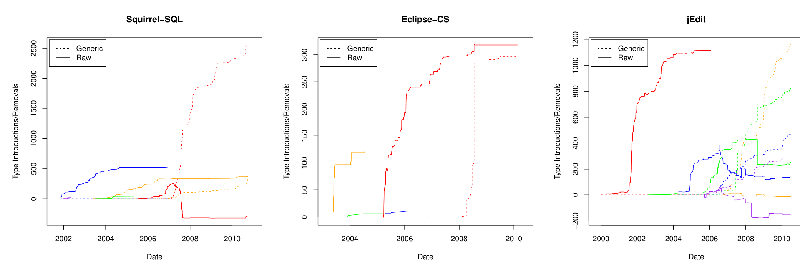

Date Date Date

(a) Squirrel-SQL (b) Eclipse-cs (c) JEdit

Figure 4: Contributors’ introduction and removal of type uses over time for the five most active contributors in each project. Solid lines indicate use of raw types (types such as List that provide an opportunity for generification) and dashed lines indicate parameterized types. Each color represents a different contributor.

relationship with tool support (including IDEs such as Eclipse and NetBeans) for generics. In order to relate time to key events that may affect adoption, we chose dates of generics feature introduction in Java and IDE support for generics.

To evaluate Research Question 3, we first had to determine which projects used which IDEs. We found evidence that IDEs were used for development for most of the projects that we studied. This evidence existed in the form of files created by IDEs (.project files in the case of Eclipse) or discussions on mailing lists. Eclipse was the most predominant IDE that we found evidence for, used by developers in Azureus, CheckStyle, Eclipse-cs, FindBugs, Jetty, JUnit, JDT, the Spring Framework, Squirrel-SQL, Subclipse, Weka, and Xerces.

Although Java 1.5 with generics was released in September of 2004, Eclipse did not support generics until the public release of version 3.1 in late June, 2005. NetBeans supported generics at the same time that they were introduced, making a study of the effects of support for this IDE difficult if not impossible. We therefore examined each of the eight projects that use Eclipse as an IDE to determine if they adopted generics prior to the 3.1 release. Of these projects, CheckStyle, JUnit, JDT and FindBugs started using generics prior to generics support in Eclipse. The other four projects waited until after generics support appeared in Eclipse and did not switch until sometime in 2006 or later (Subclipse did not begin using generics until 2010).

We examined the developer mailing lists at the time that generics support was added to Eclipse and also at the time that they began using generics and found no discussion of generics support in Eclipse as a factor in decision-making. Although these eight projects technically adopted generics after Eclipse support for them, the fact that adoption did not occur for at least six months after such support along with an absence of evidence on the developer mailing lists leads us to believe that IDE support may not be critical.

The following quote from Jason King in a discussion of generics support in Eclipse provides one way to reconcile the perceived importance of tool support with our findings.2

> Our team adopted Java 5.0 back in November 2004 and incrementally adopted the [Eclipse] 3.1 milestone builds as they came out throughout the first 6 months of this year. We found the product to be remarkably stable from an early stage, with few serious bugs.
>
> As the entire team was learning the Java 5 features, we started manually coding in generics (and enums, varargs, annotations etc). A few times we complained that autocompletion and refactoring would help, but the absence didn’t stop us. When a new [Eclipse] milestone came out our pairing sessions were really fun as we discovered new features appearing in the IDE.

Although tool support does not appear to be critical, we also looked at time of adoption to identify other possible factors affecting uptake time. Interestingly, we found no trend related to when generics were adopted. As examples of the observed variation, JEdit started using them in 2004, Squirrel-SQL in 2006, Eclipse-cs in 2008, and Subclipse in 2010. FindBugs is again an anomaly as it used generics before generics were officially released! The only statement we can confidently make is that there was not strong adoption of generics immediately following their introduction into Java.

We also saw wide variation in the rate of generics adoption within the codebases. Figure 3 shows that Squirrel-SQL, Eclipse-cs, and JEdit introduced generics into the code at a rapid rate once the decision to use them was made. In contrast, a number of projects, Lucene, Hibernate, Azureus, CheckStyle, and JUnit show a lull in generics use for months or even years following first generics use.

Overall, the data that we collected to answer Research Question 3 indicate that lack of IDE support for generics did not have an impact on its adoption. This finding raises more questions than it answers. Deciding to use a new language feature is non-trivial and can have large consequences. If many projects adopted generics, but did so at vastly different times and rates, what factors affect the decision of when to begin using them? In the future, we plan to contact project developers, especially those that first began using generics, to identify these factors.