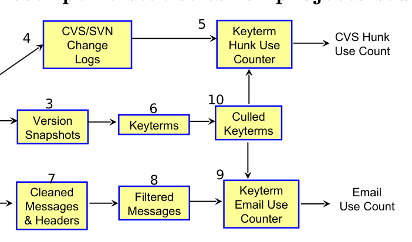
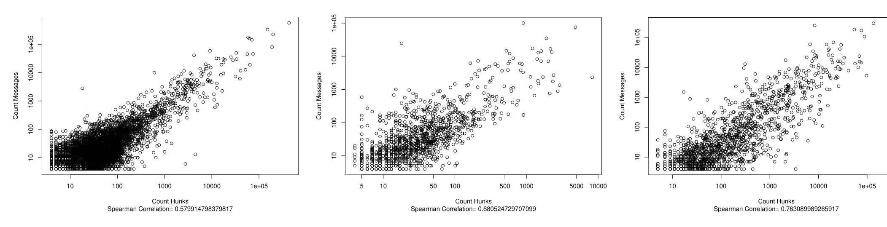
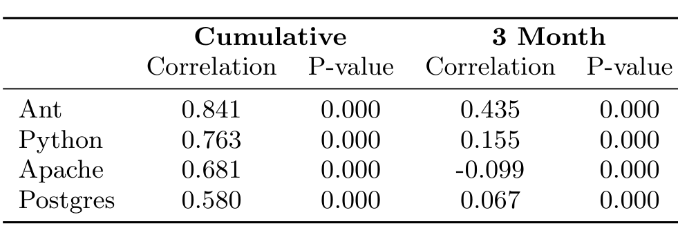
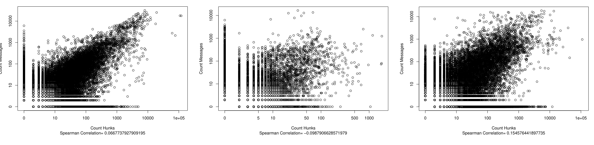
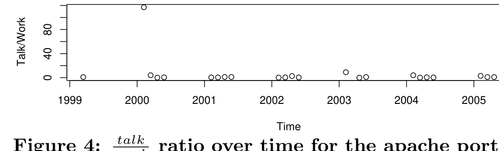

## Talk and Work: a Preliminary Report

David S Pattison, Christian A Bird, Premkumar T Devanbu  
Dept. of Computer Science, Kemper Hall,  
University of California, Davis,  
Davis, California Republic.  
pattison, bird, devanbu@cs.ucdavis.edu

## ABSTRACT

Developers in Open Source Software (OSS) projects communicate using mailing lists. By convention, the mailing lists are used only for task-related discussions, so they are primarily concerned with the software under development, and software process issues (releases, etc.). We focus on the discussions concerning the software, and study the frequency with which software entities (functions, methods, classes, etc.) are mentioned in the mail. We find a strong, striking, cumulative relationship between this mention count in the email, and the number of times these entities are included in changes to the software. When we study the same phenomena over a series of time-intervals, the relationship is much less strong. This suggests some interesting avenues for future research.

ACM Categories & Subject Descriptors: D.2.8 [Metrics]: Process metrics, K.4.3 [Organizational Impacts]: Computer-supported collaborative work  
General Terms: Human Factors, Measurement  
Keywords: Open Source, Data Mining, Information Retrieval, Social Networks

## 1. INTRODUCTION

Developing large, complex software systems is typically a knowledge-intensive activity, involving sizeable teams of people. A great deal of effort is spent in co-ordinating the activities of large teams. One of the key goals of software design is to moderate the need for co-ordination. The principles, as advocated by Parnas [7] and more recently by Baldwin & Clark [2, 1] center around separation of concerns, division of labor and division of knowledge. Baldwin & Clark argue that by adopting design rules [1] designers can reduce the need for communication and co-ordination in large systems. As a simple example, we should define the interfaces of functions and modules extra clearly (especially the ones that are used most often). If we do this, then the discussion overhead of working with these functions will be lower. In fact, if we modularize the system well, and define the interfaces well, then the communication overhead of functions (regardless of how much they are being worked with) should remain fairly constant. More “popular” functions, if well-documented, should incur no more discussion overhead than less popular ones.

But is this really true? This is our research question:

> Does the amount of discussion about software entities remain relatively independent of the level to which they are used?

In Open Source Software systems (OSS), most development and discussion activity is publicly archived; using data from several projects, we compare the number of times source-code entities (functions, methods, classes, etc.) are mentioned in changes, with the number of times they are mentioned in emails. We find a striking relationship, which essentially suggests that the answer to the question above, surprisingly, is no. Upon closer examination, however, the plot thickens: although strong throughout the entire project life, over intervals, the relationship is substantially weaker. We speculate as to the causes of this odd phenomenon.

In Section 2, we present related work. In Section 3, we describe our approach to mining relevant data to answer the research question. In Section 4, we present our results and briefly summarize threats to validity; finally we conclude with a discussion of future research.

## 2. RELATED WORK

There have been many papers relating to the extraction of data from CVS/SVN repositories (see, e.g., [10, 5]). Trying to compare discussion to software is not a new idea. Mockus et. al. [6] used emails to quantify developer participation. In previous work, [4] we have analyzed social networks of OSS mailing lists. Rigby & Hassan have analyzed OSS mailing list content for emotional content [8]. To our knowledge, ours is the first research to study the use of software entity (function, class etc.) names in emails.

## 3. DATA MINING

We now describe how relevant information from several target OSS projects is collected, cleaned and stored. Figure 1 summarizes the different steps. The approach is summarized only briefly, since details have already been published elsewhere [4].

### 3.1 Source Code Repository Extracting

CVS/SVN and other repositories contain a wealth of information regarding what, when, how, and by whom a change

This work was supported by a grant from the National Science Foundation Grant no. NSF-SoD-0613949 and software donations from SciTools and GrammaTech Corporations. Permission to make digital or hard copies of all or part of this work for personal or classroom use is granted without fee provided that copies are

---

was made to the source code. We extract two kinds of information from this—change logs, “hunks,” (See steps 1, 4 in Figure 1) and a series of snapshots (step 3).

| | Ant | Python | Apache | Postgres |
|---|---:|---:|---:|---:|
| Language | Java | C++ | C++ | C++ |
| Messages | 73,157 | 66,541 | 101,250 | 132,698 |
| w/Patches | 2,424 | 393 | 4,051 | 747 |
| Hunks | 200,854 | 253,291 | 123,221 | 1,257,633 |
| Keyterms | 12,072 | 5,519 | 2,023 | 9,461 |
| Used Keyterms | 2,704 | 1,452 | 1,271 | 5,454 |

Table 1: Descriptive statistics for projects studied



In the change logs, we are especially interested in “hunks”, which are contiguous run lengths of code indicating differences between successive versions. Hunks are very similar to diffs and patches. A hunk is a representation of a change from one version of a file to the next. Here is a sample unified diff from the Ant project:

```
@@ 109,2 111,4 @@
-Child(Element e) {
- this.e = e;
+String name = event.getTask().getClass().getName();
+int pos = name.lastIndexOf(".");
+if (pos != -1) {
+ name = name.substring(pos + 1);
```

This hunk deletes two lines and replaces them with four new lines. Multiple hunks may be used to represent more complex changes. The change is represented in a line-oriented way. Between the @@s there are four numbers, indicating the offset for the start of the change, change line count, etc. The lines prefixed by - and + are the most interesting, for these represent the actual lines added and deleted. We are specifically interested in the use of the names of programming entities in this range; the greater the use of programming terms in hunks, the more programmer effort is spent working with those terms.

These hunks will be used later on for comparison against emails. We now describe how we extract the names of the modules, or functions, from the source code.

### 3.2 Keyterm Extraction & Counting

We use the term keyterm to refer to the name of an entity in the source code of the system. These will include items such as classes, methods, static instance variables, exceptions, parameter names, local variable names, and so on. For our purposes, we only need to collect software entity names and simple metrics of these entities (such as line numbers). Using Understand from Scitools, Inc., we extracted the required information. The Understand tool, like many fact extractors, is designed to work with complete versions of the system. However, since the files in the system evolve individually, we created monthly and transaction snapshots of each file and ran Understand on each of these snapshots as if it were a static release of the source code (see steps 1, 3, 6 in Figure 1). The keyterm corresponding to every possible software artifact from the entire source code repository can be placed into the database for future use.

Understand extracts keyterms naming all Java, C, and C++ entities, including classes, fields, methods, functions, etc. From this list of keyterms (in the case of Java) we took only “fully-qualified” function names, and split this into separate parts, using each part also as a keyterm. For example, the method name: difforg.apache.ant.Project.init() we retrieved the following keyterms: difforg.apache.ant.Project.init, org, apache, ant, Project, init. For C++ projects, for example, a full function name would be: PgConnection::Connect() and the following keyterms would be extracted: PgConnection::Connect, PgConnection, Connect. Since the long function names are split into their parts, class names are also in the set of keyterms.

#### Keyterm Culling

Many keyterms are not particularly informative, since they occur too often or extremely rarely. For example, the exceedingly popular function System.out.println occurs in a great many hunks, but is not usually a hot topic of discussion on the mail. Likewise, some functions may hardly ever be discussed. To avoid the confounding effects of these outliers, we chose to only consider words that are mentioned in at least three different hunks and in at least three different messages (steps 6, 10 in Figure 1). These outlier thresholds were based on a study of the distributions of keyterm occurrence frequencies in the different projects studied.

#### Counting Keyterms

Once the keyterms have been identified, we need to count occurrences in both emails and hunks. After downloading the email archives, we parse each email for meta-data (steps 2, 7 in Figure 1) and place this relevant information into the database, as discussed in our earlier work [4]. For our purposes here, we care about the data (body field) and only some of the meta data (the timestamp of the email).

There was one complication; emails often contain patches, which are essentially verbatim diff outputs. Including this patch content might bias our results. To ensure that we only counted discussion of code keyterms, we removed (steps 7, 8 in Figure 1) emails that contain patches. For the Ant project, 73,157 email messages appear on the list serve. Using previously created scripts that identify patches in email messages [3], only 2,424 of those email messages contain a patch. Table 1 contains message and patch counts for all of the projects examined. Once the emails are filtered, we can complete the keyterm count (step 9 in Figure 1).

Counting keyterms in Hunks is relatively straightforward: using the lines prefixed with "+" and "-" in hunks we counted the number of occurrences of keyterms (step 5 in Figure 1). Once all keyterms are counted, individual documents from hunks and messages are compared. This comparison is similar to methods presented by Salton et al. [9]; however, instead of comparing documents within a single set, we are comparing documents across two disjoint sets.

## 4. RESULTS

We studied the relationship between the amount of “talk” concerning keyterms, and amount of “work” with the same

---



Figure 2: Cumulative counts of keyterm occurrence on hunks (x-axis) and emails (y-axis), for projects (left to right) Postgres, Apache, and Python. Correlation in all cases is very high and highly significant.

Both of these were measured as simple occurrence counts. We studied this relationship in two ways: cumulatively over the entire life of the project, and sequentially, comparing talk and work over successive time periods.

### 4.1 Talk & Work: Cumulative

There is a strong relationship between the hunk counts (representing work) and email counts (representing talk) in all four projects studied. Figure 2 shows the scatter plots of the counts for Postgres, Apache, and Python. Since the data is heavily left skewed, and has a high range, we use a log-log plot. Ant shows similar (even stronger) correlation, but is omitted due to space reasons. Table 2 gives the correlations of all the different projects.

The consistency of this behavior across different projects is quite striking. The prima facie interpretation is that, cumulatively over the life of each project, if a keyterm is frequently mentioned in hunks (i.e., it is frequently a subject in code changes) then it is frequently discussed in emails. For example, the function apr_thread_exit is used in hunks 15 times, and mentioned in messages 52 times, whereas the function apr_thread_mutex_lock is used in hunks 176 times and mentioned in email 179 times. Likewise apr_thread_mutex_unlock is used 285 times and mentioned 219 times.

This result suggests an overall, consistent relationship between work and talk: the more a keyterm is used in code, the more it needs to get discussed. This finding suggests an obvious next step: is this result consistent over time?

### 4.2 Talk & Work: Intervals

The next study we did was to check if there is a consistent relationship between “work” and “talk” for keyterms during successive intervals. To study this, we broke down the available lifespan of each project into 3 month intervals. For each 3 month interval, we gathered data on keyterm occurrence in hunks and in emails, and did the same analysis. To our surprise, the results were quite different (see figure 3). In this plot, each keyterm might give rise to several points on the graph, corresponding to hunk use and message counts at different intervals.

In two of the four projects, viz., Ant and Python we found strong correlations; however, Apache and Postgres were much lower. Even the strongest correlation in this experiment, Ant, was not as strong as it was in the first experiment. However, the results in Python and Ant are still significant. We show the same 3 projects as before in figure 3, omitting Ant for reasons of space. The results are summarized in Table 2. While all correlations are statisti-



for projects and different time intervals

### 4.3 Discussion

The above results leave us in a quandary. The cumulative data show such a strikingly strong relationship between use in hunks and mentions in messages, whereas the interval data show a weaker relationship. It is quite puzzling that a relationship that is weak in pieces should cumulatively turn into a strong one. Why does this happen? The conclusive answer is left for future work, but we offer a tentative theory in the ensuing discussion.

The implication here is that there is somehow a cumulative conservation of the “talk” ratio. If a function is used a lot, there is a lot of discussion about it at some point in time, but not necessarily at the same time when it is used. Perhaps this is because very useful functions are carefully designed, and are therefore a subject of a lot of discussion earlier in their life cycle. On the contrary, if they are used heavily without prior careful discussion and design, then they become troublesome later, and get discussed a lot. This theory would explain why the relationship may be weaker over intervals, but is strong when cumulated.

As a preliminary investigation into this working hypothesis, we looked at the Apache portability run-time functions which are well used and designed functions in the Apache software platform; these functions form a portability layer that is used to keep the core HTTPD software relatively easy to port. All the functions in this layer have a name that begins with “apr_” and are easy to identify. For all these functions, we computed the ratio mentions in emails and mentions in hunks + 1, then grouped the values by 3 month intervals and studied the changes. While we have not yet completed the analysis, we show an especially telling sample for a popular string printing function (Figure 4). The x-axis shows the year and interval within the year; the y-axis is the ratio above. This plot suggests that the ratio of email mentions to hunk use

---



Figure 3: Three-month interval counts of keyterm occurrence on hunks (x-axis) and emails (y-axis), for projects (left to right) Postgres, Apache, and Python. The relationship is substantially weaker in this case.

For this popular apr function was extremely high in the early period, in fact, just when the portability layer per se was being defined. Afterwards, the ratio drops. Later on, this important utility function does continue to be used in hunks, but it was not discussed nearly as much.

This suggests a tentative observation: although the level of discussion surrounding the use of a function may vary with time, good engineering principles dictate that the design of more important and useful functions must be well discussed. On the contrary, well-used functions that were not subject to good initial review and discussion will later become troublesome and require lots of discussion. Further study is clearly warranted.



Figure 4: portability layer function apr_snprintf. Notice initial peak followed by low values over the duration.

## 5. THREATS TO VALIDITY

We have only studied a small portion of OSS projects and it is entirely possible that these results may not generalize to all projects.

We also assume that the developer email lists are the only possible medium of communication between developers, whereas individuals can contact each other through other mediums such as IRC, or direct emails; however, in most cases, community norms dictate that substantive discussions do occur on the mailing list.

## 6. CONCLUSION

We studied the relationship between the use of keyterms in hunks and the mentions of those same keyterms in email discussions. We found a striking, strong relationship between the two when the occurrence counts are cumulated over the life of the project, but a much weaker relationship when broken into 3 month intervals. This leads to a puzzling set of irregular relationships cumulatively leading to a much more regular relationship. We speculate on why: more popular and useful functions may undergo a careful review and discussion period where they are discussed heavily, after which, thanks to good design, they can be used without much further ado. If not carefully designed first, such functions might eventually become troublesome and require much discussion later on. Thus overall, work and talk become closely related.

## 7. REFERENCES

[1] C. Baldwin and K. Clark. Design Rules: Vol 1. MIT Press, 2000.

[2] C. Y. Baldwin and K. B. Clark. Managing in an age of modularity. Harvard Business Review, pages 84–93, September-October 1997.

[3] C. Bird, P. Devanbu, and A. Gourley. Detecting patch submission and acceptance in oss projects. In Workshop on Mining Software Repositories, 2007.

[4] C. Bird, A. Gourley, P. Devanbu, M. Gertz, and A. Swaminathan. Mining email social networks. Proceedings of the 2006 international workshop on Mining software repositories, pages 137–143, 2006.

[5] L. Lopez, J. M. Gonzalez-Barahona, and G. Robles. Applying social network analysis to the information in cvs repositories. In Proceedings of the International Workshop on Mining Software Repositories, 2004.

[6] A. Mockus, J. D. Herbsleb, and R. T. Fielding. Two case studies of open source software development: Apache and mozilla. ACM Transactions on Software Engineering and Methodology, 11(3):309–346, July 2002.

[7] D. Parnas. The criteria to be used in decomposing systems into modules. Communications of the ACM, 14(1):221–227, 1972.

[8] P. Rigby and A. Hassan. What Can OSS Mailing Lists Tell Us? A Preliminary Psychometric Text Analysis of the Apache Developer Mailing List. Proceedings of the Fourth International Workshop on Mining Software Repositories, 2007.

[9] G. Salton, A. Wong, and C. S. Yang. A vector space model for automatic indexing. Commun. ACM, 18(11):613–620, 1975.

[10] T. Zimmermann and P. Weiβgerber. Preprocessing CVS data for fine-grained analysis. In In Proceedings of the International Workshop on Mining Software Repositories, 2004.