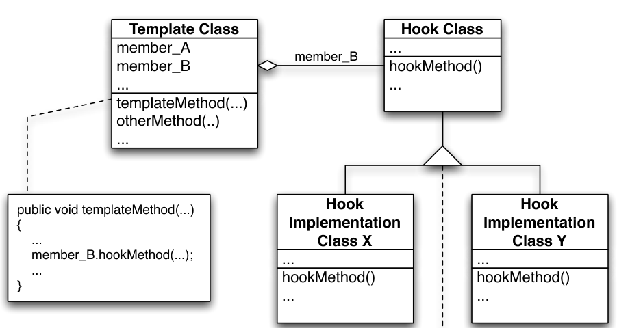
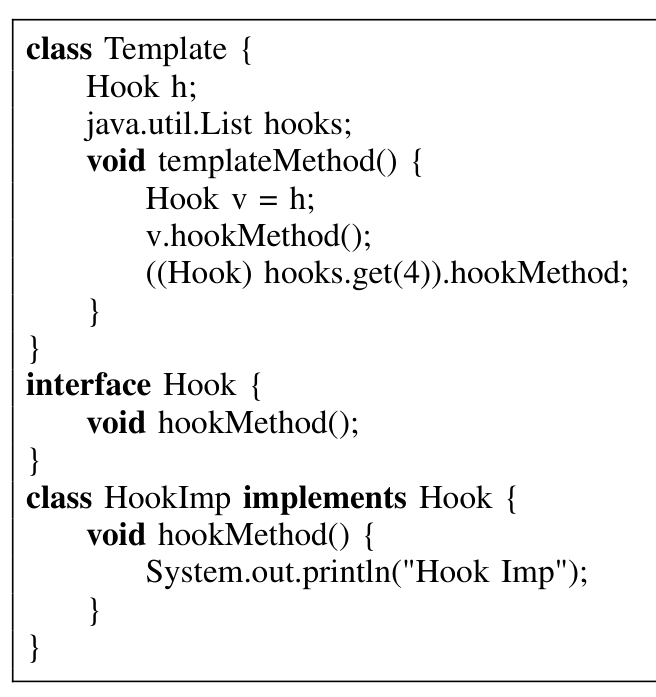
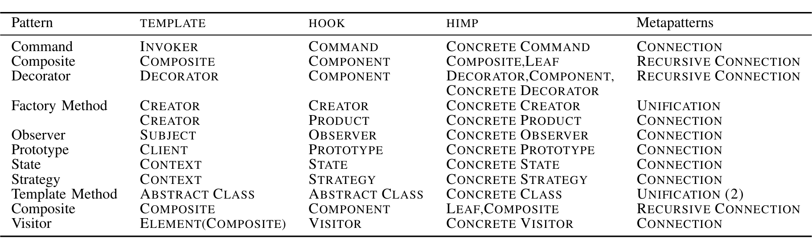
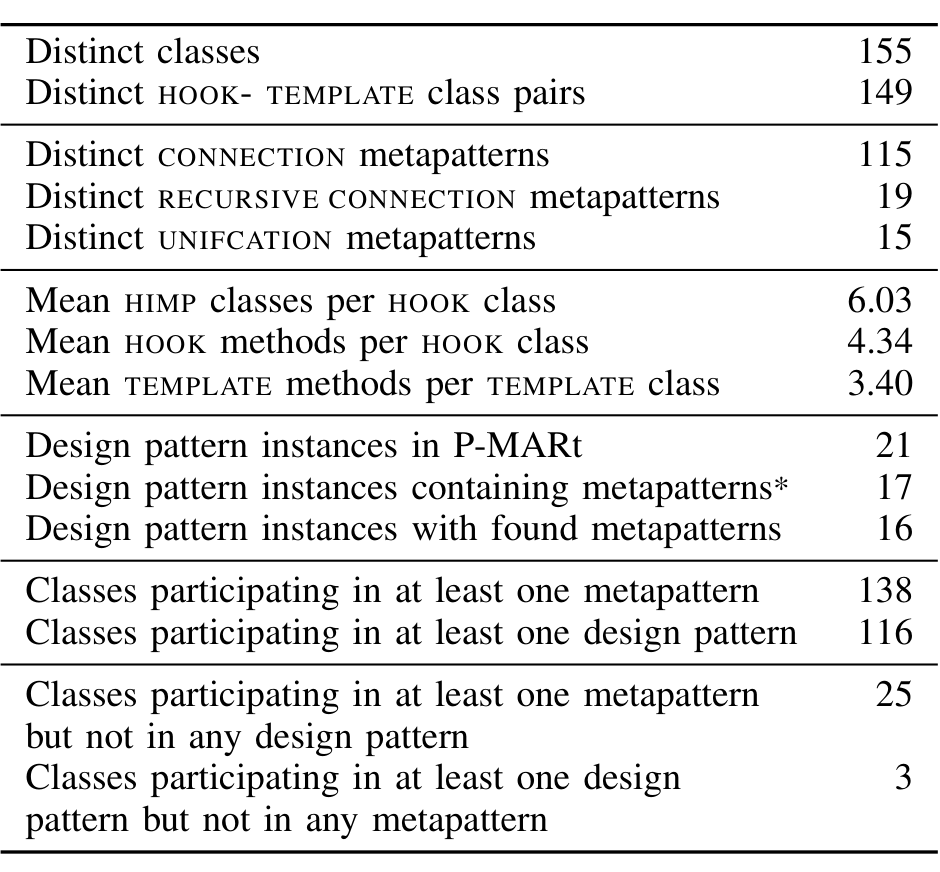

## THEX: Mining Metapatterns from Java

Daryl Posnett, Christian Bird, Premkumar Devanbu

*Department of Computer Science*  
*University of California, Davis, USA*  
*dpposnett,cabird,ptdevanbu@ucdavis.edu*

> Abstract—Design patterns are codified solutions to common object-oriented design (OOD) problems in software development. One of the proclaimed benefits of the use of design patterns is that they decouple functionality and enable different parts of a system to change frequently without undue disruption throughout the system. These OOD patterns have received a wealth of attention in the research community since their introduction; however, identifying them in source code is a difficult problem. In contrast, metapatterns have similar effects on software design by enabling portions of the system to be extended or modified easily, but are purely structural in nature, and thus easier to detect. Our long-term goal is to evaluate the effects of different OOD patterns on coordination in software teams as well as outcomes such as developer productivity and software quality. We present THEX, a metapattern detector that scales to large codebases and works on any Java bytecode. We evaluate THEX by examining its performance on codebases with known design patterns (and therefore metapatterns) and find that it performs quite well, with recall of over 90%.

> Effort in developing tools and methods to that end. However, we have found that in practice (partly because of the somewhat imprecise nature of the definition of the GoF design patterns) the tools are tricky to use, and often yield imprecise and variable results. In some cases the computational complexity of such tools does not scale to large code bases, while others suffer from high false positive or false negative rates. Some patterns are easier to detect than others. In particular, many research endeavors have found that the structural GoF design patterns are the easiest patterns to detect [3], [4].
>
> Metapatterns, in contrast, are purely structural patterns of object-oriented interaction and represent a more abstract level of design. To examine the in vivo use and evolution of metapatterns, we have developed THEX, a metapattern miner. THEX uses structural information (including inheritance graphs, member types, and method signatures) as well as symbolic execution to identify instances of various types of metapatterns in Java bytecode. In this paper we present a short synopsis of metapatterns, a description of techniques used in THEX, and evaluate the performance of THEX by examining its performance on two pieces of Java software that have known instances of metapatterns.

### I. INTRODUCTION

Most large software projects have hot spots that undergo frequent change. One of the challenges of any designer is to develop a design that accommodates this change with minimal impact on the rest of the system. One of the purposes of the object-oriented design paradigm is to enable change and adaptation through inheritance and delegation. Certain patterns of object interaction and delegation allow these hot spots to change in certain ways easily and without changes rippling throughout the system.

In 1994, Wolfgang Pree presented a system of patterns of object-oriented interaction that constitute a minimal means to capture reusable object-oriented design that he named metapatterns [1]. Metapatterns can be composed in different ways to create larger patterns, and in fact, most design patterns, including the now canonical set of design patterns introduced by Gamma et al. (commonly referred to as the "Gang of Four" and referenced here as GoF) [2], are instances of metapatterns or combinations of multiple metapatterns.

We are interested in both examining the evolution of software design and studying the effect of different design patterns on outcomes such as software quality, developer productivity, disruption of changes, and coordination requirements in teams. Performing these studies requires first that we have methods of mining the design patterns used in object-oriented software. Design pattern detection is one possibility, and the research community has seen no small amount of effort in developing tools and methods to that end.

We note that THEX is not a design pattern detector, and does not compete with these tools. THEX mines metapatterns, which offer some of the benefits of design patterns: they decouple classes, and enable certain forms of rapid change to occur without being as disruptive as other types of class interaction. Further, THEX is not a means unto itself; identifying metapattern instances is but one important piece in enabling further empirical studies of software architecture and evolution.

We also distinguish this work from earlier work by Gil et al. on detection of pattern elements they coined "micropatterns" [5]. With a few exceptions, micropatterns are mechanically recognizable traits of a single class that represent common programming practice. Most do not model relationships between classes except in the negative, e.g., a Sink micropattern is a class whose methods do not propagate calls to any other class. In general, micropatterns model common intra-class programming practices whereas metapatterns model some of the inter-class practices common to many GoF design patterns. Metapatterns lie between micropatterns and design patterns both in terms of structural representation and mechanical identification.

---



Figure 1: UML Diagram of a metapattern

## II. METAPATTERNS

Pree defines metapatterns as a “set of design patterns” that “can describe any framework example design pattern on a meta-level.” Many pattern catalogs, and in particular, most of the GoF design patterns introduced by Erich Gamma et al. [2] fall into this category of “framework example design patterns” [1]. In addition to their structural properties, the GoF design patterns embody an intent, defined by the design issue or problem the pattern solves [2]. Metapatterns capture the structural and compositional aspects of design patterns without regard to this intent. Consequently, many design patterns share a common underlying metapattern model. For example, STATE and STRATEGY GoF patterns have a different intent but share a common metapattern structure.

Metapatterns are rooted in two structural roles, TEMPLATE and HOOK. A TEMPLATE is a class with a method t that calls a method h in the HOOK class (or interface). The terms are also used without ambiguity to refer to the TEMPLATE and HOOK methods. The TEMPLATE method must invoke the HOOK method through some variable or argument f in the TEMPLATE class. The cardinality of f defines the cardinality of the instance relationship between the TEMPLATE and HOOK classes. When f is a container the TEMPLATE may invoke any number of HOOK instances and the relationship is 1-N. Alternatively, if f is a simple instance of HOOK then TEMPLATE may invoke methods in only one HOOK instance and the relationship is 1-1. In every case, the HOOK method in the HOOK class can be overridden by methods in one or more HOOK IMPLEMENTATION (hereafter referred to as HIMP) classes derived from the HOOK class. Figure 1 shows a UML description of a metapattern.

The four forms of metapatterns are defined as follows:
1) If the HOOK to TEMPLATE relation is purely associative or aggregative, it is a 1-1 or 1-N CONNECTION metapattern.  
2) If TEMPLATE inherits from HOOK, it is a 1-1 or 1-N RECURSIVE CONNECTION metapattern.  
3) If TEMPLATE and HOOK are the same class, this is a UNIFICATION metapattern.  
4) If TEMPLATE and HOOK are the same class type, but TEMPLATE references or aggregates one or more instances of its own type, it is a 1-1 or 1-N RECURSIVE UNIFICATION metapattern.

In order to detect metapatterns, we must first extract the templates and hooks and so we present THEX, a Template and Hook Extractor.

## III. DESCRIPTION OF THEX

Tourwé [6] defined a formalism for metapatterns that we use as a basis for defining TEMPLATE/HOOK relationships, and also metapatterns. Listing 1 illustrates a standard 1-1 (via Template.h) and 1-N (via Template.hooks) connection metapattern in Java. THEX works specifically on Java bytecode to identify metapatterns.

### A. Finding TEMPLATES and HOOKS

First, we note that all non-final and non-private instance methods in Java are virtual by default, and may be overridden in a subclass. Thus, by Pree’s definition, any class with at least one instance method can be a HOOK and any instance method can be a HOOK method. This is not useful for our purposes. Rather, we use the following constraints to identify a metapattern in Java. We identify the TEMPLATE and HOOK together. Two classes, TEMPLATE and HOOK, form a metapattern if:

1) HOOK has at least one subclass that overrides a method h defined in HOOK.  
2) TEMPLATE contains at least one member field, local variable, or argument f, that is either of type or super-type of HOOK (including Object), an array of type or super-type of HOOK, or a collection of type or super-type of HOOK.  
3) TEMPLATE contains some method m that contains a code path such that the object that is referenced by f has its h method called.

Constraint 1 restricts the HOOK to classes that are actually being subclassed. Constraints 1 and 2 are easily detected in a purely structural manner by reconstructing the class hierarchy in a code base and recording the methods and member fields defined in each class. Constraint 3 is more difficult. We track data flow via symbolic execution [7] in bytecode by extending the ASM library [8] and performing some minor inter-procedural analysis to detect which referenced object has its h method called. We report metapattern reference type as one of FIELD, LOCAL, or ARGUMENT, prioritized as listed, depending on which types are contained in the data trace of



Listing 1: An example java Hook and Template metapattern

---



Table I: Metapatterns in the Huston Design Patterns.

the object referenced by f. We say “the object referenced by f” because often the method call to h is not made directly through f itself. Consider a method that has a local variable l, of type HOOK. If the method only makes the call l.h(), then the class interaction is considered a metapattern with respect to l, i.e. it’s a LOCAL metapattern. However, if f is assigned to l and then the call l.h() is made, then l references the same object that f references and the class interaction is a metapattern with respect to f and the metapattern is of type FIELD. We report all three types for completeness and the researcher may filter the output depending on their particular interests.

THEX detects metapatterns even if f is not of type HOOK. In many cases, we observed metapatterns in which f was cast from a super-type to type HOOK prior to making the call to h, especially when collections were used prior to Java 1.5, where all collections hold instances of type java.lang.Object. We also found instances where the field f of the TEMPLATE class was accessed via a “getter” method, e.g. one might see a statement of the form:

```java
Hook getf() { return f; }
void templateMethod() {
    Hook v = getf();
    v.h();
}
```

We detect getter methods by identifying methods that return the object that f references along all possible code paths (in a conservative manner), and use knowledge of such getter methods when detecting a call to a hook method via the object referenced by f.

We note that constraint 2 limits 1-N patterns to cases where f is either an array of type or super-type HOOK or a java.util.Collection of type or super-type HOOK. This is because if f is an arbitrary object with a method that returns an object of type HOOK, it is difficult to determine if f represents a container for instances of HOOK or if f is some other type of object not tightly associated with HOOK. In practice, we observed that the majority of Java-based software uses arrays and collection classes (generic or otherwise) to hold instances of type (or super-type of) HOOK. THEX will not detect a metapattern if f is an idiosyncratic or custom container class for HOOK.

THEX first identifies all possible HOOK classes (i.e. classes that fulfill constraint 1). Next THEX considers every class in turn to be a TEMPLATE class and then examines all member fields and methods. Each member field is a candidate HOOK and all methods of TEMPLATE are examined to see whether constraint 3 is met (in practice, each method is examined only once and all member fields, arguments, and local variables are tracked at once during the symbolic execution). If THEX identifies a matching TEMPLATE/HOOK pair that meets all three constraints, it outputs the classes along with the HIMP class, the trace of f (including reference type), and the TEMPLATE and HOOK methods (often, there is more than one HOOK method).

### B. Metapatterns Classification

After all TEMPLATE/HOOK metapattern pairs have been identified, THEX uses inheritance and equality relationships to classify the metapatterns. Each TEMPLATE/HOOK metapattern is identified as one of UNIFICATION, CONNECTION, or RECURSIVE CONNECTION metapatterns. If the TEMPLATE class and the HOOK class are the same class then the pattern is a UNIFICATION metapattern; if the template inherits from the hook and is distinct from the hook then we identify a RECURSIVE CONNECTION metapattern and the remaining metapatterns are classified as CONNECTION metapatterns. At any given time, THEX is only examining one method in a candidate TEMPLATE class, and each method only needs to be examined once. This means that THEX runs in time linear to the total number of methods in the system and that memory usage is linear in the number of classes and fields and constant in the size of the largest method in the system. The benefit of this is that THEX scales nicely. We were able to identify metapatterns in the entire Eclipse code base in under 30 minutes. Further, THEX exists as a completely self contained jar file and only needs access to the bytecode in order to run. This allows a user to run THEX on any software that compiles to bytecode (code written in Scala or Jython, for instance) and an application can be examined in toto with required libraries, which may be cumbersome when source code is required.

## IV. EVALUATION AND USES

Our tool is designed to extract metapatterns based on our specification; hence there exists no oracle that we can use to evaluate recall and precision directly. Instead we use software with known examples of design patterns and evaluate the ability of our tool to locate metapatterns within the design patterns. To compare results, we relate metapattern roles to

---



Table II: Summary metapattern data for JHotDraw 5.1 (*Factory Method and Singleton do not contain metapatterns in JHotDraw)

design pattern roles. We first run THEX on the relatively simple Huston Design Pattern Catalog which contains short Java examples for each GOF design pattern [9]. Next we examine the results of running THEX on JHotDraw 5.1. In each case, we manually inspect the design pattern instances to determine what metapatterns exist and calculate recall by noting how many metapatterns THEX actually detects.

Metapatterns in the Huston Patterns. In all, there are 70 fairly small classes in the Huston catalog and the structure of the design patterns used are fairly canonical. We present the design pattern to metapattern role mappings that THEX detected in Table I. This table also reflects the mappings presented by Hayashi et al. in their work on detecting design patterns using metapatterns [10]. THEX identified every metapattern in the design pattern instances. THEX also identified other metapatterns that were not part of design pattern instances. Due to the small size of the codebase we were able to manually examine all combinations of variables and methods that might induce a metapattern. From this analysis we conclude that THEX has a recall of 100% and precision of 100% on the Huston design patterns data set.

Metapatterns in JHotDraw. The P-MART repository contains a database of manually identified design patterns in several small open source projects [11]. One such project is JHotDraw 5.1 and the database contains 21 design pattern instances. We compared metapatterns extracted from JHotDraw 5.1 with THEX to the P-MART identified design patterns by examining the TEMPLATE/HOOK combination in each instance.

One STATE pattern is not detected by our tool. The HOOK method call is standard. StandardDrawingView calls tool().mouseDown() which in turn calls fEditor.tool(). Strictly speaking this is not a metapattern according to our definition as the TEMPLATE does not contain the member variable of the correct type. However it behaves somewhat like a metapattern since the end result is to invoke a method on fEditor.tool, which could be considered a compound attribute of the TEMPLATE class, and a multi-level inter-procedural analysis would have made detection possible.

We summarize our results in Table II. All but 3 classes that fulfill design pattern roles also fulfill metapattern roles. In 16 of 17 design pattern instances we find either the expected metapattern or a variant. We could not perform an analysis of precision due to the size of the code base. However, these results indicate a 94% recall rate.

We have presented THEX, a tool for extracting metapatterns from Java bytecode. In practice, THEX quickly and accurately finds metapattern design motifs. We plan to use the results of THEX on evolving code bases to empirically evaluate the effect of design decisions on software engineering outcomes. In addition, we plan to make THEX available under the GPL and hope that others will be able to make use of THEX to detect and study metapatterns in their own research.

## REFERENCES

[1] W. Pree, “Metapatterns - a means for capturing the essentials of reusable object-oriented design,” Lecture Notes in Computer Science, vol. 821, no. 150, pp. 19–27, 1994.

[2] E. Gamma, R. Helm, R. Johnson, and J. Vlissides, Design patterns: elements of reusable object-oriented software. Addison-Wesley Reading, MA, 1995.

[3] N. Shi and R. A. Olsson, “Reverse engineering of design patterns from java source code,” in 21st IEEE/ACM International Conference on Automated Software Engineering, 2006, pp. 123–134.

[4] Y.-G. Guéhéneuc and G. Antoniol, “Demima: A multilayered approach for design pattern identification,” IEEE Trans. Software Eng., vol. 34, no. 5, pp. 667–684, 2008.

[5] J. Gil and I. Maman, “Micro patterns in Java code,” in Proceedings of the 20th annual ACM SIGPLAN conference on Object oriented programming systems languages and applications, vol. 40, no. 10. ACM New York, NY, USA, 2005, pp. 97–116.

[6] T. Tourwé and T. Mens, “Automated support for framework-based software,” in Software Maintenance, 2003. ICSM 2003. Proceedings. International Conference on, 2003, pp. 148–157.

[7] J. King, “Symbolic execution and program testing,” Communications of the ACM, vol. 19, no. 7, p. 394, 1976.

[8] E. Bruneton, R. Lenglet, and T. Coupaye, “ASM: a code manipulation tool to implement adaptable systems,” Adaptable and extensible component systems, 2002.

[9] V. Huston, “Huston design patterns,” accessed January, 2007. [Online]. Available: http://www.vincehuston.org/dp

[10] S. Hayashi, J. Katada, R. Sakamoto, T. Kobayashi, and M. Saeki, “Design Pattern Detection by Using MetaPatterns,” IEICE Transactions on Information and Systems, vol. 91, no. 4, 2008.

[11] Y. G. Guéhéneuc, “P-mart: Pattern-like micro architecture repository,” accessed January, 2010. [Online]. Available: http://www.ptidej.net/downloads/pmart/