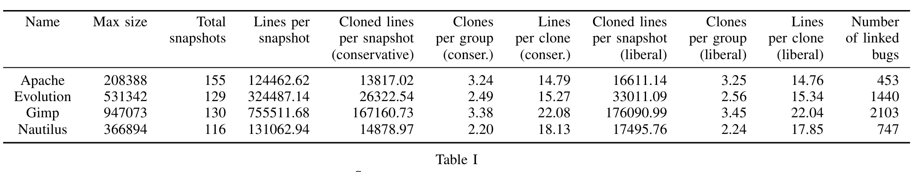
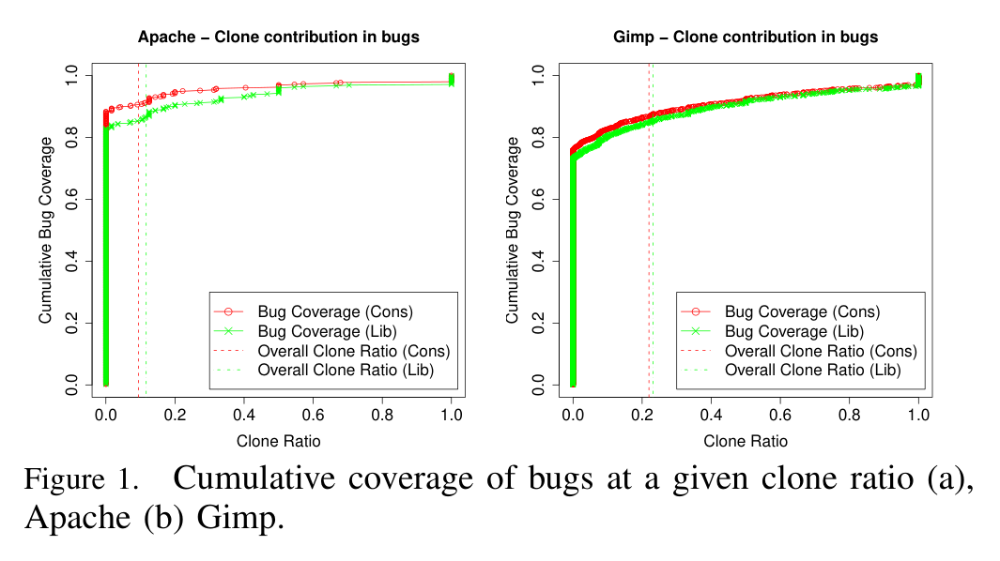
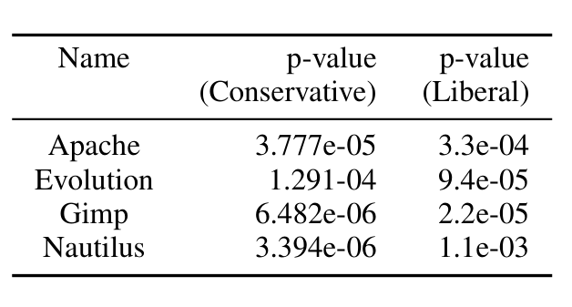

Table I  
SUMMARY OF STUDIED SYSTEMS

### RQ2 Do clones occur more often in buggy code than elsewhere?
We compare all the bugs’ clone ratio (proportion of cloned code, in all bugs, taken together) against the overall clone ratio in the project at the time that bug is fixed. So, if a bug is fixed at the r-th revision, and x% of the total code of the project, in the (r − 1)-th revision, was from clones, we ask if the buggy code in that revision has a bigger or smaller proportion of cloned code, compared to the overall project code. Since we do not have clone information for all possible revisions, we just project each line number back in the history to its staging snapshot and see whether a line is a clone or not. We then compare the staging snapshot’s clone ratio against all the bugs’ combined clone ratio that pertain to that staging snapshot. So, if a staging snapshot ss_b has n different bugs, which include a combined total m lines, of which c total lines are contributed by clones, we compare c/m against the clone ratio of ss_b. We consider two samples: each staging snapshot’s clone ratio and the corresponding coalesced clone ratio for all the bugs attributed to that snapshot. We then compare them visually using boxplots, and test if they are drawn from the same distribution (null hypothesis) using a paired Wilcoxon test. The null hypothesis is that both of these distributions should be the same. Note: in some cases, there may not be any bug projected to a particular snapshot and we ignore that snapshot as that is not a staging snapshot for any bug.

### RQ3 Are prolific clone groups more buggy than non-prolific clone groups?
We compare prolific clone groups’ bugginess with non-prolific clone groups’ bugginess. We define defect density as the fraction of cloned lines of that group that contribute to a bug. Assuming that bugs will proliferate as clone copies proliferate, we can assume that the defect density (buggy lines / total lines) will not change much. As there are many more clone groups which do not contribute any buggy code (since the total volume of buggy code mapped to a staging snapshot is a tiny fraction of overall project code, and thereby it is more likely that many clone groups include cloned lines that actually do not contribute to any buggy code), we only consider those clone groups which contribute at least one line in some buggy code. Also, by normalizing contributed buggy cloned lines for number of lines in that clone group we control for the disparity of total cloned lines contributed by clone groups of different size.

Figure 1. Cumulative coverage of bugs at a given clone ratio (a) Apache (b) Gimp.

Table II  
WILCOXON PAIRED TEST WITH ALTERNATIVE HYPOTHESIS SET TO "SNAPSHOT CLONE RATIO > BUG CLONE RATIO". ALL P-VALUES HAVE BEEN ADJUSTED USING THE BENJAMINI-HOCHBERG PROCEDURE.

## V. RESULTS

### A. Findings

#### RQ1 To what extent does cloned code contribute to bugs?
Figure 1 shows the cumulative bug coverage at different clone ratios. Due to space constraints, we only show Apache and Gimp, which are representative. The plot shows the fraction of bugs that have a clone ratio <= a given clone ratio. So, if b bugs have a clone ratio <= r, and there are total t bugs, then the plot shows b/t on the Y axis against r on the X axis. Alternatively, we can say that a 1 − b/t portion of bugs have higher clone ratio than r. As is evident from the plot, most of the bugs in both liberal and conservative clone detector settings contain hardly any cloned code. In fact, besides Gimp, 80% or more bugs in the other projects contain no cloned code at all. Even for Gimp, this threshold is close to 80%. The vertical lines depict the average clone ratio across all snapshots for different clone detector settings. So, e.g., we can say that for Gimp about 85% of bugs have lower clone ratio than the overall project clone ratio. This finding suggests that only a small number of bugs are attributable to cloning.