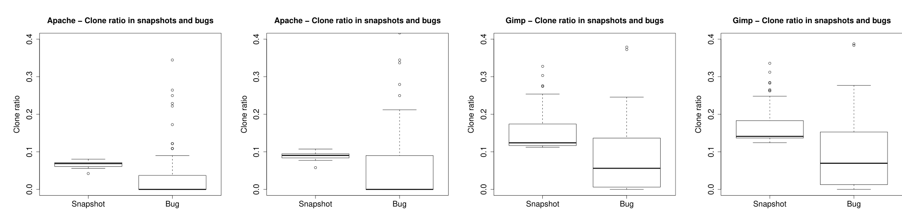
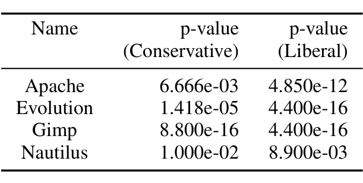

Figure 2. Clone ratio in bugs and snapshots for (a) Apache (Conservative) (b) Apache (Liberal) (c) Gimp (Conservative) (d) Gimp (Liberal).

Table III. Wilcoxon test with alternative hypothesis set to “defect density in non-prolific group > defect density in prolific group”. All p-values have been adjusted using the Benjamini-Hochberg procedure.

### RQ2 Do clones occur more often in buggy code than elsewhere?
Figure 2 shows boxplots of clone ratio in staging snapshots and corresponding clone ratio in bugs that were fixed in those staging snapshots. For all the projects, the boxplots clearly indicate a lower clone ratio in buggy code. For Apache with a conservative clone detector settings, the difference between the two boxplots is dramatic. Even with a liberal clone detector settings, the median of bug clone ratio is well below the median of snapshot clone ratio. This phenomenon is repeated in all the other projects. The non-parametric paired Wilcoxon rank sum test (with continuity correction) in all cases conclusively rejects the null hypothesis that the two samples (clone ratios in buggy code and clone ratios in the entire snapshot) are drawn from the same distribution. Corresponding p-values after Benjamini-Hochberg adjustment are presented in Table II. As we mentioned earlier, we also experimented with several other clone detector parameter settings. We found that as the similarity value is decreased and set to a very low value, such as 0.95 along with smaller token size, such as 30, clone ratio in bugs increases and the gap in median with the background distribution closes. However a Wilcoxon rank sum test shows that the overall clone ratio remains significantly lower than clone ratio in buggy code. These robust statistical results, across all 4 projects, suggest that clones are not really a major source of bugs.

### RQ3 Are prolific clone groups more buggy than non-prolific clone groups?
We compare defect density (number of buggy cloned lines per line of cloned code) in lines which are part of prolific clone groups against lines which are part of non-prolific clone groups. One might expect that by dint

of sheer size, prolific clone groups, with more code, and with more copying, will be associated with more defects than non-prolific clone groups. As the copies proliferate, the defects will replicate in the copies, and thus we can expect that the defect density will remain a constant. Figure 3 depicts our findings for Apache and Gimp. Rest of the projects are very similar and thereby we omitted them for brevity. Note that, the bug density may occasionally go above 1.0. This is because of clone group with contribution to buggy code of multiple bugs, thereby making numerator (number of buggy lines) greater than denominator (total number of lines in clone group). We find that in fact, prolific clone group has lower defect density than non-prolific clone group. Table III shows adjusted p-values (using Benjamini-Hochberg method) of Wilcoxon one-sided rank sum test with continuity correction. The alternative hypothesis is set to “defect density in non-prolific group is greater than defect density of prolific group”. All the p-values are highly significant; thus we reject null hypothesis. Clearly, there is a strong signal in all the projects, that more copies doesn’t at all mean more defects: in fact, the more copies, the lower the defect density.

We hasten to point out that others, for example [8], [9], [16], [10] have argued that the fear of clones is perhaps overstated. To our knowledge however, this is the first study to use data mined from version-control repositories and reported bug-fixes to provide quantitative evidence that clones are not necessarily to be feared. Also, to our knowledge, ours is the first study to indicate that larger clone groups are different from smaller clone groups with respect to defect attribution.

However, there could be another possible explanation of the observed phenomenon in RQ3. Prolific clone groups by definition have many members. A developer may fix the same bug in multiple copies, but do so in multiple commits; he may not identify every commit as a fix of a bug and/or present the bug id in the commit log. In such situations, our linking algorithm may miss some of the delayed fixes altogether. This will deflate bug density in prolific clone groups and poses a significant threat to RQ3 findings. However, Thummalapenta et al. [10] found that