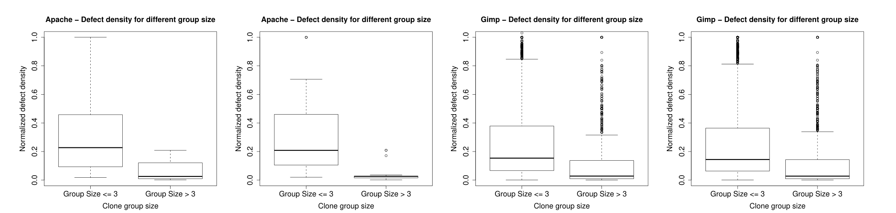

Figure 3. Defect density in clone groups of different sizes for different projects (a) Apache (Conservative) (b) Apache (Liberal) (c) Gimp (Conservative) (d) Gimp (Liberal).

Developers are able to remember location of clone copies and propagate changes consistently. In only a small percentage of cases, usually less than 16% they actually underwent late propagation.

We however want to stress that, the above mentioned threat to validity does not affect our findings in RQ1 and RQ2. In RQ1, we consider cloned code in buggy code, which is immune to above mentioned bug linking problem. Unless there is any systematic bias in bug linking which only links non cloned bugs while leaving out others, our result is robust and statistically sound. Even if only one copy is linked with a bug, we adjust both numerator and denominator when calculating clone ratio. In RQ2 we again work with clone ratio which is robust against the mentioned linking problem. We ignore bugs that are not linked and consider clone ratio in linked bugs. As long as there is no systematic bias in the linking process to leave out bugs that have cloned code in them, our results of RQ1 are also robust and statistically sound.

### B. Case Study

To gain further insights as to why clones appear less buggy, we did a case study of 20 good quality (has very few bugs) clones (3 from conservative and 2 from liberal for each of the 4 projects). In Listing 1, we show one very good quality (no buggy code) clone which comes from a group of 2 clone members. Both of the members come from the file “libnautilus-private/nautilus-file.c” in a snapshot taken on 20th November, 2000. This code tries to set a file’s owner and before doing that it checks to see whether the user has required privileges or whether the user is same as the current file owner. If everything goes well, then the code proceeds to change the owner of the file. A very similar role of a file manager is to change the group of the file. Another clone from the same group achieves that and it copies the above code exactly, but the sequence of helper method calls are different (e.g. instead of calling get_user_id_from_user_name, it calls get_group_id_from_group_name; instead of calling nautilus_file_can_set_owner, it calls nautilus_file_can_set_group). This file has 4552 lines of code in that snapshot, of which 2779 lines were declared as cloned code by DECKARD. Also, our linked bug data shows that a total of 58 bugs were fixed during the project lifetime and a total of 798 lines were modified during bug fixing, but not a single bug has any cloned code in them.

Listing 1. Example Clone in Nautilus

```c
void nautilus_file_set_owner(NautilusFile *file,
                             const char *user_name_or_id,
                             NautilusFileOperationCallback callback,
                             gpointer callback_data)
{
    uid_t new_id;
    if (!nautilus_file_can_set_owner(file)) {
        nautilus_file_changed(file);
        (*callback)(file, GNOME_VFS_ERROR_ACCESS_DENIED, callback_data);
        return;
    }
    if (!get_user_id_from_user_name(user_name_or_id, &new_id) &&
        !get_id_from_digit_string(user_name_or_id, &new_id)) {
        nautilus_file_changed(file);
        (*callback)(file, GNOME_VFS_ERROR_BAD_PARAMETERS, callback_data);
        return;
    }
    if (new_id == file->details->info->uid) {
        (*callback)(file, GNOME_VFS_OK, callback_data);
        return;
    }
    set_owner_and_group(file,
                        new_id,
                        file->details->info->gid,
                        callback, callback_data);
}
```

Listing 2. Example Clone in Gimp

```c
Tool* tools_new_color_balance()
{
    Tool *tool;
    ColorBalance *private;
    if (!color_balance_options)
        color_balance_options = tools_register_no_options
            (COLOR_BALANCE, "Color Balance Options");
    tool = (Tool *) g_malloc(sizeof(Tool));
    private = (ColorBalance *) g_malloc(sizeof(ColorBalance));
    tool->type = COLOR_BALANCE;
    tool->state = INACTIVE;
    tool->scroll_lock = 1; /* Disallow scrolling */
    tool->private = (void *) private;
    tool->auto_snap_to = TRUE;
    tool->button_press_func = color_balance_button_press;
    tool->button_release_func = color_balance_button_release;
    tool->motion_func = color_balance_motion;
    tool->arrow_keys_func = standard_arrow_keys_func;
    tool->cursor_update_func = color_balance_cursor_update;
    tool->control_func = color_balance_control;
    return tool;
}
```

In Listing 2, we show another clone from one of the largest clone groups, with 27 members totaling 775 lines of cloned code. All the clones come from different files, so this group spans 27 different files. Interestingly, all