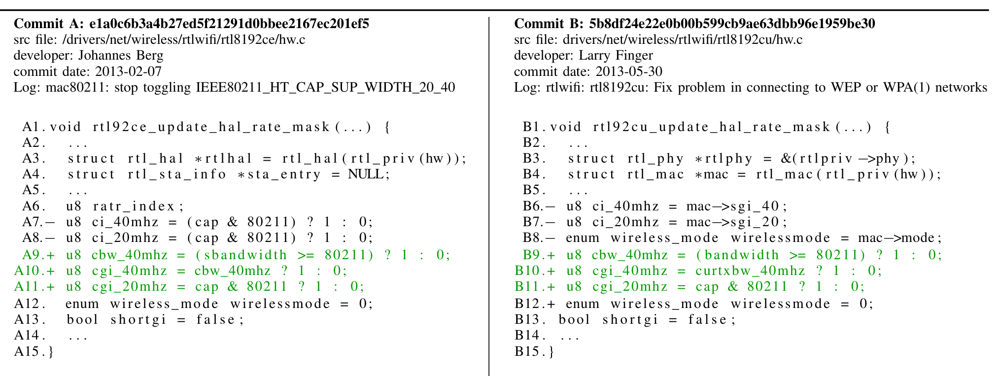
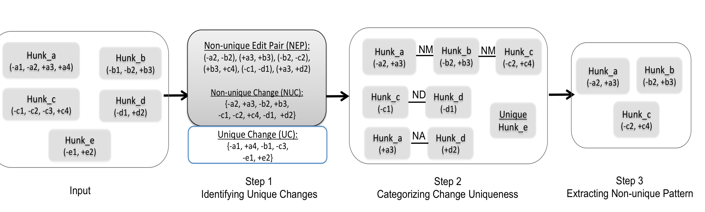
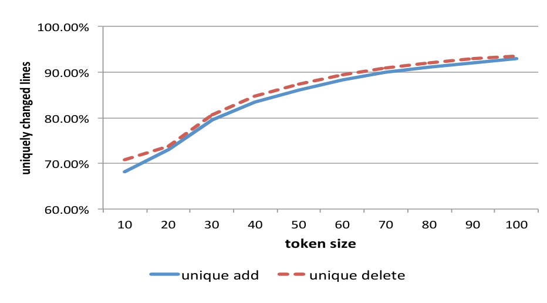
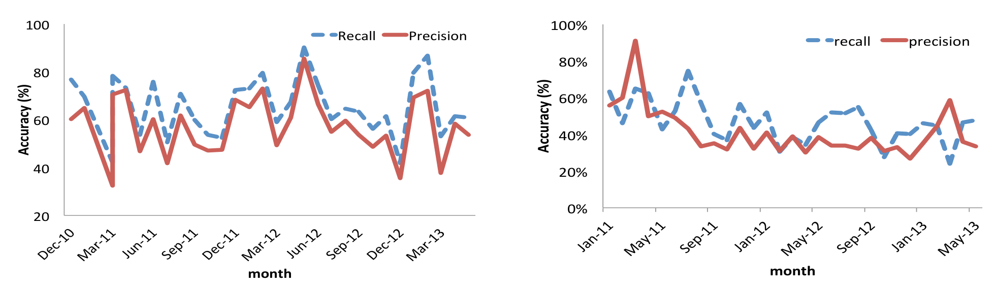
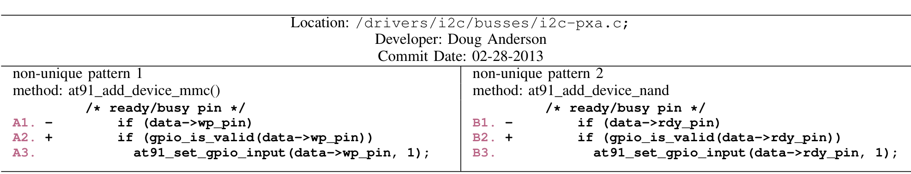

## The Uniqueness of Changes: Characteristics and Applications

Baishakhi Ray · Meiyappan Nagappan · Christian Bird, Nachiappan Nagappan, Thomas Zimmermann  
bairay@ucdavis.edu · mei@se.rit.edu · {cbird, nachin, tzimmer}@microsoft.com  
Univ. of California, Davis · Rochester Institute of Technology · Microsoft Research, Redmond

## Abstract

Abstract—Changes in software development come in many forms. Some changes are frequent, idiomatic, or repetitive (e.g. adding checks for nulls or logging important values) while others are unique. We hypothesize that unique changes are different from the more common similar (or non-unique) changes in important ways; they may require more expertise or represent code that is more complex or prone to mistakes. As such, these unique changes are worthy of study. In this paper, we present a definition of unique changes and provide a method for identifying them in software project history. Based on the results of applying our technique on the Linux kernel and two large projects at Microsoft, we present an empirical study of unique changes. We explore how prevalent unique changes are and investigate where they occur along the architecture of the project. We further investigate developers’ contribution towards uniqueness of changes. We also describe potential applications of leveraging the uniqueness of change and implement two of those applications, evaluating the risk of changes based on uniqueness and providing change recommendations for non-unique changes.

## I. INTRODUCTION

Creating software is a lot like constructing buildings. When we make changes to buildings, some changes are more repetitive than others. For example, a typical kitchen remodeling project might introduce the same marble tops and same colors found in many kitchens, while keeping other elements such as table lamps and chairs distinct. Note that, a "typical change" may also evolve over time: the 1950s saw colorful kitchens (sometimes pink) while in the 1970s colors got more serious, and the 1980s introduced more bright colors. Appliances are another example of a typical renovation: they often get replaced with the latest models in a remodeling project. However not all changes to buildings are similar or repetitive. A billionaire might have expensive taste that requires many unique changes to a kitchen.

The concept of uniqueness is not new to software engineering: Gabel and Su [8] and Hindle et al. [12] showed that source code is in general repetitive and predictable in nature. In this paper, we wanted to see whether the same theory can be applied for software changes as well. In particular, we check when developers modify an existing piece of code, whether they change it in a unique way or they follow some repetitive (or non-unique) pattern. To do that, we first introduce a methodology to identify unique/non-unique changes to a software based on lexical and syntactic matching of changes. Then, using two Microsoft projects and the Linux Kernel 3.0, we ask the following questions:

- RQ1. What is the extent of unique changes? On average, 75%, 83%, and 87% changes are unique in the two Microsoft projects and Linux respectively.

> - RQ2. Who introduces unique changes? In general, all developers commit unique changes; on average, 57% to 94% of the total contribution of a developer is unique in Microsoft and Linux. Each developer has her own set of change templates. While introducing non-unique changes, developers often reuse these templates.
> - RQ3. Where do unique changes take place? Certain subsystems of a project are more prone to unique changes. For example, in the module fs/jbd, the Linux journal base file-system module, 97% changes are unique, while in the module sound/drivers in Linux, 94% of total changes are non-unique. Also, developers introduce non-unique changes to the same file—66% of the non-unique changes take place in the same file.
>
> Knowing which changes are unique and which changes are non-unique has several possible applications in software engineering:
>
> - Risk analysis: One would expect that changes that are unique are more error prone than changes that developers repeatedly make (non-unique changes). We provide empirical evidence to support this statement in our paper.
> - Code reviews: If non-unique changes are recognized in a code review, then the developers who introduced the same change earlier can be involved in the code review process. Conversely, unique changes could be highlighted to guarantee that they are carefully reviewed.
> - Recommendation systems: non-unique changes can be used as input for recommendation systems: for example, to recommend how a line would typically be changed or after some change has been made, recommend other non-unique changes that are typically made with the initial change based on past co-occurrence (change completion).
> - Automated program repair: We expect that non-unique changes in bug fixes are better candidates for automated program repair operations than unique changes. Nguyen et al. [28] provided initial empirical evidence for this hypothesis. They found that non-unique bug fixes are usually smaller changes and therefore automated patching tools could start with small changes and gradually compose them.
>
> To demonstrate the usefulness of change uniqueness, we implement a risk analyzer and two recommendation systems. Based on bug history, our risk analyzer can evaluate how risky a unique/non-unique change is. An evaluation on our data shows that non-unique changes are in general less risky. By

---

Learning from past non-unique changes, we also implement two types of recommendation systems: one for suggesting relevant changes and other for change completion. On average, our recommendation systems can suggest changes with 52.11% to 59.91% precision, and recommend change completion correctly with 38.48% to 42.95% precision.

We make the following contributions in this paper:
- An approach to identify and measure the uniqueness of changes to a software (Section II).
- Characterization of unique vs. non-unique changes along developer and spatial dimensions of an evolving project (Section III).
- Provide evidence that unique changes can be more risky than non-unique changes by implementing a risk analyzer (Section IV-A).
- Implement and evaluate two types of recommendation systems based on change suggestion and change completion (Section IV-B).

## II. METHODOLOGY

This section describes the methodology we used to study the uniqueness of changes. First, we identify the program statements in a project that are non-uniquely changed in its development history. The rest of the program statements in the development history of the project are then considered as unique changes.

Consider the example in Table I. Developer Johannes Berg made some modification to Linux source file rtl8192ce/hw.c on 7th February, 2013 as shown in Commit A. The added and deleted lines have prefixes '+' and '-' symbols respectively. Three months later, developer Larry Finger made similar modifications to source file rtl8192cu/hw.c in Commit B. The green lines A9 to A11 and B9 to B11 show the non-uniquely added code in the corresponding commits. The rest of the changes are considered as unique changes—A7, A8 in commit A and B6 to B8, and B12 in commit B.

In the rest of this section, we first describe our data collection process in Section II-A. Then we talk about our methodology to categorize unique and non-unique changes. An overview of the methodology is shown in Figure 1. This involves three steps: Given a set of changes as input, Step 1 identifies program statements that are added or deleted non-uniquely. The rest of the changes are marked as unique (see Section II-B). Step 2 further categorizes non-unique changes to non-unique addition, deletion, and modification (see Section II-C). Finally, Step 3 extracts non-unique change patterns that repeat multiple times during the project’s evolution (see Section II-D).

### A. Data Collection

First step is to extract all the source code changes from the version control repository of a project. For each source file commit in the project evolution, we retrieve the associated code changes—deleted lines corresponding to the old version and added lines corresponding to the new version. We also extract some change-specific meta-information including author, commit message, and commit date.

For the Microsoft projects, we use CODEMINE [5]—a framework for collecting and analyzing software development history. In particular, we retrieve all the committed versions of each source file and their associated change information. For each file version, a patch is computed by comparing it with its previous version using the widely known gnu-diff utility. We represent the patches in unified diff format with 5 lines of unchanged code as context and also ignore white spaces while comparing the two versions.

Linux uses git as its version control system. We use the command `git log -w --unified=5` to retrieve all the committed patches along with change-specific meta-information. The option `--unified=5` outputs the associated commit patch in a unified diff format with 5 lines of unchanged context, as shown in Table I. Option `-w` ignores white spaces.

### B. Identifying Unique Changes

In this step, we identify the program statements in a project that are uniquely/non-uniquely changed, by analyzing all the changed lines retrieved from previous step. This takes place in two steps:

1. Identify change hunks: Input to this step is a set of program patches (which can be defined as the code that is committed in a single commit to the source code repository). Each patch typically contains multiple change regions. Each such change region with a contiguous list of deleted and added lines is called a change hunk. Thus, a hunk is defined as a list of program statements deleted or added contiguously, separated by at least one line of unchanged context.

   In Figure 1, line A7 to A11 of Commit A is a hunk. A1 to A6 and A12 to A15 are unchanged context. We identify all the hunks that are committed to the source code repository within the studied period of time, by parsing the committed patches.

2. Identify unique & non-unique changes: In this step, we first identify pairs of non-uniquely edited lines across all the hunks of a project. An edited line r of hunk H_i is considered to be non-unique, if there is at least one program statement t in another hunk H_j such that r and t have similar content (identical lexical and syntactic content) and undergo identical edit operation. For example, we consider edits "+ a = a * b" and "+ x = y * z" are non-unique since they are syntactically equivalent i.e. both represent similar multiplication operations, and also have identical edit operation (both are added statements). However, edits "- a = a * b" and "+ x = y * z" are unique even though they have similar content, because they are changed in a different manner—former statement is deleted and the latter one is added.

   Pair (r, t) of hunk H_i and H_j thus forms a non-unique edit pair (NEP_{ij}) between the hunks H_i and H_j. All such non-unique edit pairs are then aggregated by pair-wise comparison of all the studied hunks and form a global set of NEP (see Equation 1)

   NEP_{ij} = {(r, t) | r ∈ H_i ∧ t ∈ H_j ∧ clone(r, t)} (1)

   NEP = ⋃_{i ≠ j} NEP_{ij} (2)

---

TABLE I: Example of Unique and non-unique changes adapted from Linux. The deleted and added statements start with ‘–’ and ‘+’ respectively; non-unique changes are marked in green. Lines A9, A10, and A11 are non-uniquely added w.r.t. B9, B10, B11 respectively. However, A7 and A8 are unique deletions since it does not resemble any of the corresponding deleted lines B6, B7 or B8.

> **Image description:** The figure displays two real Linux commits side-by-side: Commit A (hash e1a0c6b..., file /drivers/net/wireless/rtlwifi/rtl8192ce/hw.c, Johannes Berg, 2013-02-07) on the left and Commit B (hash 5b8df24..., file drivers/net/wireless/rtlwifi/rtl8192cu/hw.c, Larry Finger, 2013-05-30) on the right. Each commit shows numbered context lines (A1–A15, B1–B15) with deletions prefixed by '−' and additions by '+'. Three added lines in each commit (A9–A11 and B9–B11) are highlighted in green to indicate they are non‑uniquely added across the two hunks: all three are u8 assignments using a conditional expression (same syntactic form, different identifiers). Other edits (for example A7–A8 and B6–B8/B12) are not marked and are treated as unique, so the image illustrates a repeated non‑unique change pattern occurring in different files and by different developers months apart.

Non-unique Changes (NUC) are a set of edited lines that are present in NEP. The rest of the changes in a project are unique changes. Thus, if C represents all the changed lines in a project, Unique Change (UC) is a set of edited lines that are present in C but not included in NUC, i.e., UC = C − NUC.

In Equation 1, similarity (or non-uniqueness) between the edited statements is determined by a function clone. Although there is no precise definition of clone in the literature, it mostly relies on the computation of individual clone detectors. The most common one is textual similarity of two edits. It can also be modeled as n-gram similarity [12], AST-based similarity [28], [32], etc. In this work, we consider two edits as non-unique, if their contents have identical lexical and syntactic content [16] and they are also edited similarly (either both are added or both are deleted).

Step 1 of Figure 1 summarizes the above stages. It takes five hunks as input. Edits -a2 and +a3 of Hunk_a are non-unique to -b2 and +b3 of Hunk_b. Hence, NEP_ab = {(-a2, -b2), (+a3, +b3)}. Likewise, NEP_bc = {(-b2, -c2), (+b3, +c4)}, NEP_cd = {(-c1, -d1)}, and NEP_ad = {(+a3, +d2)}. Thus, Non-unique Change set (NUC) = {-a2, +a3, -b2, +b3, -c2, +c4, -d1, +d2}. The rest of the changes of the input hunks are unique (UC) = {-a1, +a4, -b1, -c3, -e1, +e2}.

Implementation: To detect the NEP, we adapt Repertoire [31], a lexical based change analysis tool that identifies non-unique changes. The basic steps are as follows:

1. Repertoire pre-processes the hunks to eliminate diff-specific meta-information such as edit operations and commit dates. The meta-information is stored in a database for future use.
2. Using CCFinderX [16], a lexical token based clone detection technique, Repertoire determines non-unique code content (clone) between the processed hunks. The output of CCFinderX is a set of line pairs having identical syntax. CCFinderX takes a token threshold as input, that ensures a minimum number of contiguous tokens that has to be non-unique between the cloned regions. In our experiment, we set this token threshold to 50, based on experimental analysis as discussed in RQ1 in Section III. This ensures at least 50 contiguous tokens (around 7–8 lines) are non-unique in the detected cloned region.
3. For each identified cloned pair, Repertoire matches their edit operations. The clone pairs without identical edit operations are eliminated. Repertoire also disregards the clone pairs that has unmodified contexts. The final output is NEP — a set of edit pairs with similar edit content and edit operations. Note that, since CCFinderX outputs clones that have at least 7–8 lines of contiguous non-uniqueness, Repertoire marks only those changes as a non-unique edit pair that either belong to a larger non-unique change, or a small non-unique change that takes place in between two large unchanged contexts, with at least 7–8 lines of similarity. Such a large threshold helps us to focus only on significant non-unique changes and thus avoids unintended clones.

In Table I, Repertoire identifies (A9, B9), (A10, B10), and (A11, B11) as non-uniquely added. The other edits (A7 and A8 in Commit A and B6 to B8 and B12 in Commit B) are marked as unique changes.

### C. Categorizing Change Uniqueness

In this step, we further categorize the non-unique changes to non-unique addition, deletion, and modification. Since it is difficult to establish one-to-one correspondence between an added and deleted line, we focus on the code region i.e. hunk instead.

ND: non-unique Deletion. Between hunks (h_i, h_j), if there exists a non-unique edit pair (of 50 tokens in our implementation) where program statements are deleted (possibly with some unchanged context of program statements) in both h_i and h_j non-uniquely, but there is no addition of program statements. For example between Hunk_c and Hunk_d in Figure 1, only c1 is deleted non-uniquely to d1. Thus, Hunk_c and Hunk_d is categorized as ND. ND indicates that the code region corresponding to the hunk pair was non-unique before

---

> **Image description:** A three-step schematic showing how change hunks are analyzed to find non-unique edits and patterns. Input (left) lists five example hunks (Hunk_a..Hunk_e) with deleted (‑) and added (+) lines (e.g. Hunk_a: -a1, -a2, +a3, +a4). Step 1 (center) detects non-unique edit pairs (NEP) such as (-a2,-b2) and (+a3,+b3), aggregates them into the Non-Unique Change set (NUC = {-a2,+a3,-b2,+b3,-c2,+c4,-d1,+d2}) and labels the remaining edits as Unique Change (UC = {-a1,+a4,-b1,-c3,-e1,+e2}). Step 2 (right center) classifies hunk relationships as non-unique modification (NM, e.g. Hunk_a—Hunk_b and Hunk_b—Hunk_c where both deletions and additions match), non-unique deletion (ND, e.g. Hunk_c—Hunk_d), and non-unique addition (NA, e.g. Hunk_a—Hunk_d), while marking wholly unique hunks (Hunk_e). Step 3 (far right) extracts repeated non-unique patterns by grouping hunks that share the same signature (example pattern: Hunk_a (-a2,+a3), Hunk_b (-b2,+b3), Hunk_c (-c2,+c4)); in the paper this grouping is implemented by finding maximal cliques over NEP pairs using lexical clone detection (CCFinderX) with a contiguous-token threshold to focus on substantial repetitions.

Fig. 1: Overview of Methodology. Hunk_a, Hunk_b, Hunk_c, Hunk_d, and Hunk_e are initial input. The deleted and added lines in each of the hunks are represented by ‘–’ and ‘+’. Here we assume that, between Hunk_a and Hunk_b, line a2 is deleted similarly to b2, and a3 is added similarly to b3. Between Hunk_b and Hunk_c, line b2 is deleted similarly to c2, and b3 is added similarly to c4. Likewise, c1 and d1 are similarly deleted, and a3 and d2 are similarly added.

the change. However, after the modification, the non-unique lines were deleted, and the region became unique with respect to each other, since unique program statements were added.

NA: non-unique Addition. Similar to ND, but there is non-unique addition of program statements, but no non-unique deletion. For example, hunk pair (Hunk_a, Hunk_d) in Figure 1 shows NA non-uniqueness since only a3 is added non-uniquely to Hunk_a and d2 to Hunk_d. NA indicates two unique code regions became non-unique after the modifications.

NM: non-unique Modification. Since a modification can be represented as a deletion in the old version and an addition in the new version, NM between two hunks indicates at least one non-unique edit pair between the two hunks is added and at least one non-unique edit pair is deleted. Consider the hunk pair (Hunk_a, Hunk_b) in Figure 1: a2 and b2 are non-unique deletions while a3 and b3 are non-unique additions. Thus, (Hunk_a, Hunk_b) belongs to NM. Likewise, (Hunk_b, Hunk_c) is NM. NM signifies the corresponding code region of the hunk pair was non-unique before, and even after the modification they remain non-unique.

A hunk is Unique, if all of its changes belong to the unique changed set (UC), i.e., none of its edits resemble other edits across all the studied hunks. In Figure 1, Hunk_e is unique since its edits -e1, +e2 are not similar to any of the changes.

Such fine grained categorization of hunk uniqueness shows how uniquely similar code evolve over time, similar to tracking clone genealogy [19]. For example, the code regions corresponding to Commit A and Commit B in Figure 1 were unique initially, but after the addition they become non-unique (NA). In this case, with time unique code becomes non-unique.

### D. Extracting Non-unique Patterns

As shown in Figure 1, program statements are often changed non-uniquely. Some of these non-unique changes always occur together to form a non-unique pattern. For example, all the three edits A9, A10, A11 of Commit A in Figure 1 repeat in Commit B as B9, B10, B11; thus showing a repeated change pattern. In this step, we extract such non-unique patterns from the non-unique hunks. Later, to build recommendation system in Section IV-B, we use these patterns as common change template.

If a list of edited lines E_i of hunk h_i is non-unique to a list of edits E_j of hunk h_j, a Non-unique Pattern (NP_ij) exists between hunks h_i and h_j. E_i and E_j represent the signature of NP_ij corresponding to hunks h_i and h_j respectively. For example, in Step 3 of Figure 1, edits [-a2, +a3] of Hunk_a are similar to [-b2, +b3] of Hunk_b; thus, they form a non-unique pattern NP_ab = {[-a2, +a3], [-b2, +b3]}, where [-a2, +a3] is the signature of NP_ab for Hunk_a, and [-b2, +b3] is the signature of NP_ab for Hunk_b.

A change pattern may be repeated across multiple hunks. If hunk h_i shares a non-unique pattern with hunk h_j and hunk h_k with identical signature, they are merged to form a single non-unique pattern NP_ijk. For example, NP_abc = {[-a2, +a3], [-b2, +b3], [-c2, +c4]} is a non-unique pattern extracted from Hunk_a, Hunk_b, Hunk_c, as shown in Step 3 of Figure 1.

This reduces to a maximal clique problem for a graph formed by non-unique hunk pairs. We adapted Carraghan et al.'s algorithm of maximal clique solving problem [2] to detect the non-unique patterns.

## III. STUDY OF CHARACTERISTICS

### Study Subjects

In this study, we analyzed uniqueness of changes in both open and closed source software development. We studied the evolution of proprietary projects A and B from Microsoft, and a large scale open source software, Linux 3.0 (see Table II). Project A and Linux are written in C, and Project B is written in C++. We analyze the changes made in the source files (.c, .cpp etc.), ignoring the interface declarations in the header files (.h), documentation etc.

First, from the version control system of a project we retrieve all the file commits that are made within the studied period (2011-05-19 to 2013-08-29). Next, we classify the changes associated with the commits into two categories: unique and non-unique. In total, we studied more than 17 million lines of changes in all the three projects in their two plus years of parallel evolution history. Around six thousand developers contributed those changes.

Prior to analyzing properties of unique and non-unique changes, we begin with a straightforward question that checks the proportion of unique and non-unique changes in a project.

---

## TABLE II: Study Subject

### Project A
- Total number of changed files: 2,485
- Number of File Commits: 6,264
- Number of Changed Lines: 364,737
- Number of Hunks: 50,102
- Development Period: 2010-12-03 to 2013-06-03
- Number of Developers: 289

### Project B
- Total number of changed files: 56,803
- Number of File Commits: 227,844
- Number of Changed Lines: 12,864,319
- Number of Hunks: 1,854,666
- Development Period: 2010-11-30 to 2013-06-11
- Number of Developers: 1,338

### Linux 3.0
- Total number of changed files: 17,695
- Number of File Commits: 166,749
- Number of Changed Lines: 4,623,333
- Number of Hunks: 798,399
- Development Period: 2011-05-19 to 2013-08-29
- Number of Developers: 4,216

> **Image description:** A line chart plotting the percentage of uniquely changed lines in Linux as the clone detection token threshold is increased from 10 to 100. Two series are shown: a solid blue line for uniquely added lines and a dashed red line for uniquely deleted lines; both rise monotonically (roughly from the high 60s–low 70s percent at token size 10, to about 80% near token 30, ≈85–88% around token 50, and above 90% near token 100). The dashed (delete) curve stays slightly above the added curve across most thresholds. The figure supports the paper’s point that raising the minimum contiguous-token requirement causes more changes to be classified as unique (motivating the authors’ choice of a mid-range threshold of 50).

Fig. 2: Extent of unique changes over different token size in Linux

### RQ1. What is the extent of unique changes?

Figure 2 shows the extent of uniquely added and deleted lines with a varying token threshold (10 to 100), in Linux. Note that a threshold represents minimum number of contiguous tokens that need to be similar between two cloned regions. At threshold 10 (around 1–2 lines), 70.81% of changed lines is unique, while at threshold 100 (around 16–20 lines), 93.61% changed lines are unique. The median and average of uniquely changed lines are 88.38% and 85.61% respectively, which is also achieved at threshold 50. Thus, uniqueness increases with the increase of token threshold for both added and deleted lines.

Since source code in general lacks uniqueness [8], non-unique changes detected at a very low threshold like 10 may simply detect changes caused by program construct, for example an addition of a for loop. In contrast, if the threshold size is set to a very high value, we might ignore some important non-unique changes that developers introduce in purpose. This leads us to choose a middle ground—threshold 50 for the rest of our experiment. A non-unique change at threshold 50 means that there are at least 7 to 8 non-unique lines. These 7–8 lines can be either a large non-unique change or a small non-unique change with unchanged context above and below the change also being non-unique. Table III shows the extent of uniquely changed lines for all the studied projects at token threshold 50. Project B shows maximum non-unique changes (three million lines) over its entire evolution period.

## TABLE III: Extent of Uniquely Changed Lines (with a token threshold of 50)

Changed Lines (LOC)

| Project | Total | Unique | Non-Unique |
|---|---:|---:|---:|
| Project A | 364,737 | 82.77% | 17.44% |
| Project B | 12,864,319 | 74.82% | 25.18% |
| Linux | 4,623,333 | 87.41% | 12.59% |

## TABLE IV: Distribution of Non-Uniquely Changed Hunks. Note that these categories are not disjoint, because a hunk can share only non-unique addition with one hunk, while sharing non-unique deletion or modification with another.

|  | non-unique addition | non-unique deletion | non-unique modification |
|---|---:|---:|---:|
| Project A | 82.25% | 24.31% | 24.20% |
| Project B | 71.54% | 25.75% | 18.71% |
| Linux | 34.94% | 30.98% | 34.08% |

Now that we have seen the extent of non-unique changed lines in a project — 12% to 25% — we would like to shed light on their evolutionary pattern, i.e. whether they are added, deleted, or modified non-uniquely. Since it is difficult to identify mapping between individual added and deleted lines, we focus on added and deleted regions (i.e. hunks), as discussed in Section II-C. Table IV shows the distribution of hunk uniqueness across projects. In projects A and B, non-unique addition dominates significantly (82% and 71%), while non-unique deletion and modification share similar proportion. In Linux, all the three categories are in the same range (30% to 34%).

Finally, we check how many non-unique patterns are formed from the observed non-unique changes (see Section II-D). The following table shows the result. Three million non-unique changed lines in Microsoft codebase come from only 300K distinct non-unique patterns. In Linux, 582K non-unique changed lines come from 142K patterns. On average, these patterns occur 3.4 and 3.3 times in Microsoft projects and Linux respectively. They are often short-lived—average lifetime (last commit date − first commit date) is 63 and 67 days in Microsoft projects and Linux respectively. These results indicate developers often introduce non-unique change patterns, use them few times at quick succession, and then stop using them.

| Project | non-unique change (KLOC) | patterns | Occurrence | Lifetime |
|---|---:|---:|---:|---:|
| Microsoft (A+B) | 3,278 | 324,285 | 3.4 | 63.04 |
| Linux | 582 | 142,633 | 3.3 | 67.79 |

> Result 1: Unique changes are more common than non-unique changes. Non-unique changes form distinct patterns that often repeat multiple times in the code base within a short span of time.

Since the extent of non-unique changes is non-trivial, we wonder who commits such non-unique changes. Since developers usually have individual coding style [29], [14], it may be possible that some developers introduce more non-unique changes than others. It is also important to know whose changes they borrow. Especially, if we find that developers

---

> **Image description:** Two side-by-side plots compare how non-unique changes are distributed across developers and how many developers share the same non-unique change patterns. Left: a density curve (x = percent of a developer’s changes that are non-unique, y = percent of developers) shows Linux (solid blue) strongly concentrated at very low non-unique rates (the curve peaks near 10% with about 80% of developers there), while the combined Microsoft projects (dashed red) are flatter and shifted toward higher non-unique percentages (notable mass around 30–50%). Right: developer diversity of non-unique patterns (x = number of developers using the same pattern, y = frequency in thousands) shows an extremely steep drop — most patterns are owned by a single developer (105,208 in Linux and 278,509 in Projects A+B), and only about 0.39% (Linux) and 0.55% (Microsoft) of patterns are used by more than four developers. Together the plots support the paper’s finding that developers typically reuse their own change templates and only a small fraction of non-unique patterns are shared widely across developers.

(a) Frequency of developers performing non-unique changes  (b) Developer diversity of non-unique patterns  
Fig. 3: Characteristics of non-unique changes along the dimension of developers.

### RQ2. Who introduces unique changes?

First, we measure the extent of non-unique changes over total changes that a developer has committed over time. Figure 3(a) shows the frequency distribution of the proportion of non-unique changes per developer. Almost all developers commit non-unique changes, although some commit more than others. For example, we found 10 and 20 developers in Linux and Microsoft respectively who committed only non-unique changes. A closer look reveals that these developers' contributions in respective projects are considerably low—only 1 to 16 lines of changes during the studied period. On average, 42.67% of changes of a Microsoft developer are non-unique, and Linux developers commit more unique changes—only 5.83% of a developer’s commits are non-unique in Linux.

We further check whose changes developers borrow to introduce non-uniqueness. We measure that by computing developer diversity—the number of developers using a non-unique pattern. Figure 3(b) shows the frequency distribution of developer diversity. A large number of patterns (105,208 and 278,509 in Linux and Microsoft projects) are actually owned by a single developer. The curve falls sharply as developer diversity increases. Only 0.39% and 0.55% of total non-unique patterns are introduced by more than 4 developers in the Microsoft projects and Linux respectively. Such less diverse changes suggest that developers have their own set of patterns that they repeatedly use. A highly diverse change pattern often suggests a system-wide pervasive change. For example, we find a change pattern with developer diversity of 10 in Linux that modified an existing logging feature. In another instance, multiple developers repeatedly change identifier type proc_inode to type proc_ns and the associated code over a long period of time.

> Result 2: Developers have their own set of change patterns that they use repeatedly.

Since we have seen that developers repeatedly use non-unique patterns, we wonder where they are used. Knowing the

answer not only serves researchers' curiosity, it has several advantages. For example, if two software components often change in non-unique manner, the developers of one component may help in reviewing the code of the other. Also, the same group of developers may be assigned to maintain two such closely related modules. Thus, we ask the following question:

### RQ3. Where do unique changes take place?

First we measure extent of non-unique changes per file. For each file, we take the ratio of unique and total changes across all the commits. Thus, if a file f is committed n times within the studied period, ratio of unique changes for file f = (Σ_i uniquely changed lines_i) / (Σ_i total changed lines_i).

Table V shows top 10 sub-directories in Linux (up to 2 levels from the root of the source code) that contain most unique and non-unique changes. While the journaling block-device module fs/jbd contains 97.52% of unique changes, the sound driver module sound/drivers has 94.34% non-unique changes. Non-unique changes are mostly restricted within the same file. In 23.67% cases, non-unique changes are introduced across different commits of the same file, while in 42.24% cases even within the same commit (but across hunks). The rest 34.07% of non-unique changes are made across different files.

Also, some files often change in a non-unique fashion. Table VI shows top 5 file pairs in Linux sharing non-unique changes. Note that, in most cases name of the file pairs are also very similar and relates to similar functionality. This shows that similar software artifacts often change non-uniquely.

TABLE V: Top 10 development directories containing unique and non-unique changes

> **Image description:** A two-column ranked list of Linux source subdirectories showing the ten directories with the highest proportions of unique changes (left) and the ten with the highest proportions of non-unique changes (right). On the unique side, fs/jbd/ tops the list with 97.52% of its changed lines marked unique, followed by drivers/video/ (94.25%) and fs/ext4/ (93.79%). On the non-unique side, sound/drivers/ is highest at 94.34%, then lib/ (92.86%) and net/netlink/ (91.67%). These figures illustrate the paper’s finding that uniqueness is concentrated in particular modules (e.g., journaling fs is highly unique) while other areas (e.g., sound drivers) exhibit high repetition of similar changes.

---

### TABLE VI: Top 5 file couplings with non-unique changes

File2

> **Image description:** The table ranks the top five file pairs in Linux that share the largest number of non-uniquely changed lines, reporting each pair’s path and the total non-uniquely changed lines. The top pair is /drivers/staging/csr/csr_wifi_router_ctrl_serialize.c paired with /drivers/staging/csr/csr_wifi_sme_serialize.c (20,445 non-uniquely changed lines), followed by /drivers/media/common/siano/smsdvb-debugfs.c with /drivers/media/common/siano/smsdvb.c (4,200), and /drivers/net/wireless/rtlwifi/rtl8192c/phy_common.c with /drivers/net/wireless/rtlwifi/rtl8192de/phy.c (3,087). A second entry for the CSR serialize files appears with 2,685 lines, and the fifth pair is two nouveau GPU graph files (/drivers/gpu/drm/nouveau/core/engine/graph/ctxnvc0.c and .../ctxnve0.c) with 2,648 lines. All top pairs reside under drivers/ and have similar filenames, indicating closely related components that undergo many repeated, co-occurring edits.

### Result 3: Unique & non-unique changes are localized in certain modules.

## IV. APPLICATIONS

Distinguishing non-unique changes from unique ones can facilitate many software engineering applications. We demonstrate this concretely by implementing a risk analysis system (Section IV-A) and two recommendation systems (Section IV-B).

### A. Risk Analysis

There has been decades of research on software risk analysis [10]. Using sophisticated statistical or machine learning models [30], [27], the risk of a software component is predicted primarily based on its evolutionary history. Different types of software metrics including product metrics (lines of code, source code complexity), process metrics (pre-release bugs, software churn), and social metrics (number of developers) are typically used for risk prediction models [30]. Nagappan et al. found that changed code is also a good indicator of bug-proneness [27]. However, not all changes are necessarily buggy. In this section, we show that categorizing changes as unique and non-unique can further facilitate the risk assessment of a file commit.

Methodology: Our risk analyzer works on the assumption that if a bug is introduced to the codebase, the bug will be fixed within a few months. For example, if a commit c introduces a bug to file f, soon there will be a bug-fix commit c_b to the file (within t months from the commit date of c). Here, we build a prediction model that assesses c’s risk of introducing a bug. We start with analyzing the evolution history of file f. Figure 4 illustrates how the risk analyzer works.

> **Image description:** A horizontal timeline for a single file f shows a sequence of commits labeled c1..c6 (triangles for regular commits) and red stars for bug-fix commits (c3, c4, c6). A vertical dashed line marks the Release separating the pre-release period (c1–c5) from the post-release period (after Release); c3 and c4 are pre-release fixes (bug1, bug2) while c6 is a post-release fix (bug3). Dashed double-headed arrows labeled T1 illustrate the lookup window used to associate future pre-release bug-fixes with an earlier commit (e.g., c1 sees c3 within T1 so its bug potential increments by 1; c2 sees both c3 and c4 and gets a bug potential of 2). The figure conveys the paper’s risk-analysis rule: pre-release bug-fixes are assigned to commits within a forward lookup time, while post-release fixes increment the bug potential of all prior commits.

Fig. 4: Workflow of the Risk Analyzer per File Commit. The timeline shows the evolution of a file f. Each marker (triangle or star) is a commit, where red stars indicate bug-fix commits (c3, c4, and c6). c3 and c4 are pre-release fixes, c6 is a post-release fix as c6’s commit date is after the release date, marked by the red line.

First, we identify all the bug-fix commits (c_b) that fix errors or bugs in the codebase. For Microsoft projects, we identify such commits from a bug-fix database. For Linux, we identify the bug-fix commits whose commit messages contain at least one of the key words: 'bug', 'fix', and 'error'. Then for each file commit we analyze its risk of introducing a bug w.r.t. pre- and post-release bugs. For a file f, if a bug-fix commit c_b is found within t months of a commit c, we consider that c may have introduced that bug, hence c’s bug-potential is non-zero. We measure risk of a commit by its bug potential — the number of bugs that are fixed within t months of the commit. The bug potential starts from 0, indicating zero risk.

We treat pre-release and post-release bugs differently. As the name suggests, the pre-release bugs are detected and fixed before the release of a software. Usually they are detected through continuous testing, often parallel to development. Hence, we assume that these bugs should be detected and fixed within a few months from their date of introduction. To detect pre-release bugs, we look forward in the evolution history of the file up to a predefined lookup time t, and check whether the file has undergone any bug-fixes in the future. The bug potential of a commit is equal to the number of pre-release bug-fixes found within that lookup time. For example, in Figure 4, for a lookup time t = T1, commit c1 sees only one pre-release bug-fix c3. Hence, c1’s bug potential becomes 1. Similarly, c2 has bug potential 2 as it sees 2 pre-release fixes c3 and c4 within lookup time t = T1.

Post-release bugs are reported by customers facing real-world problems, only after the software is released. Since these bugs are noticed only after real-world deployment, they are in general more serious in nature. The post-release bugs were not detected during the active development period. Thus, we assume every commit in the pre-release can potentially cause the post-release bug irrespective of its time frame; i.e., if a post-release bug is fixed to a file f, any change throughout f’s evolution can potentially introduce the bug. Thus for a post-release bug, we increment the bug potential of each commit of f prior to the fix, similar to Tarvo et al. [35]. For instance, for the post-release fix c6, we assume all the previous commits (c1 to c5) have equal potential to introduce the error and increment their bug potential by one. Thus, c1’s bug potential becomes 1 + 1 = 2, c2’s bug potential becomes 2 + 1 = 3 and so on.

To check whether unique file commits are more risky than non-unique file commits, we compare the bug potential of the two using the non-parametric Mann-Whitney-Wilcoxon test (MWW) [34]. First, we calculate the non-uniqueness of a file commit as the ratio of number of non-unique changed lines (S) to the total changed lines (T) associated in the commit. Next, we categorize the file commits into unique and non-unique groups based on their non-uniqueness — a file commit is non-unique if its non-uniqueness is more than a chosen threshold.

1 Since our goal is to assess risk for each file commit, the risk analysis model is based on changed lines associated with each commit, instead of hunk.

---

TABLE VII: Wilcoxon-Mann-Whitney test of unique vs. non-unique commits in assessing risk of introducing bugs

> **Image description:** Table VII reports Wilcoxon–Mann–Whitney p-values and risk ratios (average bug potential of non-unique commits divided by that of unique commits) for Linux and Microsoft (projects A+B) across lookup periods of 1–6 months and two non-uniqueness thresholds (0.6 and 0.5). All reported p-values are highly significant (mostly <0.0001 or shown as 0), indicating statistically different bug potentials between the groups. For threshold 0.6, Linux risk ratios decline from 0.93 to 0.85 (lookup 1→6) and Microsoft ratios are about 0.45–0.46, showing non-unique commits have lower bug potential; for threshold 0.5 Linux ratios are 1.02 (highlighted), 0.97, 0.96, 0.95, 0.93, 0.92 while Microsoft ratios are consistently ≈0.54. Because risk<1 implies non-unique commits are less risky on average, the table shows this effect is pronounced for Microsoft and marginal (near 1) for Linux, with one exception (Linux, threshold 0.5, lookup=1) where the ratio is 1.02.

and vice versa. We then measure the risk of introducing bugs of non-unique commits over the unique commits.

risk = average bug potential of non-unique group / average bug potential of unique group

Note that risk is computed as a ratio of the average bug potentials. Therefore, the number of unique or non-unique changes will not impact the risk value.

Result. We repeat the experiments for lookup time 1 to 6 months with varying uniqueness threshold (0.5 and 0.6). The result of WMW test on the potential bug count of unique and non-unique groups is shown in Table VII. For all lookup periods, p-values of WMW is significant indicating the bug potential of unique and non-unique changes differ with statistical significance.

Also, risk is less than 1 for all lookup periods and non-uniqueness thresholds, except the one marked in red. This means, on average, the bug potential of non-unique changes is less than the bug potential of unique changes and the difference is statistically significant. In fact, for Microsoft projects non-unique changes are 50% less risky than the unique changes. That means in Microsoft code developers may introduce non-unique changes with more confidence.

However, for Linux projects the risk ratio is close to one. To further understand this, we measure Cohen's effect size between unique and non-unique commit groups [3]. In all the cases we observe a low effect size, varying from 0.12 to 0.19. This shows non-unique changes in Linux may not differ much from the unique changes in terms of their bug proneness. In fact, we found 836 non-unique patterns in Linux that have average bug potential beyond 50. However, we also notice that there are 180K non-unique patterns that do not introduce any errors to the codebase.

## B. Recommendation System

There exists a wide variety of recommendation systems that suggest possible changes or change locations to developers to facilitate the software development process [33]. Learning from the non-unique changes in the history of a project's evolution, here we build two different recommendation systems:

- REC-I. When developers select a code fragment to modify, it recommends possible changes that similar code has experienced previously.
- REC-II. When developers make a non-unique change, it recommends other change patterns that co-occurred with that committed change in the past.

### Recommendation System I (REC-I)

REC-I suggests relevant changes to the developer using the history of non-unique changes. When developers modify code, it shows up in the commit as a set of program statements that are deleted and a set of program statements that are added. Therefore, when a developer selects some program statements to modify, REC-I searches for a similar set of deleted program statements from the commit history of the project. If a non-unique match is found, REC-I recommends the set of corresponding program statements that were added in the commit history to the developer. In case of multiple matches (i.e., different sets of program statements that are added for a similar set of program statements that were deleted in different parts of the code), REC-I suggests all of them along with their frequency counts. For example, consider Table VIII. If a developer selects line B1 to delete, REC-I searches the previous change history and finds a match A1 that is a non-unique deletion. REC-I then suggests the corresponding line A2 as a possible addition.

To measure the accuracy of REC-I, we need a training data set and a test data set consisting of non-unique changes. We split the commit history of a project at a given point of time, and all the commit history data before this point is considered as training data and the data over the next three months from this point in time is considered as test data. For each change in the test data, we query REC-I that searches the training data for a recommendation. Thus, for a query q, if R_q denotes REC-I output, and E_q denotes actual usage (obtained from the test data),

Precision (P): Percentage of REC-I recommendations that appear in expected usage from the test data, i.e., |E_q ∩ R_q| / |R_q|

Recall (R): Percentage of expected usage (as appeared in the test data) that is recommended by REC-I, i.e., |R_q ∩ E_q| / |E_q|

Note that we evaluate the precision and recall only for those changes in the test data for which a recommendation was made by REC-I.

The accuracy of REC-I is measured at each month (the point in time that separates the training and testing data) for the entire study period (see Figure 5(a)). The overall performance of REC-I is measured by computing the mean of all the precision and recall values over the entire study period, similar to Zimmermann et al. [39].

P = (1/N) Σ_i P_i
R = (1/N) Σ_i R_i

Table IX shows the average precision and recall of REC-I. For project A, B, and Linux precision are 59.91%, 57.41%, and 52.11% respectively. This means when REC-I is returning a query with suggestive changes, there is on average 52.11% to 59.91% chances that developers will accept that recommendation. REC-I’s recall values are 67.36%, 65.44%, and 59.02% respectively, i.e., REC-I successfully returned 59% to 67% of expected correct suggestion. Such low value of recall is

---

> **Image description:** Two side-by-side time series for Project B show precision (solid red) and recall (dashed blue) over months. Left panel (REC‑I, Dec‑2010 to Mar‑2013) shows generally higher recall than precision with both metrics oscillating roughly between 40% and 90% (recall) and about 33% to 85% (precision), including a pronounced peak around Jun‑2012 and a deep precision dip near Mar‑2011. Right panel (REC‑II, Jan‑2011 to May‑2013) shows lower, more slowly declining accuracy: a sharp precision spike near Apr–May‑2011 (~90–92%), after which both precision and recall mostly lie in the 30%–60% range with periodic rises and falls. These fluctuations match the paper’s observation that recommendation accuracy varies periodically as short‑lived non‑unique change patterns appear and disappear.

month  
(a) Accuracy of REC-I

month  
(b) Accuracy of REC-II

Fig. 5: Accuracy of Recommendation Systems for Project B

partially due to our choice of high token threshold; we could not suggest non-unique changes that have smaller change size. For the same reason, we perform reasonably well in precision w.r.t. state of the art recommendation system by Nguyen et al. [28], based on similar change uniqueness philosophy. They reported a precision of 30% with top-3 and top-1 suggestion. Though a direct comparison with the top-3 and top-1 precision is not possible (though in most of the cases REC-I suggests fewer than five suggestions), our recommendation system performs reasonably well in predicting non-unique changes.

Interestingly, from Figure 5(a) we find that the precision and recall vary periodically over time. We believe this behavior is related to the short lifespan of the non-unique patterns (See RQ1 of Section III). When developers introduce a non-unique pattern, they use it frequently for a short amount of time and then stop using it. Once REC-I learns the pattern, it continues suggesting it. As long as the developers use that pattern, the accuracy of REC-I remains high. However, when the developers stop using the pattern, the accuracy falls off until new non-unique changes are introduced. All the three projects show this periodic trend.

**TABLE IX: Overall Performance of the Recommendation Systems**

| Project | REC-I precision | REC-I recall | REC-II precision | REC-II recall |
|---------|------------------:|-------------:|------------------:|-------------:|
| Project A | 59.91% | 67.36% | 38.48% | 50.79% |
| Project B | 57.41% | 65.44% | 41.16% | 46.95% |
| Linux     | 52.11% | 59.02% | 42.95% | 37.53% |

Recommendation System II (REC-II): We observe that developers often use multiple non-unique changes together, in the same commit. For example, changes of Table VIII are committed together 4 times in Linux in different files. They also appear in different method bodies. Leveraging such co-occurrences, we build Recommendation System II (REC-II) to suggest relevant non-unique changes. If a developer introduces a non-unique change in the code-base, REC-II searches for other change patterns that are committed together in the past along with the introduced change. For each match, REC-II displays frequency, i.e., number of times the recommended changes were committed together.

Similar to REC-I accuracy, we measure REC-II accuracy over a continuous time period. Figure 5(b) shows the rolling precision and recall for REC-II for project B. The other two projects show similar trend. We notice that REC-II’s precision and recall shows similar periodic nature as those of REC-I. The average precision for projects A, B, and Linux are 38.48%, 41.16%, and 42.95% respectively. Similarly, the recall values are 50.79%, 46.95%, and 37.53% respectively (see Table IX).

## V. RELATED WORK

Uniqueness of Code. Prior research shows a general lack of uniqueness in source code. Gabel and Su study source code uniqueness across 6000 projects including 420 million lines of code and find that code fragments are similar up to seven lines (6 to 40 tokens) [8]. Using n-gram model, Hindle et al. show that source code is repetitive in nature and has high degree of predictability [12]. Kamiya et al. find 10% to 30% of code similarity in large scale projects (e.g., gcc–8.7%, JDK–29%, Linux–22.7% etc) [16]. James et al. find evidences of adopted code in device driver modules between Linux and FreeBSD [4]. In this work, instead of looking at non-unique code, we look at how non-uniquely code evolves with time.

There are research on repetitiveness of code change as well. Ray et al. [31] show that around 11% to 16% changes are non-unique between FreeBSD, NetBSD, and OpenBSD in each release. In a recent study, Nguyen et al. [28] inspect a large corpus of changes for 2,841 open source Java projects, and find that up to 70–100% of source code is non-uniquely changed within and across projects. Barr et al. also find evidence that change lines reuse existing code. However, these prior works look at changes at small granularity—one or two lines of non-unique changes. In contrast, we purposefully focus on either larger non-unique changes (or smaller non-unique changes but made in similar code context) to avoid unintentional non-uniqueness. Thus, our work does not take into account smaller non-unique changes that may be introduced due to program construct, for example, addition of while loop etc. We further characterize change uniqueness w.r.t. before-after relation (non-unique deletion, non-unique addition, non-unique modification) and analyze them in developer and architectural dimensions.

Complementary studies further characterized changes based on their semantics as opposed to structural similarities. For example, Kawrykow and Robillard found that up to 15.5% of method updates of a software contains non-essential changes—cosmetic or behavior-preserving changes [17]. However, non-unique changes are not necessarily non-essential.

---

TABLE VIII: Example of co-committed non-unique changes in Linux. These changes co-occur 4 times in Linux in different files.

> **Image description:** A side-by-side unified-diff showing two non-unique change patterns from Linux in two functions (at91_add_device_mmc and at91_add_device_nand). The commit header at the top lists the file path (/drivers/i2c/busses/i2c-pxa.c) and date (02-28-2013). Each hunk deletes a direct test of a pin (lines shown with '-') — e.g., if (data->wp_pin) and if (data->rdy_pin) — and adds a guarded test using gpio_is_valid(...) (lines with '+') followed by a call to at91_set_gpio_input(..., 1); the two patterns are identical in structure but differ only by the pin identifier (wp_pin vs rdy_pin). The paper notes these two patterns co-occurred four times in Linux, illustrating a repeated, template-like non-unique edit applied across similar device-initialization routines.

changes; for example non-unique changes in Table I are part of a feature implementation as well as a bug fix as mentioned by the developer: “introduce a bandwidth field indicating the currently usable bandwidth to transmit to the station.... also fix ieee80211_ht_cap_ie_to_sta_ht_cap() to not ignore HT cap overrides when MCS TX isn’t supported." Thus, the concept of essential and unique changes are orthogonal and they could be combined. For example, one can first extract non-essential changes and then compute unique changes on top of that data.

### Risk Analysis.
Fenton and Neil [7] summarize some of the earlier work, while Hall et al. [10] summarize the more recent contributions in this area of research. Lessmann et al. [22] and D’Ambros et al. [6] compare the various risk analysis approaches using benchmark datasets, to identify the strengths and weaknesses of each approach. More recently, Menzies et al. [25] and Bettenburg et al. [1] have shown that splitting the data in smaller subsets before building fault prediction models is very useful. In this paper we propose a new software metric for risk analysis based on the uniqueness of change in order to predict faults in software.

### Recommendation System.
Recommending possible changes to programmers to guide software development is a well researched area [33]. While some recommendation systems suggest API usages [13], [36] and bug-fixes [20] based on the previous development history, others recommend possible code locations (file, class, method) that developers should check associated with a given software task. For example, by mining evolutionary data of a project, the ROSE tool [39], [40] and the tool from Ying et al. [38] identify software artifacts that often modify together. When developers edit code, these tools recommend other possible code locations that developers should change as well, leveraging the co-evolution in the history of the project.

We further extend the change recommendation system (to REC-II) by learning from the co-evolution in the history of the project. Similar to Zimmermann et al. [39], [40], when a developer is about to commit a code change, REC-II suggests other non-unique changes that were committed together in the past. REC-II recommends with 38% to 43% precision and 37% to 51% recall, on average.

## VI. THREATS TO VALIDITY
Threats to construct validity concern the relation between theory and observation. To detect non-unique changes, we rely on the effectiveness of widely used clone detection tool CCFinderX. For the characteristic study of unique changes and their applications, we use a token threshold value of 50. Our findings may differ with a different token threshold. To help readers understand how our results can vary with different numbers of tokens, we calculate the extent of uniqueness of changes with different token sizes in Section III.

Also, for risk analysis in Section IV-A, we assume that a file commit is error-prone if a bug is fixed in the same file in a later period. However, it is possible that the error occurred due to other factors, such as other error-inducing changes in the same or different files. More advanced techniques like the SZZ algorithm [21], identifying untangling changes first to get a more reliable data on bugfix commits [11], etc. can be used to reduce the impact of this threat. We also assume that a bug is fixed in a commit if the commit message has a set of keywords. Although such a technique has been used in past research [26], other techniques [37] could yield results with lesser noise.

Also, while measuring accuracy of the recommendation system in Section IV-B, we measure how accurately we suggest change templates as opposed to actual changes. A template may differ from the actual change by identifier names and types. However, we believe existing auto program generation tools like GenProg [9], Sydit [23], LASE [24], and PAR [18] can adapt our suggested templates to the relevant change context and produce more accurate program patches.

External validity concerns generalization of our findings. In this work, we analyzed C and C++ projects. It is possible that other languages show different characteristics of changes. Also, we only studied intra-project uniqueness. In inter-project settings, the uniqueness characteristics may be different. However, Nguyen et al. [28] studied repetitive changes within and across different Java projects and reported similar findings. This indicates our results may still hold in other projects written in different languages.

## VII. CONCLUSION
The source code in software is constantly changed by developers. In this paper we empirically examined how unique these changes are, by studying a large number of commits from both open source and proprietary domains. We find that the extent of unique changes is a lot more than that of non-unique changes; although developers frequently commit non-trivial amounts of non-unique changes.

We believe that because there is a considerable number of non-unique changes to a software, the developers can be helped in many ways to build better software including risk analysis, code reviews, recommendation systems, and automated program repair. To demonstrate the usefulness of non-unique changes, we build two recommendation systems and a risk analysis system. We intend to examine other scenarios in the future.

---

## REFERENCES

[1] N. Bettenburg, M. Nagappan, and A. Hassan. Think locally, act globally: Improving defect and effort prediction models. In Mining Software Repositories (MSR), 2012 9th IEEE Working Conference on, pages 60–69, 2012.

[2] R. Carraghan and P. M. Pardalos. An exact algorithm for the maximum clique problem. Operations Research Letters, 9(6):375–382, 1990.

[3] J. Cohen. Statistical power analysis for the behavioral sciences. Routledge Academic, 2013.

[4] J. R. Cordy. Exploring large-scale system similarity using incremental clone detection and live scatterplots. In ICPC 2011, 19th International Conference on Program Comprehension (to appear), 2011.

[5] J. Czerwonka, N. Nagappan, W. Schulte, and B. Murphy. Codemine: Building a software development data analytics platform at Microsoft. IEEE Software, 30(4):64–71, 2013.

[6] M. D’Ambros, M. Lanza, and R. Robbes. Evaluating defect prediction approaches: A benchmark and an extensive comparison. Empirical Software Engineering, 17(4-5):531–577, Aug. 2012.

[7] N. E. Fenton and M. Neil. A critique of software defect prediction models. Software Engineering, IEEE Transactions on, 25(5):675–689, Sept. 1999.

[8] M. Gabel and Z. Su. A study of the uniqueness of source code. In Proceedings of the eighteenth ACM SIGSOFT international symposium on Foundations of software engineering, FSE ’10, pages 147–156, New York, NY, USA, 2010. ACM.

[9] C. L. Goues, T. Nguyen, S. Forrest, and W. Weimer. GenProg: A generic method for automatic software repair. IEEE Trans. Software Eng., 38(1):54–72, 2012.

[10] T. Hall, S. Beecham, D. Bowes, D. Gray, and S. Counsell. A systematic literature review on fault prediction performance in software engineering. Software Engineering, IEEE Transactions on, 38(6):1276–1304, 2012.

[11] K. Herzig and A. Zeller. The impact of tangled code changes. In Mining Software Repositories (MSR), 2013 10th IEEE Working Conference on, pages 121–130. IEEE, 2013.

[12] A. Hindle, E. T. Barr, Z. Su, M. Gabel, and P. Devanbu. On the naturalness of software. In Proceedings of the 2012 International Conference on Software Engineering, ICSE 2012, pages 837–847, Piscataway, NJ, USA, 2012. IEEE Press.

[13] R. Holmes, R. J. Walker, and G. C. Murphy. Strathcona example recommendation tool. In Proceedings of the 10th European Software Engineering Conference Held Jointly with 13th ACM SIGSOFT International Symposium on Foundations of Software Engineering, ESEC/FSE-13, pages 237–240, New York, NY, USA, 2005. ACM.

[14] T. Jiang, L. Tan, and S. Kim. Personalized defect prediction. In Proceedings of the IEEE/ACM International Conference on Automated Software Engineering (ASE), November 2013.

[15] T. Jiang, L. Tan, and S. Kim. Personalized defect prediction. In Proceedings of the IEEE/ACM International Conference on Automated Software Engineering (ASE), November 2013.

[16] T. Kamiya, S. Kusumoto, and K. Inoue. CCFinder: A multilinguistic token-based code clone detection system for large scale source code. IEEE Transactions on Software Engineering, 28(7):654–670, 2002.

[17] D. Kawrykow and M. P. Robillard. Non-essential changes in version histories. Software Engineering, International Conference on, pages 351–360, 2011.

[18] D. Kim, J. Nam, J. Song, and S. Kim. Automatic patch generation learned from human-written patches. In Proceedings of the 2013 International Conference on Software Engineering, ICSE ’13, pages 802–811, Piscataway, NJ, USA, 2013. IEEE Press.

[19] M. Kim, V. Sazawal, D. Notkin, and G. Murphy. An empirical study of code clone genealogies. In ACM SIGSOFT Software Engineering Notes, volume 30, pages 187–196. ACM, 2005.

[20] S. Kim, K. Pan, and E. E. J. Whitehead, Jr. Memories of bug fixes. In Proceedings of the 14th ACM SIGSOFT International Symposium on Foundations of Software Engineering, SIGSOFT ’06/FSE-14, pages 35–45, New York, NY, USA, 2006. ACM.

[21] S. Kim, T. Zimmermann, K. Pan, and E. J. Whitehead. Automatic identification of bug-introducing changes. In Automated Software Engineering, 2006. ASE ’06. 21st IEEE/ACM International Conference on, pages 81–90. IEEE, 2006.

[22] S. Lessmann, B. Baesens, C. Mues, and S. Pietsch. Benchmarking classification models for software defect prediction: A proposed framework and novel findings. Software Engineering, IEEE Transactions on, 34(4):485–496, 2008.

[23] N. Meng, M. Kim, and K. S. McKinley. Sydit: Creating and applying a program transformation from an example. In Proceedings of the 19th ACM SIGSOFT Symposium and the 13th European Conference on Foundations of Software Engineering, ESEC/FSE ’11, pages 440–443, New York, NY, USA, 2011. ACM.

[24] N. Meng, M. Kim, and K. S. McKinley. LASE: Locating and applying systematic edits by learning from examples. In Proceedings of the 2013 International Conference on Software Engineering, ICSE ’13, pages 502–511, Piscataway, NJ, USA, 2013. IEEE Press.

[25] T. Menzies, A. Butcher, A. Marcus, T. Zimmermann, and D. Cok. Local vs. global models for effort estimation and defect prediction. In Proceedings of the 2011 26th IEEE/ACM International Conference on Automated Software Engineering, ASE ’11, pages 343–351, 2011.

[26] A. Mockus and L. G. Votta. Identifying reasons for software changes using historic databases. In Software Maintenance, 2000. Proceedings. International Conference on, pages 120–130. IEEE, 2000.

[27] N. Nagappan and T. Ball. Use of relative code churn measures to predict system defect density. In ICSE ’05: Proceedings of the 27th International Conference on Software Engineering, pages 284–292. ACM, 2005.

[28] H. A. Nguyen, A. T. Nguyen, T. T. Nguyen, T. N. Nguyen, and H. Rajan. A study of repetitiveness of code changes in software evolution. In Proceedings of the 28th International Conference on Automated Software Engineering, ASE, 2013.

[29] T. J. Ostrand, E. J. Weyuker, and R. M. Bell. Programmer-based fault prediction. In Proceedings of the 6th International Conference on Predictive Models in Software Engineering, page 19. ACM, 2010.

[30] F. Rahman and P. Devanbu. How, and why, process metrics are better. In Proceedings of the 2013 International Conference on Software Engineering, pages 432–441. IEEE Press, 2013.

[31] B. Ray and M. Kim. A case study of cross-system porting in forked projects. In Proceedings of the ACM SIGSOFT 20th International Symposium on the Foundations of Software Engineering, FSE ’12, pages 53:1–53:11, New York, NY, USA, 2012. ACM.

[32] B. Ray, M. Kim, S. Person, and N. Rungta. Detecting and characterizing semantic inconsistencies in ported code. In Automated Software Engineering (ASE), 2013 IEEE/ACM 28th International Conference on, pages 367–377. IEEE, 2013.

[33] M. P. Robillard, R. J. Walker, and T. Zimmermann. Recommendation systems for software engineering. IEEE Software, 27(4):80–86, July 2010.

[34] S. Siegel. The Mann-Whitney U test. Nonparametric Statistics for the Behavioral Sciences, pages 116–127, 1956.

[35] A. Tarvo, N. Nagappan, and T. Zimmermann. Predicting risk of pre-release code changes with checkinmentor. In Software Reliability Engineering (ISSRE), 2013 IEEE 24th International Symposium on, pages 128–137. IEEE, 2013.

[36] F. Thung, S. Wang, D. Lo, and J. Lawall. Automatic recommendation of API methods from feature requests. In Proceedings of the 28th International Conference on Automated Software Engineering, ASE, 2013.

[37] R. Wu, H. Zhang, S. Kim, and S.-C. Cheung. ReLink: Recovering links between bugs and changes. In Proceedings of the 19th ACM SIGSOFT symposium and the 13th European conference on Foundations of software engineering, pages 15–25. ACM, 2011.

[38] A. T. T. Ying, G. C. Murphy, R. Ng, and M. C. Chu-Carroll. Predicting source code changes by mining change history. IEEE Trans. Softw. Eng., 30(9):574–586, Sept. 2004.

[39] T. Zimmermann, P. Weißgerber, S. Diehl, and A. Zeller. Mining version histories to guide software changes. In Proceedings of the 26th International Conference on Software Engineering, pages 563–572. IEEE Computer Society, May 2004.

[40] T. Zimmermann, P. Weißgerber, S. Diehl, and A. Zeller. Mining version histories to guide software changes. IEEE Transactions on Software Engineering, 31(6):429–445, June 2005.