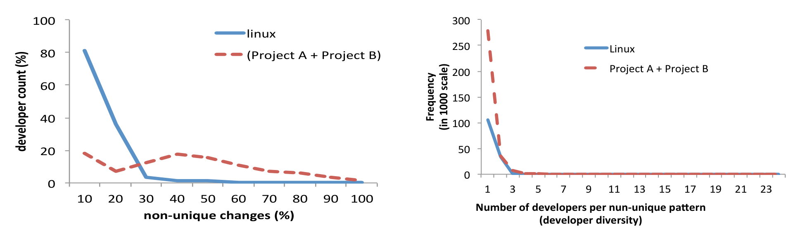
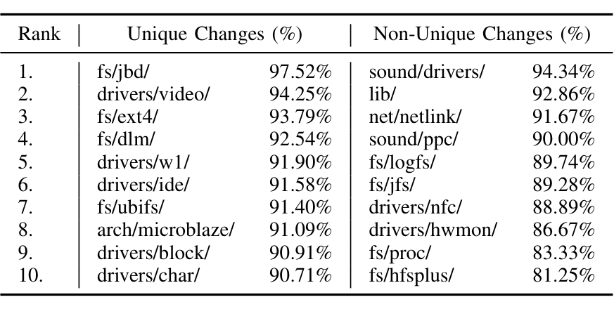

(a) Frequency of developers performing non-unique changes  (b) Developer diversity of non-unique patterns  
Fig. 3: Characteristics of non-unique changes along the dimension of developers.

### RQ2. Who introduces unique changes?

First, we measure the extent of non-unique changes over total changes that a developer has committed over time. Figure 3(a) shows the frequency distribution of the proportion of non-unique changes per developer. Almost all developers commit non-unique changes, although some commit more than others. For example, we found 10 and 20 developers in Linux and Microsoft respectively who committed only non-unique changes. A closer look reveals that these developers' contributions in respective projects are considerably low—only 1 to 16 lines of changes during the studied period. On average, 42.67% of changes of a Microsoft developer are non-unique, and Linux developers commit more unique changes—only 5.83% of a developer’s commits are non-unique in Linux.

We further check whose changes developers borrow to introduce non-uniqueness. We measure that by computing developer diversity—the number of developers using a non-unique pattern. Figure 3(b) shows the frequency distribution of developer diversity. A large number of patterns (105,208 and 278,509 in Linux and Microsoft projects) are actually owned by a single developer. The curve falls sharply as developer diversity increases. Only 0.39% and 0.55% of total non-unique patterns are introduced by more than 4 developers in the Microsoft projects and Linux respectively. Such less diverse changes suggest that developers have their own set of patterns that they repeatedly use. A highly diverse change pattern often suggests a system-wide pervasive change. For example, we find a change pattern with developer diversity of 10 in Linux that modified an existing logging feature. In another instance, multiple developers repeatedly change identifier type proc_inode to type proc_ns and the associated code over a long period of time.

> Result 2: Developers have their own set of change patterns that they use repeatedly.

Since we have seen that developers repeatedly use non-unique patterns, we wonder where they are used. Knowing the

answer not only serves researchers' curiosity, it has several advantages. For example, if two software components often change in non-unique manner, the developers of one component may help in reviewing the code of the other. Also, the same group of developers may be assigned to maintain two such closely related modules. Thus, we ask the following question:

### RQ3. Where do unique changes take place?

First we measure extent of non-unique changes per file. For each file, we take the ratio of unique and total changes across all the commits. Thus, if a file f is committed n times within the studied period, ratio of unique changes for file f = (Σ_i uniquely changed lines_i) / (Σ_i total changed lines_i).

Table V shows top 10 sub-directories in Linux (up to 2 levels from the root of the source code) that contain most unique and non-unique changes. While the journaling block-device module fs/jbd contains 97.52% of unique changes, the sound driver module sound/drivers has 94.34% non-unique changes. Non-unique changes are mostly restricted within the same file. In 23.67% cases, non-unique changes are introduced across different commits of the same file, while in 42.24% cases even within the same commit (but across hunks). The rest 34.07% of non-unique changes are made across different files.

Also, some files often change in a non-unique fashion. Table VI shows top 5 file pairs in Linux sharing non-unique changes. Note that, in most cases name of the file pairs are also very similar and relates to similar functionality. This shows that similar software artifacts often change non-uniquely.

TABLE V: Top 10 development directories containing unique and non-unique changes

