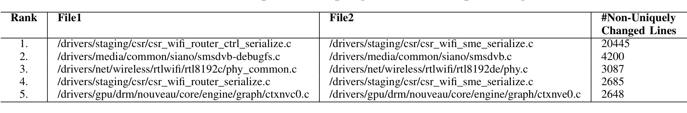
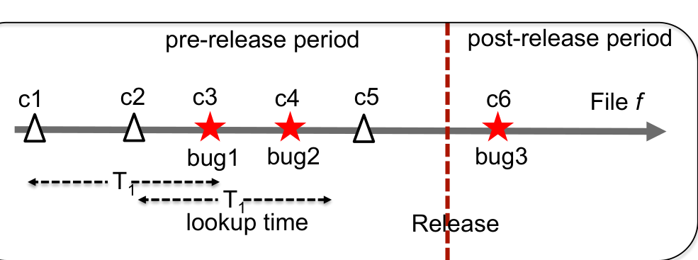

### TABLE VI: Top 5 file couplings with non-unique changes

File2

### Result 3: Unique & non-unique changes are localized in certain modules.

## IV. APPLICATIONS

Distinguishing non-unique changes from unique ones can facilitate many software engineering applications. We demonstrate this concretely by implementing a risk analysis system (Section IV-A) and two recommendation systems (Section IV-B).

### A. Risk Analysis

There has been decades of research on software risk analysis [10]. Using sophisticated statistical or machine learning models [30], [27], the risk of a software component is predicted primarily based on its evolutionary history. Different types of software metrics including product metrics (lines of code, source code complexity), process metrics (pre-release bugs, software churn), and social metrics (number of developers) are typically used for risk prediction models [30]. Nagappan et al. found that changed code is also a good indicator of bug-proneness [27]. However, not all changes are necessarily buggy. In this section, we show that categorizing changes as unique and non-unique can further facilitate the risk assessment of a file commit.

Methodology: Our risk analyzer works on the assumption that if a bug is introduced to the codebase, the bug will be fixed within a few months. For example, if a commit c introduces a bug to file f, soon there will be a bug-fix commit c_b to the file (within t months from the commit date of c). Here, we build a prediction model that assesses c’s risk of introducing a bug. We start with analyzing the evolution history of file f. Figure 4 illustrates how the risk analyzer works.

Fig. 4: Workflow of the Risk Analyzer per File Commit. The timeline shows the evolution of a file f. Each marker (triangle or star) is a commit, where red stars indicate bug-fix commits (c3, c4, and c6). c3 and c4 are pre-release fixes, c6 is a post-release fix as c6’s commit date is after the release date, marked by the red line.

First, we identify all the bug-fix commits (c_b) that fix errors or bugs in the codebase. For Microsoft projects, we identify such commits from a bug-fix database. For Linux, we identify the bug-fix commits whose commit messages contain at least one of the key words: 'bug', 'fix', and 'error'. Then for each file commit we analyze its risk of introducing a bug w.r.t. pre- and post-release bugs. For a file f, if a bug-fix commit c_b is found within t months of a commit c, we consider that c may have introduced that bug, hence c’s bug-potential is non-zero. We measure risk of a commit by its bug potential — the number of bugs that are fixed within t months of the commit. The bug potential starts from 0, indicating zero risk.

We treat pre-release and post-release bugs differently. As the name suggests, the pre-release bugs are detected and fixed before the release of a software. Usually they are detected through continuous testing, often parallel to development. Hence, we assume that these bugs should be detected and fixed within a few months from their date of introduction. To detect pre-release bugs, we look forward in the evolution history of the file up to a predefined lookup time t, and check whether the file has undergone any bug-fixes in the future. The bug potential of a commit is equal to the number of pre-release bug-fixes found within that lookup time. For example, in Figure 4, for a lookup time t = T1, commit c1 sees only one pre-release bug-fix c3. Hence, c1’s bug potential becomes 1. Similarly, c2 has bug potential 2 as it sees 2 pre-release fixes c3 and c4 within lookup time t = T1.

Post-release bugs are reported by customers facing real-world problems, only after the software is released. Since these bugs are noticed only after real-world deployment, they are in general more serious in nature. The post-release bugs were not detected during the active development period. Thus, we assume every commit in the pre-release can potentially cause the post-release bug irrespective of its time frame; i.e., if a post-release bug is fixed to a file f, any change throughout f’s evolution can potentially introduce the bug. Thus for a post-release bug, we increment the bug potential of each commit of f prior to the fix, similar to Tarvo et al. [35]. For instance, for the post-release fix c6, we assume all the previous commits (c1 to c5) have equal potential to introduce the error and increment their bug potential by one. Thus, c1’s bug potential becomes 1 + 1 = 2, c2’s bug potential becomes 2 + 1 = 3 and so on.

To check whether unique file commits are more risky than non-unique file commits, we compare the bug potential of the two using the non-parametric Mann-Whitney-Wilcoxon test (MWW) [34]. First, we calculate the non-uniqueness of a file commit as the ratio of number of non-unique changed lines (S) to the total changed lines (T) associated in the commit. Next, we categorize the file commits into unique and non-unique groups based on their non-uniqueness — a file commit is non-unique if its non-uniqueness is more than a chosen threshold.

1 Since our goal is to assess risk for each file commit, the risk analysis model is based on changed lines associated with each commit, instead of hunk.