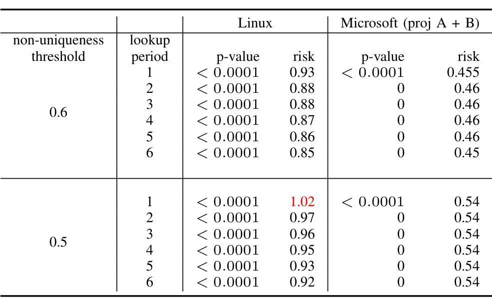

TABLE VII: Wilcoxon-Mann-Whitney test of unique vs. non-unique commits in assessing risk of introducing bugs

and vice versa. We then measure the risk of introducing bugs of non-unique commits over the unique commits.

risk = average bug potential of non-unique group / average bug potential of unique group

Note that risk is computed as a ratio of the average bug potentials. Therefore, the number of unique or non-unique changes will not impact the risk value.

Result. We repeat the experiments for lookup time 1 to 6 months with varying uniqueness threshold (0.5 and 0.6). The result of WMW test on the potential bug count of unique and non-unique groups is shown in Table VII. For all lookup periods, p-values of WMW is significant indicating the bug potential of unique and non-unique changes differ with statistical significance.

Also, risk is less than 1 for all lookup periods and non-uniqueness thresholds, except the one marked in red. This means, on average, the bug potential of non-unique changes is less than the bug potential of unique changes and the difference is statistically significant. In fact, for Microsoft projects non-unique changes are 50% less risky than the unique changes. That means in Microsoft code developers may introduce non-unique changes with more confidence.

However, for Linux projects the risk ratio is close to one. To further understand this, we measure Cohen's effect size between unique and non-unique commit groups [3]. In all the cases we observe a low effect size, varying from 0.12 to 0.19. This shows non-unique changes in Linux may not differ much from the unique changes in terms of their bug proneness. In fact, we found 836 non-unique patterns in Linux that have average bug potential beyond 50. However, we also notice that there are 180K non-unique patterns that do not introduce any errors to the codebase.

## B. Recommendation System

There exists a wide variety of recommendation systems that suggest possible changes or change locations to developers to facilitate the software development process [33]. Learning from the non-unique changes in the history of a project's evolution, here we build two different recommendation systems:

- REC-I. When developers select a code fragment to modify, it recommends possible changes that similar code has experienced previously.
- REC-II. When developers make a non-unique change, it recommends other change patterns that co-occurred with that committed change in the past.

### Recommendation System I (REC-I)

REC-I suggests relevant changes to the developer using the history of non-unique changes. When developers modify code, it shows up in the commit as a set of program statements that are deleted and a set of program statements that are added. Therefore, when a developer selects some program statements to modify, REC-I searches for a similar set of deleted program statements from the commit history of the project. If a non-unique match is found, REC-I recommends the set of corresponding program statements that were added in the commit history to the developer. In case of multiple matches (i.e., different sets of program statements that are added for a similar set of program statements that were deleted in different parts of the code), REC-I suggests all of them along with their frequency counts. For example, consider Table VIII. If a developer selects line B1 to delete, REC-I searches the previous change history and finds a match A1 that is a non-unique deletion. REC-I then suggests the corresponding line A2 as a possible addition.

To measure the accuracy of REC-I, we need a training data set and a test data set consisting of non-unique changes. We split the commit history of a project at a given point of time, and all the commit history data before this point is considered as training data and the data over the next three months from this point in time is considered as test data. For each change in the test data, we query REC-I that searches the training data for a recommendation. Thus, for a query q, if R_q denotes REC-I output, and E_q denotes actual usage (obtained from the test data),

Precision (P): Percentage of REC-I recommendations that appear in expected usage from the test data, i.e., |E_q ∩ R_q| / |R_q|

Recall (R): Percentage of expected usage (as appeared in the test data) that is recommended by REC-I, i.e., |R_q ∩ E_q| / |E_q|

Note that we evaluate the precision and recall only for those changes in the test data for which a recommendation was made by REC-I.

The accuracy of REC-I is measured at each month (the point in time that separates the training and testing data) for the entire study period (see Figure 5(a)). The overall performance of REC-I is measured by computing the mean of all the precision and recall values over the entire study period, similar to Zimmermann et al. [39].

P = (1/N) Σ_i P_i
R = (1/N) Σ_i R_i

Table IX shows the average precision and recall of REC-I. For project A, B, and Linux precision are 59.91%, 57.41%, and 52.11% respectively. This means when REC-I is returning a query with suggestive changes, there is on average 52.11% to 59.91% chances that developers will accept that recommendation. REC-I’s recall values are 67.36%, 65.44%, and 59.02% respectively, i.e., REC-I successfully returned 59% to 67% of expected correct suggestion. Such low value of recall is