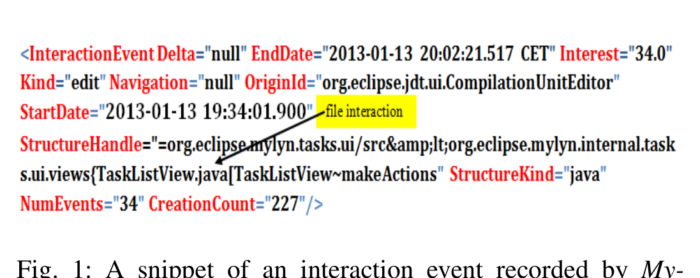
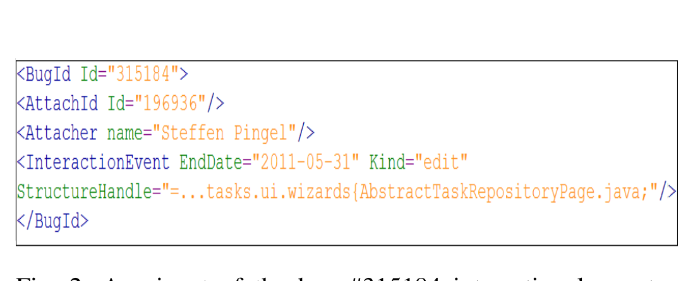

Fig. 1: A snippet of an interaction event recorded by Mylyn for bug issue #330695 with trace ID #221752. File TaskListView.java is edited.

TaskListView.java is edited.

file) and documents are extracted. A corpus is created such that each file will have a corresponding document therein. Identifiers, comments, and expressions are extracted from the source code. Each document in the corpus is referred to as doc_past.

2) Preprocessing Step: Each document doc_past is preprocessed in two parts: removing stop words and stemming.

3) Document-Term Representation:
Document Indexing: We produce a dictionary from all of the terms in our document and assign a unique integer Id to each term appearing in it.

Term Weighting: We use tfidf in our approach. The global importance of a term i is based on its inverse document frequency (idf), calculated as the reciprocal of the number of documents that the term appears in. idf is the document frequency of term i in the whole document collection. tf_ij is the term frequency of the term i in the document j. Each document d_j is represented as a vector d_j = (w_1j, ..., w_ij, ..., w_nj) where n is the total number of terms in our document collection and w_ij is the weight of the term i in document j.

4) Using Change Request: The textual description of a change request for which we want to find all of the relevant files, and eventually to be assigned developer(s), is referred to as doc_new. doc_new also goes through the preprocessing step and is represented as a document.

5) K-Nearest-Neighbor: The task of multi-label classification is to predict for each data instance a set of labels that applies to it. Standard classification only assigns one label to each data instance. However, in many settings a data instance can be assigned by more than one label. In our context, each data instance (i.e., a bug report) can be assigned multiple labels (i.e., source-code files). ML-KNN is a state-of-the-art algorithm in the multi-label classification literature [10]. We employ the ML-KNN search with a user-defined value of K (e.g., the value of 10 as used in previous work [5]) to search the existing corpus (doc_past) based on similarities with the new bug description (doc_new). This search finds the top K similar files. Cosine is then used to measure the similarity of the two document vectors.

f_sim(doc_new, doc_past) = (doc_new · doc_past) / (|doc_new| |doc_past|) (1)

At the conclusion of this step, we have identified the K most relevant source-code files to the given change request. Now, we need to mine the candidate developers from the interaction histories of these files.

Fig. 2: A snippet of the bug #315184 interaction log entry from its interaction log file.

### C. Mining Interaction Histories to Recommend Developers

The basic premise of iHDev is that the attachers who substantially interacted with the specific source code in the past are most likely the best candidate to assist with the issues/bugs associated with it. Our approach uses an interaction log, which was assembled from source-code interactions submitted by attachers to the bug tracking system (e.g., Bugzilla). Interaction log entries include the dimensions: attacher, date, and path (e.g., files) involved in an interaction event. Interaction logs are not directly available from the issue/bug tracking systems. We engineered the interaction log to simplify the implementation of the mining component of iHDev. A notable side effect is that it provides an analogy to commit logs, which are a basis for several developer-recommendation approaches.

Interaction Log: An Interaction Log is a file that includes the interaction history and the attacher(s) who created the trace file for each bug in the issue tracking system. The specific steps for creating an interaction log are given below:

1) Extracting Interactions: We first need to identify the bug reports with the mylyn-context.zip attachment(s) because not all bug issues necessarily contain the interaction trace(s). We searched the Bugzilla issue tracking system and included bugs containing at least one mylyn-context.zip attachment.

2) Determining the list of attachers: All the trace files from the issue-tracking system are automatically downloaded to a user-specified directory. A complete list of attachers for each trace file of every bug is then produced.

3) Creating Interaction log: The tool then takes the directory that contains the trace files as input and parses each trace file to create an interaction log. For each bug Id, this interaction log includes the attacher (from the list of attachers) and three of the eleven attributes from the trace file (see Figure 1): EndDate, Kind, and StructureHandle. There are several different kinds of interaction events (e.g., edit, manipulation, selection, and propagation); however, we consider only the edit interaction events because these events refer to interactions that resulted in a change to the source code file (even if that change was never committed), an action that often requires some level of knowledge of the source code. Other events such as navigation or selection do not imply explicit interaction or expertise and can therefore potentially introduce noise rather than provide additional useful information. Also, it is possible for one bug to have multiple trace files, each with a different attacher. Thus, for each bug in the interaction log file, multiple log entries may exist. Figure 2 shows a log entry for bug #315184 in the interaction log, which has only one trace file (and one attacher). For this bug, only one file has an edit interaction event (i.e., "AbstractTaskRepositoryPage.java").
