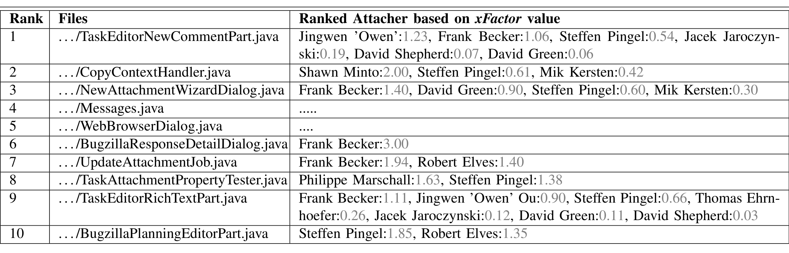
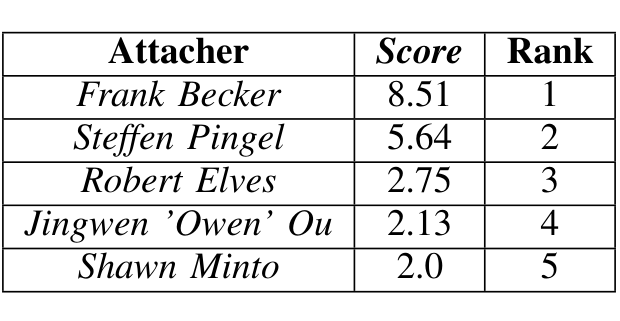
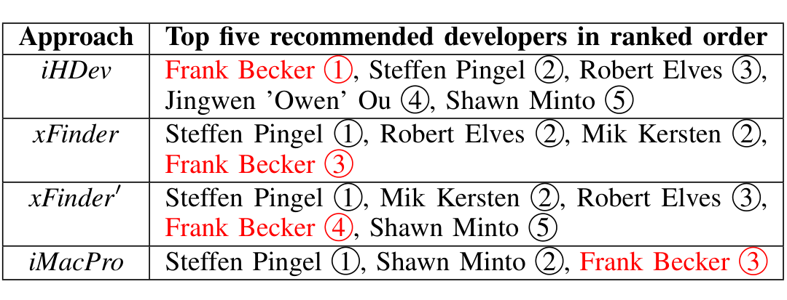

TABLE I: The attachers extracted with iHDev from each of the top ten files relevant to Bug# 313712.

This step concludes iHDev and we have the top m candidate developers recommended for the given change request.

### D. An Example from Mylyn

Here, we demonstrate our approach iHDev using an example from Mylyn. The change request of interest here is the bug #313712 “attachment dialog does not resize when Advanced section is expanded”. We first collected a snapshot of Mylyn’s source code prior to this bug being fixed and then parsed it using the file-level granularity (i.e., each document is a file). After indexing with a machine learning technique, we obtained a corpus consisting of 1,825 documents and containing 201,554 words. A search query is then formulated using the bug’s textual description, the result of which (i.e., a ranked list of relevant files) is summarized in Table I. These (k = 10) files are our starting point for iHDev. The correct developer who fixed this bug and committed the change is Frank Becker. In Table I, the third column shows a set of all attachers with the xFactor values for each file f_i.

In iHDev, we first obtained the set D_au from all of the attachers recommended for each relevant file f_i to the bug #313712 in Table I. The set D_au consists of 11 unique attachers. Because a developer could use different identities for the attacher and committer roles, we normalized them to a single identity, which was their full name. For each of the 11 unique attachers, the Score value is calculated according to Equation 6. Table II shows the top five Score values and the corresponding attachers, i.e., m = 5. Frank Becker has the highest score in the set DF (a value of 8.51), so he is the first recommended developer. For the remaining attachers, the value of the function Score is less than Frank Becker’s score, so they all have a rank greater than 1.

TABLE II: Top five attachers (developers) recommended to resolve bug #313712 by iHDev.

Table III shows the results for the approaches iHDev, xFinder, xFinder' and iMacPro (described in sections III-A) for m = 5. Clearly, the best result is for iHDev, as it recommends Frank Becker (the correct developer who fixed bug #313712) in the first position, whereas xFinder, xFinder', and iMacPro recommend Frank Becker in the third, fourth, and third position respectively. iHDev outperforms the others with respect to recall@1 and recall@2 values. At recall@5, all the approaches would be equivalent; however, iHDev provides the best ranked position (i.e., the reciprocal ranked value).

TABLE III: Top five recommended developers and their associated ranks for the compared approaches. iHDev, xFinder, xFinder' and iMacPro.

## III. CASE STUDY

The purpose of this study was to investigate how well our iHDev approach recommends expert developers to assist with incoming change requests. We also compared our approach with two previously published approaches. The first approach, xFinder [2], is based on the mining of commit logs. The second approach, iMacPro [6], uses the authorship information and maintainers of the relevant change-prone source code to recommend developers. We used these two approaches for comparison because they require information from the commit repository. iHDev uses interaction history of source code. Therefore, this part of the study would allow us to compare interactions and commits with respect to the developer recommendation task. We addressed the following research question RQ: How do iHDev (trained from the interaction history) compare with xFinder, xFinder', and iMacPro (trained from the commit history) in recommending developers?