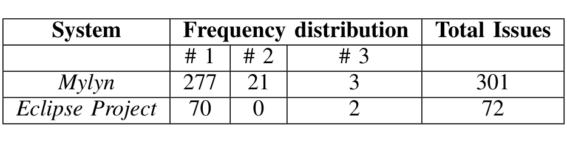

TABLE IV: The frequency distributions of developers resolving issues in the benchmarks for Mylyn and Eclipse Project.

of the issues were resolved by two developers in Eclipse Project. Our technique operates at the change request level, so we also needed input queries to test. We considered all of the bugs that have at least one associated Id in the commit messages and traces files. We created the final training corpus from all of the source code files in the last revision before the bug issues in our benchmark were fixed. We split the benchmark into training and testing sets. We picked June 18, 2007 to March 16, 2010 as our training set and March 16, 2010 to July 01, 2011 as our testing set for Mylyn. The testing set period contains 600 different revisions and 301 different issues/bugs. Similarly, we picked July 25, 2007 to March 01, 2010 as our training set and March 01, 2010 to November 05, 2012 as our testing set for Eclipse Project. The testing set contains 140 different revisions and 72 different issues/bugs. Our benchmarks are available online3. The experiment was run for m = 1, m = 2, m = 3, and m = 5, where m is the number of recommended developers. We considered the top ten relevant files from the machine learning step.

### D. Metrics and Statistical Analyses

We evaluated the accuracy of each of the approaches for all of the bug issues in our testing set using the Recall and Mean Reciprocal Rank (MRR) metrics used in previous work [1], [3], [5]. For each bug b, in a set of bugs B of size n, in the benchmark of a system and a m number of recommended developers, the formula for the recall@m is given below:

recall@m = |RD(b) ∩ AD(b)| / |AD(b)| (8)

where RD(b) and AD(b) are the recommended developer by the approach and the actual developer who resolved the issue for bug b, respectively. This metric is computed for recommendation lists of developers with different sizes (e.g., m = 1, m = 2, m = 3, and m = 5 developers).

Increasing the value of m could lead to a higher recall value (and typically does); however, it may come at the cost of an increased effort in examining the potential noise (false positives). Over 90% of the cases in our benchmarks have only a single correct developer. In such a scenario, each increment to m in pursuit of a correct developer could add drastically to the proportion of false positives. Therefore, a traditional metric of the likes of precision is not a suitable fit for our context. For example, if a correct developer is found at m = 5, the possible precision value is in the range [0.2, 1.0] for the rank positions [5, 1], typically around the lower bound of 0.2. Note that the precision metric is also agnostic to the rank positions of recommendations. Therefore, for a cutoff value of m, it would produce the same value for two approaches presenting the same number of correct answers. For m = 5, two approaches presenting a single correct answer at the positions 1 and 5 respectively will have the same precision value of 0.2. Nonetheless, a complementary measure to recall is also needed to assess the potential effort in addressing noise (false positives). We focused on evaluating the ranked position of the correct developer for each bug in each benchmark from a cumulative perspective regardless of the cutoff point m.

Mean Reciprocal Rank (MRR) is one such measure that can be used for evaluating any process that produces a list of possible responses to a sample of queries, ordered by probability of correctness. This metric has been used in previous work [12]. The reciprocal rank of a query response is the multiplicative inverse of the rank of the first correct answer. Intuitively, the lower the value (between 0 and 1), the farther down the list, examining incorrect responses, one would have to search to find a correct response.

MRR = (1/n) * sum_{i=1}^n (1 / rank_i) (9)

Here, the reciprocal rank for a query (bug) is the reciprocal of the position of the correct developer in the returned ranked list of developers (rank_i) and n is the total number of bugs in our benchmark. When the correct developer for a bug is not recommended at all, we consider its inverse rank to be zero. When there are multiple correct developers (which are very few cases in our benchmark), we consider the highest/first ranked position. The higher the value of MRR, the better it speaks of the potential effort spent in noise. For example, an MRR value of 0.5 suggests that the approach typically produces the correct answer at the 2nd rank. Overall, our main research hypothesis is that iHDev will outperform the subjected competitors in our study in terms of recall without incurring additional costs in terms of MRR.

We applied the One Way ANOVA test to validate whether there was a statistically significant difference with α = 0.05 between the results of both recall and MRR values. For MRR, we considered the ranks of correct answers of the approaches for each bug (data point). We used this non-parametric test because we did not assume normality in the distributions of the recall results. The purpose of the test is to assess whether the distribution of one of the two samples is stochastically greater than the other. Therefore, we defined the following null hypotheses for our study (the alternative hypotheses can be easily derived from the respective null hypotheses):

- H-1: There is no statistically significant difference between the recall@m values of iHDev and each of xFinder, xFinder', and iMacPro.
- H-2: There is no statistically significant difference between the MRR values of iHDev and each of xFinder, xFinder', and iMacPro.

We expect the hypotheses H-1 and H-2 to be rejected in favor of iHDev. That is, iHDev will offer improvements over others in terms of recall. Also, iHDev will not incur any additional cost in terms of MRR compared to others (or may even offer improvements).