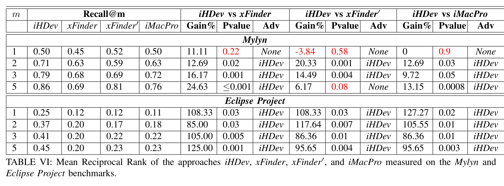
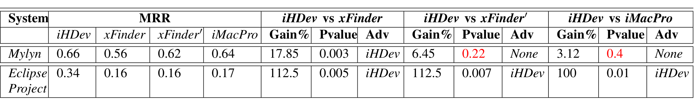

TABLE V: Average of recall @1, 2, 3 and 5 values of the approaches iHDev, xFinder, xFinder', and iMacPro measured on the Mylyn and Eclipse Project benchmarks.

## E. Results

The recall@1, recall@2, recall@3, and recall@5 values for each of the compared approaches for Mylyn and Eclipse Project were calculated from the established benchmarks. Table V shows the recall@m values of Mylyn and Eclipse Project for all the compared approaches (see the Recall@m column). The MRR values for each of the compared approaches for Mylyn and Eclipse Project were then calculated. Table VI shows the MRR values of Mylyn and Eclipse Project for all approaches (see the MRR column).

We computed the recall gain of iHDev over another compared approach (i.e., Y) using the following formula:

GainR@m_{iHDev−Y} = (recall@m_{iHDev} − recall@m_Y) / recall@m_Y × 100  (10)

The MRR column in Table VI shows MRR values of the compared approaches.

We computed the MRR gain of iHDev over another compared approach (i.e., Y) using the following formula:

GainMRR_{iHDev−Y} = (MRR_{iHDev} − MRR_Y) / MRR_Y × 100  (11)

To answer the research question RQ, we compared the recall values of iHDev, xFinder, xFinder', and iMacPro for m = 1, m = 2, m = 3, and m = 5. We computed the recall gain of iHDev over Y in {xFinder, xFinder', and iMacPro} using Equation 10. Similarly, we compared MRR values of iHDev, xFinder, xFinder', and iMacPro. We computed the MRR gain of iHDev over Y in {xFinder, xFinder', and iMacPro} using Equation 11. Table V and Table VI show the recall and MRR results respectively. The Gain % columns in

Table V show the recall gains of iHDev over each compared approach for the different m values. The Gain % columns in Table VI show the MRR gain of iHDev over each compared approach. The Pvalue columns in Table V show the p-values from applying the One Way ANOVA test on the recall values for m = 1, m = 2, m = 3, and m = 5. The Pvalue columns in Table VI shows the p-values from applying the One Way ANOVA test on the reciprocal rank values. The Advantage columns show the approach that had a statistically significant gain over the other. In cases neither did, None is shown.

For each pair of competing approaches, there were eight comparison points in terms of recall values (four each for Mylyn and Eclipse Project). Overall, out of eight comparison cases between iHDev and xFinder for recall values, iHDev was advantageous over xFinder in seven of them; the remaining one being a statistical tie. Out of eight comparison cases between iHDev and xFinder' for recall values, iHDev was advantageous in six of them; the remaining two being a statistical tie. Out of eight comparison cases between iHDev and iMacPro for recall values, iHDev was advantageous in seven of them; the remaining one being a statistical tie. Despite a few observations of negative gains, there was not even a single case in which one of the other approaches was statistically advantageous over iHDev in terms of recall. Therefore, we reject the hypothesis H1.

For each pair of competing approaches, there were two comparison points in terms of MRR values (one each for Mylyn and Eclipse Project). Overall, iHDev was advantageous in both cases of comparison between iHDev and xFinder. iHDev was advantageous in one case each for comparisons between iHDev and xFinder', and between iHDev and iMacPro. The remaining two cases were a statistical tie. There were no