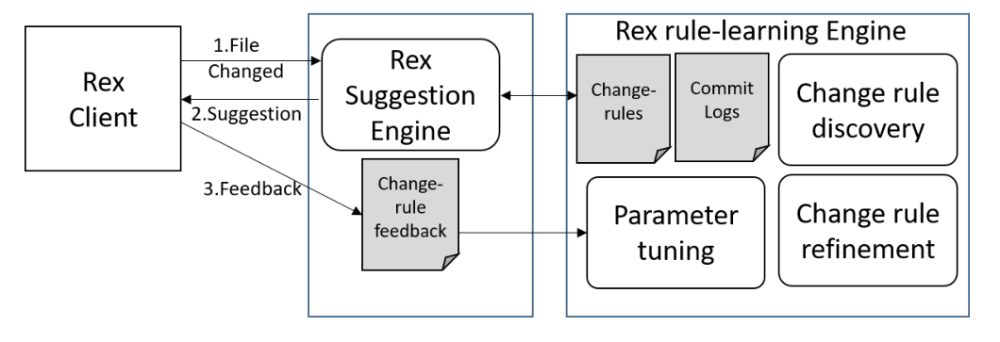
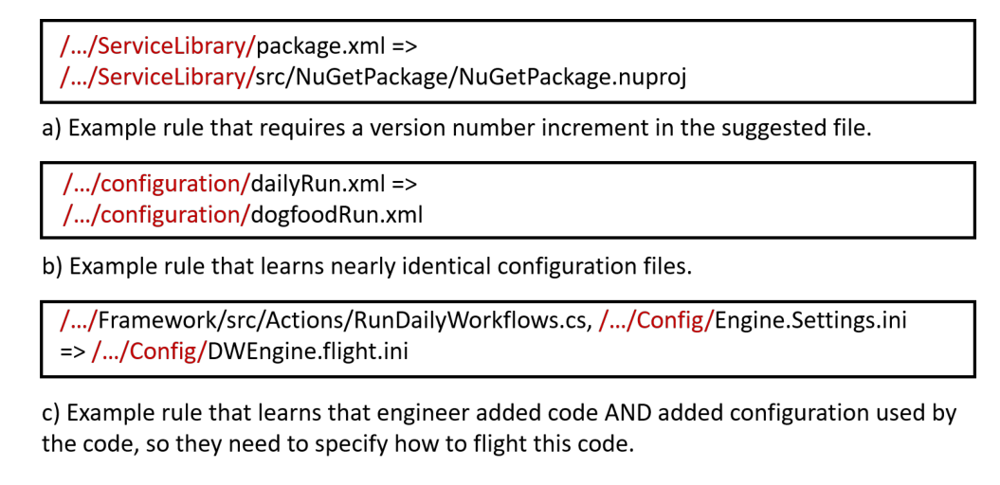
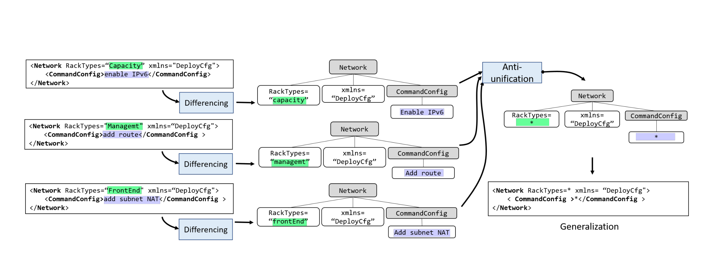
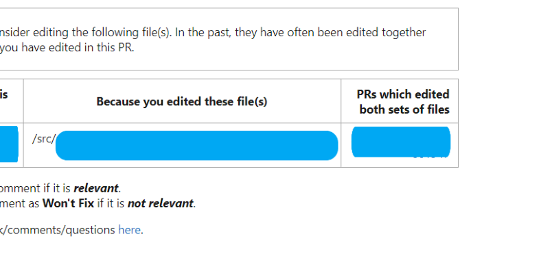
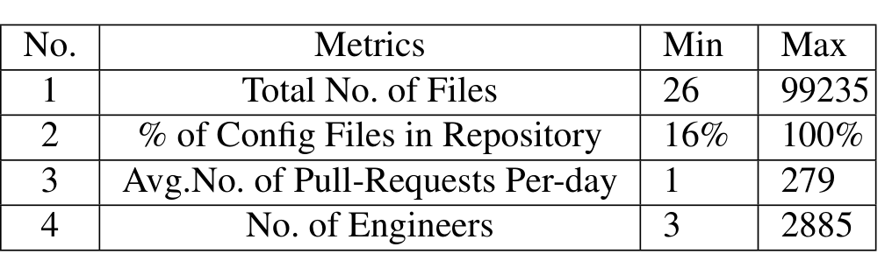
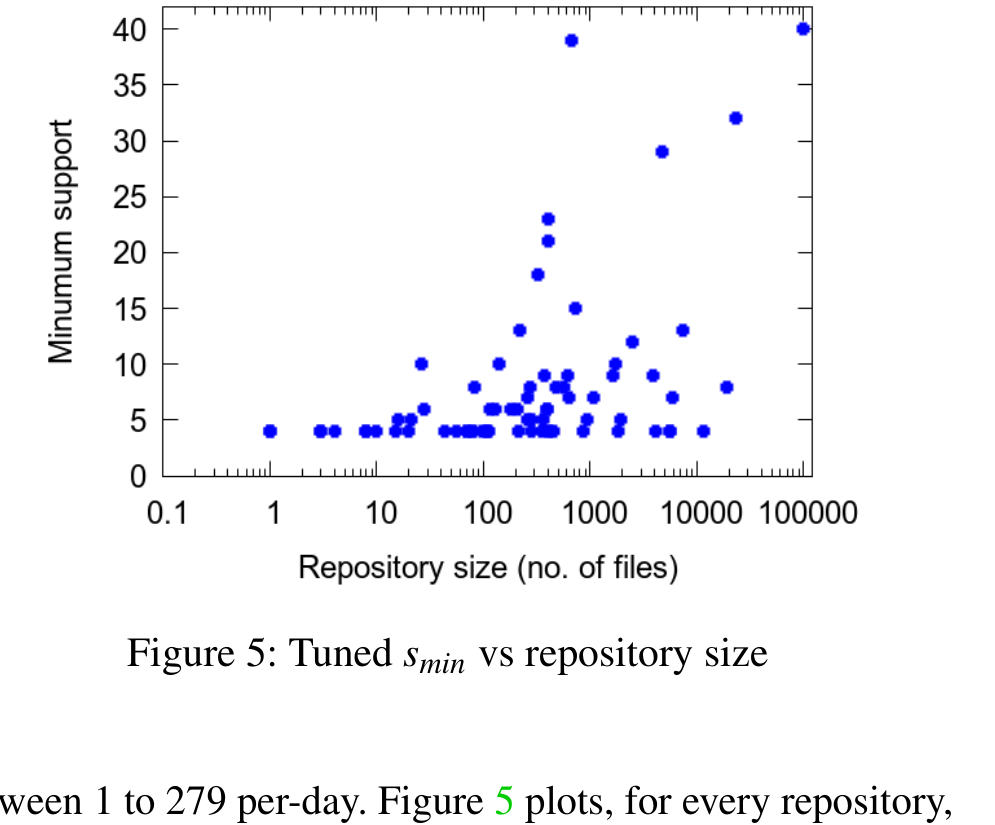

# Rex: Preventing Bugs and Misconfiguration in Large Services Using Correlated Change Analysis

Sonu Mehta1, Ranjita Bhagwan1, Rahul Kumar1, Chetan Bansal1, Chandra Maddila1, B. Ashok1, Sumit Asthana1, Christian Bird2, and Aditya Kumar1  
1 Microsoft Research India  
2 Microsoft Research Redmond

## Abstract

Large services experience extremely frequent changes to code and configuration. In many cases, these changes are correlated across files. For example, an engineer introduces a new feature following which they also change a configuration file to enable the feature only on a small number of experimental machines. This example captures only one of numerous types of correlations that emerge organically in large services. Unfortunately, in almost all such cases, no documentation or specification guides engineers on how to make correlated changes and they often miss making them. Such misses can be vastly disruptive to the service.

We have designed and deployed Rex, a tool that, using a combination of machine learning and program analysis, learns change-rules that capture such correlations. When an engineer changes only a subset of files in a change-rule, Rex suggests additional changes to the engineer based on the change-rule. Rex has been deployed for 14 months on 360 repositories within Microsoft that hold code and configuration for services such as Office 365 and Azure. Rex has so far positively affected 4926 changes without which, at the very least, code quality would have degraded and, in some cases, the service would have been severely disrupted.

only to a small set of machines to test it further. Similarly, when an engineer renames a service API, they must also change firewall rule specifications so that the rules apply to the now renamed API rather than to the old one.

Such correlations can occur between code files across components, between code and configuration files, or between configuration files. Unfortunately, unlike pure code, which goes through compilation, reviewing and systematic testing to weed out bugs, these correlations are often not specified, checked for, and are left undocumented. Consequently engineers, with no documentation or specification to go by, often miss making necessary changes to code or configuration files. This can delay deployment, increase security risks and, in some cases, even disrupt the service completely. Disruptions due to such correlations are surprisingly frequent [12]. For instance, an engineer recently caused a disruption at Salesforce because they did not perform all necessary dependent configuration changes related to a change they initiated [22].

To address this problem, we present Rex, a tool that learns these correlations using a combination of machine learning and program analysis. Using association rule mining on many months of file changes, Rex determines sets of files that often change together. Rex also uses differential syntax analysis to learn change-rules: each change-rule captures a set of correlated changes across files. When an engineer makes a file change, Rex analyzes the change and uses the change-rules to suggest additional changes if required.

While the idea of using association rule mining to determine correlations in code and configuration has been proposed before [6, 35, 37], previous work has not concentrated on generalizing the algorithm. To the best of our knowledge, Rex is the first tool that combines association rule mining with syntactic analysis to determine change-rules. Moreover, Rex takes the crucial step of making correlated change analysis generalize well to multiple file-types and services, and deploying it at a large-scale. We do this through three key observations made by studying the characteristics of services:
1. Correlations occur in a multitude of unpredictable ways. Consequently, Rex’s algorithm should not rely on any hard-

## 1 Introduction

Large-scale services run on a foundation of very large code bases and configuration repositories. To run uninterrupted, a service not only depends on correct code, but also on correct network and security configuration, and suitable deployment specification. This causes various dependencies both within and across components/sources of the service which emerge organically. When an engineer changes a certain region of code or configuration, these dependencies require them to make changes to other code or configuration regions. For instance, when an engineer adds a new feature to a service, they may need to add a function to test the feature. Also, they may need to configure the service to deploy the new feature

---

coded domain knowledge, neither should it depend on any manual configuration or tuning.

2. Configuration management practice varies widely across services and projects. Every service has distinct configuration management and maintenance strategies as a result of which machine learning models have to be service or project-specific, with no extrapolation from one to the other. To make matters even more challenging, even a single service or project can change characteristics significantly over time. Hence, Rex’s models have to be periodically retrained so that its suggestions can be accurate.

3. Care has to be taken while applying association rule mining on large code and configuration files. Services depend upon a large amount of code and configuration. Applying rule mining which is exponential in the size of the input at the level of individual code and configuration constructs is simply not feasible. We realized this early in the design process and therefore apply rule-mining at the file-level.

Rex is deployed on 360 Microsoft repositories which hold code and configuration for services such as Exchange Online, OneDrive, Azure, Dynamics CRM and Skype. We are currently scaling out Rex at a fast pace, on-boarding almost one repository per day. Till date, Rex has suggested 4926 changes to engineers that, if not made, may have adversely affected our services in many ways.

In this paper, we make the following contributions:

- We demonstrate different types of correlations that exist across code and configuration of large services.
- We describe a novel two-step algorithm to perform correlated change analysis involving file-level association rule mining followed by differential syntactic analysis of the changes made to the files.
- We have implemented and deployed Rex and provide an evaluation based on our deployments.
- We have performed an extensive user study to understand how useful Rex is in practice.

Section 2 describes different types of correlations Rex has found across many services. Section 3 provides an overview of Rex’s approach, limitations, and challenges. Section 4 explains the algorithms Rex uses to suggest changes. Section 5 and Section 6 provide specifics on its implementation and deployment. Finally, Sections 7 and 8 describe a thorough evaluation and user study respectively.

## 2 Reasons for Correlated Change

Correlations occur due to various reasons. In this section, we describe several categories of correlations we found through our deployments. Table 1 shows a sample of correlated changes that engineers missed making and Rex flagged at commit-time. We note that though these examples are specific to our deployments, the problem of correlated configuration is generic and extends to other organizations as well [14,22,27]. We now describe these categories of correlations with the help of the examples in Table 1.

### 2.1 Flighting

When an engineer adds a new feature, they use canary-testing or “flighting” to deploy it in stages. They first deploy it to a small subset of machines to ensure that the feature works as planned and does not cause disruptions. Once they ensure this, they deploy the feature more widely. Hence, when the engineer adds code to implement a new feature, they also need to add configuration to files that define the set of machines that will test this feature. Services implement flighting in many different ways. Example 3 shows an instance where the engineer who develops the new feature decides which set of machines to run the feature on. Example 7, for a different service, shows an instance of a change where the engineer who develops the new feature does not directly turn on the feature: they provide a “code switch” which other engineers can use to turn on flighting. These two examples again illustrate why Rex needs to learn such varied change-rules from data and why rule-based engines would not work across services.

### 2.2 Replicating Code and Configuration

While clearly not recommended, we find that engineers sometimes replicate files and file contents across different logical boundaries of the service. They do this since, without replication, there will be a larger number of dependencies across files and components. This in turn will lead to less modular code-bases which may take longer to test, debug, and deploy. Example 2 shows an instance where a configuration file is replicated across different alerting frameworks. An engineer changed one, without knowing that a replica existed within the other alerting framework. Rex flagged this file and the engineer immediately changed the other file as well.

### 2.3 Complex Configuration

Configuring services is a complex task and, as a result, several correlations show up between configuration files. Example 4 shows an instance where an engineer renamed a microservice, but forgot to change the name of the service in the file that contained its firewall rules. This could have caused a security issue. Example 8 shows another instance where hardware configuration files are correlated, and missing this change could have caused a service disruption.

---

Table 1: This table describes some real examples of correlated changes that engineers missed and Rex flagged in our deployments. The Reason column captures why the two files are correlated. The last column describes what may have happened, had Rex not flagged the issue and notified the engineer.

## 2.4 Testing

Example 1 shows that, when an engineer adds a new feature to code, they should consider adding a new test for that feature in a separate file that contains only tests. While this is fairly common across multiple code-bases and services, each code-base has its own organization structure for separating test code from the main production code. Rex automatically detects such structures without any manual input.

## 2.5 Scripting

Often, administrators use scripts to test and deploy services. These scripts can have complex inter-dependencies which, unlike compiled code, can go unchecked at commit-time. For instance, in Example 6, an engineer changed a function definition in one script and hence they had to change the way the function was called in another script. Rex caught this issue, while existing IDEs and compilers could not.

## 2.6 Miscellaneous

Apart from the categories we have mentioned so far, Rex also flags somewhat rare cases of correlation which can have high impact. In Example 5, File 2 maintains a list of line-numbers of vulnerable code across different files in the code-base. The idea is to maintain a record of all vulnerabilities that have already been found and vetted by engineers. Thus, when an engineer adds n lines of code to File 1, they also changed the line number of the vulnerable code in File 1. Hence they need to increment the line number in File 2 by n. While such categories of correlations are rare, we notice multiple such rare cases. This further confirms the value of using a learning-

---

based approach.

Note that, for simplicity, the table shows examples that involved only two files. In reality, change-rules can contain more than two files. Moreover, the correlations for similar tasks are very different for different services. Example 3 and Example 7 in Section 2.1 talk about two different ways of flighting a feature. Even within a service, the correlations are dynamic and keep changing with time. We believe no existing syntactic or semantic analysis techniques or heuristic based model could have effectively and efficiently captured such diverse and complex correlations.

## 3 Problem Overview

In this section, we define the problem that Rex solves, the approach to it, and describe some limitations of the approach. Finally, we lay out the challenges we faced as we designed and deployed Rex.

### 3.1 Approach

Rex applies association rule mining on months of commit logs to find correlated changes. Association rule mining is fundamentally an exponential algorithm. Finding correlations between individual configuration parameters and code constructs such as variables and functions will be prohibitively expensive simply because of the sheer large numbers of such constructs [28, 33, 35]. Hence to scale well, we decided to mine change-rules at the file-level. While the approach is coarse-grained and does not capture correlations perfectly, it makes the solution practical to deploy at a large scale.

Rex learns change-rules in two steps: change-rule discovery and change-rule refinement. In the discovery step, it uses association rule mining to find sets of files that change together “frequently”. A set of parameters determine how frequently the files need to change for Rex to learn the change-rule. Section 4.2 provides more detail on this algorithm and Section 4.5 shows how we tune its parameters to maintain effectiveness through changing characteristics of the service.

After change-rule discovery, Rex runs the second step, namely, change-rule refinement. The idea is to make each change-rule, which is coarse-grained and at the file-level, more precise. Rex analyzes the change in every file of the change-rule to determine what types of changes are correlated. Section 4.3 describes this procedure further. Finally, Rex makes suggestions to engineers based on the learnt rules.

### 3.2 Design Goals

Rex’s design is driven by two factors. First, it needs to be generic: its techniques need to work well across file-types, service-types, and programming languages. Second, it needs to be effective: it should find subtle misconfigurations and bugs which existing tools cannot catch. To achieve these goals, our solution has the following characteristics:

#### No Manual Inputs
The main goal of Rex is to help engineers find misconfigurations and bugs early, while minimally intruding upon their already busy schedule. We therefore design it to work with existing systems and logs, and do not require any additional logging or inputs from the engineers. We believe this is one of the main reasons that Rex is being adopted widely across our organization over multiple services.

#### Correlation, not causation
Rex flags correlations, and does not detect causality because the cause of a specific set of correlated changes may not be captured by any logs. For instance, consider Example 2 in Table 1: changing one file of component definitions does not cause the change in the other. An engineer was extending the alerting infrastructure to a larger number of components, and this caused the need to change both files.

### 3.3 Scope

As with any machine learning-based approach, Rex is a best-effort service. Sometimes it may miss suggesting required changes (false-negatives) and conversely, it also suggests changes when none are needed (false-positives). As we describe in Section 4, we tune Rex so that it catches as many misconfigurations as possible even though this may come at the cost of a higher number of false-positives. Take for instance Example 5. We need to change File 2 only if the line-number of a vulnerable code-snippet in File 1 changes. It is fundamentally difficult for a generic technique to learn the specific semantics of this particular correlation. Rather, Rex suggests that the engineer change File 2 whenever they change File 1, even if the line-numbers in File 1 do not change. Such a suggestion will be a false-positive.

### 3.4 Challenges

Determining the right set of correlations has several challenges associated with it.

#### Imperfect Ground-truth
The largest challenge we faced as we designed Rex was imperfect ground-truth. The reasons for this are many. First, correlations are often subtle and do not necessarily cause compile errors, deployment failures, or immediate service downtime. Consider the issue in Table 1, Example 1, where the engineer needs to add a test for a newly added feature. This is not strictly necessary but definitely recommended. However engineers are often hard-pressed to commit and deploy fast and therefore may not add the test. Hence the commit logs that Rex uses may not always see the two files with the added feature and test changed together. As a consequence, Rex may not learn the change-rule that includes these two files.

#### Performance
Rex currently runs on 360 repositories, and its adoption is increasing rapidly. Hence we need to ensure there

---

Figure 1: Rex system design.

Figure 2: Some example rules from the change-rule discovery step. Note that rules are not limited to only file pairs. Example c) shows an example where two files are learned on the LHS.

are no manual steps involved. Additionally, we need to ensure that the rule mining algorithm does not become prohibitively expensive.

## 4 System Design

In this section, we provide an overview of the different components of Rex. We then describe each component in detail.

### 4.1 Design Overview

Figure 1 shows an overview of the Rex design. The Rex rule-learning engine periodically learns change-rules that capture which files change together and how. It uses several months of commit logs to do this. For each commit, the commit log contains information about which files changed, and how they changed. Rex’s rule-learning engine runs two processes to learn rules: change-rule discovery (Section 4.2) and change-rule refinement (Section 4.3).

The Rex suggestion engine interfaces between the client that uses Rex and the rule-learning engine. When an engineer changes a file, the Rex client notifies the suggestion engine of the change. The suggestion engine looks up applicable change-rules to determine if the engineer may have missed changing a correlated file. If so, the suggestion engine suggests the additional file change back to the client. Our current implementation of the Rex client is built for various source control systems such as Git [29]. It adds suggestions as pull-request comments, whenever required, after every commit in a pull-request. More details on this are in Section 5.

When the Rex client provides the suggestion back to the engineer, they either accept the suggestion by editing the suggested file or not. Rex uses this behavior as feedback to the rule-learning engine. Using this implicit feedback, Rex automatically tunes parameters used to learn the change-rules. Section 4.5 provides more details on the tuning module and why this is essential to scale Rex across hundreds of repositories. Very few engineers provide explicit feedback by replying or resolving the comment and we do not use this because such feedback is very limited and is inherently biased towards negative examples.

### 4.2 Change-rule Discovery

In this section, we describe the first-step towards learning rules, which is change-rule discovery. We use six months of commit data for rule-mining. First, Rex prunes the commit logs to exclude commits that are aggregates of smaller commits caused by merging branches (squashed changes), or porting a set of commits across branches. Since these commits put together a set of smaller commits that may not have any relation with each other, they do not capture true correlations between files. Moreover, such large commits make mining rules prohibitively expensive. Figure 2 shows some examples of rules that Rex has learned.

Rex runs the rule mining algorithm considering each commit as a transaction. First, it discovers frequent item-sets using the FP-Growth algorithm [13]. A frequent item-set is a set of files that change together very often. Mathematically, we define a frequent item-set as F = {f1, ..., fn} where files f1 through fn have changed together at least smin times. smin is the minimum support defined for the model. The support of the frequent item-set, sF, is defined as the number of times files f1 through fn change together. Hence, sF ≥ smin.

Next, the algorithm generates change-rules from frequent item-sets. From the frequent item-set F, Rex learns the rule X ⇒ Y such that X ⊂ F, Y ⊂ F, X ∩ Y = ∅, X ∪ Y = F.

The confidence of the rule is the number of times all the files in F change together (support of file-set F) divided by the number of times all the files in X change together (support of file-set X). The rule’s confidence is therefore sF / sX. Hence, the more often files in sets X and Y change together, the higher the confidence of the rule. Rex learns a rule only if it has confidence above a minimum confidence cmin.

### 4.3 Change-rule Refinement

In this Section, we describe the change-rule refinement process. Currently our implementation supports configuration files, but it can be extended to support code files as well. In our description, we concentrate on xml files though the same

---

Figure 3: Steps of change-rule refinement for a rule `network_dc1.xml` ⇒ `network_dc2.xml`. Three separate commits are made to a single configuration file. Each one adds an XML attribute Network, but with different values. From each of these three, Rex learns difference trees that codify the additions. All these difference trees are input to the anti-unification algorithm which outputs a generalization for this type of addition.

These techniques apply to other file-types such as JSON.

Consider the following examples which have arisen in our deployments:

**Ex 1. Network configuration:** An engineer adds new commands to a file `NetConfig_dc1.xml` that configure racks in data center 1. These changes need to be applied to all data centers, and hence, the engineer has to change similar configuration files for other data centers as well, say `NetConfig_dc2.xml`. Rex should therefore suggest these changes if the engineer does not make them. However, in many cases, the engineer makes changes to `NetConfig_dc1.xml` that apply only to data center 1 and not to data center 2. For instance, they may add a new subnet only to data center 1. In this case, Rex should not suggest changing `NetConfig_dc2.xml`. Change-rule discovery alone cannot differentiate these two scenarios.

**Ex 2. Role-based access control:** Several of our services implement role-based access control. Engineers often define a new role in a file `RoleDefn.xml`. When they do so, they should also change `RoleMembership.xml`, which specifies the users or groups that are associated with the new role. However, if the engineer is only modifying an already existing role definition in `RoleDefn.xml`, they need not change `RoleMembership.xml`.

These examples show that, in some cases, for a rule X ⇒ Y, Y changes only if X changes in a specific way. While for code, compilers often catch such correlations and dependencies, configuration files lack an equivalent safety net.

Change-rule refinement has two parts. First, given a configuration file `x`, it learns all generalizations of additions, deletions and modifications made to `x`, where a generalization is in the form of a regular expression. Next, for any change-rule X ⇒ Y already learned by change-rule discovery where `x ∈ X`, it refines the rule further. We now describe these two steps in detail.

### 4.3.1 Learning generalizations

Figure 3 shows an example of this. Rex creates a set of all commits C that modify `x`. For every commit in C, Rex computes a syntactic difference between the old and new version of `x`. To do this, Rex constructs parse trees for both versions, and then uses a novel differencing algorithm to compute the difference between the two parse trees, which we call a difference tree. For example, in Figure 3, three changes were added to `x` in three different commits. Each change added an XML node named `network`, but with varying attribute values. In each case, Rex's differencing algorithm outputs a difference tree capturing the difference. The shaded vertices are XML nodes, while the unshaded vertices are XML attributes.

Next, from the difference trees, Rex learns generalizations of the changes that happen to the configuration file. To extract these generalizations, Rex uses the process of anti-unification [15, 23]. The anti-unification algorithm learns regular expressions that are the most specific generalizations of the difference trees. In each of the three changes shown in Figure 3, the XML attribute `RackTypes` has different values. The XML attribute `CommandConfig` too has different text values. Taking the three difference trees as input, the anti-unification algorithm outputs the generalized difference tree, and thereby the most specific generalization of the three changes.

While Figure 3 describes one example generalization, a file `x` may have many more such generalizations. Rex learns all such generalizations of additions, deletions and modifications to the configuration file `x`. Say this set is `G(x) = {g1, g2, ..., gn}`.

### 4.3.2 Refining Rules

Next, given a rule learned during change-rule discovery X ⇒ Y, where `x ∈ X`, Rex learns more fine-grained rules of the form `{X, (x, gi)} ⇒ Y, gi ∈ G(x)`. This rule says that when all files in X change, Rex will suggest changing Y

---

only if the change to file x_C matches generalization g_i.

This is done in the following way. Say the number of times a change in file x_C matches g_i and all files in Y change is n. Conversely, say the number of times a change in file x_C matches g_i and files in Y do not change is n˜. If n/(n + n˜) > t, where t is a threshold we call the refinement threshold, Rex refines the rule by adding the tuple (x_C, g_i) to the left-hand side of the rule. This means that Rex now makes the suggestion only if the change to x_C matches the regular expression g_i. Thus, change-rule refinement cuts down on false-positive suggestions. In all our deployments, we set t to 0.75.

Though our implementation of the differencing algorithm is specific to configuration files, we can also extend this to code files. The code differencing algorithm could learn syntactic features such as “function added”, “if-condition changed”, etc. We could refine rules for code using these features. Based on a careful empirical study we conducted while going through true-positives and false-positives that change-rule discovery generated, we observed that a lot of issues with code files are already addressed by compilers. So, we do not see many false-positives for code files when the engineer has committed changes, because in most cases, engineers commit changes after compiling the code. This will become more clear in the next section 4.4 where we describe how these rules are used. Rex uses these rules to make recommendations for missing files after an engineer has committed a change. Such a tool for code files would be helpful for developers if the suggestions are made at IDE (Integrated Development Environment) level. We leave this for future work.

### 4.4 Suggestion Engine

In this section, we describe how the Rex suggestion engine uses the rules learned by change-rule discovery and change-rule refinement.

When an engineer commits a code or configuration change, the Rex client calls the suggestion engine which determines the set of rules that match the commit. If there is a match, the suggestion engine checks if any of the files in Y are unchanged by the commit. If it does find such a file, the suggestion engine recommends that the files be changed. If the engineer does indeed change the suggested files, the suggestion is considered a true-positive. Else, the suggestion is a false-positive. These numbers are used both for parameter tuning (Section 4.5) and evaluation for Rex (Section 7).

### 4.5 Parameter Tuning

As we deployed Rex on more projects and services, we noticed that the frequency and the nature of changes varied widely, not just across projects and services, but also within the same project at different times. Hence, once a day, Rex uses the feedback from the suggestion engine to tune models.

Figure 4: Screenshot of a Rex pull-request comment. Sensitive text has been masked.

Association rule mining has two main tunable parameters, the minimum support s_min and the minimum confidence c_min. Rex tunes only s_min and sets c_min to a constant, relatively low value of 0.5. This is because while we want change-rule discovery to learn a relatively large set of rules, perhaps some with low confidence, we use change-rule refinement to make the rules more precise.

We train various models by varying the value of s_min. We do not set s_min to values less than 4, since that leads to too many rules and slows down rule-mining. We then evaluate each model on one month’s data and pick the best one using the described approach. We apply the model after every commit1. We measure the number of false-positives and true-positives. In addition, we also compute false-negatives for a model. This is the number of true-positives that the model with s_min set to 4 found, but the current model did not. Hence, we compute every model’s false-negatives relative to the model with the lowest value of s_min, which learns the largest number of rules.

From these numbers, we can compute precision, recall and F1-score for each model. Finally, we pick the model with the highest F1-score and deploy it.

## 5 Implementation

Rex is implemented using C# on top of the .NET framework and deployed using a combination of services provided by Microsoft Azure [19]. Rex is currently deployed on 360 repositories across multiple Microsoft services. There are three main components of Rex:

Data Ingestion and Loading: Using Azure DevOps [18] and Github [11] APIs, batch jobs execute at predefined intervals to ingest information about pull requests, commits, files, diffs, etc. for each repository where Rex is enabled. All data is stored using SQL databases. Currently, there is a one-to-one mapping between a repository and a database. The SQL database schema is normalized and allows for efficient querying of commit and file data. Newly onboarded repositories are backfilled with 6 months of data.

1 Our evaluations are GIT-specific, so we apply Rex after every commit to a pull-request. This approach extends to other version control systems as well.

---

Learning: For each repository, every day a new model is learned. Currently, Rex uses the FP-growth algorithm [13] to learn association rules from the six months of commit history in a repository. Rex also analyzes XML files more deeply using XmlDiffAndPatch [10] in order to perform change-rule refinement using the anti-unification algorithm [15, 23]. The learned model and metadata about the model is saved in the respective database for the repository; thus, resulting in a repository-local model.

Decorator: The pull-request decorator performs the functionality of the suggestion engine. It subscribes to events in each repository using APIs. For each pull-request that is created or updated, the decorator mines details on the fly, performs inferencing of the pull-request using the latest model stored in the repository database, and creates systematic comments in the pull-request for all valid and new Rex suggestions.

## 6 Deployment

Deploying Rex is easy: an administrator of a repository only needs to provide a URL of their repositories. Repo admins need not provide any inputs to Rex, they need not configure it, and hence the effort to on-board a repository is minimal. We started deploying Rex with one repository in October 2018. Since then, its adoption has steadily grown. Rex is now deployed on 360 repositories for services such as Exchange Online, OneDrive, Azure, Dynamics CRM, and Skype.

Table 2: Characteristics of repositories on which Rex runs.

Deployments are on very different types of repositories. Table 2 summarizes the characteristics of the 360 repositories that Rex is deployed on. The characteristics vary widely: we host one of the largest git repositories in the world, while we also host small, relatively inactive repositories. Row 2 captures that our repositories have varying amounts of code and configuration. Some repositories hold only configuration information, while others hold mostly code.

### 6.1 Lessons

In this section, we will outline some lessons and insights we have gathered from these varied deployments. We believe these insights hold in general for tools such as MUVI [16], DeepBugs [20], EnCore [35] and Getafix [24] which use machine learning to flag bugs and misconfigurations.

1. We should distinguish between model precision vs. deployment precision. No ML-based tool is perfect, and hence the best way to evaluate it is by observing its precision, which is the ratio of the number of true-positives to the total number of suggestions made. In our implementation, a Rex suggestion is a true-positive if, after it is made on a pull-request, the engineer adds the suggested change within the same pull-request. For bug and misconfiguration-detection tools, one needs to compute two types of precision: model precision and deployment precision. Model precision is the ratio of true-positives to total suggestions that the model makes on test data as opposed to a real deployment. Rex uses the last six months of commit logs as test data. The deployment precision is the ratio of the true positives actually observed in deployment to the total number of suggestions shown to engineers.

   Invariably, deployment precision is significantly lower than the model precision. This is because Rex provides suggestions only when the engineer makes a Git pull-request. This is after the engineer has had an opportunity to weed out bugs and misconfiguration through subsequent commits made after some unit-testing and reviewing. For instance, say Rex predicts correlations in 100 cases, of which 90 are correct (true-positives) and 10 are incorrect (false-positives). The model precision is thus quite high, i.e., 90%. In actual deployment though, say engineers remember to make the right changes in 88 of the 90 cases Rex discovered. Hence Rex shows suggestions only in the 2 remaining cases. On the other hand, Rex does make the same 10 false-positive suggestions. Thus the deployment precision for Rex is 2/(10+2) = 16.7%. The deployment precision may seem low, but it is important to note that the suggestions made by Rex are for less obvious correlations which the engineer is unaware of.

2. Flagging high-impact misses offsets the effect of low deployment precision. In the example shown above, the 2 useful suggestions made by Rex in deployment could actually avert severe service disruption. By interviewing several engineers we found that Rex is indeed flagging such issues, and as a result, the engineers consider the low deployment precision acceptable. Therefore, when we deploy Rex afresh for a project, we ensure that engineers understand this trade-off and yet appreciate the utility. Also, for this reason, we tune Rex not just for high precision but also for high recall relative to the baseline model, as described in Section 4.5.

Engineers want suggestion interpretability: Engineers like to know why Rex makes a particular suggestion. Therefore, along with every suggestion, we also provide an explanation which shows the past commits from which Rex learned the rule. If an engineer would like to understand the reason for a Rex suggestion, they can view this explanation.

## 7 Evaluation

Rex has been in deployment for about a year now and has so far found 4,926 true-positive suggestions across 360 repositories, many of which have helped avoid severe service outages. In this section, we evaluate Rex. The questions we ask are:

---

1. How does change-rule discovery perform?
2. What value does change-rule refinement add over change-rule discovery?
3. How useful is the parameter-tuning process?
4. What is the performance overhead of Rex?

## 7.1 Rex Precision

In this section, we evaluate both model precision and deployment precision as we explained in Section 6.1. We first evaluate change-rule discovery.

Table 3 shows the model and deployment precision for change-rule discovery for 7 repositories across 4 services: OneDrive, Azure, Exchange Online and Dynamics CRM. The model was trained on 6 months of commit data and tested on 6 subsequent months of test data. We find that the model precision varies between 66.09% and 82.11%. The deployment precision varies between 6.84% and 16.74%. Notice that a higher model precision does not necessarily imply a higher deployment precision. Consider Azure1 and OneDrive1. Though they both have relatively high model precisions, OneDrive1 has a high deployment precision (16.74%) whereas Azure1’s deployment precision is only 6.84%. We believe this variability is due to various reasons specific to the repository, such as the complexity of the repository, the nature of the configuration and the learned rules, etc. Our user study in Section 8 explains this to some extent.

We now compare precision for change-rule discovery with and without change-rule refinement (CRR). We use the same train-test split used to evaluate change-rule discovery. We run this experiment only for configuration files written in xml, config, csproj, proj, resx and wxs formats since our differencing algorithm supports them. We do not consider code files. Hence, the deployment precision numbers vary slightly from the results in Table 3.

Table 4 shows the performance of Rex, with and without change-rule refinement, for 6 repositories. In each case, while model precision does improve, the deployment precision improves significantly. For Exchange3, which had a very low deployment precision of 5.03%, the deployment precision with change-rule refinement increased to 18.00%, an increase of about 250%.

## 7.2 Parameter Tuning

In this section, we justify the importance of tuning the minimum support s_min for change-rule discovery both across repositories and also within a single repository.

Tuning across repositories: The repositories that Rex is deployed on are extremely varied and dynamic, with the number of pull requests varying between 1 to 279 per day.

Figure 5: Tuned s_min vs repository size

Figure 5 plots, for every repository, the tuned value of minimum support s_min against the size of the repository at a given point of time. The size of the repository is the number of files in the repository. While there is a clear correlation of 0.56 between repository size and s_min, the repository size by itself does not clearly tell us what the value of s_min should be. For instance, for size 700, depending on the repository, s_min varies from 4 to 23. This implies that we need to tune s_min for each individual repository.

Tuning within a repository: Even within a repository, characteristics change over time. Figures 6a–6d show the variation of s_min with time for four repositories. This variation can be due to multiple reasons. First, decreased commit rates require Rex to lower s_min so that a healthy suggestion rate is maintained, even though precision may drop. Second, engineers may add new files to the repository in which case the s_min may need to be lowered to learn rules specific to these files.

To understand this fluctuation better, Figures 6e–6h plot precision, recall and F1-score for one run of the parameter-tuning algorithm for four repositories. Note that the recall here refers to the recall based on the number of true-positive suggestions made by the baseline model with s_min = 4. The graph shows values of precision, recall and F1-score normalized by the respective values for the baseline model (s_min = 4). As expected, for all four repositories, as support increases, the model learns fewer rules, and there is a drop in recall. Surprisingly though, as s_min increases, precision increases predictably only for Repository 4, and to some extent for Repository 2. Repositories 1 and 3 see some local increases in precision, but overall, it follows a downward trend.

On analysis of these repositories, we found that the majority of true-positives in this case were generated by the rules having low s_min. On increasing s_min, we do not retain these rules and thus the number of true-positives drops significantly. Even though there is a drop in false-positives with the increase in s_min, the drop in true-positives is significant enough to bring the precision value down. This unpredictability in behavior motivates the need to perform regular tuning of Rex models.

---

Table 3: Model and Deployment Precision for Change-Rule Discovery

Table 4: Improvement in Model and Deployment precision with Change-rule refinement (CRR) over Change-rule discovery

### 7.3 Performance

The suggestion engine is relatively quick, taking approximately 2 seconds to evaluate a pull-request and make a suggestion. In this section, we explore the time it takes to perform the tuning operation across all repositories. This is the most expensive step in the Rex pipeline since it involves multiple runs of the association rule mining algorithm.

Figure 7 shows the tuning time against the size of the repository. Note that both axes are on a logarithmic scale. The largest repository with about 100,000 files also takes 370 seconds to tune the model. The two red points in the graph are outliers. They take significantly longer to tune than the other repositories of similar size as the average number of files in each commit is more than other repositories and so each round of association rule mining takes longer.

## 8 User Study

To understand the relevance of Rex, we performed an extensive user study by sending emails to 328 engineers working across 5 of the repositories on which Rex is deployed. The user study was conducted in three phases:

**Phase 1:** When we manually examined Rex’s suggestions in deployment, we noticed that often, users did not accept some suggestions even though they seemed useful. We therefore asked 30 engineers from 3 teams to subjectively comment on the utility of Rex’s suggestions. From their responses, we categorized the suggestions into three categories:

> 1. Accepted: Some suggestions clearly point out file-changes that are absolutely required and if not acted upon, will lead to bugs/build failures/service disruption. Example 6 in Table 1 shows an example. If the engineer alters a function signature in a script, then they also have to change the way they call the function from another script. Else, service deployment will fail. Engineers usually act on such suggestions. These are what constitute Rex true-positives.
>
> 2. Relevant but not accepted: These are suggestions that engineers find useful but do not act upon. For instance, some rules capture the association of test files with core functional code (Example 1 in Table 1). When an engineer makes changes to code by adding a new feature, Rex often recommends editing the test file. While the suggestion makes the engineer consider it, they may not do so, either because the test will delay deployment, or because they decide to add it later. Another example is Example 5 where Rex will make the suggestion, but is unable to infer that the suggestion is valid only if the line-number of the offending code changes. It is up to the engineer to decide if they have indeed changed the line-number of the offending code, and if not, they will not act on the suggestion. However it is still useful since it brought the engineer’s attention to the issue.
>
> 3. Irrelevant: These suggestions are not relevant to the engineers and thus are not acted upon. For instance, when an engineer is working on a new project, they modify the project configuration file very often, mostly adding new references. Rex therefore learns a lot of spurious change-rules that associate code files with the configuration file. With time, the engineer stops adding reference files, and hence, most suggestions

---

(a) (b) (c) (d)

(e) (f) (g) (h)

Figure 6: For four repositories, the top row shows how s_min varies with time. For each repository, the bottom row shows the precision, recall and F1-score as a function of s_min. The black square on the F1-score plot shows the maximum F1-score.

Figure 7: Tuning time vs repository size

based on this change-rule are irrelevant. Since Rex retrains its model regularly, it does eventually drop this change-rule.

Phase 2: Rex true-positives or suggestions that were accepted can be easily estimated by tracking files that got changed in the later iterations of the pull-request. False-positives, on the other hand, may either be relevant or irrelevant. To understand what fraction of false-positives may still be relevant, we sent emails to 263 engineers who had not accepted Rex’s suggestions. We asked them to categorize Rex’s suggestion they saw into one of four categories:

1. The recommendation was relevant but you could not act upon it for some reason.
2. The recommendation was relevant in general but not in this case. Yet, it helped to think through the suggestion.

3. The recommendation was relevant in general but not in this case. You’d rather not have seen the suggestion.
4. The recommendation was not relevant at all.

We received a total of 156 responses. 99 engineers selected the first or second option, i.e., they found the suggestions relevant, i.e., in 99 out of 156 cases, even though Rex’s suggestion was a false-positive, it was still useful to the engineer.

Phase 3: We also used feedback from users to understand the impact of Rex suggestions that were accepted. What if Rex had not made those suggestions and the engineer did not make the correlated changes? To understand this, we sent emails to 65 engineers who had accepted Rex suggestions (true-positives). We provided them with the following options:

1. The recommendation was relevant and had the file not been edited, it could have (broken the build)/(led to service disruption)/(introduced a bug). [High Impact]
2. The recommendation was good to have but the impact of not editing the suggested file would be low. [Low Impact/Good to have]

We received a total of 16 responses. 7 engineers chose option 1. We quote some of their comments here:

"In fact, without the suggested change, the code would not have worked."

"If the file is not edited, the build would have failed."

"The suggestion was valid and saved later service disruptions and time."

9 engineers found the suggestion having low impact but without that change, code quality would have been impacted negatively. Some of the responses from engineers include:

---

> "It was good to have edited the additional files for consistency, but it would not have caused any live site impact."
>
> "Even though the build/tests would have been successful, it was a good-to-have suggestion. Adding these files helped unit test the code changes."
>
> From this user study, we infer that Rex is making many more relevant suggestions than the hit rate suggests. Rex is also catching a good number of high-impact suggestions which, if not accepted, would have caused breaks in the build pipeline of the service or even service disruption.

## 9 Related Work

Rex takes inspiration from two categories of previous work: configuration management in large systems, and code dependency analysis in empirical software engineering. In this section, we describe related work in these areas.

### 9.1 Configuration Management

Previous work has explored automated bug and misconfiguration detection using both black-box [16, 24, 30, 31] and white-box techniques [34, 35]. It has also shown how detecting misconfigurations early can help bring down the cost of service disruptions significantly [34].

EnCore [34] uses pre-defined or user-specified templates to detect misconfigurations, which allows it to detect more fine-grained correlations between individual configuration parameters. Through interviews with practitioners, we found that requiring manual inputs posed a severe impediment to adoption. Hence we designed Rex to not require any manual inputs, and to automatically learn templates (generalizations) using change-rule refinement. As a consequence, Rex may not detect rules at as fine a granularity as EnCore.

An orthogonal body of work [14, 25, 28] targets the problem by proposing tool-suites that make it easier for engineers to manage and validate configuration across large services. Facebook’s holistic configuration [28] also illustrates the effort required to detect misconfigurations, by using automated canary testing for changed configurations, and using user-defined invariants to drive configuration changes. However, none of these specifically target the problem of correlated configurations explicitly.

### 9.2 Code Suggestions

Previous work has explored the idea of providing suggestions to engineers to change certain parts of code based on the changes they have already made. Some efforts rely on detecting structural dependencies in code based on program analysis to suggest related components [16, 21, 36]. Others determine couplings between classes in managed code using several semantic and logical techniques [6]. This body of work studies how code dependencies and couplings influence a software engineer’s view of related changes. However, they are mostly analyses and learnings, and in most cases, have not been extended to design and deployment of a generic tool that detects such couplings and suggests changes to engineers.

Most related in this space to Rex is work that infers transactions using association rule mining on code version histories [37]. The authors have developed a tool that uses association rule mining to suggest related code changes within an IDE. However, they do not follow it up with inductive generalization/anti-unification which was necessary to reduce the false recommendations. To speed up the mining process, the consequent of a rule is constrained to have single entity. Hence the rules detected by the tool will be a subset of the rules Rex learns. They mine rules on the fly, each rule taking a few seconds which does not scale well for large-scale deployments. Rex is a more generic technique and has been deployed widely across different services.

MUVI [16] uses frequent itemset mining to find correlated variable accesses in code. If the programmer does not access all correlated variables together, or does not guard them with the same lock, MUVI flags a potential bug. Getafix [23] uses code change analysis to guide testing and to find bugs related to certain properties, such as a missing null-check. Both MUVI and Getafix are designed to discover very specific kinds of bugs, such as multiple access correlations in the case of MUVI and null dereferencing in the case of Getafix. The goal of Rex is to be generic and applicable to a wide range of scenarios across multiple service deployments. We believe that such tools could work very well alongside Rex.

## 10 Conclusion

This paper presents Rex, a widely deployed and scalable service that performs correlated change analysis using change-rule discovery and change-rule refinement to identify development gaps in code changes being proposed by engineers. Many lessons have been learned during the development and deployment of Rex, which have been outlined and presented in this paper. Most significantly, engineers are always looking for more tools and services to help their process, and Rex fits into their workflow naturally and effectively. Rex has had significant impact in avoiding bad deployments, service outages, build breaks, and buggy commits.

## Acknowledgements

We would like to thank developers from Exchange Online, Azure, OneDrive and Dynamics CRM team for providing valuable feedback as part of the user study. We would also like to thank Tom Zimmerman, developers from Azure PIE team, Rana Sulaiman and Robin Schramm for helping us with the initial model and our shepherd Anirudh Sivaraman for providing feedback on the paper.

---

## References

[1] Roslyn: Code syntax analyzer. https://github.com/dotnet/roslyn. [Online; accessed 24-April-2019].

[2] Gregory Piatetsky-Shapiro, Matthew Mayo. https://www.kdnuggets.com/2016/04/association-rules-apriori-algorithm-tutorial.html. [Online; accessed 24-April-2019].

[3] R. Agrawal and R. Srikant. Fast algorithms for mining association rules in large databases. In Proceedings of the 20th International Conference on Very Large Data Bases, VLDB ’94, pages 487–499, San Francisco, CA, USA, 1994. Morgan Kaufmann Publishers Inc.

[4] M. Barnett, C. Bird, J. Brunet, and S. K. Lahiri. Helping developers help themselves: Automatic decomposition of code review changesets. In Proceedings of the 37th International Conference on Software Engineering — Volume 1, pages 134–144. IEEE Press, 2015.

[5] R. Bavishi, H. Yoshida, and M. R. Prasad. Phoenix: Automated data-driven synthesis of repairs for static analysis violations. In Proceedings of the 2019 27th ACM Joint Meeting on European Software Engineering Conference and Symposium on the Foundations of Software Engineering, ESEC/FSE 2019, pages 613–624, New York, NY, USA, 2019. ACM.

[6] G. Bavota, B. Dit, R. Oliveto, M. Di Penta, D. Poshyvanyk, and A. De Lucia. An empirical study on the developers’ perception of software coupling. In 2013 35th International Conference on Software Engineering (ICSE), pages 692–701, May 2013.

[7] R. J. Bayardo, Jr. Efficiently mining long patterns from databases. SIGMOD Rec., 27(2):85–93, June 1998.

[8] R. Bhagwan, R. Kumar, C. S. Maddila, and A. A. Philip. Orca: Differential bug localization in large-scale services. In 13th USENIX Symposium on Operating Systems Design and Implementation (OSDI 18), pages 493–509, Carlsbad, CA, 2018. USENIX Association.

[9] S. Brin, R. Motwani, J. D. Ullman, and S. Tsur. Dynamic itemset counting and implication rules for market basket data. SIGMOD Rec., 26(2):255–264, June 1997.

[10] M. Corporation. Generating diffgrams of xml-files. https://www.nuget.org/packages/XMLDiffPatch/. [Online; accessed 24-April-2019].

[11] GitHub Inc. https://github.com. [Online; accessed 24-April-2019].

[12] H. S. Gunawi, M. Hao, R. O. Suminto, A. Laksono, A. D. Satria, J. Adityatama, and K. J. Eliazar. Why does the cloud stop computing?: Lessons from hundreds of service outages. In Proceedings of the Seventh ACM Symposium on Cloud Computing, SoCC ’16, pages 1–16, New York, NY, USA, 2016. ACM.

[13] J. Han, J. Pei, and Y. Yin. Mining frequent patterns without candidate generation. SIGMOD Rec., 29(2):1–12, May 2000.

[14] P. Huang, W. J. Bolosky, A. Singh, and Y. Zhou. Conf-valley: A systematic configuration validation framework for cloud services. In Proceedings of the Tenth European Conference on Computer Systems, EuroSys ’15, pages 19:1–19:16, New York, NY, USA, 2015. ACM.

[15] T. Kutsia, J. Levy, and M. Villaret. Anti-unification for unranked terms and hedges. Journal of Automated Reasoning, 52(2):155–190, 2014.

[16] S. Lu, S. Park, C. Hu, X. Ma, W. Jiang, Z. Li, R. A. Popa, and Y. Zhou. Muvi: Automatically inferring multivariable access correlations and detecting related semantic and concurrency bugs. In Proceedings of Twenty-first ACM SIGOPS Symposium on Operating Systems Principles, SOSP ’07, pages 103–116, New York, NY, USA, 2007. ACM.

[17] Microsoft Azure Cloud Services. https://docs.microsoft.com/en-us/azure/cloud-services/cloud-services-choose-me. [Online; accessed 24-April-2019].

[18] Microsoft Azure DevOps. https://azure.microsoft.com/en-in/services/devops/. [Online; accessed 24-April-2019].

[19] Microsoft Azure Documentation. https://docs.microsoft.com/en-in/azure/. [Online; accessed 24-April-2019].

[20] M. Pradel and K. Sen. DeepBugs: A learning approach to name-based bug detection. CoRR, abs/1805.11683, 2018.

[21] M. P. Robillard. Automatic generation of suggestions for program investigation. In Proceedings of the 10th European Software Engineering Conference Held Jointly with 13th ACM SIGSOFT International Symposium on Foundations of Software Engineering, ESEC/FSE-13, pages 11–20, New York, NY, USA, 2005. ACM.

[22] SalesForce. Rcm for eu18 disruptions of service - aug sept 2018. https://help.salesforce.com/articleView?id=000321150&type=1. [Online; accessed 24-April-2019].

[23] A. Scott, J. Bader, and S. Chandra. Getafix: Learning to fix bugs automatically. CoRR, abs/1902.06111, 2019.

---

[24] A. Scott, J. Bader, and S. Chandra. Getafix: Learning to fix bugs automatically. CoRR, abs/1902.06111, 2019.

[25] A. Sherman, P. A. Lisiecki, A. Berkheimer, and J. Wein. ACMS: The akamai configuration management system. In Proceedings of the 2nd Conference on Symposium on Networked Systems Design & Implementation - Volume 2, NSDI ’05, pages 245–258, Berkeley, CA, USA, 2005. USENIX Association.

[26] B. W. Silverman. Using kernel density estimates to investigate multimodality. Journal of the Royal Statistical Society: Series B (Methodological), 43(1):97–99, 1981.

[27] C. Tang, T. Kooburat, P. Venkatachalam, A. Chander, Z. Wen, A. Narayanan, P. Dowell, and R. Karl. Holistic configuration management at Facebook. In Proceedings of the 25th Symposium on Operating Systems Principles, SOSP ’15, pages 328–343, New York, NY, USA, 2015. ACM.

[28] C. Tang, T. Kooburat, P. Venkatachalam, A. Chander, Z. Wen, A. Narayanan, P. Dowell, and R. Karl. Holistic configuration management at Facebook. In Proceedings of the 25th Symposium on Operating Systems Principles, pages 328–343. ACM, 2015.

[29] The Git Version Control System. https://git-scm.com/.

[30] H. J. Wang, J. C. Platt, Y. Chen, R. Zhang, Y.-M. Wang, and Y.-M. Wang. Automatic misconfiguration troubleshooting with peerpressure. In Proceedings of the 6th Conference on Symposium on Operating Systems Design & Implementation - Volume 6, OSDI ’04, pages 17–17, Berkeley, CA, USA, 2004. USENIX Association.

[31] Y.-M. Wang, C. Verbowski, J. Dunagan, Y. Chen, H. J. Wang, C. Yuan, and Z. Zhang. Strider: A black-box, state-based approach to change and configuration management and support. Science of Computer Programming, 53(2):143–164, 2004.

[32] A. Weiss, A. Guha, and Y. Brun. Tortoise: Interactive system configuration repair. In 2017 32nd IEEE/ACM International Conference on Automated Software Engineering (ASE), pages 625–636. IEEE, 2017.

[33] T. Xu, L. Jin, X. Fan, Y. Zhou, S. Pasupathy, and R. Talwadker. Hey, you have given me too many knobs!: Understanding and dealing with over-designed configuration in system software. In Proceedings of the 2015 10th Joint Meeting on Foundations of Software Engineering, ESEC/FSE 2015, pages 307–319, New York, NY, USA, 2015. ACM.

[34] T. Xu, X. Jin, P. Huang, Y. Zhou, S. Lu, L. Jin, and S. Pasupathy. Early detection of configuration errors to reduce failure damage. In 12th USENIX Symposium on Operating Systems Design and Implementation (OSDI 16), pages 619–634, Savannah, GA, 2016. USENIX Association.

[35] J. Zhang, L. Renganarayana, X. Zhang, N. Ge, V. Bala, T. Xu, and Y. Zhou. Encore: Exploiting system environment and correlation information for misconfiguration detection. In ACM SIGPLAN Notices, volume 49, pages 687–700. ACM, 2014.

[36] T. Zimmerman, N. Nagappan, K. Herzig, R. Premraj, and L. Williams. An empirical study on the relation between dependency neighborhoods and failures. In 2011 Fourth IEEE International Conference on Software Testing, Verification and Validation, pages 347–356, March 2011.

[37] T. Zimmermann, P. Weisgerber, S. Diehl, and A. Zeller. Mining version histories to guide software changes. In Proceedings of the 26th International Conference on Software Engineering, ICSE ’04, pages 563–572, Washington, DC, USA, 2004. IEEE Computer Society.