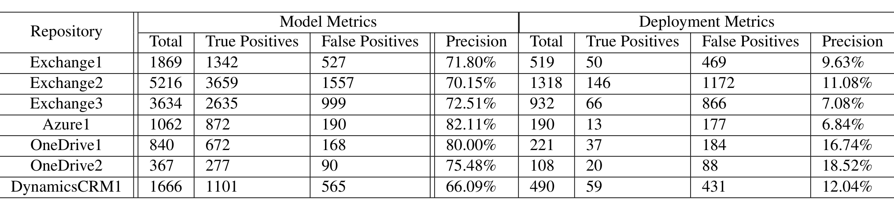
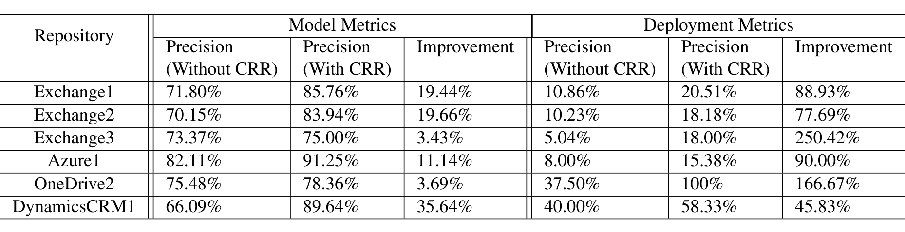

Table 3: Model and Deployment Precision for Change-Rule Discovery

Table 4: Improvement in Model and Deployment precision with Change-rule refinement (CRR) over Change-rule discovery

### 7.3 Performance

The suggestion engine is relatively quick, taking approximately 2 seconds to evaluate a pull-request and make a suggestion. In this section, we explore the time it takes to perform the tuning operation across all repositories. This is the most expensive step in the Rex pipeline since it involves multiple runs of the association rule mining algorithm.

Figure 7 shows the tuning time against the size of the repository. Note that both axes are on a logarithmic scale. The largest repository with about 100,000 files also takes 370 seconds to tune the model. The two red points in the graph are outliers. They take significantly longer to tune than the other repositories of similar size as the average number of files in each commit is more than other repositories and so each round of association rule mining takes longer.

## 8 User Study

To understand the relevance of Rex, we performed an extensive user study by sending emails to 328 engineers working across 5 of the repositories on which Rex is deployed. The user study was conducted in three phases:

**Phase 1:** When we manually examined Rex’s suggestions in deployment, we noticed that often, users did not accept some suggestions even though they seemed useful. We therefore asked 30 engineers from 3 teams to subjectively comment on the utility of Rex’s suggestions. From their responses, we categorized the suggestions into three categories:

> 1. Accepted: Some suggestions clearly point out file-changes that are absolutely required and if not acted upon, will lead to bugs/build failures/service disruption. Example 6 in Table 1 shows an example. If the engineer alters a function signature in a script, then they also have to change the way they call the function from another script. Else, service deployment will fail. Engineers usually act on such suggestions. These are what constitute Rex true-positives.
>
> 2. Relevant but not accepted: These are suggestions that engineers find useful but do not act upon. For instance, some rules capture the association of test files with core functional code (Example 1 in Table 1). When an engineer makes changes to code by adding a new feature, Rex often recommends editing the test file. While the suggestion makes the engineer consider it, they may not do so, either because the test will delay deployment, or because they decide to add it later. Another example is Example 5 where Rex will make the suggestion, but is unable to infer that the suggestion is valid only if the line-number of the offending code changes. It is up to the engineer to decide if they have indeed changed the line-number of the offending code, and if not, they will not act on the suggestion. However it is still useful since it brought the engineer’s attention to the issue.
>
> 3. Irrelevant: These suggestions are not relevant to the engineers and thus are not acted upon. For instance, when an engineer is working on a new project, they modify the project configuration file very often, mostly adding new references. Rex therefore learns a lot of spurious change-rules that associate code files with the configuration file. With time, the engineer stops adding reference files, and hence, most suggestions