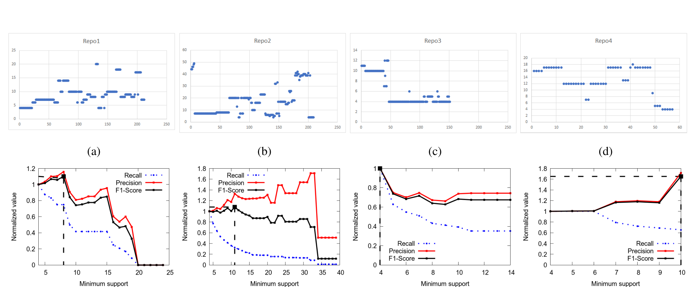
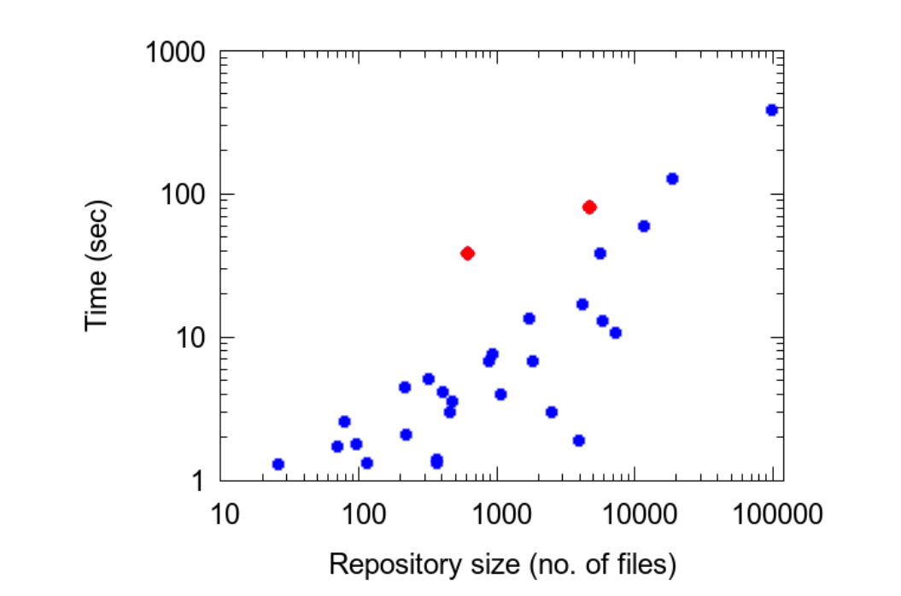

(a) (b) (c) (d)

(e) (f) (g) (h)

Figure 6: For four repositories, the top row shows how s_min varies with time. For each repository, the bottom row shows the precision, recall and F1-score as a function of s_min. The black square on the F1-score plot shows the maximum F1-score.

Figure 7: Tuning time vs repository size

based on this change-rule are irrelevant. Since Rex retrains its model regularly, it does eventually drop this change-rule.

Phase 2: Rex true-positives or suggestions that were accepted can be easily estimated by tracking files that got changed in the later iterations of the pull-request. False-positives, on the other hand, may either be relevant or irrelevant. To understand what fraction of false-positives may still be relevant, we sent emails to 263 engineers who had not accepted Rex’s suggestions. We asked them to categorize Rex’s suggestion they saw into one of four categories:

1. The recommendation was relevant but you could not act upon it for some reason.
2. The recommendation was relevant in general but not in this case. Yet, it helped to think through the suggestion.

3. The recommendation was relevant in general but not in this case. You’d rather not have seen the suggestion.
4. The recommendation was not relevant at all.

We received a total of 156 responses. 99 engineers selected the first or second option, i.e., they found the suggestions relevant, i.e., in 99 out of 156 cases, even though Rex’s suggestion was a false-positive, it was still useful to the engineer.

Phase 3: We also used feedback from users to understand the impact of Rex suggestions that were accepted. What if Rex had not made those suggestions and the engineer did not make the correlated changes? To understand this, we sent emails to 65 engineers who had accepted Rex suggestions (true-positives). We provided them with the following options:

1. The recommendation was relevant and had the file not been edited, it could have (broken the build)/(led to service disruption)/(introduced a bug). [High Impact]
2. The recommendation was good to have but the impact of not editing the suggested file would be low. [Low Impact/Good to have]

We received a total of 16 responses. 7 engineers chose option 1. We quote some of their comments here:

"In fact, without the suggested change, the code would not have worked."

"If the file is not edited, the build would have failed."

"The suggestion was valid and saved later service disruptions and time."

9 engineers found the suggestion having low impact but without that change, code quality would have been impacted negatively. Some of the responses from engineers include: