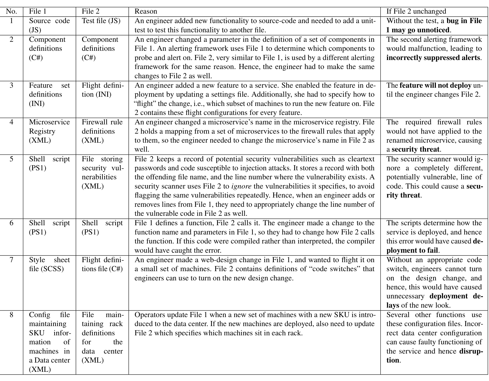

Table 1: This table describes some real examples of correlated changes that engineers missed and Rex flagged in our deployments. The Reason column captures why the two files are correlated. The last column describes what may have happened, had Rex not flagged the issue and notified the engineer.

## 2.4 Testing

Example 1 shows that, when an engineer adds a new feature to code, they should consider adding a new test for that feature in a separate file that contains only tests. While this is fairly common across multiple code-bases and services, each code-base has its own organization structure for separating test code from the main production code. Rex automatically detects such structures without any manual input.

## 2.5 Scripting

Often, administrators use scripts to test and deploy services. These scripts can have complex inter-dependencies which, unlike compiled code, can go unchecked at commit-time. For instance, in Example 6, an engineer changed a function definition in one script and hence they had to change the way the function was called in another script. Rex caught this issue, while existing IDEs and compilers could not.

## 2.6 Miscellaneous

Apart from the categories we have mentioned so far, Rex also flags somewhat rare cases of correlation which can have high impact. In Example 5, File 2 maintains a list of line-numbers of vulnerable code across different files in the code-base. The idea is to maintain a record of all vulnerabilities that have already been found and vetted by engineers. Thus, when an engineer adds n lines of code to File 1, they also changed the line number of the vulnerable code in File 1. Hence they need to increment the line number in File 2 by n. While such categories of correlations are rare, we notice multiple such rare cases. This further confirms the value of using a learning-