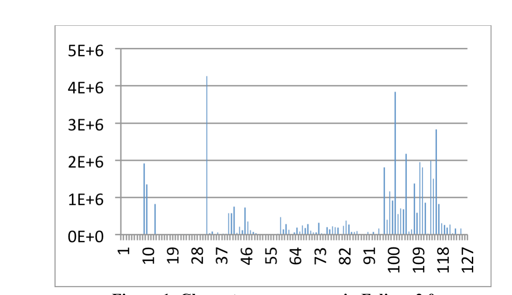
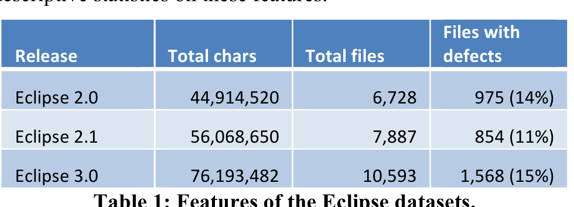
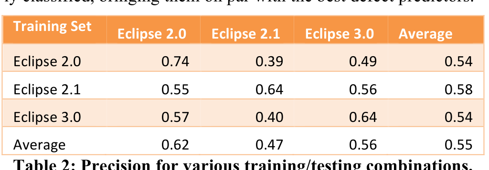
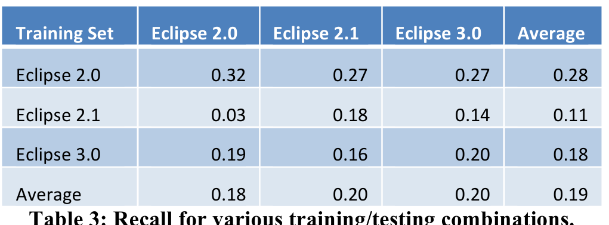

Figure 1: Character occurrences in Eclipse 2.0

style of interaction is especially interesting, as its effect is immediately reflected in the program artifacts being created. Indeed, we can interpret source code as the product of a long sequence of keystrokes, immediately visible in the program text.

One may argue at this point that this again is too much of an abstraction, as the final product (the source code) would not conserve all the editing actions that lead to it. When it comes to actionable consequences, though, treating source code as a product of keystrokes has several advantages, as we shall see later in this paper. Let us thus formulate our research hypotheses:

H1. We can predict defects from programmer actions.

Should H1 hold, we can test the next hypothesis:

H2. We can isolate defect-prone programmer actions.

These failure-correlated actions are what we call IROPs, which is an airline industry acronym for “irregular operation”. (IROP also refers to the four most important features to avoid in source code, as detailed in Section 3.5.)

Good predictive power and actionable results lead to our final hypothesis, stating the ultimate goal of our research:

H3. We can prevent defects by restricting programmer actions.

## 3. EVALUATION

### 3.1 Study Subject

The key challenge for empirical research is to find appropriate data sets that would allow linking failures to program features. To encourage replication and public assessment, we selected the publicly available Eclipse bug dataset [1] [2] for our studies. It maps between 6,729 files (for Eclipse 2.0) and 10,593 files (Eclipse 3.0) to the number of pre- and post-release defects found and fixed in each file.

### 3.2 Independent Variables

For our investigation, we needed to establish a relation between specific actions and defects. For this purpose, we modeled a programmer action as one of 256 possible keystrokes, one for each 8-bit ASCII character. The result of these keystrokes is easily measured by the number of occurrences in individual source code files. Figure 1 shows the distribution of characters 1–127 across all files in Eclipse 2.0; space (ASCII code 32) is the most frequent character, followed by “e” (101), and “t” (116), which also happen to be the most frequent letters in the English language. Note that while there is a clear bias towards printable and blank 7-bit characters, there is nothing to assume that such a bias would be specific to Eclipse source code.

### 3.3 Dependent Variables

Our dependent variable in this setting is whether a file would be defect-prone or not. We only care for post-release defects, as these would be the ones impacting actual users. Table 1 provides descriptive statistics on these features.

Eclipse 3.0 76,193,482 10,593 1,568 (15%)  
Table 1: Features of the Eclipse datasets.

### 3.4 Predicting Defects by Actions

We start with a standard research question, namely asking whether programmer actions predict the defect-proneness of files. For this purpose, we replicated a standard setting, training a model from a set of features (c, d) for each file f. Here, c would be a 256-tuple denoting the occurrence counts over all 256 characters in f, and d would be a Boolean value expressing whether f has had a defect fixed in the past or not. Our null hypothesis would be:

H0. A character distribution is not sufficient to predict defect-proneness.

In our experiment, we used a logistic regression model, as provided by the R statistical package. Having trained the model on one of the Eclipse datasets, we used it to classify files f' in the other data sets whether they would contain defects or not. Table 2 lists the precision we obtained for our experiments. For instance, training the model on Eclipse 2.0 (first row) and predicting whether files would be defect-prone in Eclipse 2.1 yields a precision of 0.39 – that is, 39% of all files predicted to be defect-prone actually are defect-prone. Note that this is the worst of all precisions observed; on average, more than 50% of all files are correctly classified, bringing them on par with the best defect predictors.

Average 0.62 0.47 0.56 0.55  
Table 2: Precision for various training/testing combinations.

One feature we found striking was how well the model performed when used within one release of Eclipse only. This setting is particularly important when applying the prediction during development of a release – in a way, “training on the job”. When applied within Eclipse 2.0 only, the precision is 74%, which makes this a highly useful prediction tool.

Average 0.18 0.20 0.20 0.19  
Table 3: Recall for various training/testing combinations.

In terms of recall, our approach fares less well (Table 3), but this is a feature (or problem) shared with most defect predictors. Still, applied within Eclipse 2.0, our approach correctly identifies 32%