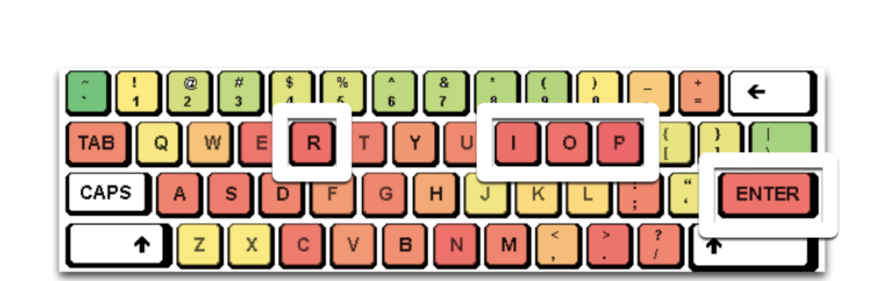
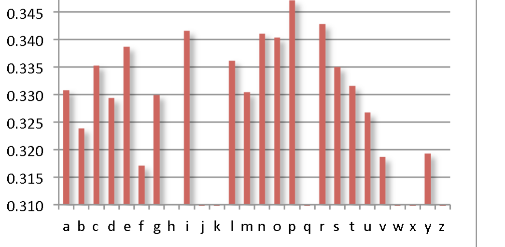

Figure 2: Color-coding keys by their defect correlation; (red = strong). The five strongest correlations are highlighted.

> Programmer actions (keystrokes used to create source code)  
> serve as excellent defect predictors, with a precision of  
> up to 74% and a recall of up to 32%.

### 3.5 Programmer Actions and Defects

Now that we know how to predict defects, can we actually prevent them? Of course, we could focus quality assurance on those files predicted as most defect-prone. But are there also constructive ways to avoid these defects? Is there a general rule to learn?

For this purpose, let us now focus on H2: Is there a correlation between individual actions (= keystrokes) and defects? For this purpose, we would search for correlations between the count of the 256 characters and the overall post-defect count per file; our null hypothesis would be:

H0. There is no correlation between character distribution and defect-proneness.

After a number of preliminary experiments, we focused on the Eclipse 3.0 dataset. It is well known that most metrics of software do not follow a normal distribution and our measures of keystrokes are no exception. The distributions of characters appear to have an exponential rather than a power-law character. Nonetheless, due to the heavily skewed distribution, we used a standard non-parametric approach with the Spearman rank correlation. Of course, with so many metrics (one for each character), we run the risk of identifying spurious correlations, and we thus employed p-value adjustment using Benjamini-Hochberg p-value correction [3] to deal with this multiple hypothesis testing. In order to be conservative in our findings and avoid Type I errors, we used a p-value cutoff of α = 0.01 for statistical significance [4]. Even after taking these rigorous steps, all letters and digits showed a statistically significant positive correlation with failures.

For the non-printable characters, this correlation is strongest for the newline character (0.34). The correlation with newline characters is not surprising: given a constant defect density, a file with more lines would be assumed to also have more defects. For the printable characters, though, we observed the highest correlation for the lower-case letters “i” (0.34), “r” (0.34), “o” (0.34), and “p” (0.35) — in other words, the more of these letters one would have in a file, the higher the defect count. This is the more interesting as these letters do not rank in the most frequently used English letters; this is also in sharp contrast to characters such as “%” (0.06) or the uppercase “Z” (0.19). Figure 3 lists the correlations for the individual lower-case letters.

Figure 3: Defect correlation for the 26 lower-case letters.

> Our results show a strong correlation between specific programmer actions (keystrokes I, R, O, and P) and defects.

This high correlation for the specific letters “i” (0.34), “r” (0.34), “o” (0.34), and “p” (0.35) came as a huge surprise to us; it is these specific letters that named our approach IROP. All reported correlations are statistically significant (p = 0.01), refuting H0 and confirming our hypothesis H2.

Our results show a strong correlation between specific programmer actions (keystrokes I, R, O, and P) and defects.

### 3.6 Preventing Defects

Correlations like the above give way to immediate action. Our first idea was to encode the defect likelihood as colors into the keyboard (Figure 2), such that programmers would be aware of the risk immediately when undertaking the specific action.

However, such an encoding on the keyboard would not impact professional programmers, in particular touch typists. Therefore, we constructed a special keyboard that would make it harder for programmers to undertake defect-prone actions (Figure 4). Note how the four letters of failure are conveniently removed, which forces programmers to rethink their actions and to search for alternatives.

We deployed this keyboard to three Microsoft interns in our group to carefully monitor its effect on defect reduction. It quickly

1 We also explored removing the “Enter” key, but experienced that this led to a sharp increase in the number of defects per line as well as a drop in productivity (measured as LOC/day). These effects will be explored in future research.