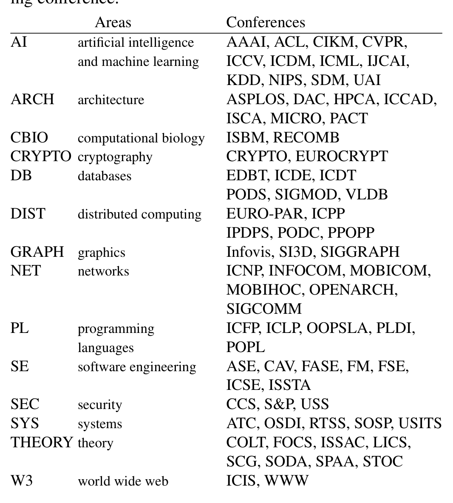
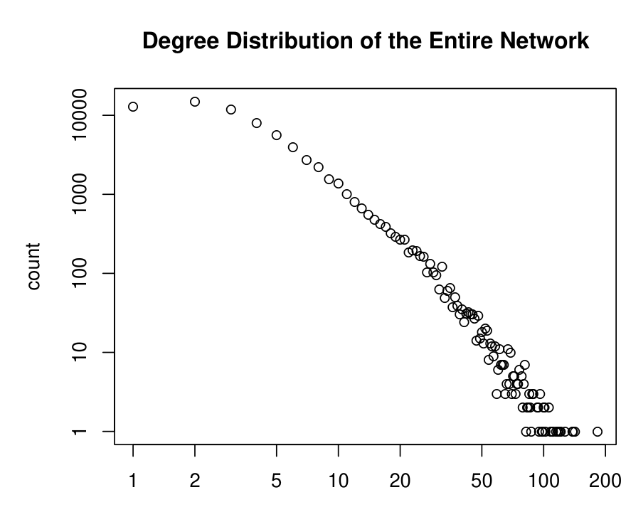
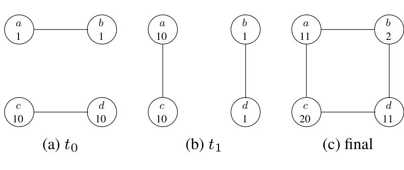
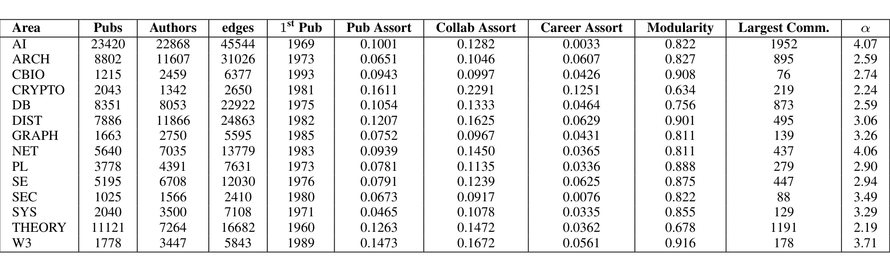
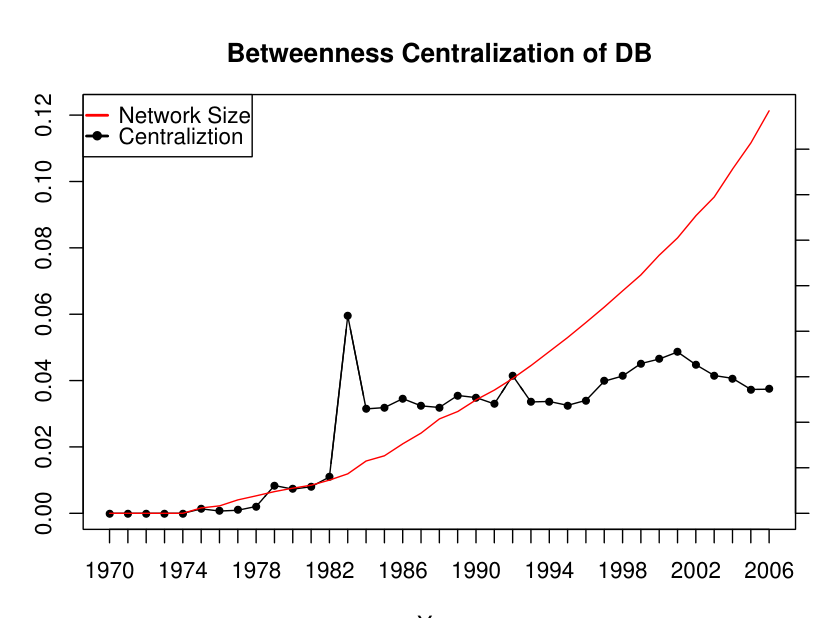
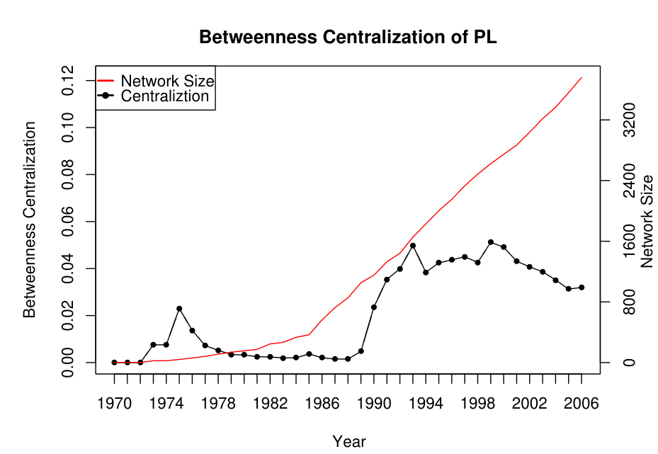
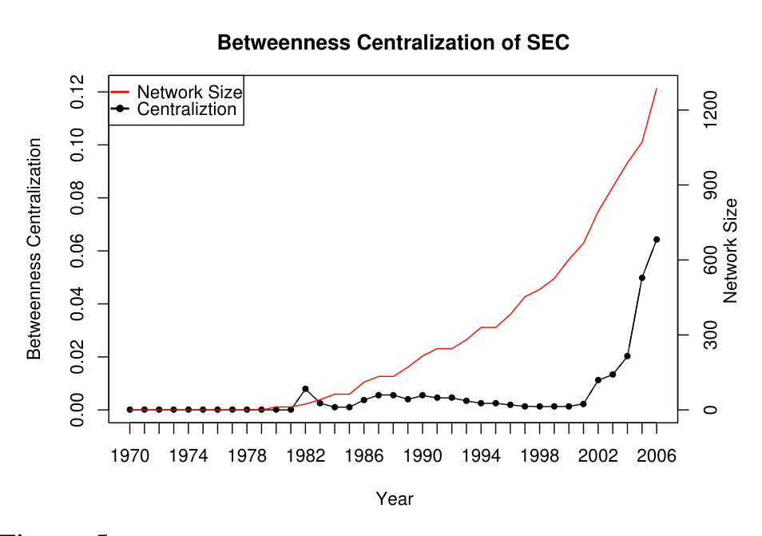
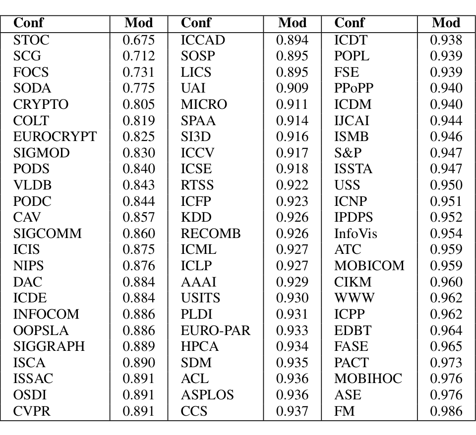
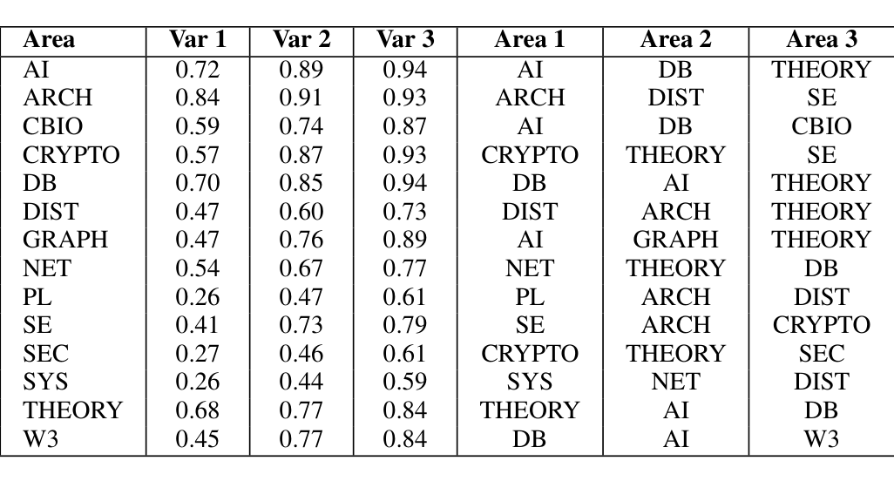
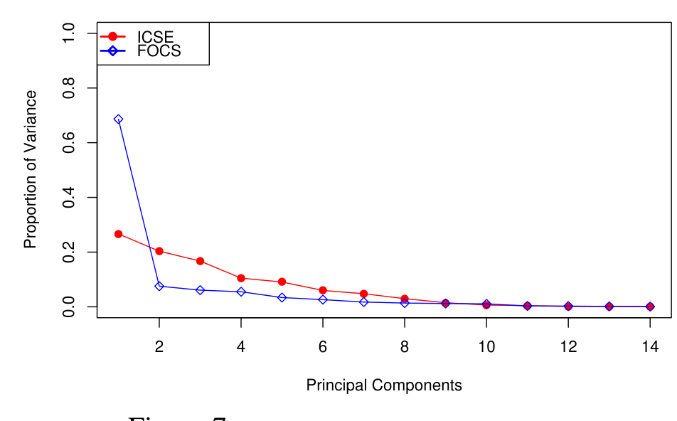

## Structure and Dynamics of Research Collaboration in Computer Science

Christian Bird, Earl Barr, Andre Nash  
Premkumar Devanbu, Vladimir Filkov, Zhendong Su  
Department of Computer Science  
University of California, Davis  
{cabird, etbarr, alnash, ptdevanbu, vfilkov, su}@ucdavis.edu

### Abstract

Complex systems exhibit emergent patterns of behavior at different levels of organization. Powerful network analysis methods, developed in physics and social sciences, have been successfully used to tease out patterns that relate to community structure and network dynamics. In this paper, we mine the complex network of collaboration relationships in computer science, and adapt these network analysis methods to study collaboration and interdisciplinary research at the individual, within-area, and network-wide levels.

We start with a collaboration graph extracted from the DBLP bibliographic database and use extrinsic data to define research areas within computer science. Using topological measures on the collaboration graph, we find significant differences in the behavior of individuals among areas based on their collaboration patterns. We use community structure analysis, betweenness centralization, and longitudinal assortativity as metrics within each area to determine how centralized, integrated, and cohesive they are. Of special interest is how research areas change with time. We longitudinally examine the area overlap and migration patterns of authors, and empirically confirm some computer science folklore.

We also examine the degree to which the research areas and their key conferences are interdisciplinary. We find that data mining and software engineering are very interdisciplinary while theory and cryptography are not. Specifically, it appears that SDM and ICSE attract authors who publish in many areas while FOCS and STOC do not. We also examine isolation both within and between areas. One interesting discovery is that cryptography is highly isolated within the larger computer science community, but densely interconnected within itself.

### 1 Background and Motivation

Computer science is a diverse and growing area of scholarly activity, with many subareas, such as artificial intelligence (AI), computational biology (CBIO), cryptography (CRYPTO), databases (DB), graphics (GRAPH), programming languages (PL), software engineering (SE), security (SEC), theory (THEORY), among others. Some of these areas are quite old, rooted in the earliest stirrings of the field (e.g., THEORY) and others started much later (e.g., GRAPH). Some are quite large, attracting a large number of researchers (e.g., DB and GRAPH) and others are smaller (e.g., CRYPTO and SE). Some are in a stable phase (e.g., THEORY); others are growing rapidly (e.g., SEC).

There are other, more subtle differences in character and style between areas. These differences, although they are currently not rigorously quantified, nevertheless may have important implications for the future of these areas. These differences are recognized by researchers working in the respective (or closely allied) areas, but have not been rigorously studied. For example, some of these areas are considered intellectually unified, while others are said to include several distinct, thriving groups. Some areas tend to interact strongly with others, with a tradition of mutual enrichment, and others are more stand-alone. Some areas are dominated by a few researchers, while others have a more diffuse collaborative structure. In some areas, older and younger researchers frequently collaborate, while in others, researchers collaborate primarily with others like them.

These informal, folkloric differences between areas are worthy of study, because such properties clearly can have a strong influence on the intellectual vibrancy and diversity of an area. In this paper, we begin to quantify and study these differences to produce data that may provide "actionable intelligence" for interested parties. For example, researchers (students, new faculty) might well consider these factors when deciding whether to enter (or leave) an area. Funding agencies (industries, government foundations) might consider the status and style of a field, choose to formulate Broad Area Announcements (BAAs) and Calls for Proposals to influence a field, for example, to become more interdisciplinary, or more intellectually diverse, or to spread their funding more broadly to increase centers of influence; contrariwise, they could design funding initiatives to reverse such trends if that seems appropriate.

---

How can we put these informal, folkloric differences on a sounder, more quantitatively rigorous footing? We claim that the solution lies in a range of different network analysis methods that have been developed in quantitative social science and statistical physics. We adapt these methods to analyze the differences between computer science areas, and identify areas that are more fragmented, more dominated by fewer researchers, more interdisciplinary, and so on. We use two broadly different classes of metrics: (1) one class characterizes individuals and their collaborative styles, and (2) the other characterizes the entire collaborative network of all the researchers in an area. Both of these two classes of experimental studies lead to observations that match well with folkloric beliefs and intuitions about the fields, and also indicate some surprising, perhaps worrisome, trends in some areas.

### Result Summary

This paper makes the following contributions:

- We bring a new set of methods from physics and mathematical social science to study the structure and evolution of collaboration patterns in the different areas of computer science. These include measures of centrality in networks, and principal component analysis of the publishing behavior of researchers in different areas. Our work illustrates the ability of these methods to tease out more subtle properties of collaborative networks, going well beyond the Pareto distributions of paper authorship and scale-free degree distributions in collaborations that earlier researchers have noticed. We also introduce new novel analysis methods such as longitudinal assortativity and area overlap.

- We compare different areas of computer science using several indicators of collaborative style: (1) How interdisciplinary are the fields? and (2) Are there well-defined sub-areas within each field? We find, for example, that programming languages (PL) and software engineering (SE) are quite interdisciplinary, whereas AI and architecture (ARCH) are not. We also find that a large area like databases (DB) is remarkably well-integrated, without isolated subgroups, whereas a smaller area, like software engineering (SE), is surprisingly fragmented.

- We study researchers and their collaborative patterns in each area. Do some researchers dominate some areas? Are some areas marked by assortative collaborations (where researchers tend to collaborate with others more like them)? We find, for example, that many areas go through periods where a few researchers dominate an area, but gradually evolve to a more diffuse collaborative network. However, one area—security (SEC)—in fact shows a rapidly increasing dominance by a few researchers. Some might argue that this is a worrisome trend in an area of vital national importance. We also notice that researchers in cryptography tend to be much more assortative than in other areas. This should perhaps raise concerns about the future health of this area [12,37].

### Paper Outline

The rest of the paper is structured as follows. After discussing closely related work (Section 2), we present our method of data collection (Section 3). In particular, we discuss which bibliographic database we use in our analysis, how we divide the computer science community into subareas, and how we extract collaboration networks from the DBLP data. Section 4 presents the analysis methods we use to examine collaborative styles in different areas and our findings, and Section 5 presents the methods and results of our analysis of how the areas interrelate in terms of author overlap and migration. We conclude in Section 6 with a discussion of possible future directions for further investigation.

## 2 Related Work

Newman [26,27] is among the earliest to study author collaboration networks from a number of sources, including physics and medical databases, and finds power-law distributions of papers per author, authors per paper, collaborators per author, and so on. He also analyzes “clustering” in these networks, which indicates that collaboration relationships are transitive. He also reports that these networks have surprisingly small diameters, for their size. Newman uses these global graph characteristics to compare distinct disciplines—biology, physics, and mathematics. We focus on a single community, computer science, and analyze its sub-community structure. Elmmacioglu and Lee [11] find that the collaboration network of DBLP authors has the same typical properties: a small diameter (about six), a Pareto distribution of papers published per author, and increasing levels of collaboration. The small-world properties of author collaborations have also been described, for databases (Nascimento [25]) and software engineering (Hassan and Holt [16]). Both papers also consider closeness centrality as a way of identifying the most important authors. Barabási et al. study the dynamics of collaboration networks [4] and report decreasing diameters. They also report that preferential attachment is a good model for the manner in which people acquire more collaborators. Ramasco et al. [36] also consider dynamics, but using a bipartite network of artifacts and authors. They define growth models to explain observed properties, such as degree distributions in the two-mode network, as well as degree–degree correlations across authorship edges: Do highly productive authors tend to write multiply-authored papers? Our own work on network dynamics considers the migration of researchers between different computer science subareas, rather than the emergent distributions.

---

of node properties.

Huang et al [18] construct a collaboration network from 1980 to 2005 from CiteSeer data and analyze it at various levels of granularity. They overcome the name ambiguity problem that we encountered in CiteSeer through the use of a novel technique [17] involving online support vector machine to calculate distances between authors and using an efficient clustering algorithm (DBSCAN). They report that the growth of the computer science collaboration network exhibits the small-world phenomenon. They divide publications into 6 topic spaces and compare and contrast the characteristics of these networks. A stochastic Poisson model for predicting future collaborations between authors (SPOT), which uses the neighborhood of an author in the collaboration network, is also introduced and evaluated. This model predicts future collaboration at a much higher level than through the use of Support Vector Regression. While our study also examines collaboration networks in a longitudinal fashion, we limit our analysis to top tier conferences (for reasons explained in the next section) and analyze relationships between topic areas such as overlap and migration of authors. We also examine within-area characteristics such as betweenness centralization and modularity.

Backstrom et al [3] use DBLP data in their examination of community growth. They find that the community growth (based on the use of a conference as a community) is influenced by key structural properties of the network such as community size, number of collaborators on the network fringe, and average distance between collaborators. They use a decision tree to determine which properties are most important. They also examine how "hot" topics move between conferences, detect topic bursts over time based on terms used in paper titles, and use this data to see how topically aligned conferences are based on their relationship to topics chronologically.

Liu et al [23] consider the social network of digital library researchers, and use several metrics, including traditional social network measures, and a variant of PageRank, called author rank. They find that high scores correspond well with service on program committees. Rahm and Thor [35] focus on citations for papers in the area of databases, and among other findings, report that conferences in the database area have much more impact than journals. Mohan and Srikant [24] focus on nurturance, wherein they assess researchers by the degree of success achieved by those they mentor. They consider both the activity (number of papers) and impact (number of citations) of mentees in gauging the level of nurturance provided by a mentor. Researchers in organizational science, such as Liebeskind et al [22], have studied the impact of collaboration networks on technology diffusion in businesses.

Our own work on community structure is preceded by Girvan and Newman [14]. They describe an automated clustering procedure that uses the strength and topology of network connections to separate networks into sub-components that are strongly connected within themselves and more weakly to each other. They show that this approach discovers intrinsic disciplinary boundaries within the collaboration network of researchers within a large government laboratory in the United States. Other researchers have also studied the extent to which one type of relationship (e.g., collaboration) influences another (e.g., disciplinary overlap). Cai et al. [6] consider heterogeneous networks with different types of links (e.g., each type corresponding to the collaboration on papers in a specific conference). The task they are interested in is to see whether a given partition of the network can be expressed as a linear combination of the strengths of the different types of links. This approach can be used to determine whether the presence (or absence) of one type of relationship can be explained by the presence (or absence) of a combination of other types of relationships.

Our work is also related to work on topic discovery using bibliographic databases. Topic discovery is a burgeoning field of research, where "a topic is a semantic unit that can function as a basic building block of knowledge discovery" [19]. Our work analyzes sub-communities of computer science, or areas, extrinsically defined as sets of conferences. In terms of topics, these areas span a range of topics. Our concern is the network properties of these areas, not their constituent topics. Our belief is that these properties can elucidate how collaboration, independent of topics, occurs within the larger computer science community.

### 3 Data Collection

To perform our analysis, we first need to select a publicly available bibliographic data source. After an analysis of the bibliographic data available from various public data sources, such as Google Scholar, CiteSeer, and DBLP, we found that all suffer from author name problems. These include cases where multiple authors have the same name, and where the same author may have multiple names. However, DBLP bibliographic information is maintained via massive human effort with special attention paid to important issues such as author name consistency [21]. In contrast, CiteSeer and Google Scholar harvest information in a more automated "search engine" manner [20]. Fortunately, the DBLP data is publicly available in XML form which is easily parsed and can be found at http://dblp.uni-trier.de/xml/. We downloaded the DBLP XML dump as of February 4th, 2008, parsed the data, and stored it in a MySQL database for easy access and retrieval.

Although the DBLP data is fairly accurate, it still suffers to some degree from the name consistency problem. We therefore used heuristics such as text similarity of names, number of collaborators in common, number of publication venues in common, and dates of publication to identify pairs of names that are likely the same author. The results of this analysis were manually inspected and correct matches.

---

of names were added to our database to increase accuracy.

As our goal is to investigate whether there are different styles of collaboration among subareas of computer science and as well as how these areas interrelate, we need a mechanism to divide the large computer science community into subareas. For this purpose, we define the research areas in computer science as sets of first tier conferences. We restrict our definition to first tier conferences as practitioners are more likely to associate these conferences with a single area and, further, such assignments are both less controversial and better known than those for up and coming conferences. The results of our analyses are highly sensitive to the mapping of first tier conferences into areas. To determine these assignments, we surveyed expert opinion and consulted Citeseer’s impact rating [5,7,41].

Table 1 shows the areas of computer science research that we investigate. We manually validated DBLP’s assignment of papers to conferences as follows: Because some conferences change their name, we examined several papers in each conference and year to discover the name used that year. Then we histogrammed the counts of papers for each conference and year, looking for and fixing any irregularities. As an example, we found that some papers marked as FSE were from Fast Software Encryption, a cryptography and security conference, while others were published in Foundations of Software Engineering, a software engineering conference.

> **Image description:** A two-column table that maps 14 computer-science subareas (left column: short codes and full names) to the sets of first‑tier conferences used to define each area (right column). Examples shown include AI (artificial intelligence and machine learning) → AAAI, ACL, CVPR, ICML, NIPS, KDD, SDM; DB (databases) → PODS, SIGMOD, VLDB, EDBT; THEORY → FOCS, STOC, SODA; SE (software engineering) → ICSE, FSE, ASE. This conference-to-area assignment was used to extract area-specific publication sets from DBLP and forms the basis for the paper’s analyses of overlap, migration, interdisciplinarity, and within-area collaboration structure.

Table 1: Areas and Conferences

Once the process of assigning papers to conferences and identifying top tier conferences in each area was complete, we created the collaboration graphs. In all, there were 76,598 distinct authors, 83,587 papers, and 194,243 collaboration pairs (where we count a collaboration between author a and b only once even if they have collaborated on multiple papers). Let C(p) represent some predicate or constraint on papers that identifies only those publications that we are interested in. An example is “publications in the area of Machine Learning in 2003.” Let P be the set of all papers, A be the set of all authors, and let W(a,p) be a predicate that is true if and only if author a is an author, or writer, of paper p. We then create the graph G = (V, E) as follows:

(3.1)
V = {a : a ∈ A, p ∈ P, C(p) ∧ W(a,p)}

(3.2)
E = {(a,b) : a, b ∈ V, p ∈ P, C(p) ∧ W(a,p) ∧ W(b,p)}

Thus, each node in a graph is an author and each edge connects two authors who have collaborated on a paper for which the constraint C is true. It is important to note the edges in these graphs are undirected. Furthermore, we can weight the edges based on the number of papers that the two authors have collaborated on. The graphs that result from various choices of C represent the data used in our network analyses.

In the following sections, we explain the various forms of analysis we performed on the collaboration graphs we extract, before we present the results of each analysis. We found ample evidence for folkloric beliefs in our results, but here present only a subset of those results due to space constraints. For completeness and repeatability, comprehensive figures, data and code for each research area and analytic method can be found at http://janus.cs.ucdavis.edu/~cabird/sdm09/. Finally, we include information necessary for repeatability such as locations of public data, experimental parameters, and tools used.

## 4 Within-Area Analysis

We seek an understanding of the differences between the various sub-disciplines of computer science research by examining the collaboration graphs for each area in isolation. In this section, we first describe the measures from complex network theory that we employ to characterize the area networks, then the results we obtained from applying them.

### 4.1 Degree Distribution

The importance of node degree to the whole-network behavior is well-studied and understood, especially for highly connected vertices, or hubs [1]. Naturally occurring networks have long-tailed node degree distributions, i.e., hubs do occur in them. Growth models, most notably preferential attachment, have been proposed that explain such distributions from first principles. We have found that the computer science collaboration network, and the networks of its sub-areas, both manifest the same long-

---

tailed, power-law-like degree distributions that previously studied social networks exhibit. In fact, the degree distributions of the sub-areas are almost identical, save for a scaling factor, and thus do not make good discriminators in our case. We demonstrate the scale-free nature of these networks by showing the degree distribution for the entire collaboration network in figure 1 and include the exponent of the best power law fit, α, for each area in table 2. The best fit α was obtained according to the methods from Clauset et al. [9] using code obtained from them.

> **Image description:** A log–log scatter plot of author degree (number of collaborators) versus the count of authors in the full collaboration network constructed from first‑tier DBLP publications. The y‑axis (count) spans roughly 1 to over 100,000 and the x‑axis degrees range from 1 up to about 200; most authors have very low degree while a few have very high degree. Points form an approximately straight, negative slope on the log–log axes, illustrating the paper’s observation of a long‑tailed, power‑law–like (scale‑free) degree distribution for the collaboration network.

Figure 1: Degree distribution of authors in the collaboration network from first-tier publications in DBLP

In naturally occurring networks, edges (or interactions) depend not only on the vertex degree distribution but also on the connectivities of the vertex neighbors, i.e., there is apparent statistical dependence in the joint degree–degree probability distribution [28]. To better characterize networks in terms of node–node interactions, a number of network measures have been developed that capture effects beyond the first-order degree distributions. We describe and use them next.

### 4.2 Assortativity

Assortative mixing in networks is the tendency of vertices to be connected to like vertices. For example, highly connected vertices may be joined to other highly connected vertices more often than to lowly connected ones [28]. Scalar vertex properties other than degree can be used to assess how much alike are vertices in the network, so long as they are discrete or enumerative.

Here we follow the formal definitions from Newman [28]. We define a set of properties over a graph’s vertices; in our graph, these properties include degree and the author’s career length. Each vertex is labeled with its value for each property, e.g., a vertex of degree 4 has a label with the value 4. Let e_xy be the fraction of all edges in the graph that start at a vertex labeled x and end at a vertex labeled y. e is known as the mixing matrix. For undirected networks e_xy = e_yx. Let a_x be the fraction of all edge ends incident to a vertex labeled x. By definition, ∑_y e_xy = a_x and ∑_x a_x = 1.

Assortativity is the Pearson correlation coefficient of the property values of any two vertices connected by an edge:

r = (∑_{x,y} x y (e_{xy} − a_x a_y)) / σ_a^2,

where σ_a^2 is the variance in the distribution of a_x. The assortativity ranges from 1, which indicates that all vertices are connected only to vertices that have similar values for that property, to −1, which indicates a perfect negative correlation in the values of connected vertices. For example, social networks (like collaboration and coauthorship graphs) typically have positive degree assortativity, while technological and biological networks have negative degree assortativity [28].

### 4.3 Longitudinal Assortativity

Assortativity is a static measure of a graph at a particular point in time; it does not incorporate longitudinal data, i.e., graph evolution. We propose longitudinal assortativity to measure the correlation of dynamic properties of nodes at the time that an edge is created (i.e., a collaboration occurs). To apply this metric, we timestamp edges and vertex properties (such as career length or number of publications) when they change or are added. We associate a single timestamp with each edge, so our collaboration graph becomes a multigraph with an edge for each collaboration between two authors. We then use these timestamps to decompose the multigraph into the sequence of multigraphs from which it evolved. Each multigraph in this sequence contains only those property values and edges whose timestamp is earlier than the point in time under consideration. Since a property may have many values whose timestamp is less than a given time, we take the value with the greatest timestamp. The sequence of multigraphs formed by updates itself forms a multigraph in which each multigraph in the sequence is a disconnected component. Longitudinal assortativity returns the value of applying assortativity to this multigraph.

> **Image description:** Three small panels show the same four authors across two time steps and the aggregated graph. (a) At t0 two disjoint collaborations exist: a–b with each author labeled 1, and c–d with each labeled 10. (b) At t1 the collaborations cross differently: a–c (both labeled 10) and b–d (both labeled 1). (c) The final, time‑aggregated graph unions edges from (a) and (b), yielding node totals a=11, b=2, c=20, d=11 and a 4‑cycle of edges that pair high‑ and low‑count nodes so the usual (static) assortativity is near zero; decomposing the graph by time (longitudinal assortativity) recovers the perfect homophily present at each step (value 1).

Figure 2: Longitudinal Assortativity

Consider a small collaboration graph with 4 authors in Figure 2c. The value at each node is number of publications. Figure 2c evolved from Figure 2a in time step t0 and Figure 2b in time step t1. In Figure 2a, authors a and b wrote a single paper together, while c and d wrote 10; in Figure 2b,

---

authors a and c publish 10, while b and d publish one. Notice that at each time step, edges form between identical nodes. However, this fact is lost when we calculate the assortativity of Figure 2c: its assortativity is 0, since it connects an author with a low publication count to two authors with medium counts, and those two in turn to a single author with a high number of publications. Longitudinal assortativity, in contrast, decomposes Figure 2c into Figures 2a and 2b, returns 1, capturing the fact that publishing activity occurred between identical nodes in the evolution of Figure 2c.

### RESULTS:
Here, we assess the degree to which computer scientists in different research areas tend to publish with collaborators who are similar to them. We do this by calculating the longitudinal assortativity over the three properties: number of publications, number of collaborators, and career length (since first publication). The property at each time-stamp represents the cumulative value of the property up to that time (i.e. the number of publications in 1989 is the total number an author has published up to 1989). A high value of assortativity for the number of publications, for example, indicates that researchers in the graph with high publication counts work mainly with other high publication count researchers, while researchers who have few publications collaborate with each other. Similarly, a negative value of assortativity for career length indicates that those who have published for many years often collaborate with authors who have only been working in the field for a short time. Note that each paper produces a clique of authors. While we would expect to see negative assortativity in this graph with professors commonly working with students, it is surprising that the assortativity is low, but positive. A scenario in which one professor published one paper with each of his students would lead to a star configuration and negative assortativity, while a paper with 3 professors and 3 students (like this one) would lead to a 6-clique and draw the assortativity closer to 0. We hypothesize that the assortativity of researchers based on these measures is different in the different subdisciplines of computer science.

Table 2 presents longitudinal assortativity values per area, for each of the three properties. Here, assortativity based on number of collaborators represents the degree assortativity that is commonly measured in social networks. Unlike most social networks in which the assortativity is positive and generally quite large [33], the level of assortativity is low in most areas in our collaboration network. While CRYPTO’s assortativity is still low at .22, its difference from the mean is notable. Discussions with established researchers in cryptography, and some of our own experience working in the area indicate that cryptography is a field in which senior researchers tend to collaborate with other senior researchers. There are some reasons for this: the field is very technical, and has a high barrier to entry for junior researchers and outsiders; however, the high level of assortativity casts doubt on the future vibrancy and dynamism of the field, and suggests that greater efforts by established cryptographers to improve training of, and outreach to, newcomers might be called for.

## 4.4 Betweenness Centralization
Betweenness centrality is a measure of the global status of a given vertex in a network [13, 38]; it is a measure of the proportion of geodesics that flow through a given vertex. A geodesic is a shortest path between two vertices. In a connected, undirected graph with n vertices, there are at least n(n − 1) geodesics. This is a lower bound because there may be two shortest paths of equal length between a pair of vertices. The betweenness centrality of a vertex in a graph is calculated as the number of geodesics passing through that vertex. In social networks, actors with high betweenness represent gatekeepers or information brokers because they lie along many paths of information flow [38]. An author that is the sole link between two groups of researchers will have high betweenness even if his actual degree is relatively low. There are a range of centrality metrics, all of which gauge the role played by a vertex in the networks; betweenness centrality measures the degree to which an individual mediates information and power flow in a social network. In a collaborative network, where ideas and influence flow between collaborating authors, an individual with very high betweenness plays a key role in mediating the transfer of ideas and influence within the collaborative network.

While centrality is a property of individuals, centralization is a property of a network, which measures the relative difference between the highest and lowest values for the centrality metric over all vertices in the graph. Collaboration networks with high centralization have a few highly dominant researchers, while lower centralization values indicate a more integrated community where each author is relatively equal in their centrality scores. Given a centrality metric of vertices in a network, it is straightforward to calculate the centralization for the entire network. Let b_v(v_i) be the betweenness value of vertex v_i and let v* be the vertex with the highest betweenness in the graph. The betweenness centralization b_g of the entire graph is

(4.4) b_g = (sum_{i=1}^n (b_v(v*) − b_v(v_i))) / (n^3 − 4n^2 + 5n − 2)

The numerator is the sum of differences of each vertex’s betweenness centrality from the highest centrality score. The denominator represents the maximum theoretical value of the sum of differences for a graph with n vertices, which obtains when the graph is in a star configuration. For further details, please see the original paper by Freeman [13] and the classic text by Wassermann and Faust [38]. High betweenness centralization in a network indicates that there are a few individuals who have a great deal of importance in

---

> **Image description:** The table reports per-area collaboration statistics for 14 computer-science subfields: total publications (Pubs), distinct authors, collaboration edges, first publication year, three longitudinal assortativity measures (Pub Assort, Collab Assort, Career Assort), modularity, size of the largest detected community, and the power‑law exponent α for degree distribution. It shows AI as the largest area (23,420 pubs, 22,868 authors, 45,544 edges) and THEORY as the oldest (first pub 1960); largest community sizes are proportional to area size (e.g., AI: 1,952; THEORY: 1,191). Cryptography (CRYPTO) notably has the highest assortativity values (Pub 0.1611, Collab 0.2291, Career 0.1251) and a relatively low modularity (0.634), matching the paper’s finding that cryptographers tend to collaborate with similarly senior/high-output peers while being internally cohesive; by contrast, Systems (SYS) has the lowest publication assortativity (0.0465). Modularity varies from 0.634 (CRYPTO) to 0.916 (W3), indicating differing degrees of community fragmentation, and α ranges from about 2.19 (THEORY) to 4.07 (AI), indicating variation in the heaviness of degree-distribution tails across areas.

Table 2: Summary of the Within-Area metrics results. Shown are the values for assortativity for each area and the network as a whole (all) based on number of publications, collaborators, years since first publication, and modularity.

mediating the flow of information and influence through the network.

**RESULTS:** For most areas, betweenness centralization had an initial peak, an early period most likely dominated by pioneers, followed by a plateau signifying a more diffuse flow of information within the community as illustrated in Figure 3.

> **Image description:** Line chart showing betweenness centralization (black line with points) and network size (red curve) for the databases (DB) research area from 1970 to 2006. The centralization metric has a pronounced spike in the early 1980s (peaking around 0.06), then falls to roughly 0.02–0.04 and remains in that range with a smaller bump in the early 1990s and a modest peak near 0.05 around 2000 before a slight decline toward 2006; by contrast the red network-size curve grows steadily and steeply to about 0.12 by 2006. This visualizes the paper’s finding that DB experienced an early pioneer-dominated centralization episode followed by a sustained plateau in centralization even as the community (network size) continued to grow rapidly.

Figure 3: Centralization in databases shows a typical pattern: initial spike, followed by decrease and stabilization, as more researchers enter the field, and collaboration becomes more diffuse.

We superimposed population growth, which is superlinear, onto all plots to illustrate that this pattern is independent of the growth of the fields. Of interest are the two areas that did not follow the “peak-followed-by-plateau” pattern and we discuss them next.

Figure 4, which depicts betweenness centralization over time in PL, shows an initial peak, in 1975, followed by a long trough, then a second peak in 1993. To shed light on this phenomenon, we examined the raw data. The first peak can be explained by the research activity of Jeffrey Ullman whose research focused on parsing, dataflow, and compiler optimizations. As the seventies drew to a close, research in PL grew apace, but was no longer mediated by a few pioneers. Daniel Bobrow is the author with the highest betweenness in 1993.

> **Image description:** Time-series plot showing two overlaid series for the Programming Languages (PL) collaboration network: betweenness centralization (black points, left axis 0–0.12) and network size (red line, right axis up to ≈3,200 authors) from 1970 to 2006. Centralization has an early modest peak around 1974–1975 (~0.02), falls to near zero through the late 1970s and 1980s, then rises sharply around 1990 to a mid‑1990s peak near 0.05 (≈1993) before gradually declining to about 0.03 by 2006, while network size increases steadily (especially after 1990) from almost zero to several thousand authors. The paper explains the two centralization peaks as driven by a small number of highly bridging individuals (the first associated with Jeffrey Ullman and the second with Daniel Bobrow), illustrating how leadership/brokering roles produced transient centralization even as the field grew.

Figure 4: Centralization in PL shows an initial peak after which centralization falls into a valley before the normal pattern takes hold.

His publications are few, but span and integrate disparate topics within PL. For instance, he and his coauthors on “Common Loops: Merging Lisp and Object-Oriented Programming” bridge the functional and object-oriented subcommunities, while he and his coauthors on “Objects in Concurrent Logic Programming Languages” tie together research in objects, concurrency, and logic.

Figure 5 concerns the vital field of computer security. It shows the striking, rapid, and accelerating growth of the number of researchers in the field (almost doubling in size since 2002, to well over a thousand). Despite this tremendous growth in the number of active authors in the field, we find an even more dramatic, unrelenting increase in betweenness centralization in security starting in 2002 to 2006, the end of our data set. This trend centers on a small number of researchers: Perrig, Reiter, and Song, all from Carnegie‑Mellon University, who have dominated the top conferences in security — S&P, CCS, USENIX Security — since about 2001/2002 when all three joined CMU. The unusually high betweenness scores of these researchers indicates, as per social network theory (e.g., [39]) that these individuals are playing a key “brokering” role in the flow of information and ideas through the collaboration network. The high level of centralization, compared to other fields, indicates these in-

---

> **Image description:** This time-series chart plots betweenness centralization (left axis, 0–0.12) and network size (right axis, number of authors up to ~1,300) for the Security (SEC) area from 1970 to 2006. The red line shows network size: nearly zero in the 1970s–80s, modest growth through the 1990s, and a rapid rise after 2000 to over 1,200 authors by 2006. The black line with circular markers shows betweenness centralization: near zero with a small spike around 1982, then a pronounced increase beginning about 2002 and reaching roughly 0.06 by 2006. The paper links this concurrent increase in centralization and population to the growing dominance of a few high-betweenness researchers (notably Perrig, Reiter, and Song at CMU) who acted as brokers in SEC collaborations during the 2000s.

Figure 5: Centralization for Security shows an unusually rapid and continual growth in centralization, despite increasing number of researchers. Is this healthy?

Individuals have an unusually high level of importance; the continuing rapid growth of centralization indicates that their importance is increasing. In a field so central to the security and well-being of people and businesses, such a high and growing level of importance focused on a small number of researchers at a single institution is perhaps a cause for concern, and certainly worth further examination.

### 4.5 Community Structure

In 2002, Newman and Girvan introduced a quantitative notion of the community structure of a network, as “the division of network vertices into groups within which the network connections are dense, but between which they are sparser” [15]. Community structure has been investigated in many types of networks in recent years [2, 3, 30, 34] due to advances in methods of identifying these structures [8, 31, 40]. In our author collaboration network, strong community structure in an area indicates that the area consists of several distinct subgroups, each pursuing their own agenda, with stronger collaborations within the groups than between them. Weaker community structure in an area indicates an integrated group of researchers.

Community structure algorithms partition a network into groups of vertices, such that the connections within groups are dense and the connections between the groups are sparse. Newman & Girvan defined modularity, a measure that uses the density and sparsity of the groups’ intra- and inter-connections to quantify community structure strength [32]. We apply this measure to the research areas we are studying. Consider a partition of a network into k communities. Let us define a k × k matrix e whose element e_ij is the fraction of all edges in the network that link vertices in group i to vertices in group j. The row sum is a_i = ∑_j e_ij and the column sum is b_j = ∑_i e_ij. The modularity measure is

(4.5) Q = ∑_i (e_ii − a_i b_i)

Authorial collaboration is an undirected relationship. Thus our adjacency and partition matrices are symmetric and a_i = b_i. Q measures the fraction of the edges in the network that connect vertices within the same group minus the expected value of the same quantity in a network with the same community divisions, but random connections between the vertices (that is, the same division on a random network with the same degree distribution). Values for Q range from 0 (networks of essentially random structure) to 1.

Finding the partition that maximizes the modularity for a given network is an NP-complete problem [10]. Newman & Girvan’s method is approximate, but empirically effective [31]. We refer the reader to their paper for details of their algorithm.

Girvan & Newman’s original algorithm works well for binary networks, but not networks with weighted edges. Our networks contain weighted edges, representing the number of papers jointly authored by each pair of researchers. A weighted network can be represented as a parallel, or multi-edge, binary network. We modified their algorithm to handle such a parallel network, following the method described by Newman [29]. Our implementation is available to others wishing to use it.

RESULTS: In Table 3, we show the modularity, or degree of community structure for different conferences as well as the size of the largest identified community (largest comm. in the table). In each case, the size of the largest community is proportional to the size of the network, adding validation to the modularity values. One striking observation is that theoretical conferences, including the core theory conferences (STOC, FOCS), the algorithms conference (SODA), computational geometry (SCG), learning theory (COLT) and cryptography (CRYPTO, EUROCRYPT) all show the lowest levels of modularity, and thus are the most integrated. This is perhaps reflective of the lower geographic and conceptual barriers to collaborative research in the more theoretical areas. In theoretical areas, the underlying topics tend to have precise definitions, claims and arguments that can be more readily communicated during short meetings at conferences, or even over email. In less theoretical areas, there is more folklore and intuition that is harder to communicate and share. Therefore, we can expect that subcommunities will coalesce around co-located, or otherwise socially connected individuals. However, there are a few instances that we find surprising. For example, we do not know why PODS, SIGMOD, and VLDB appear to be so tightly integrated.

It should be noted that modularity is not simply a function of size; viz., larger communities aren’t naturally more modular than smaller ones. For example, while the cryptography community is quite small, both databases and theory are some of the largest communities. All of these are lower on the modularity scale.

In general, we believe that the community structure of

---

> **Image description:** A three-column table listing many top-tier computer science conferences alongside their modularity (Mod) scores (Newman’s Q) that quantify community structure within each conference. Scores span from 0.675 (STOC) up to 0.986 (FM), with low values (e.g., STOC 0.675, SCG 0.712, FOCS 0.731, SODA 0.775, CRYPTO 0.805) indicating well‑integrated communities and high values (e.g., PACT 0.973, MOBIHOC 0.976, ASE 0.976, FM 0.986) indicating strong fragmentation into subcommunities. The table shows theoretical venues and some large database conferences (SIGMOD 0.830, VLDB 0.843) tending toward lower modularity, while many systems and applied venues rank higher, supporting the paper’s claim that theoretical fields are more integrated and systems fields more fragmented.

Table 3: Community structure of different conferences. In general, theoretical conferences are the least modular, indicating that researchers in the field are well-integrated. Systems conferences tend to be more fragmented. Database conferences, while quite large, don't have significant sub-communities.

different fields can reveal a great deal about the intellectual fragmentation of an area. However, the interpretation of these communities requires specialized knowledge of the technical content and folklore of an area. We have therefore created visualizations depicting the communities in each conference and made them available at http://janus.cs.ucdavis.edu/~cabird/sdm09/.

It is important to note that analysis and interpretation is largely influenced by classification of areas within computer science and mapping of papers to these fields.

## 5 Network-wide Metrics

We are also interested in the relationship between the research areas in computer science, and how these relationships change over time. The explanation of these “Network-wide Metrics” are described below.

### 5.1 Area Overlap

Many researchers publish in more than one research area. We examine the relationship between areas that “share” authors by examining area overlap, the number of authors that have published in two areas during the same time period. Since we have the venue and area for each paper, calculating area overlap is fairly straightforward. Let a and b be two research areas in computer science and let A(a, t) be the set of authors who have published in area a during time period t. The area overlap is defined in terms of these two sets.

O_a(b, t) = |A(a, t) ∩ A(b, t)| / |A(a, t)|  (5.6)

This measure is an asymmetric ratio, normalized on the size of the area that we’re examining overlap for. We have defined it, rather than employ the symmetric Jaccard Index, because it better captures our intuitive notion of the overlap of one field with another and allows for relative comparison.

To see this, assume that in 1990 |PL| = 10, |AI| = 100, and |PL ∩ AI| = 5, while in 2000 |PL| = 20, |SEC| = 20, and |PL ∩ SEC| = 10. Under our index the overlap of PL with AI in 1990 and SEC in 2000 are both 0.5, indicating that in each case, half of the authors publishing in PL are also publishing in the other area as well. In contrast, the Jaccard Index yields 0.09 in 1990 and 0.33 in 2000, neither of which accurately reflects the overlap of PL with each area. We examine this measure across time to see how the relationship between various subdisciplines has changed and report our findings below.

### 5.2 Migration

The migration patterns of researchers over time are an interesting area of study that can give a high-level view of relationships between areas and longitudinal trends. We analyze migration patterns by assigning each researcher to a specific area for each year based on publication history and examining how their assigned areas change.

For each author, we create a score for each computer science research area based on past publication history that favors recent publications. The intuition behind this method is that an author’s publication history captures their interests, but those interests also change with time. For example, a prolific author may publish heavily in databases for 10 years, change interests, and publish strictly in graphics for the next 6. If we simply aggregated this author’s output, we could mis-classify her current area as databases when she is in fact focused on graphics. We therefore introduce a decay into the publication count in the following two scoring equations. Publications lose twenty percent of their weight with each year in the first score, while publications retain their full weight during their initial three years followed by a drop of a third each year thereafter in the second score. Let P(r, a, y) be the number of publications by author r in area a in year y. We calculate the research “score” for each author per area per year in the following two ways.

S1(r, a, y) = sum_{i=1}^5 P(r, a, y-i) * (6 - i) / 5  (5.7)

S2(r, a, y) = sum_{i=1}^3 P(r, a, y-i) + sum_{i=4}^5 P(r, a, y-i) * (6 - i) / 3  (5.8)

From these scores, we determine the research area of researcher r for a particular year y, A(r, y), by choosing the area with the highest score.

---

> **Image description:** Line chart of the normalized area-overlap O_DB(other, year) from 1975–2006 showing three series: SE (red circles), AI (green diamonds), and THEORY (blue triangles). The y-axis is the proportion of authors who published in DB that also published in the other area in the same year; the x-axis is year. SE overlap is high in the mid‑to‑late 1980s, peaking near 0.10–0.11 around 1985, then steadily declines to about 0.01–0.02 by the late 1990s and 2000s. AI overlap is low through the 1980s but rises monotonically from the early 1990s to reach roughly 0.09–0.10 by 2005–2006; THEORY shows intermediate and episodic overlap with peaks near 0.06–0.07 around 1981 and a smaller peak around 1999 (~0.05) before settling near ~0.03 by 2006. This visual supports the paper’s finding that DB’s author overlap with SE fell after the 1980s while overlap with AI (machine learning) increased in the 1990s–2000s.

Figure 6: Overlap of DB with other areas over time.

(5.9) A1(r, y) = argmax_a S1(r, a, y)

(5.10) A2(r, y) = argmax_a S2(r, a, y)

For all authors over the span of their careers, we found that A1 and A2 differed in less than one percent of the (researcher, year) cases.

Computing the migration of authors between areas is fairly straightforward. Let R(a, y) be the set of researchers who have area a as their main research area in year y. The number researchers that migrated from area a to area b between y and y + 1 is |R(a, y) ∩ R(b, y + 1)|. We normalize this measure to derive the proportion of total authors in a that entered b.

(5.11) |R(a, y) ∩ R(b, y + 1)| / |R(a, y)|

### RESULTS

We use area overlap and migration to examine the changing relationships between different research areas. Of particular note are cases where the overlap and migration with one area wanes while another is rising.

Figure 6 depicts one example, which shows the number of authors who published in both software engineering and other disciplines in the same year over time. In the mid to late 80’s, 8–10% of the authors publishing in the top tier database conferences were also publishing in SE. This “interest” dies off by the mid to late 90’s with a nearly monotonic increase in the proportion of authors from DB publishing in machine learning conferences (AI). This confirms the folklore that the two areas are converging.

Our overlap metric is an asymmetric ratio which is normalized and thus comparable. Table 4 shows areas with highest and lowest overlap in 2005. A row that reads Area1 → Area2 x% indicates that x% of the authors that published in Area1 also published in Area2. For instance, the first row indicates that just over 13% of the authors that

> **Image description:** A two-column table of the 20 area pairs with the largest asymmetric area-overlap O_a(b,t) for 2005. The left column lists Area1 → Area2 and the right column gives the percentage of Area1 authors who also published in Area2 that year (the metric is normalized by the size of Area1). The largest overlaps are CRYPTO → SEC (13.39%), CRYPTO → THEORY (12.60%), and SEC → CRYPTO (8.99%), showing substantial author sharing among cryptography, security, and theory; other notable pairs include W3 → DB (8.64%), DB → AI (7.86%), and PL → SE (7.02%). Because the index is asymmetric, the numbers mean, for example, that about 13% of authors publishing in top cryptography venues also published in top security venues in 2005, supporting the paper’s observation of close ties between those areas.

Table 4: Pairs of areas with highest overlap

Areas Proportion  
CRYPTO → SEC 13.39%  
CRYPTO → THEORY 12.60%  
SEC → CRYPTO 8.99%  
W3 → DB 8.64%  
SYS → NET 8.17%  
DB → AI 7.86%  
W3 → AI 7.65%  
PL → SE 7.02%  
SYS → DIST 6.76%  
PL → DIST 6.73%  
CBIO → AI 6.08%  
THEORY → DIST 6.04%  
SEC → NET 5.82%  
SYS → ARCH 5.35%  
THEORY → AI 5.05%  
NET → DIST 4.98%  
PL → ARCH 4.97%  
SEC → PL 4.23%  
ARCH → DIST 4.09%  
SEC → SE 3.70%

published in top cryptography conferences also published in top security conferences. The first three rows show that cryptography, security, and theory have many authors in common. Compared to overlap values from prior years (not shown), this confirms the folklore that the areas of software engineering and programming languages are moving closer together and attracting the same authors. We also see a rise in the authors in computational biology that are publishing in machine learning conferences (AI) as new algorithms and analysis techniques are devised for dealing with the scale and kinds of data now available. Of the 182 possible area pairs, 32, or 18%, had no overlap whatsoever.

Turning to migration over time, one key result is that migration partitions the areas into a set in which the net flows are nearly zero, i.e., each migration path had roughly the same people leaving as entering, and a set in which the flows are not zero. All areas except for DB, SE, PL, NET, and W3 had a net flow of nearly 0 along all migration paths. Among these areas, we find a flow of people from DB to PL and thence to NET and no corresponding flow of equivalent magnitude in the other direction.

### 5.3 Interdisciplinariness

We quantify each author’s publication record as a vector whose components are the scores calculated, at a particular point in time, using Equation 5.8 from section 5.2. We call this vector a publication profile. For each area and conference, we create a matrix from the publication profiles of its authors. Since a publication profile is a snapshot of an author’s activity, these matrices may contain distinct publication profiles for an author who publishes more than once in the interval under consideration. Principal Components Analysis (PCA) of the resulting matrices illuminate the degree to which the associated conference or area is diverse or interdisciplinary.

A scree plot shows how much of the variance in each author’s publication profile is described by each eigenvector.

---

of the covariance matrix. If the scree plot falls sharply, then the first few eigenvectors explain a large amount of variance in the data set. In our context, this means that the profiles of the authors for the conferences are fairly uniform and implies that the conference is not very diverse. We also examine the loadings on the principal eigenvectors to see which areas contain the most variation in their author profiles. Areas that have low loadings have low variance. In our data, we have found that this is almost always indicative of negligible publication counts. For each venue, we report the variance explained in the first two eigenvectors and the areas with highest loadings.

The following example illustrates one limitation of our approach. Suppose a conference attracts only authors who each have equally strong publication records in the same three areas. In this case, the principal eigenvector accounts for the majority of the variance, leading to a conclusion that the conference is not interdisciplinary. This contrasts starkly with the publication profiles of the authors, who are interdisciplinary by definition. We observe that in practice, this does not occur in the data.

RESULTS: Table 5 contains the cumulative variance explained in the first three eigenvectors produced via PCA, in its columns labeled Var 1–3. The columns Area 1–3 capture the areas of highest loading across these three eigenvectors. Although eigenvectors are linear combinations of all areas, we found that each eigenvector had one or two areas (dimensions) that predominated. We see that SYS accumulates the least proportion of its variance in its first three eigenvectors, while architecture’s sum rises sharply. This confirms the folklore that systems is highly interdisciplinary, while architecture, which differs from other areas in that it is closer to the metal and must consider physical constraints, is not. Since it is foundational, we expect theory to appear often in the loading columns and indeed it does, appearing 8 times.

> **Image description:** Table listing each computer‑science area (left column) with the cumulative proportion of variance captured by the first three principal components (columns Var 1–Var 3) and the top three areas that load most heavily on those components (columns Area 1–Area 3). For example, AI shows Var1=0.72, Var2=0.89, Var3=0.94 with Area1=AI, Area2=DB, Area3=THEORY, and DB shows Var1=0.70, Var2=0.85, Var3=0.94 (Area1=DB, Area2=AI, Area3=THEORY), indicating those areas’ author profiles are largely explained by one or two components. By contrast, SYS and PL have the smallest cumulative variance in the first three components (SYS: 0.26, 0.44, 0.59; PL: 0.26, 0.47, 0.61), with Area1 entries SYS and PL respectively, indicating these fields are more interdisciplinary (their author publication profiles require more components to capture variance). The Area1–Area3 columns identify which other areas contribute most to each principal component for each field (e.g., ARCH: Var1=0.84, Var3=0.93 with Area2=DIST and Area3=SE, showing architecture’s profiles are more concentrated).

Table 5: PCA Results by Area

To confirm widely held beliefs about the interdisciplinary reputations of particular conferences, we performed the same analysis on SDM, ICSE, FOCS, and STOC. SDM and ICSE are widely believed to draw authors who have diverse research interests, while FOCS and STOC are thought to attract authors who are more narrowly focused. Our analysis confirms these stereotypes. Figure 7 shows the proportion of variance explained by each principal component.

> **Image description:** Scree plot (principal components 1–14 on the x‑axis) showing the proportion of variance explained (y‑axis, 0–1) for ICSE (red circles) and FOCS (blue diamonds). FOCS is dominated by the first principal component (≈0.65–0.7), with a steep drop to ≈0.06–0.08 for PC2 and near‑zero contribution thereafter. By contrast, ICSE’s variance is spread more gradually: PC1 ≈0.25, PC2 ≈0.18–0.20, PC3–PC5 still contribute measurable variance and then taper off, indicating ICSE authors have more diverse publication profiles while FOCS authors are much more homogeneous in their area combinations.

Figure 7: Scree plot for PCA of FOCS and ICSE

## 6 Conclusions and Future Work

In this paper, we have presented a quantitative study of collaboration patterns of the computer science research community. In particular, we have examined the collaboration network derived from the DBLP bibliographic database. We first divided the network into computer science subareas and then applied various network analysis metrics to find differences in the research styles of the areas and how these areas interrelate in terms of author overlap and migration. Our results are informative—they not only confirm computer science folklore, but also highlight some patterns that we found surprising. For example, we found that the areas differed greatly in their level of integration and the degree to which they are interdisciplinary. We have also identified areas that are dominated by a few researchers. These findings may highlight potential problems within our community and suggest policies and actions to guide us towards a more effective scientific community.

There are many potential directions for future research. First, this exploratory work has generated a number of preliminary results for which we intend to formulate, test, and validate hypotheses. Second, we plan to extend our analysis to journals and less well recognized conferences besides those first-tier conferences considered in this work to investigate whether the patterns are similar or different. Finally, we plan to examine people’s citation patterns to see whether or how they may correlate with collaboration patterns. The goal is to gain a good understanding of the structure and dynamics of our research community.

References

[1] R. Albert and A.-L. Barabasi. Statistical mechanics of complex networks. Reviews of Modern Physics, 74:47–97, 2002.

[2] U. Alon. Biological Networks: The Tinkerer as an Engineer, 2003.

---

[3] L. Backstrom, D. Huttenlocher, J. Kleinberg, and X. Lan. Group formation in large social networks: membership, growth, and evolution. In KDD ’06: Proceedings of the 12th ACM SIGKDD international conference on Knowledge discovery and data mining, pages 44–54, New York, NY, USA, 2006. ACM.

[4] A. Barabási, H. Jeong, Z. Néda, E. Ravasz, A. Schubert, and T. Vicsek. Evolution of the social network of scientific collaborations. Physica A: Statistical Mechanics and its Applications, 311(3-4):590–614, 2002.

[5] S. S. Bhowmick. Computer science conference rankings, February 2008. http://www.ntu.edu.sg/home/assourav/crank.htm.

[6] D. Cai, Z. Shao, X. He, X. Yan, and J. Han. Mining hidden community in heterogeneous social networks. Proceedings of the 3rd international workshop on Link discovery, pages 58–65, 2005.

[7] Estimated impact of publication venues in computer science, 2003. http://citeseer.ist.psu.edu/impact.html.

[8] A. Clauset, M. E. J. Newman, and C. Moore. Finding community structure in very large networks. Physical Review E, 70(6):066111, 2004.

[9] A. Clauset, C. Shalizi, and M. Newman. Power-law distributions in empirical data. ArXiv preprint arXiv:0706.1062, 2007.

[10] L. Danon, A. Díaz-Guilera, J. Duch, and A. Arenas. Comparing community structure identification. Journal of Statistical Mechanics: Theory and Experiment, 9:P09008, 2005.

[11] E. Elmacioglu and D. Lee. On six degrees of separation in DBLP-DB and more. ACM SIGMOD Record, 34(2):33–40, 2005.

[12] M. Franklin. Private communication, February 2008.

[13] L. Freeman. Centrality in social networks: Conceptual clarification. Social Networks, 1(3):215–239, 1979.

[14] M. Girvan and M. E. J. Newman. Community structure in social and biological networks. PNAS, 99(12):7821–7826, 2002.

[15] M. Girvan and M. E. J. Newman. Community structure in social and biological networks. PROC. NATL. ACAD. SCI. USA, 99:7821, 2002.

[16] A. Hassan and R. Holt. The small world of software reverse engineering. Reverse Engineering, 2004. Proceedings. 11th Working Conference on, pages 278–283, 2004.

[17] J. Huang, S. Ertekin, and C. L. Giles. Efficient name disambiguation for large-scale databases. In PKDD, pages 536–544, 2006.

[18] J. Huang, Z. Zhuang, J. Li, and C. L. Giles. Collaboration over time: characterizing and modeling network evolution. In WSDM ’08: Proceedings of the international conference on Web search and web data mining, pages 107–116, New York, NY, USA, 2008. ACM.

[19] Y. Jo, C. Lagoze, and C. L. Giles. Detecting research topics via the correlation between graphs and texts. In KDD ’07: Proceedings of the 13th ACM SIGKDD international conference on Knowledge discovery and data mining, pages 370–379, New York, NY, USA, 2007. ACM.

[20] S. Lawrence, C. L. Giles, and K. Bollacker. Digital libraries and autonomous citation indexing. IEEE Computer, 32(6):67–71, 1999.

[21] M. Ley and P. Reuther. Maintaining an online bibliographical database: The problem of data quality. In EGC, pages 5–10, 2006.

[22] J. Liebeskind, A. Oliver, L. Zucker, and M. Brewer. Social Networks, Learning, and Flexibility: Sourcing Scientific Knowledge in New Biotechnology Firms. Organization Science, 7(4):428–443, 1996.

[23] X. Liu, J. Bollen, M. Nelson, and H. Van de Sompel. Co-authorship networks in the digital library research community. Information Processing and Management, 41(6):1462–1480, 2005.

[24] B. Mohan. Searching association networks for nurturers. Computer, 38(10):54–60, 2005.

[25] M. Nascimento, J. Sander, and J. Pound. Analysis of SIGMOD’s co-authorship graph. ACM SIGMOD Record, 32(3):8–10, 2003.

[26] M. Newman. Scientific collaboration networks. I. Network construction and fundamental results. Physical Review E, 64(1):016131, 2001.

[27] M. Newman. Scientific collaboration networks. II. Shortest paths, weighted networks, and centrality. Physical Review E, 64(1):016132, 2001.

[28] M. Newman. Mixing patterns in networks. Physical Review E, 67:026126, 2003.

[29] M. Newman. Analysis of weighted networks. Physical Review E, 70:056131, 2004.

[30] M. Newman. Coauthorship networks and patterns of scientific collaboration. Proceedings of the National Academy of Sciences, 101(suppl_1):5200–5205, 2004.

[31] M. Newman. Finding community structure in networks using the eigenvectors of matrices. Physical Review E, 74(3):036104, 2006.

[32] M. Newman and M. Girvan. Finding and evaluating community structure in networks. Phys. Rev. E, 69(2):026113, Feb 2004.

[33] M. Newman and J. Park. Why social networks are different from other types of networks. Phys. Rev. E, 68(3):036122, Sep 2003.

[34] G. Palla, I. Derenyi, I. Farkas, and T. Vicsek. Uncovering the overlapping community structure of complex networks in nature and society. ArXiv preprint physics/0506133, 2005.

[35] E. Rahm and A. Thor. Citation analysis of database publications. ACM SIGMOD Record, 34(4):48–53, 2005.

[36] J. Ramasco, S. Dorogovtsev, and R. Pastor-Satorras. Self-organization of collaboration networks. Physical Review E, 70(3):036106, 2004.

[37] P. Rogaway. Private communication, February 2008.

[38] S. Wasserman and K. Faust. Social Network Analysis: Methods and Applications. Cambridge University Press, 1994.

[39] E. Widmer. Social Capital in Wide Family Contexts: An Empirical Assessment Using Social Network Methods. International Review of Sociology, 17(2):225–238, 2007.

[40] J. Yoon, A. Blumer, and K. Lee. An algorithm for modularity analysis of directed and weighted biological networks based on edge-betweenness centrality. Bioinformatics, 22(24):3106, 2006.

[41] O. R. Zaïane. Computer science conference rankings, February 2008. http://www.cs.ualberta.ca/~zaiane/htmldocs/ConfRanking.html.